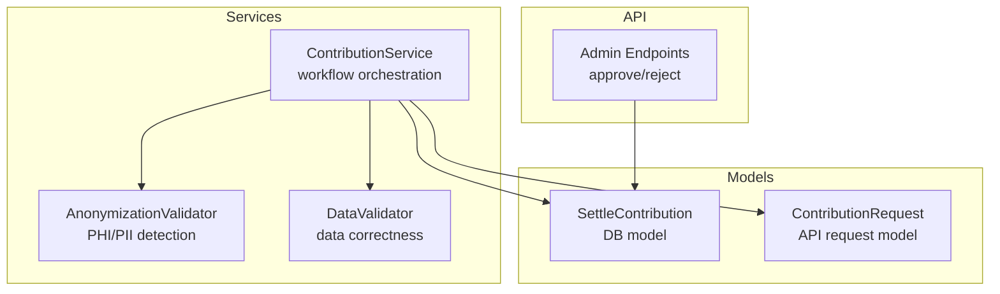
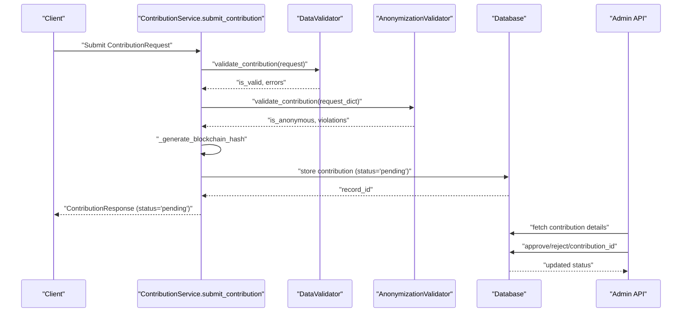
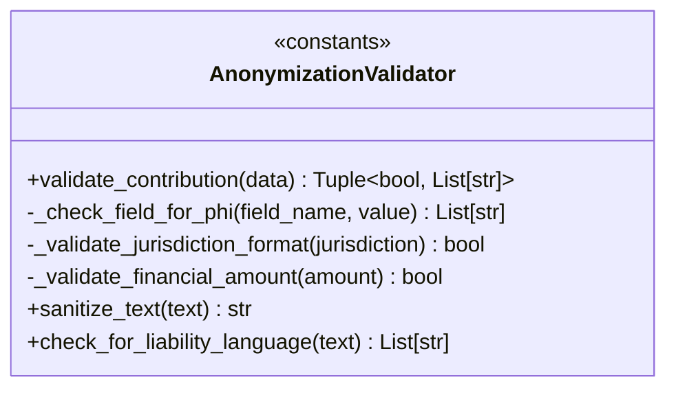
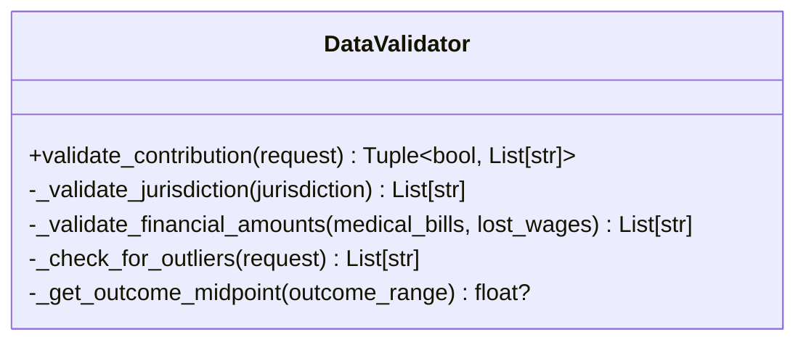
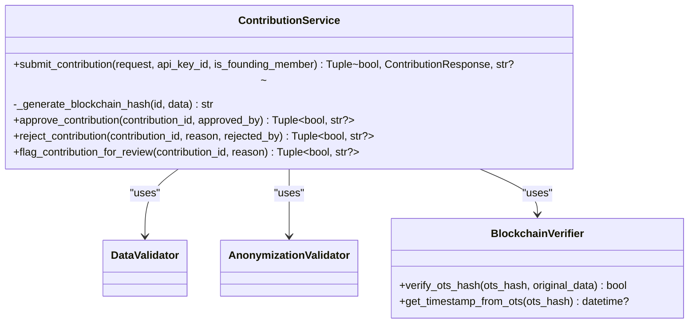
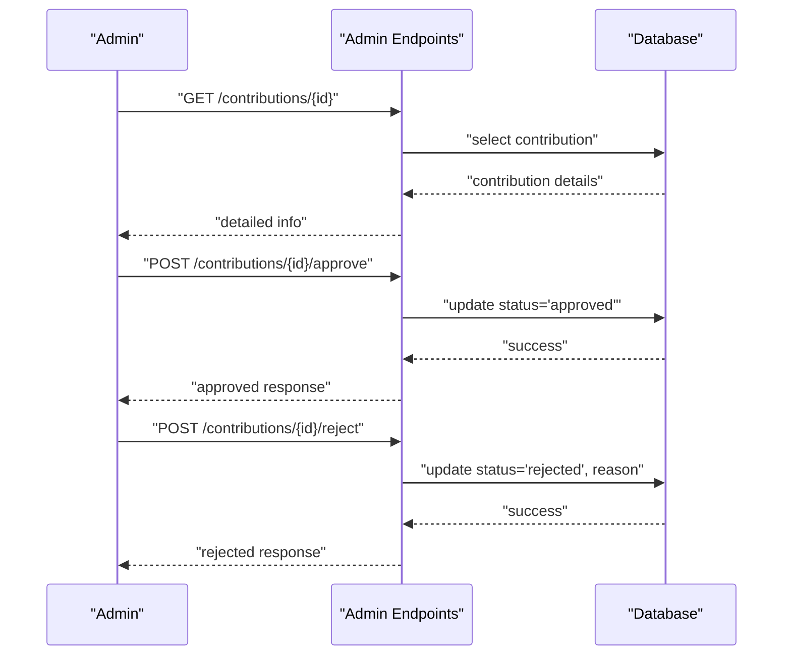
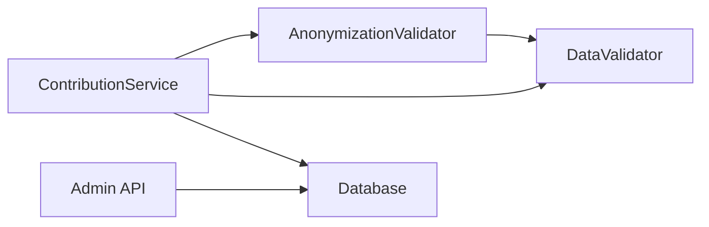

# Anonymization & Compliance

<cite>
**Referenced Files in This Document**
- [anonymizer.py](file://app/services/anonymizer.py)
- [validator.py](file://app/services/validator.py)
- [contributor.py](file://app/services/contributor.py)
- [case_bank.py](file://app/models/case_bank.py)
- [test_anonymizer.py](file://tests/test_anonymizer.py)
- [admin.py](file://app/api/v1/endpoints/admin.py)
- [SAAS_ADMIN_API_CONTRACT.md](file://docs/integration/SAAS_ADMIN_API_CONTRACT.md)
</cite>

## Table of Contents
1. [Introduction](#introduction)
2. [Project Structure](#project-structure)
3. [Core Components](#core-components)
4. [Architecture Overview](#architecture-overview)
5. [Detailed Component Analysis](#detailed-component-analysis)
6. [Dependency Analysis](#dependency-analysis)
7. [Performance Considerations](#performance-considerations)
8. [Troubleshooting Guide](#troubleshooting-guide)
9. [Conclusion](#conclusion)
10. [Appendices](#appendices)

## Introduction
This document describes the anonymization and compliance system for settlement contributions. It focuses on the AnonymizationValidator class and its PHI/PII detection algorithms, the anonymization process (including data masking and redaction rules), compliance with legal requirements, and the integration with contribution approval workflows. It also documents anonymization violation reporting and remediation pathways, and provides examples of anonymization failures, detection scenarios, and compliance check results.

## Project Structure
The anonymization and compliance logic is implemented primarily in:
- AnonymizationValidator: Detects PHI/PII and enforces strict anonymization rules.
- DataValidator: Enforces data correctness and value constraints.
- ContributionService: Orchestrates validation, anonymization checks, blockchain hashing, and persistence.
- API Admin endpoints: Provide administrative actions to approve or reject contributions and to inspect anonymization status.

**Diagram sources**
- [anonymizer.py:17-340](file://app/services/anonymizer.py#L17-L340)
- [validator.py:25-327](file://app/services/validator.py#L25-L327)
- [contributor.py:31-339](file://app/services/contributor.py#L31-L339)
- [case_bank.py:15-63](file://app/models/case_bank.py#L15-L63)
- [admin.py:76-220](file://app/api/v1/endpoints/admin.py#L76-L220)

**Section sources**
- [anonymizer.py:1-340](file://app/services/anonymizer.py#L1-L340)
- [validator.py:1-327](file://app/services/validator.py#L1-L327)
- [contributor.py:1-339](file://app/services/contributor.py#L1-L339)
- [case_bank.py:1-269](file://app/models/case_bank.py#L1-L269)
- [admin.py:76-220](file://app/api/v1/endpoints/admin.py#L76-L220)

## Core Components
- AnonymizationValidator: Enforces strict anonymization rules, detects PHI/PII, validates drop-down selections, jurisdiction format, and financial reasonableness. Provides redaction helpers for legacy cleanup.
- DataValidator: Validates data types, required fields, value ranges, and business logic constraints.
- ContributionService: Coordinates validation and anonymization, generates a blockchain hash, stores contributions, and exposes admin actions for approval/rejection/flagging.
- API Admin endpoints: Allow administrators to review anonymization status and approve or reject contributions.

Key responsibilities:
- PHI/PII detection: SSN, DOB, phone, email, case numbers, addresses, common names, specific business identifiers.
- Redaction rules: Bucketed outcomes, generic categories, drop-down selections, jurisdiction format.
- Compliance: Jurisdiction format, consent confirmation, financial reasonableness, prohibited liability language.

**Section sources**
- [anonymizer.py:17-340](file://app/services/anonymizer.py#L17-L340)
- [validator.py:25-327](file://app/services/validator.py#L25-L327)
- [contributor.py:31-339](file://app/services/contributor.py#L31-L339)
- [case_bank.py:15-63](file://app/models/case_bank.py#L15-L63)

## Architecture Overview
The anonymization and compliance pipeline runs during contribution submission:

**Diagram sources**
- [contributor.py:55-125](file://app/services/contributor.py#L55-L125)
- [validator.py:52-138](file://app/services/validator.py#L52-L138)
- [anonymizer.py:92-180](file://app/services/anonymizer.py#L92-L180)
- [admin.py:97-220](file://app/api/v1/endpoints/admin.py#L97-L220)

## Detailed Component Analysis

### AnonymizationValidator
The AnonymizationValidator enforces strict anonymization rules and detects PHI/PII across all textual fields and arrays. It validates:
- Text fields for PHI/PII patterns (SSN, DOB, phone, email, case numbers, addresses).
- Common names and specific business identifiers (e.g., “#123”).
- Drop-down selections against allowed lists.
- Jurisdiction format (“County, ST”).
- Consent confirmation.
- Financial reasonableness.
- Prohibited liability language.

Detection algorithms:
- Regex-based pattern matching for PHI/PII.
- Whitelisted allowed lists for categorical fields.
- Jurisdiction parsing and validation.
- Liability language detection via forbidden phrases.

Redaction rules:
- Sanitization replaces detected patterns with redacted tokens for legacy cleanup (production should reject submissions).

**Diagram sources**
- [anonymizer.py:17-340](file://app/services/anonymizer.py#L17-L340)

**Section sources**
- [anonymizer.py:17-340](file://app/services/anonymizer.py#L17-L340)

### DataValidator
The DataValidator ensures data correctness and business logic constraints:
- Jurisdiction format and state validation.
- Drop-down selections against predefined constants.
- Financial amount ranges and reasonableness.
- Outlier detection for manual review.

**Diagram sources**
- [validator.py:25-327](file://app/services/validator.py#L25-L327)

**Section sources**
- [validator.py:25-327](file://app/services/validator.py#L25-L327)

### ContributionService
ContributionService orchestrates the end-to-end workflow:
- Validates data via DataValidator.
- Checks anonymization via AnonymizationValidator.
- Generates a blockchain hash (placeholder for OpenTimestamps).
- Stores contributions with status set to pending.
- Exposes admin actions for approval/rejection/flagging.

**Diagram sources**
- [contributor.py:31-339](file://app/services/contributor.py#L31-L339)

**Section sources**
- [contributor.py:31-339](file://app/services/contributor.py#L31-L339)

### Admin API and Approval Workflows
Administrators can:
- Review contribution details and anonymization status.
- Approve contributions (status becomes approved).
- Reject contributions with a reason (status becomes rejected).
- Flag contributions for manual review.

**Diagram sources**
- [admin.py:97-220](file://app/api/v1/endpoints/admin.py#L97-L220)
- [SAAS_ADMIN_API_CONTRACT.md:88-175](file://docs/integration/SAAS_ADMIN_API_CONTRACT.md#L88-L175)

**Section sources**
- [admin.py:97-220](file://app/api/v1/endpoints/admin.py#L97-L220)
- [SAAS_ADMIN_API_CONTRACT.md:88-175](file://docs/integration/SAAS_ADMIN_API_CONTRACT.md#L88-L175)

## Dependency Analysis
- AnonymizationValidator depends on regex patterns and allowed lists to detect PHI/PII and enforce redaction rules.
- DataValidator depends on predefined constants for drop-down selections and jurisdiction/state validation.
- ContributionService composes DataValidator and AnonymizationValidator and integrates with the database and admin endpoints.
- Admin endpoints depend on the database schema to fetch and update contribution statuses.

**Diagram sources**
- [anonymizer.py:17-340](file://app/services/anonymizer.py#L17-L340)
- [validator.py:25-327](file://app/services/validator.py#L25-L327)
- [contributor.py:31-339](file://app/services/contributor.py#L31-L339)
- [admin.py:97-220](file://app/api/v1/endpoints/admin.py#L97-L220)

**Section sources**
- [anonymizer.py:17-340](file://app/services/anonymizer.py#L17-L340)
- [validator.py:25-327](file://app/services/validator.py#L25-L327)
- [contributor.py:31-339](file://app/services/contributor.py#L31-L339)
- [admin.py:97-220](file://app/api/v1/endpoints/admin.py#L97-L220)

## Performance Considerations
- Regex-based detection is linear in input length; complexity is O(n) per field scanned.
- Allowed-list membership checks are O(k) per selection, where k is the size of the allowed list.
- Jurisdiction parsing and financial validation are O(1).
- Array fields are scanned item-by-item; complexity scales with total items across arrays.
- Recommendations:
  - Precompile regex patterns once at class level (already done).
  - Use efficient membership checks (sets) for allowed lists.
  - Consider batching or streaming for large array fields if needed.

[No sources needed since this section provides general guidance]

## Troubleshooting Guide
Common anonymization failures and remediation:
- PHI/PII detected:
  - SSN, DOB, phone, email, addresses, case numbers, common names, specific business identifiers.
  - Remediation: Remove or redact offending content; use allowed drop-down values; ensure jurisdiction format is “County, ST”; confirm consent.
- Jurisdiction format invalid:
  - Remediation: Use “County, ST” format; ensure state is a valid 2-letter code.
- Drop-down values not from allowed lists:
  - Remediation: Choose values strictly from allowed lists.
- Financial amounts out of range:
  - Remediation: Adjust amounts within allowed bounds.
- Liability language detected:
  - Remediation: Remove phrases indicating fault or liability; keep outcome descriptions neutral.
- Outliers flagged:
  - Remediation: Review unusual patterns; provide justification; resubmit with supporting context.

Examples from tests:
- SSN detection in jurisdiction field blocks submission.
- Phone number and email detection in narrative fields blocks submission.
- Common names and specific business identifiers trigger violations.
- Invalid case type from drop-down triggers a violation.
- Liability language detection returns forbidden phrases.

**Section sources**
- [test_anonymizer.py:10-201](file://tests/test_anonymizer.py#L10-L201)
- [anonymizer.py:92-180](file://app/services/anonymizer.py#L92-L180)

## Conclusion
The anonymization and compliance system enforces strict PHI/PII protection and legal adherence through a layered validation pipeline. AnonymizationValidator detects sensitive information and enforces redaction rules, while DataValidator ensures data correctness and business logic. ContributionService coordinates these checks and integrates with admin workflows for approval and remediation. Together, these components provide a robust framework for maintaining privacy, integrity, and compliance across settlement contributions.

[No sources needed since this section summarizes without analyzing specific files]

## Appendices

### Compliance Check Results and Examples
- Valid anonymous contribution passes both DataValidator and AnonymizationValidator.
- PHI detection scenarios include SSN, phone, email, names, addresses, and specific business identifiers.
- Liability language detection identifies forbidden phrases and flags submissions for review.
- Sanitization replaces detected patterns with redacted tokens for legacy cleanup.

**Section sources**
- [test_anonymizer.py:10-201](file://tests/test_anonymizer.py#L10-L201)
- [anonymizer.py:182-340](file://app/services/anonymizer.py#L182-L340)

### Relationship Between Anonymization Status and Contribution Approval
- Contributions are stored with status “pending” after successful validation and anonymization.
- Administrators review anonymization status and approve or reject contributions.
- Rejected contributions include a reason (e.g., “PHI detected”, “Outlier”, “Invalid data”).
- Approved contributions finalize the process and become part of the dataset.

**Section sources**
- [contributor.py:112-125](file://app/services/contributor.py#L112-L125)
- [admin.py:97-220](file://app/api/v1/endpoints/admin.py#L97-L220)
- [SAAS_ADMIN_API_CONTRACT.md:88-175](file://docs/integration/SAAS_ADMIN_API_CONTRACT.md#L88-L175)