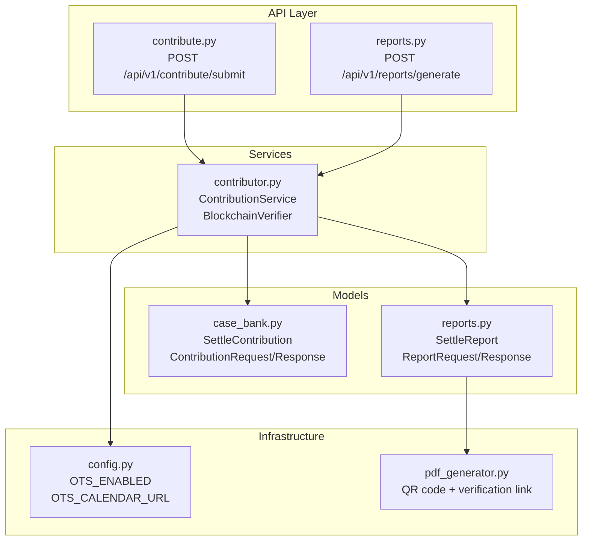
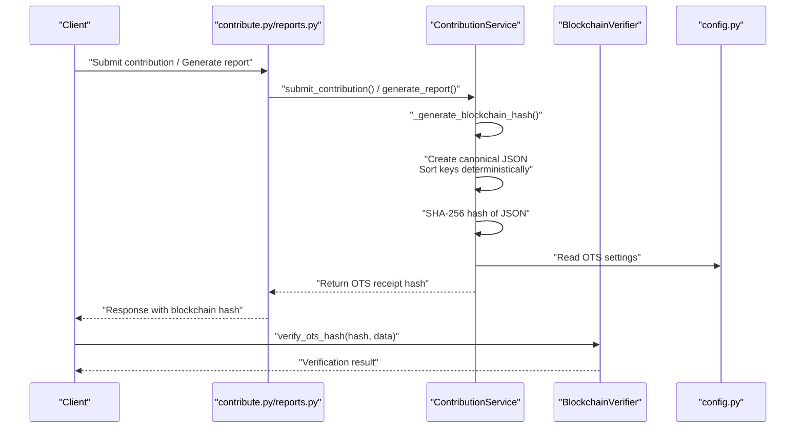
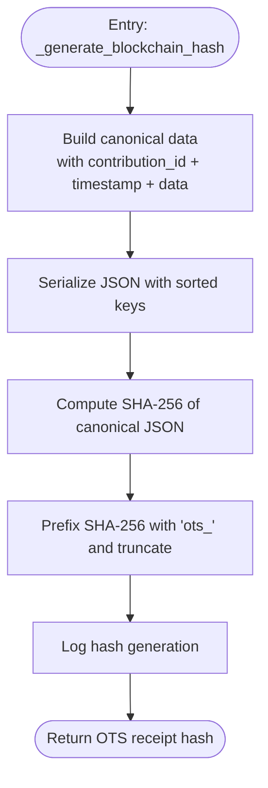
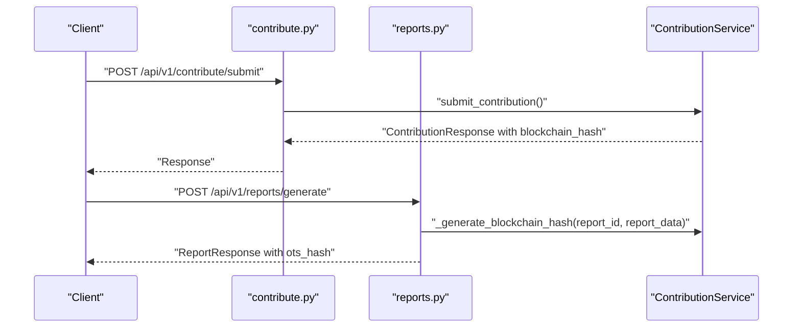
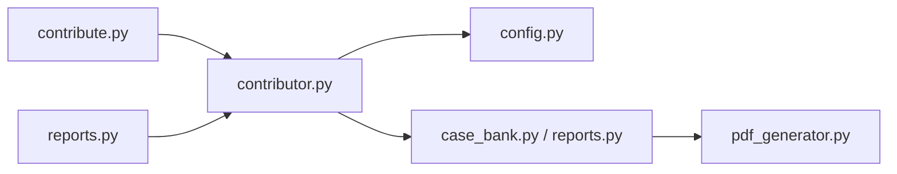

# Blockchain Integration

<cite>
**Referenced Files in This Document**
- [contributor.py](file://app/services/contributor.py)
- [contribute.py](file://app/api/v1/endpoints/contribute.py)
- [reports.py](file://app/api/v1/endpoints/reports.py)
- [reports.py](file://app/models/reports.py)
- [case_bank.py](file://app/models/case_bank.py)
- [config.py](file://app/core/config.py)
- [pdf_generator.py](file://app/services/reports/pdf_generator.py)
- [README.md](file://README.md)
</cite>

## Table of Contents
1. [Introduction](#introduction)
2. [Project Structure](#project-structure)
3. [Core Components](#core-components)
4. [Architecture Overview](#architecture-overview)
5. [Detailed Component Analysis](#detailed-component-analysis)
6. [Dependency Analysis](#dependency-analysis)
7. [Performance Considerations](#performance-considerations)
8. [Troubleshooting Guide](#troubleshooting-guide)
9. [Conclusion](#conclusion)

## Introduction
This document explains the blockchain integration system using OpenTimestamps within the SETTLE service. It focuses on the cryptographic proof generation process, canonical JSON representation, SHA-256 hashing, OTS receipt generation, and the verification utilities. It also documents the current implementation status, the role of blockchain hashes in audit trails and data integrity, and outlines future integration plans with actual OpenTimestamps infrastructure.

## Project Structure
The blockchain integration spans several modules:
- API endpoints orchestrate contribution and report generation workflows.
- The ContributionService encapsulates the core logic for generating blockchain hashes.
- Data models define the canonical structures for contributions and reports.
- Configuration exposes OpenTimestamps settings.
- The PDF generator embeds verification QR codes and links for transparency.

**Diagram sources**
- [contribute.py:51-125](file://app/api/v1/endpoints/contribute.py#L51-L125)
- [reports.py:23-188](file://app/api/v1/endpoints/reports.py#L23-L188)
- [contributor.py:31-192](file://app/services/contributor.py#L31-L192)
- [case_bank.py:15-203](file://app/models/case_bank.py#L15-L203)
- [reports.py:40-100](file://app/models/reports.py#L40-L100)
- [config.py:188-191](file://app/core/config.py#L188-L191)
- [pdf_generator.py:510-543](file://app/services/reports/pdf_generator.py#L510-L543)

**Section sources**
- [README.md:19](file://README.md#L19)
- [config.py:188-191](file://app/core/config.py#L188-L191)

## Core Components
- ContributionService: Implements the contribution workflow, including canonical JSON creation, SHA-256 hashing, and placeholder OTS receipt generation. It also provides a verification hook and a helper for founding member stats.
- BlockchainVerifier: Utility class offering static methods to verify OTS hashes and extract timestamps from receipts.
- API Endpoints: Expose contribution submission and report generation, integrating the blockchain hash into responses and PDF outputs.
- Data Models: Define canonical structures for contributions and reports, including optional OTS hash fields.
- Configuration: Provides flags and calendar URL for OpenTimestamps integration.

**Section sources**
- [contributor.py:31-192](file://app/services/contributor.py#L31-L192)
- [contributor.py:300-337](file://app/services/contributor.py#L300-L337)
- [contribute.py:51-125](file://app/api/v1/endpoints/contribute.py#L51-L125)
- [reports.py:23-188](file://app/api/v1/endpoints/reports.py#L23-L188)
- [case_bank.py:15-203](file://app/models/case_bank.py#L15-L203)
- [reports.py:40-100](file://app/models/reports.py#L40-L100)
- [config.py:188-191](file://app/core/config.py#L188-L191)

## Architecture Overview
The blockchain integration follows a deterministic pipeline:
1. Canonical JSON construction from contribution/report data.
2. Deterministic serialization via sorted keys.
3. SHA-256 hashing of the canonical JSON.
4. Placeholder OTS receipt generation (currently a prefixed hash).
5. Verification utilities for OTS hash validation and timestamp extraction.
6. Presentation in API responses and PDFs with QR codes and verification links.

**Diagram sources**
- [contribute.py:51-125](file://app/api/v1/endpoints/contribute.py#L51-L125)
- [reports.py:23-188](file://app/api/v1/endpoints/reports.py#L23-L188)
- [contributor.py:127-173](file://app/services/contributor.py#L127-L173)
- [contributor.py:300-337](file://app/services/contributor.py#L300-L337)
- [config.py:188-191](file://app/core/config.py#L188-L191)

## Detailed Component Analysis

### _generate_blockchain_hash Method
The method constructs a canonical representation of the data, serializes it deterministically, computes a SHA-256 digest, and produces a placeholder OTS receipt hash. It logs the operation and returns a prefixed string representing the OTS hash.

**Diagram sources**
- [contributor.py:127-173](file://app/services/contributor.py#L127-L173)

**Section sources**
- [contributor.py:127-173](file://app/services/contributor.py#L127-L173)

### Canonical JSON Representation Creation
The canonical representation includes:
- A unique identifier for the contribution/report.
- A timestamp to ensure uniqueness across submissions.
- The original data payload.

Serialization uses sorted keys to ensure deterministic ordering regardless of input order.

**Section sources**
- [contributor.py:150-159](file://app/services/contributor.py#L150-L159)

### SHA-256 Hashing
The canonical JSON is encoded and hashed using SHA-256. The resulting digest is truncated and prefixed to form the OTS receipt hash.

**Section sources**
- [contributor.py:161-167](file://app/services/contributor.py#L161-L167)

### OTS Receipt Generation
The current implementation returns a prefixed hash derived from the SHA-256 digest. Future integration will replace this with an actual OpenTimestamps calendar submission and return the real OTS receipt hash.

**Section sources**
- [contributor.py:164-167](file://app/services/contributor.py#L164-L167)
- [config.py:188-191](file://app/core/config.py#L188-L191)

### BlockchainVerifier Utility Class
The utility class provides:
- verify_ots_hash: Validates an OTS hash against original data (placeholder implementation).
- get_timestamp_from_ots: Extracts a timestamp from an OTS hash (placeholder implementation).

These methods are intended to integrate with OpenTimestamps verification APIs in future releases.

**Section sources**
- [contributor.py:300-337](file://app/services/contributor.py#L300-L337)

### Timestamp Extraction and Verification Workflows
- Timestamp extraction: The verifier’s static method is designed to parse the OTS receipt and return the recorded timestamp.
- Verification workflow: The verifier compares the computed hash of the original data with the OTS receipt to confirm integrity and existence at the recorded time.

**Section sources**
- [contributor.py:324-337](file://app/services/contributor.py#L324-L337)

### API Integration Points
- Contribution submission endpoint: Generates a blockchain hash during submission and returns it in the response.
- Report generation endpoint: Generates a blockchain hash for the report and includes it in the response and PDF.

**Diagram sources**
- [contribute.py:51-125](file://app/api/v1/endpoints/contribute.py#L51-L125)
- [reports.py:23-188](file://app/api/v1/endpoints/reports.py#L23-L188)
- [contributor.py:89-94](file://app/services/contributor.py#L89-L94)

**Section sources**
- [contribute.py:51-125](file://app/api/v1/endpoints/contribute.py#L51-L125)
- [reports.py:23-188](file://app/api/v1/endpoints/reports.py#L23-L188)
- [contributor.py:89-94](file://app/services/contributor.py#L89-L94)

### Data Models and Audit Trail
- SettleContribution: Stores contribution records with optional blockchain_hash and compliance metadata.
- Report models: Include optional OTS hash fields for reports, enabling audit trails and integrity verification.

**Section sources**
- [case_bank.py:15-63](file://app/models/case_bank.py#L15-L63)
- [reports.py:40-100](file://app/models/reports.py#L40-L100)

### PDF Presentation and QR Code Integration
The PDF generator embeds:
- A QR code linking to the OpenTimestamps verification page with the hash parameter.
- The blockchain hash display area.
- A verification link for external checks.

**Section sources**
- [pdf_generator.py:470-480](file://app/services/reports/pdf_generator.py#L470-L480)
- [pdf_generator.py:510-543](file://app/services/reports/pdf_generator.py#L510-L543)

## Dependency Analysis
- API endpoints depend on ContributionService for blockchain hash generation.
- ContributionService depends on configuration for OpenTimestamps settings.
- Data models define the canonical structures used by the hashing pipeline.
- PDF generator depends on report models and the OTS hash for presentation.

**Diagram sources**
- [contribute.py:51-125](file://app/api/v1/endpoints/contribute.py#L51-L125)
- [reports.py:23-188](file://app/api/v1/endpoints/reports.py#L23-L188)
- [contributor.py:31-192](file://app/services/contributor.py#L31-L192)
- [config.py:188-191](file://app/core/config.py#L188-L191)
- [case_bank.py:15-203](file://app/models/case_bank.py#L15-L203)
- [reports.py:40-100](file://app/models/reports.py#L40-L100)
- [pdf_generator.py:510-543](file://app/services/reports/pdf_generator.py#L510-L543)

**Section sources**
- [contributor.py:31-192](file://app/services/contributor.py#L31-L192)
- [config.py:188-191](file://app/core/config.py#L188-L191)
- [case_bank.py:15-203](file://app/models/case_bank.py#L15-L203)
- [reports.py:40-100](file://app/models/reports.py#L40-L100)
- [pdf_generator.py:510-543](file://app/services/reports/pdf_generator.py#L510-L543)

## Performance Considerations
- Canonical JSON serialization and SHA-256 hashing are lightweight operations suitable for real-time workflows.
- The current placeholder OTS receipt generation avoids network latency but does not provide cryptographic proof until integrated with OpenTimestamps calendars.
- Future integration should batch submissions and cache receipts to minimize repeated computations.

## Troubleshooting Guide
- If blockchain hash verification fails, ensure the original data used for hashing matches the data passed to the verification utility.
- Confirm that the canonical JSON includes the required fields and that sorting is applied consistently.
- Validate that the OTS settings are enabled and the calendar URL is reachable when integrating with actual OpenTimestamps infrastructure.
- For PDF verification, ensure the QR code encodes the correct verification URL with the hash parameter.

**Section sources**
- [contributor.py:150-167](file://app/services/contributor.py#L150-L167)
- [contributor.py:300-337](file://app/services/contributor.py#L300-L337)
- [config.py:188-191](file://app/core/config.py#L188-L191)
- [pdf_generator.py:527](file://app/services/reports/pdf_generator.py#L527)

## Conclusion
The SETTLE service implements a robust, deterministic pipeline for generating blockchain hashes using OpenTimestamps. While the current implementation uses a placeholder OTS receipt, the architecture is ready for seamless integration with actual OpenTimestamps calendars. The canonical JSON approach, SHA-256 hashing, and verification utilities establish a strong foundation for audit trails, data integrity, and contribution provenance. Future enhancements will focus on replacing placeholders with real OTS submissions and expanding verification capabilities across the platform.