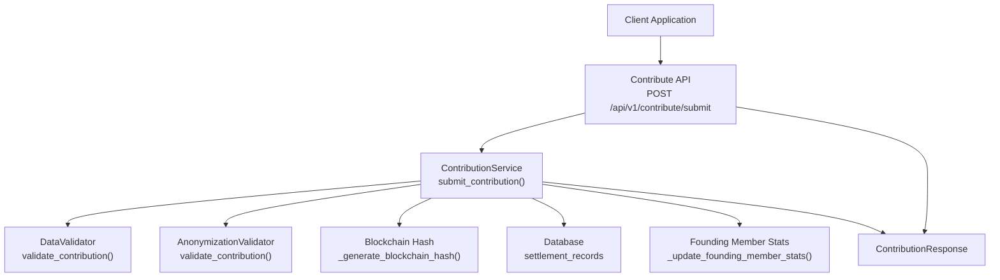
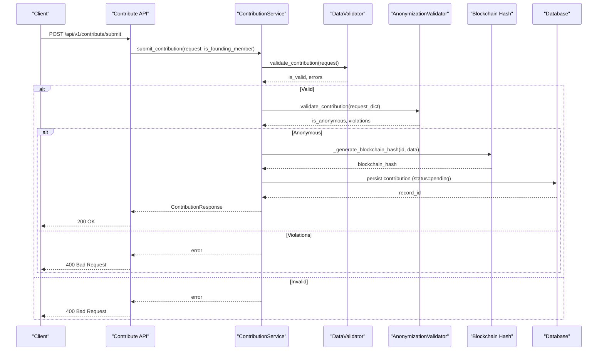
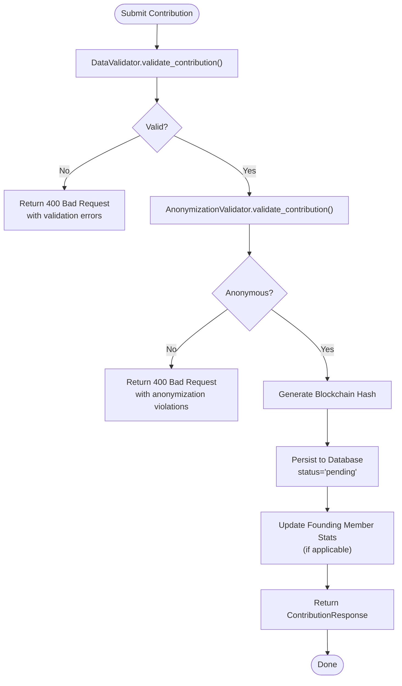

# Contribution Workflow

<cite>
**Referenced Files in This Document**
- [contribute.py](file://app/api/v1/endpoints/contribute.py)
- [contributor.py](file://app/services/contributor.py)
- [contribution_service.py](file://app/services/contribution_service.py)
- [case_bank.py](file://app/models/case_bank.py)
- [validator.py](file://app/services/validator.py)
- [anonymizer.py](file://app/services/anonymizer.py)
- [admin.py](file://app/api/v1/endpoints/admin.py)
- [auth.py](file://app/core/auth.py)
- [33175e3b6200_add_settlement_records_table.py](file://alembic/versions/33175e3b6200_add_settlement_records_table.py)
- [API_DOCUMENTATION.md](file://docs/API_DOCUMENTATION.md)
</cite>

## Table of Contents
1. [Introduction](#introduction)
2. [Project Structure](#project-structure)
3. [Core Components](#core-components)
4. [Architecture Overview](#architecture-overview)
5. [Detailed Component Analysis](#detailed-component-analysis)
6. [Dependency Analysis](#dependency-analysis)
7. [Performance Considerations](#performance-considerations)
8. [Troubleshooting Guide](#troubleshooting-guide)
9. [Conclusion](#conclusion)

## Introduction
This document describes the complete seven-step contribution workflow for submitting anonymized settlement intelligence to the SETTLE service. It covers validation, anonymization checks, blockchain hash generation, database storage, founding member tracking, and confirmation delivery. It also documents the ContributionRequest and ContributionResponse models, workflow states, transition conditions, and administrative actions.

## Project Structure
The contribution workflow spans API endpoints, services, validators, models, and database schema. The following diagram shows the high-level flow from client submission to final confirmation.

**Diagram sources**
- [contribute.py:51-125](file://app/api/v1/endpoints/contribute.py#L51-L125)
- [contributor.py:55-125](file://app/services/contributor.py#L55-L125)
- [validator.py:52-138](file://app/services/validator.py#L52-L138)
- [anonymizer.py:92-180](file://app/services/anonymizer.py#L92-L180)

**Section sources**
- [contribute.py:51-125](file://app/api/v1/endpoints/contribute.py#L51-L125)
- [contributor.py:31-54](file://app/services/contributor.py#L31-L54)

## Core Components
- API endpoint: Validates authentication, orchestrates the workflow, and returns a standardized response.
- ContributionService: Implements the seven-step workflow, including validation, anonymization, hash generation, storage, and founding member stats.
- DataValidator: Enforces data types, required fields, value ranges, and business logic constraints.
- AnonymizationValidator: Ensures no PHI/PII and enforces allowed drop-down categories.
- Models: ContributionRequest and ContributionResponse define the shape and validation rules for submissions and confirmations.
- Database: settlement_records table stores validated contributions with fingerprinting and status tracking.

**Section sources**
- [contribute.py:51-125](file://app/api/v1/endpoints/contribute.py#L51-L125)
- [contributor.py:31-125](file://app/services/contributor.py#L31-L125)
- [validator.py:25-138](file://app/services/validator.py#L25-L138)
- [anonymizer.py:17-180](file://app/services/anonymizer.py#L17-L180)
- [case_bank.py:141-203](file://app/models/case_bank.py#L141-L203)
- [33175e3b6200_add_settlement_records_table.py:22-43](file://alembic/versions/33175e3b6200_add_settlement_records_table.py#L22-L43)

## Architecture Overview
The workflow is designed around a strict pipeline:
1. Authentication and authorization (tenant user or API key).
2. Data validation against domain rules and acceptable value sets.
3. Anonymization validation to prevent PHI/PII leakage.
4. Blockchain hash generation for cryptographic proof.
5. Database persistence with duplicate detection via fingerprinting.
6. Founding member stats update for qualifying submitters.
7. Confirmation delivery with status and optional founding member stats.

**Diagram sources**
- [contribute.py:51-125](file://app/api/v1/endpoints/contribute.py#L51-L125)
- [contributor.py:55-125](file://app/services/contributor.py#L55-L125)
- [validator.py:52-138](file://app/services/validator.py#L52-L138)
- [anonymizer.py:92-180](file://app/services/anonymizer.py#L92-L180)

## Detailed Component Analysis

### Seven-Step Workflow
1. Validate data (completeness, correctness)
   - Jurisdiction format, case type, injury categories, financial bounds, outcome ranges, consent.
2. Check anonymization (no PHI/PII)
   - Pattern-based checks for SSN, DOB, phone, email, case numbers, addresses; forbidden liability language.
3. Generate blockchain hash (OpenTimestamps)
   - Canonical JSON of contribution with ID and timestamp; SHA-256; placeholder OTS receipt.
4. Store in database (status='pending' for manual review)
   - Insert into settlement_records with fingerprint and metadata.
5. Track Founding Member stats (if applicable)
   - Increment contribution counts for qualifying submitters.
6. Return confirmation with blockchain receipt
   - ContributionResponse includes contribution_id, blockchain_hash, status, optional founding member stats.

Administrative actions:
- Approve: Transition status to approved.
- Reject: Transition status to rejected with reason.
- Flag: Transition status to flagged for manual review.

**Section sources**
- [contribute.py:56-77](file://app/api/v1/endpoints/contribute.py#L56-L77)
- [contributor.py:55-125](file://app/services/contributor.py#L55-L125)
- [validator.py:52-138](file://app/services/validator.py#L52-L138)
- [anonymizer.py:92-180](file://app/services/anonymizer.py#L92-L180)
- [contributor.py:219-293](file://app/services/contributor.py#L219-L293)

### ContributionRequest Model
Fields and validation rules:
- jurisdiction: Required, "County, ST" format; state must be 2-letter code.
- case_type: Required; must be from allowed list.
- injury_category: Required array; at least one item.
- primary_diagnosis: Optional; allowed drop-down.
- treatment_type: Optional array; allowed drop-down values.
- duration_of_treatment: Optional; must be from allowed list.
- imaging_findings: Optional array; allowed drop-down values.
- medical_bills: Required; numeric ≥ 1; max thresholds enforced.
- lost_wages: Optional; numeric ≥ 0; max thresholds enforced.
- policy_limits: Optional; must be from allowed list.
- defendant_category: Required; must be from allowed list.
- outcome_type: Required; must be from allowed list.
- outcome_amount_range: Required; must be one of predefined buckets.
- consent_confirmed: Required; must be true.

Data types:
- Strings for categorical fields; floats for monetary values; arrays for multi-selects.

Validation rules:
- Format checks for jurisdiction and outcome ranges.
- Domain checks for allowed drop-down values.
- Numeric bounds for financial fields.
- Consent confirmation required.

**Section sources**
- [case_bank.py:141-189](file://app/models/case_bank.py#L141-L189)
- [validator.py:52-138](file://app/services/validator.py#L52-L138)
- [anonymizer.py:92-180](file://app/services/anonymizer.py#L92-L180)

### ContributionResponse Model
Fields:
- contribution_id: UUID.
- blockchain_hash: String; OpenTimestamps receipt placeholder.
- status: One of pending, approved, rejected, flagged.
- founding_member_status: Optional object containing stats for qualifying submitters.
- message: Human-readable confirmation.
- created_at: Timestamp.

**Section sources**
- [case_bank.py:191-203](file://app/models/case_bank.py#L191-L203)
- [API_DOCUMENTATION.md:880-894](file://docs/API_DOCUMENTATION.md#L880-L894)

### Workflow States and Transitions
States:
- pending: Initial state after successful validation and anonymization.
- approved: Admin action; marks contribution accepted.
- rejected: Admin action; marks contribution declined with reason.
- flagged: Admin action; marks contribution for manual review.

Transitions:
- pending → approved (admin approval).
- pending → rejected (admin rejection with reason).
- pending → flagged (admin flagging).
- flagged → approved/rejected (after manual review).

Note: The current implementation logs transitions; actual database updates are marked as TODO.

**Section sources**
- [contributor.py:219-293](file://app/services/contributor.py#L219-L293)
- [admin.py:251-271](file://app/api/v1/endpoints/admin.py#L251-L271)

### Data Validation Flow

**Diagram sources**
- [validator.py:52-138](file://app/services/validator.py#L52-L138)
- [anonymizer.py:92-180](file://app/services/anonymizer.py#L92-L180)
- [contributor.py:55-125](file://app/services/contributor.py#L55-L125)

### Database Storage and Fingerprinting
- Table: settlement_records with UUID primary key, fingerprint hash, and indexed fields for efficient querying.
- Fingerprinting: SHA-256 over normalized key fields to detect duplicates across similar records.
- Status: Default pending upon insertion; later updated by admins.

**Section sources**
- [33175e3b6200_add_settlement_records_table.py:22-43](file://alembic/versions/33175e3b6200_add_settlement_records_table.py#L22-L43)
- [contribution_service.py:224-277](file://app/services/contribution_service.py#L224-L277)

### API Keys, Founding Member Privileges, and Moderation Workflows
- API keys: Used for programmatic access; endpoints enforce unified auth.
- Founding Member privileges: Special access level allows elevated contribution frequency and stats tracking; endpoint dependencies restrict access accordingly.
- Moderation workflows: Admin endpoints support approve/reject/flag actions; status transitions are logged.

**Section sources**
- [auth.py:765-795](file://app/core/auth.py#L765-L795)
- [admin.py:251-271](file://app/api/v1/endpoints/admin.py#L251-L271)
- [contribute.py:96](file://app/api/v1/endpoints/contribute.py#L96)

## Dependency Analysis

```mermaid
graph LR
A["Contribute API<br/>contribute.py"] --> B["ContributionService<br/>contributor.py"]
B --> C["DataValidator<br/>validator.py"]
B --> D["AnonymizationValidator<br/>anonymizer.py"]
B --> E["Database<br/>settlement_records"]
A --> F["Auth Context<br/>auth.py"]
A --> G["ContributionResponse<br/>case_bank.py"]
B --> G
```

**Diagram sources**
- [contribute.py:51-125](file://app/api/v1/endpoints/contribute.py#L51-L125)
- [contributor.py:31-125](file://app/services/contributor.py#L31-L125)
- [validator.py:25-138](file://app/services/validator.py#L25-L138)
- [anonymizer.py:17-180](file://app/services/anonymizer.py#L17-L180)
- [auth.py:765-795](file://app/core/auth.py#L765-L795)
- [case_bank.py:191-203](file://app/models/case_bank.py#L191-L203)

**Section sources**
- [contribute.py:51-125](file://app/api/v1/endpoints/contribute.py#L51-L125)
- [contributor.py:31-125](file://app/services/contributor.py#L31-L125)

## Performance Considerations
- Validation and anonymization are CPU-bound; keep payload sizes reasonable.
- Fingerprint computation is O(k) over key fields; ensure normalization is efficient.
- Database inserts should leverage existing indexes on fingerprint and query columns.
- Asynchronous operations (e.g., event emission) should not block request completion.

## Troubleshooting Guide
Common failure scenarios:
- Validation failures: Missing required fields, invalid jurisdiction format, out-of-range financial values, or invalid outcome buckets.
- Anonymization failures: Presence of PHI/PII patterns, forbidden liability language, or non-allowed drop-down values.
- Administrative actions: Approve/reject/flag endpoints require proper admin credentials; ensure correct status transitions.

Operational tips:
- Review logs for warning/error messages indicating validation or anonymization violations.
- Use the stats endpoint to monitor contribution volume and pending reviews.
- For blockchain hash verification, use the provided verifier utilities once implemented.

**Section sources**
- [validator.py:132-138](file://app/services/validator.py#L132-L138)
- [anonymizer.py:173-180](file://app/services/anonymizer.py#L173-L180)
- [contribute.py:137-152](file://app/api/v1/endpoints/contribute.py#L137-L152)

## Conclusion
The contribution workflow enforces strict data quality and compliance through layered validation and anonymization, ensures immutable proof via blockchain hashing, persists records with duplicate detection, tracks founding member participation, and delivers standardized confirmations. Administrative controls enable safe moderation while maintaining audit trails.