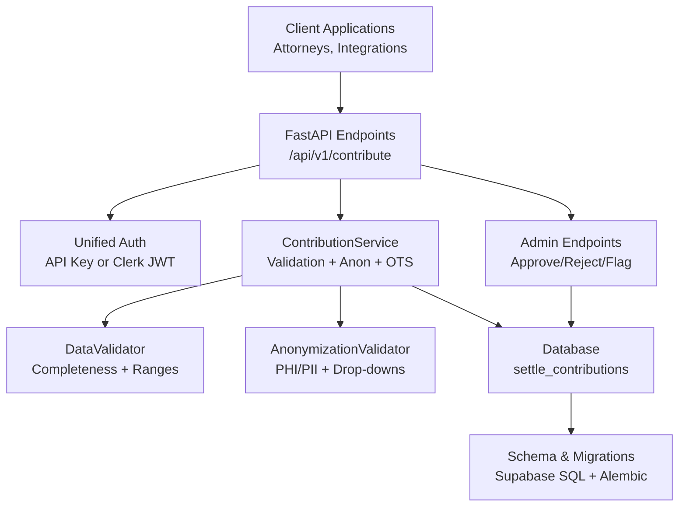
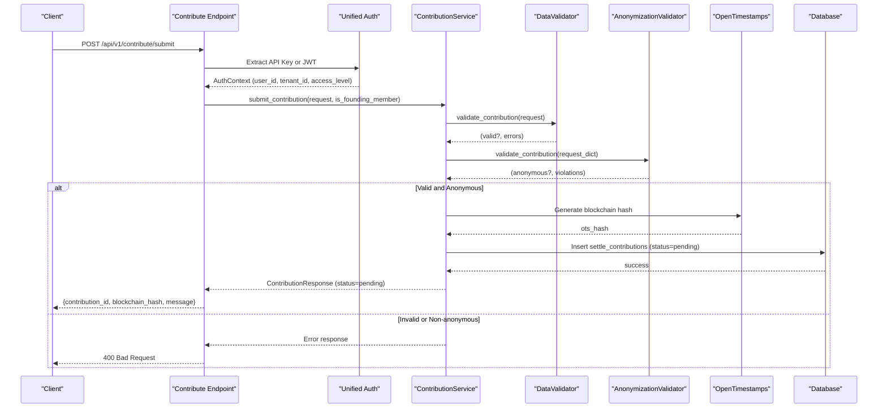
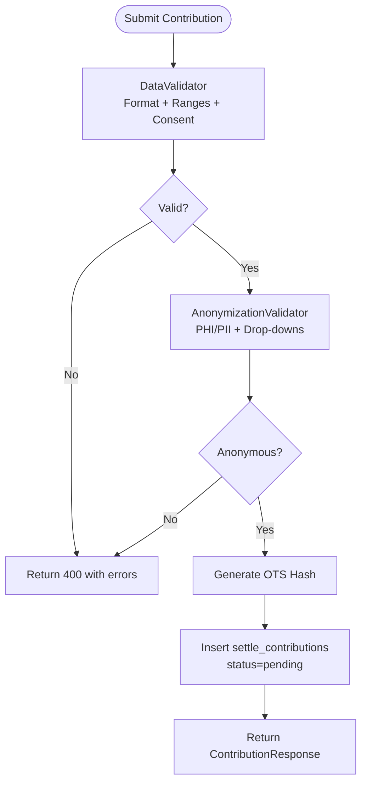
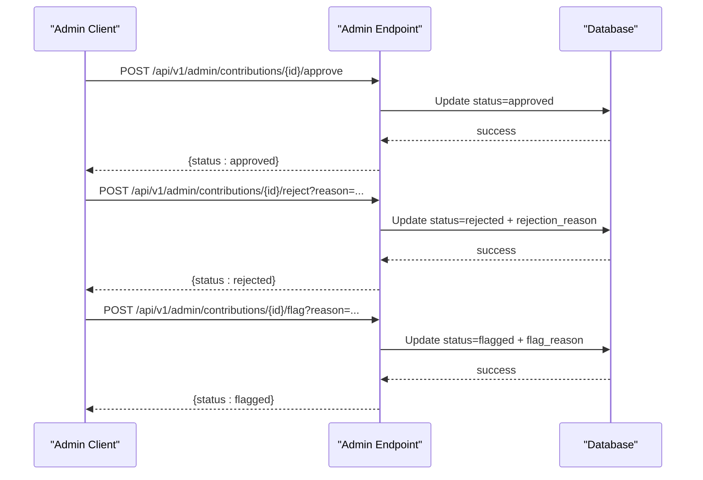
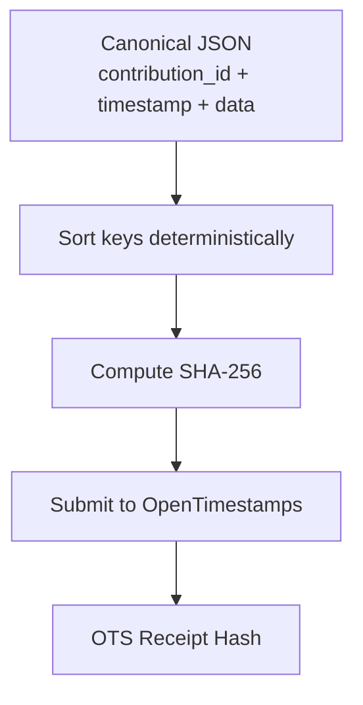
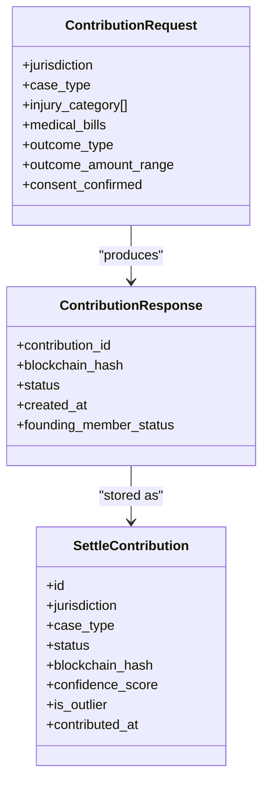
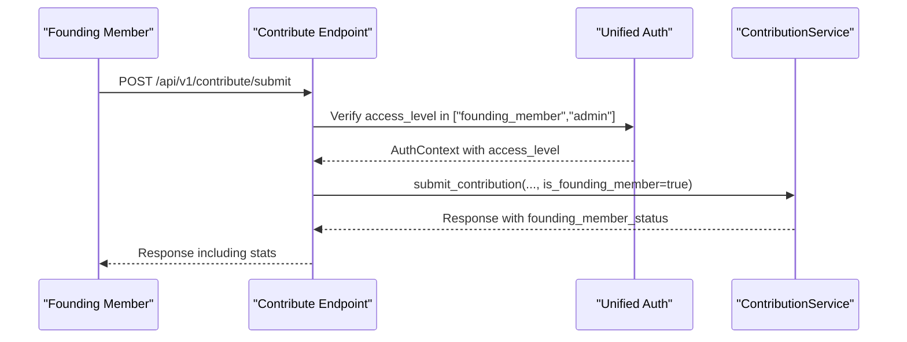
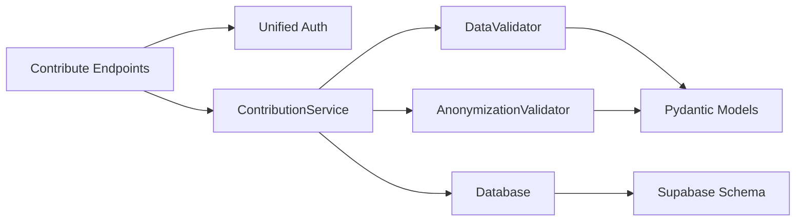

# Data Contribution System

<cite>
**Referenced Files in This Document**
- [contribution_service.py](file://app/services/contribution_service.py)
- [contributor.py](file://app/services/contributor.py)
- [anonymizer.py](file://app/services/anonymizer.py)
- [validator.py](file://app/services/validator.py)
- [case_bank.py](file://app/models/case_bank.py)
- [contribute.py](file://app/api/v1/endpoints/contribute.py)
- [admin.py](file://app/api/v1/endpoints/admin.py)
- [auth.py](file://app/core/auth.py)
- [main.py](file://app/main.py)
- [settle_supabase.sql](file://database/schemas/settle_supabase.sql)
- [ffd820027e8c_add_contribution_type_to_settlement_.py](file://alembic/versions/ffd820027e8c_add_contribution_type_to_settlement_.py)
- [test_anonymizer.py](file://tests/test_anonymizer.py)
- [test_validator.py](file://tests/test_validator.py)
</cite>

## Table of Contents
1. [Introduction](#introduction)
2. [Project Structure](#project-structure)
3. [Core Components](#core-components)
4. [Architecture Overview](#architecture-overview)
5. [Detailed Component Analysis](#detailed-component-analysis)
6. [Dependency Analysis](#dependency-analysis)
7. [Performance Considerations](#performance-considerations)
8. [Troubleshooting Guide](#troubleshooting-guide)
9. [Conclusion](#conclusion)

## Introduction
The Data Contribution System enables plaintiff attorneys and authorized contributors to submit anonymized settlement intelligence while ensuring legal compliance, data quality, and verifiable timestamps. It validates submissions for completeness and PHI/PII safety, generates blockchain-backed timestamps via OpenTimestamps, stores contributions with status tracking, and supports moderation workflows for approvals and rejections. Founding Members receive special privileges and contribution tracking.

## Project Structure
The system is organized around:
- API endpoints for contribution submission and administrative actions
- Services for validation, anonymization, and contribution lifecycle management
- Pydantic models defining request/response contracts and database entities
- Database schema enforcing bar-compliant storage and status tracking
- Authentication supporting dual modes (API key and Clerk JWT)

**Diagram sources**
- [contribute.py:51-125](file://app/api/v1/endpoints/contribute.py#L51-L125)
- [contributor.py:31-125](file://app/services/contributor.py#L31-L125)
- [validator.py:25-138](file://app/services/validator.py#L25-L138)
- [anonymizer.py:17-180](file://app/services/anonymizer.py#L17-L180)
- [settle_supabase.sql:31-113](file://database/schemas/settle_supabase.sql#L31-L113)
- [ffd820027e8c_add_contribution_type_to_settlement_.py:21-31](file://alembic/versions/ffd820027e8c_add_contribution_type_to_settlement_.py#L21-L31)

**Section sources**
- [main.py:102-135](file://app/main.py#L102-L135)
- [auth.py:340-484](file://app/core/auth.py#L340-L484)

## Core Components
- ContributionRequest and ContributionResponse define the contract for submissions and confirmations.
- DataValidator ensures jurisdiction format, drop-down selections, financial ranges, and consent.
- AnonymizationValidator enforces bar-compliant anonymization by rejecting PHI/PII and requiring allowed dropdown values.
- ContributionService orchestrates validation, anonymization, blockchain timestamp generation, and status updates.
- Admin endpoints manage moderation actions (approve, reject, flag) and viewing contribution details.

**Section sources**
- [case_bank.py:141-203](file://app/models/case_bank.py#L141-L203)
- [validator.py:25-138](file://app/services/validator.py#L25-L138)
- [anonymizer.py:17-180](file://app/services/anonymizer.py#L17-L180)
- [contributor.py:31-125](file://app/services/contributor.py#L31-L125)
- [admin.py:146-220](file://app/api/v1/endpoints/admin.py#L146-L220)

## Architecture Overview
The contribution workflow integrates validation, anonymization, timestamping, storage, and moderation:

**Diagram sources**
- [contribute.py:51-125](file://app/api/v1/endpoints/contribute.py#L51-L125)
- [contributor.py:55-125](file://app/services/contributor.py#L55-L125)
- [validator.py:52-138](file://app/services/validator.py#L52-L138)
- [anonymizer.py:92-180](file://app/services/anonymizer.py#L92-L180)
- [settle_supabase.sql:31-113](file://database/schemas/settle_supabase.sql#L31-L113)

## Detailed Component Analysis

### Contribution Submission Pipeline
- Input validation: jurisdiction format, required fields, financial ranges, outcome ranges, and consent.
- Anonymization checks: PHI/PII patterns, forbidden identifiers, liability language, and allowed dropdown values.
- Blockchain timestamp: canonical JSON hashing and OpenTimestamps receipt generation.
- Storage: insert into settle_contributions with status pending and optional founding member tracking.

**Diagram sources**
- [validator.py:52-138](file://app/services/validator.py#L52-L138)
- [anonymizer.py:92-180](file://app/services/anonymizer.py#L92-L180)
- [contributor.py:127-173](file://app/services/contributor.py#L127-L173)
- [settle_supabase.sql:31-113](file://database/schemas/settle_supabase.sql#L31-L113)

**Section sources**
- [contribute.py:51-125](file://app/api/v1/endpoints/contribute.py#L51-L125)
- [contributor.py:55-125](file://app/services/contributor.py#L55-L125)
- [validator.py:52-138](file://app/services/validator.py#L52-L138)
- [anonymizer.py:92-180](file://app/services/anonymizer.py#L92-L180)

### Moderation Workflows
Administrators can approve, reject, or flag contributions. These actions update status and optionally store rejection reasons.

**Diagram sources**
- [admin.py:146-220](file://app/api/v1/endpoints/admin.py#L146-L220)
- [settle_supabase.sql:92-93](file://database/schemas/settle_supabase.sql#L92-L93)

**Section sources**
- [admin.py:146-220](file://app/api/v1/endpoints/admin.py#L146-L220)
- [contributor.py:219-293](file://app/services/contributor.py#L219-L293)

### Anonymization and Legal Compliance
The anonymization validator enforces:
- No PHI/PII: SSN, DOB, phone, email, addresses, MRN, case numbers.
- No free-text narratives or specific identifiers; only allowed dropdowns and bucketed amounts.
- Jurisdiction format: "County, ST".
- Consent confirmation required.
- Liability language detection to prevent attribution of fault.

**Section sources**
- [anonymizer.py:17-180](file://app/services/anonymizer.py#L17-L180)
- [test_anonymizer.py:10-200](file://tests/test_anonymizer.py#L10-L200)

### Data Quality Assurance and Outlier Detection
DataValidator performs:
- Jurisdiction validation (format, state codes).
- Financial amount bounds and sanity checks.
- Outcome range validation and outlier warnings based on medical bill/outcome ratios.
- Drop-down selection enforcement.

**Section sources**
- [validator.py:52-262](file://app/services/validator.py#L52-L262)
- [test_validator.py:11-140](file://tests/test_validator.py#L11-L140)

### Blockchain Timestamp Integration (OpenTimestamps)
ContributionService generates a deterministic canonical JSON of contribution data and timestamp, computes a SHA-256 hash, and produces an OTS receipt hash. Verification utilities are provided for OTS hash validation and timestamp extraction.

**Diagram sources**
- [contributor.py:127-173](file://app/services/contributor.py#L127-L173)

**Section sources**
- [contributor.py:127-173](file://app/services/contributor.py#L127-L173)

### Contribution Types and Status Tracking
Supported contribution types include settlement records, treatment data, policy limit data, and insurer behavior. Status tracking supports pending, approved, rejected, and flagged states. Confidence scores and outlier flags assist quality assessment.

**Diagram sources**
- [case_bank.py:141-203](file://app/models/case_bank.py#L141-L203)
- [settle_supabase.sql:31-113](file://database/schemas/settle_supabase.sql#L31-L113)

**Section sources**
- [case_bank.py:141-203](file://app/models/case_bank.py#L141-L203)
- [ffd820027e8c_add_contribution_type_to_settlement_.py:21-26](file://alembic/versions/ffd820027e8c_add_contribution_type_to_settlement_.py#L21-L26)

### Founding Member Privileges and Statistics
Founding Members receive elevated access and contribution tracking. Access is enforced via unified authentication, and stats include contributions, queries, and reports.

**Diagram sources**
- [auth.py:765-795](file://app/core/auth.py#L765-L795)
- [contribute.py:51-97](file://app/api/v1/endpoints/contribute.py#L51-L97)
- [contributor.py:104-125](file://app/services/contributor.py#L104-L125)

**Section sources**
- [auth.py:765-795](file://app/core/auth.py#L765-L795)
- [contributor.py:104-125](file://app/services/contributor.py#L104-L125)

## Dependency Analysis
The system exhibits clear separation of concerns:
- API layer depends on unified authentication and routes to services.
- Services depend on validators and database abstractions.
- Validators depend on predefined dropdown constants.
- Database schema defines constraints and indexes for performance and compliance.

**Diagram sources**
- [contribute.py:51-125](file://app/api/v1/endpoints/contribute.py#L51-L125)
- [contributor.py:31-125](file://app/services/contributor.py#L31-L125)
- [validator.py:25-138](file://app/services/validator.py#L25-L138)
- [anonymizer.py:17-180](file://app/services/anonymizer.py#L17-L180)
- [settle_supabase.sql:31-113](file://database/schemas/settle_supabase.sql#L31-L113)

**Section sources**
- [case_bank.py:209-268](file://app/models/case_bank.py#L209-L268)
- [settle_supabase.sql:115-136](file://database/schemas/settle_supabase.sql#L115-L136)

## Performance Considerations
- Canonical JSON serialization and SHA-256 hashing are lightweight; OpenTimestamps submission is currently stubbed and should be implemented asynchronously to avoid blocking.
- Database indexes on jurisdiction, case_type, outcome range, status, and created_at optimize common queries.
- Validation and anonymization checks are O(n) over fields; keep regex patterns efficient and avoid excessive backtracking.
- Consider batching moderation updates and using optimistic concurrency with row_version.

## Troubleshooting Guide
Common issues and resolutions:
- Validation failures: Ensure jurisdiction format, required fields, and outcome ranges match allowed dropdowns; verify financial amounts fall within configured bounds.
- Anonymization failures: Remove PHI/PII, avoid free-text narratives, and use only allowed dropdown values; confirm consent is true.
- Blockchain hash generation: Confirm canonical JSON construction includes contribution_id and timestamp; ensure deterministic sorting of keys.
- Moderation actions: Verify admin authentication and that contribution exists; check status transitions are permitted.

**Section sources**
- [validator.py:52-138](file://app/services/validator.py#L52-L138)
- [anonymizer.py:92-180](file://app/services/anonymizer.py#L92-L180)
- [contributor.py:127-173](file://app/services/contributor.py#L127-L173)
- [admin.py:146-220](file://app/api/v1/endpoints/admin.py#L146-L220)

## Conclusion
The Data Contribution System provides a robust, bar-compliant framework for collecting settlement intelligence. Its layered validation, anonymization, and timestamping ensure legal safety and auditability, while moderation endpoints enable governance. Founding Member privileges streamline participation for early adopters, and the database schema enforces data quality and compliance constraints.