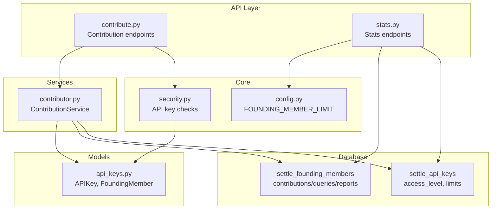
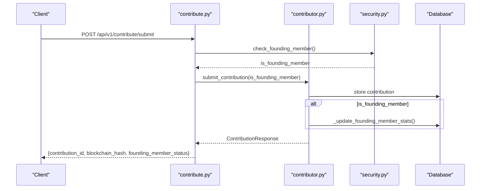
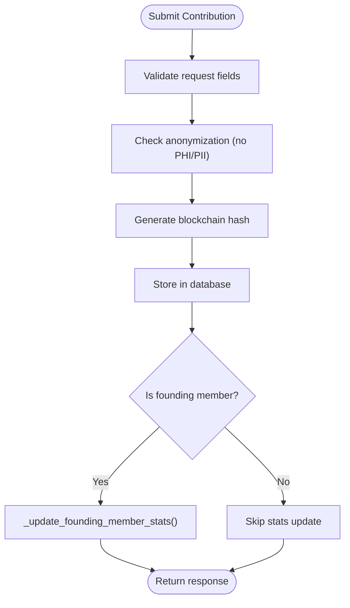
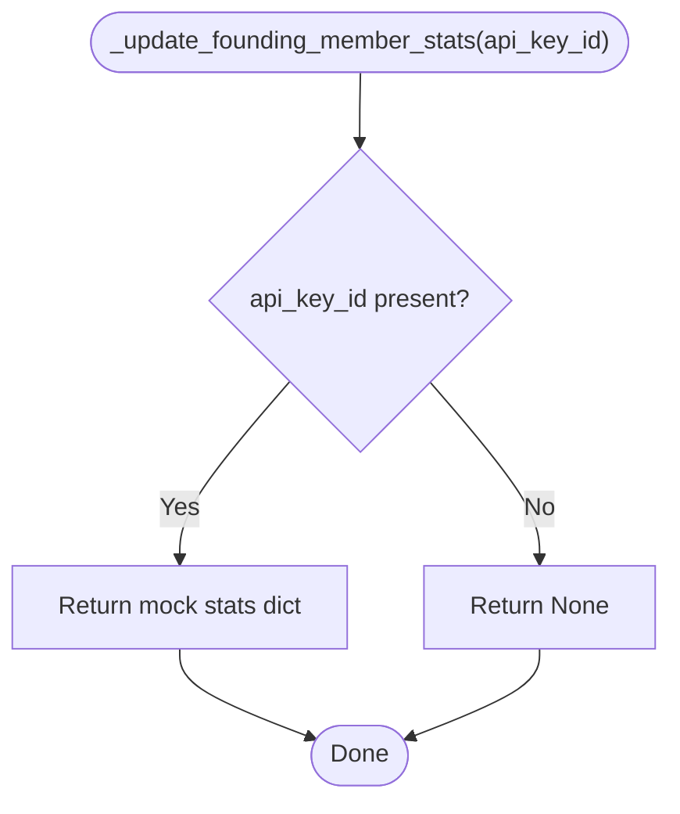
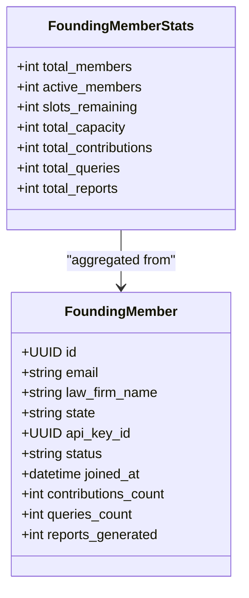
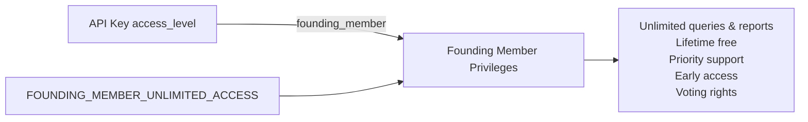
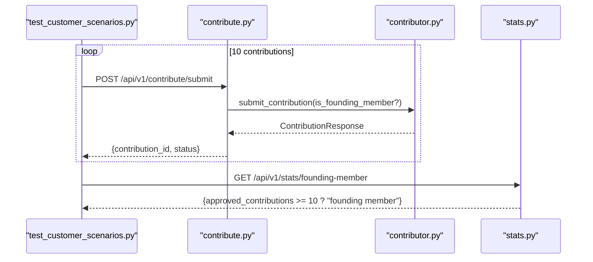
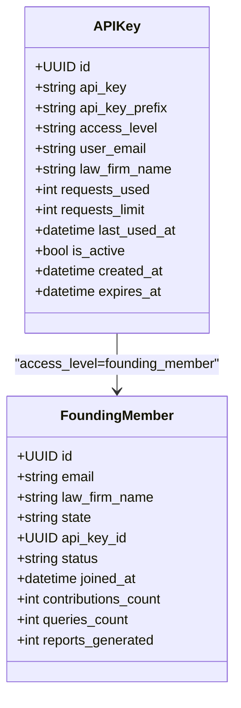
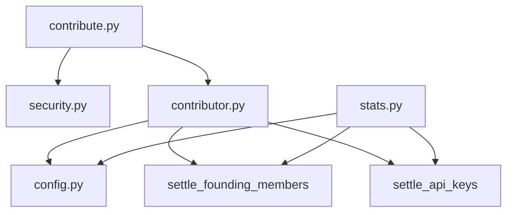

# Founding Member Privileges

<cite>
**Referenced Files in This Document**
- [contribute.py](file://app/api/v1/endpoints/contribute.py)
- [contributor.py](file://app/services/contributor.py)
- [stats.py](file://app/api/v1/endpoints/stats.py)
- [api_keys.py](file://app/models/api_keys.py)
- [security.py](file://app/core/security.py)
- [config.py](file://app/core/config.py)
- [settle_supabase.sql](file://database/schemas/settle_supabase.sql)
- [CREATE_SETTLE_DATABASE.sql](file://database/CREATE_SETTLE_DATABASE.sql)
- [test_customer_scenarios.py](file://tests/test_customer_scenarios.py)
- [test_automated_integration.py](file://tests/test_automated_integration.py)
- [SETTLE_PRICING_CONVERSATION.md](file://docs/architecture/SETTLE_PRICING_CONVERSATION.md)
</cite>

## Table of Contents
1. [Introduction](#introduction)
2. [Project Structure](#project-structure)
3. [Core Components](#core-components)
4. [Architecture Overview](#architecture-overview)
5. [Detailed Component Analysis](#detailed-component-analysis)
6. [Dependency Analysis](#dependency-analysis)
7. [Performance Considerations](#performance-considerations)
8. [Troubleshooting Guide](#troubleshooting-guide)
9. [Conclusion](#conclusion)

## Introduction
This document explains the Founding Member privilege system within the contribution workflow. It details how contributions are processed, how founding members receive special treatment, and how stats are tracked for contributions, queries, and report generation. It also covers the privilege escalation process, benefits, and integration with API key management and user tier systems.

## Project Structure
The Founding Member system spans several modules:
- API endpoints for contribution submission and stats retrieval
- Services that implement the contribution workflow and privilege handling
- Data models for API keys and founding members
- Configuration for limits and privileges
- Database schema for founding member tracking and related metrics
- Tests that demonstrate the founding member journey

**Diagram sources**
- [contribute.py:51-125](file://app/api/v1/endpoints/contribute.py#L51-L125)
- [contributor.py:55-125](file://app/services/contributor.py#L55-L125)
- [stats.py:41-107](file://app/api/v1/endpoints/stats.py#L41-L107)
- [api_keys.py:11-147](file://app/models/api_keys.py#L11-L147)
- [security.py:124-195](file://app/core/security.py#L124-L195)
- [config.py:192-198](file://app/core/config.py#L192-L198)
- [settle_supabase.sql:200-246](file://database/schemas/settle_supabase.sql#L200-L246)
- [CREATE_SETTLE_DATABASE.sql:200-221](file://database/CREATE_SETTLE_DATABASE.sql#L200-L221)

**Section sources**
- [contribute.py:51-125](file://app/api/v1/endpoints/contribute.py#L51-L125)
- [contributor.py:55-125](file://app/services/contributor.py#L55-L125)
- [stats.py:41-107](file://app/api/v1/endpoints/stats.py#L41-L107)
- [api_keys.py:11-147](file://app/models/api_keys.py#L11-L147)
- [security.py:124-195](file://app/core/security.py#L124-L195)
- [config.py:192-198](file://app/core/config.py#L192-L198)
- [settle_supabase.sql:200-246](file://database/schemas/settle_supabase.sql#L200-L246)
- [CREATE_SETTLE_DATABASE.sql:200-221](file://database/CREATE_SETTLE_DATABASE.sql#L200-L221)

## Core Components
- Contribution endpoints: Validate, anonymize, hash, store, and optionally update founding member stats upon successful contribution.
- Contribution service: Implements the workflow and calls the founding member stats updater when appropriate.
- Stats endpoints: Public stats for founding member program, including totals and capacity.
- API key models: Define access levels including founding_member and usage tracking.
- Security helpers: Determine founding member status and enforce rate limits accordingly.
- Configuration: Defines the founding member program capacity and privileges.
- Database schema: Tracks founding member stats and API key access levels.

**Section sources**
- [contribute.py:51-125](file://app/api/v1/endpoints/contribute.py#L51-L125)
- [contributor.py:55-125](file://app/services/contributor.py#L55-L125)
- [stats.py:41-107](file://app/api/v1/endpoints/stats.py#L41-L107)
- [api_keys.py:11-147](file://app/models/api_keys.py#L11-L147)
- [security.py:146-195](file://app/core/security.py#L146-L195)
- [config.py:192-198](file://app/core/config.py#L192-L198)
- [settle_supabase.sql:200-246](file://database/schemas/settle_supabase.sql#L200-L246)

## Architecture Overview
The contribution workflow integrates with the founding member privilege system as follows:
- On submission, the endpoint determines whether the caller is a founding member.
- If so, the service updates founding member stats after storing the contribution.
- Stats endpoints expose program-wide metrics including capacity and usage.

**Diagram sources**
- [contribute.py:51-125](file://app/api/v1/endpoints/contribute.py#L51-L125)
- [contributor.py:55-125](file://app/services/contributor.py#L55-L125)
- [security.py:146-157](file://app/core/security.py#L146-L157)

## Detailed Component Analysis

### Contribution Endpoint and Workflow
- Validates request and logs context.
- Determines founding member status from auth context.
- Submits contribution via the service, which performs validation, anonymization, hashing, and storage.
- Updates founding member stats if the submitter qualifies.

**Diagram sources**
- [contribute.py:51-125](file://app/api/v1/endpoints/contribute.py#L51-L125)
- [contributor.py:55-125](file://app/services/contributor.py#L55-L125)

**Section sources**
- [contribute.py:51-125](file://app/api/v1/endpoints/contribute.py#L51-L125)
- [contributor.py:55-125](file://app/services/contributor.py#L55-L125)

### _update_founding_member_stats Method
- Purpose: Update founding member stats after a qualifying contribution.
- Current behavior: Returns mock stats including contribution, query, and report counts.
- Future behavior: Will increment counters in the database for the founding member’s API key.

**Diagram sources**
- [contributor.py:194-217](file://app/services/contributor.py#L194-L217)

**Section sources**
- [contributor.py:194-217](file://app/services/contributor.py#L194-L217)

### Stats Tracking System
- Founding member program stats endpoint aggregates:
  - Total members
  - Active members
  - Slots remaining
  - Total capacity (from configuration)
  - Total contributions
  - Total queries
  - Total reports
- Database-backed counters include:
  - contributions_count
  - queries_count
  - reports_generated

**Diagram sources**
- [stats.py:20-29](file://app/api/v1/endpoints/stats.py#L20-L29)
- [settle_supabase.sql:200-246](file://database/schemas/settle_supabase.sql#L200-L246)

**Section sources**
- [stats.py:41-107](file://app/api/v1/endpoints/stats.py#L41-L107)
- [settle_supabase.sql:200-246](file://database/schemas/settle_supabase.sql#L200-L246)

### Privilege Escalation and Benefits
- Founding members are identified by API key access level and configuration.
- Benefits documented include:
  - Unlimited settlement range queries
  - Unlimited report generation
  - Free forever (no subscription fees)
  - Priority support
  - Early access to new features
  - Voting rights on database policies
- Pricing recommendation indicates lifetime free access for the Founding tier with 50% off premium add-ons.

**Diagram sources**
- [api_keys.py:20-23](file://app/models/api_keys.py#L20-L23)
- [config.py:192-198](file://app/core/config.py#L192-L198)
- [SETTLE_PRICING_CONVERSATION.md:1272-1275](file://docs/architecture/SETTLE_PRICING_CONVERSATION.md#L1272-L1275)

**Section sources**
- [api_keys.py:20-23](file://app/models/api_keys.py#L20-L23)
- [config.py:192-198](file://app/core/config.py#L192-L198)
- [SETTLE_PRICING_CONVERSATION.md:1272-1275](file://docs/architecture/SETTLE_PRICING_CONVERSATION.md#L1272-L1275)

### Examples of Founding Member Contribution Workflows
- Scenario: Submit 10 contributions to become a founding member.
  - Submit contributions via the contribution endpoint.
  - After each submission, the service conditionally updates founding member stats if the caller is a founding member.
  - Final status checked via stats endpoint; threshold for founding membership is demonstrated in tests.

**Diagram sources**
- [test_customer_scenarios.py:190-252](file://tests/test_customer_scenarios.py#L190-L252)
- [contribute.py:51-125](file://app/api/v1/endpoints/contribute.py#L51-L125)
- [contributor.py:55-125](file://app/services/contributor.py#L55-L125)
- [stats.py:41-107](file://app/api/v1/endpoints/stats.py#L41-L107)

**Section sources**
- [test_customer_scenarios.py:190-252](file://tests/test_customer_scenarios.py#L190-L252)
- [contribute.py:51-125](file://app/api/v1/endpoints/contribute.py#L51-L125)
- [contributor.py:55-125](file://app/services/contributor.py#L55-L125)
- [stats.py:41-107](file://app/api/v1/endpoints/stats.py#L41-L107)

### Integration with API Key Management and User Tier Systems
- API keys carry an access_level field supporting founding_member, standard, premium, admin, external.
- Founding members bypass rate limits and receive unlimited access according to configuration.
- Database schema enforces access level constraints and tracks usage limits.

**Diagram sources**
- [api_keys.py:11-76](file://app/models/api_keys.py#L11-L76)
- [settle_supabase.sql:160-188](file://database/schemas/settle_supabase.sql#L160-L188)
- [settle_supabase.sql:200-246](file://database/schemas/settle_supabase.sql#L200-L246)

**Section sources**
- [api_keys.py:11-76](file://app/models/api_keys.py#L11-L76)
- [settle_supabase.sql:160-188](file://database/schemas/settle_supabase.sql#L160-L188)
- [settle_supabase.sql:200-246](file://database/schemas/settle_supabase.sql#L200-L246)

## Dependency Analysis
- The contribution endpoint depends on security helpers to detect founding members.
- The contribution service encapsulates the workflow and calls the stats updater when appropriate.
- Stats endpoints depend on configuration for capacity and query databases for counts.
- API key models define the access level contract used to determine privileges.

**Diagram sources**
- [contribute.py:51-125](file://app/api/v1/endpoints/contribute.py#L51-L125)
- [contributor.py:55-125](file://app/services/contributor.py#L55-L125)
- [stats.py:41-107](file://app/api/v1/endpoints/stats.py#L41-L107)
- [config.py:192-198](file://app/core/config.py#L192-L198)
- [settle_supabase.sql:200-246](file://database/schemas/settle_supabase.sql#L200-L246)

**Section sources**
- [contribute.py:51-125](file://app/api/v1/endpoints/contribute.py#L51-L125)
- [contributor.py:55-125](file://app/services/contributor.py#L55-L125)
- [stats.py:41-107](file://app/api/v1/endpoints/stats.py#L41-L107)
- [config.py:192-198](file://app/core/config.py#L192-L198)
- [settle_supabase.sql:200-246](file://database/schemas/settle_supabase.sql#L200-L246)

## Performance Considerations
- Founding members bypass rate limits, which simplifies their throughput but requires careful monitoring of overall system load.
- Stats aggregation is lightweight and safe to call frequently; ensure database indexes remain optimized for founding member and API key lookups.
- Mock implementations in stats and service endpoints should be replaced with real database queries for production.

## Troubleshooting Guide
- Founding member stats not updating:
  - Verify the caller is identified as a founding member via access level.
  - Confirm the service’s stats updater is invoked with a valid API key ID.
- Rate limit errors for non-founders:
  - Ensure requests_used and requests_limit are properly tracked and enforced.
- Capacity reporting anomalies:
  - Check FOUNDING_MEMBER_LIMIT configuration and database-backed capacity.

**Section sources**
- [contributor.py:194-217](file://app/services/contributor.py#L194-L217)
- [security.py:160-195](file://app/core/security.py#L160-L195)
- [config.py:192-198](file://app/core/config.py#L192-L198)

## Conclusion
The Founding Member privilege system integrates seamlessly with the contribution workflow. Founding members receive unlimited access and have their stats updated automatically upon qualifying contributions. The system’s design supports future database-backed implementations while maintaining clear separation of concerns across API, service, model, and configuration layers.