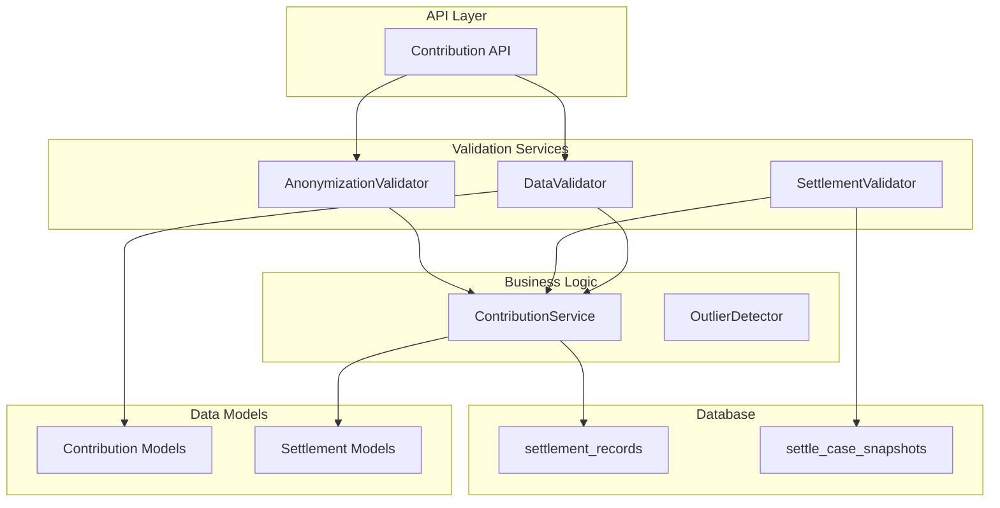
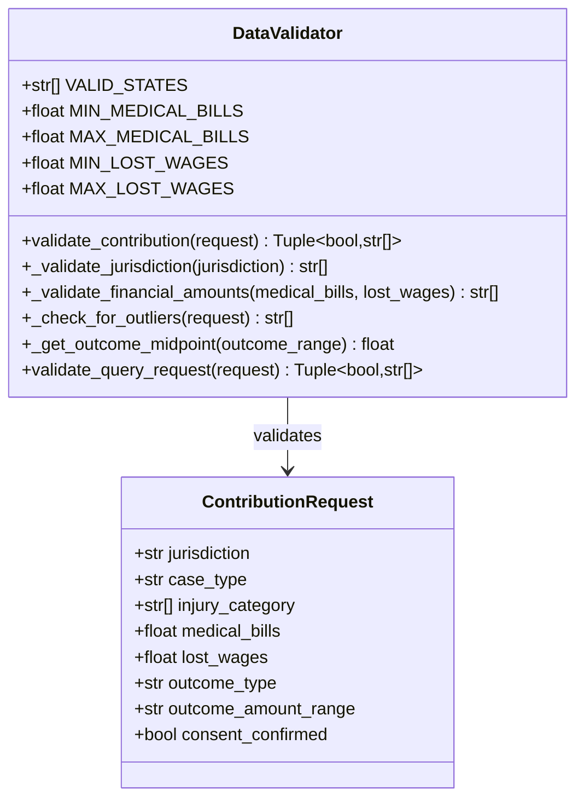
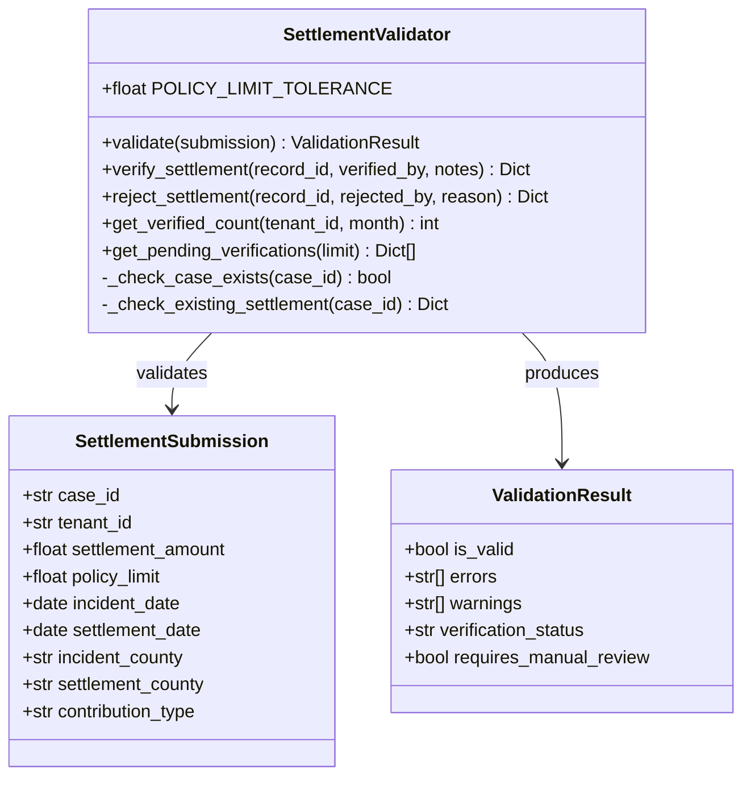
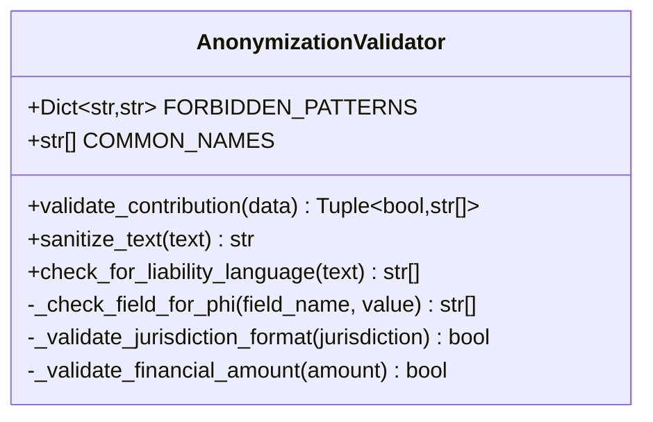
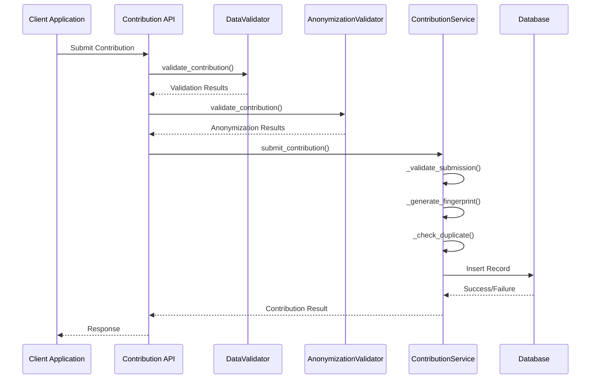
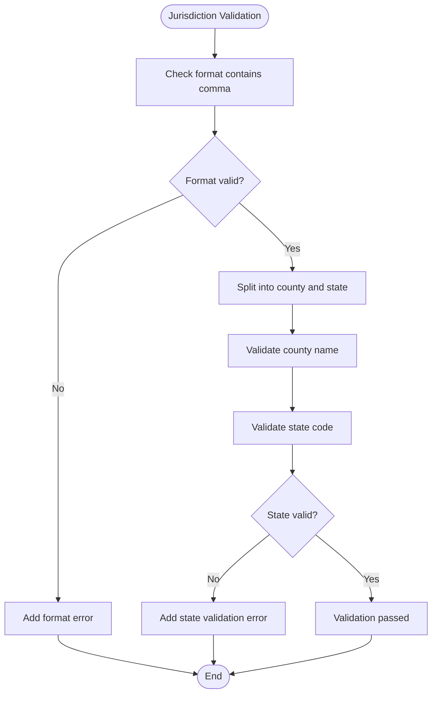
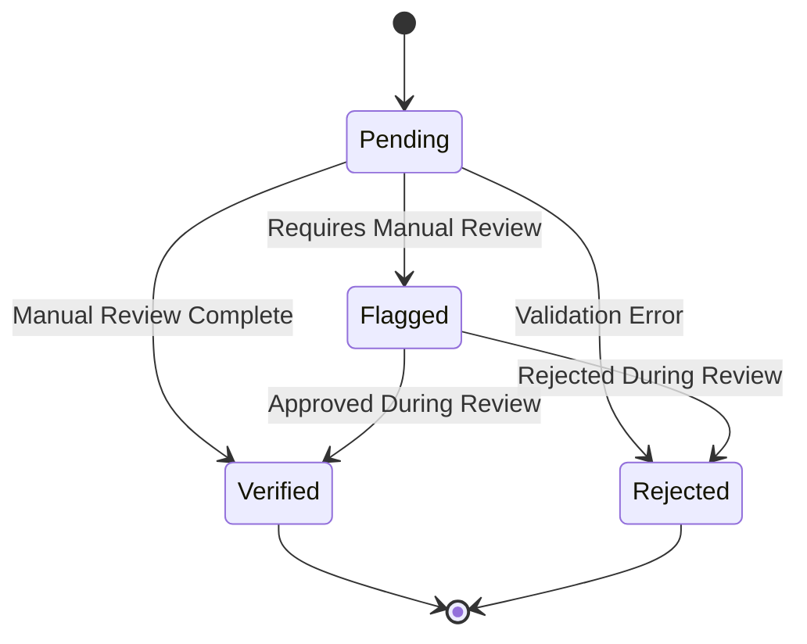
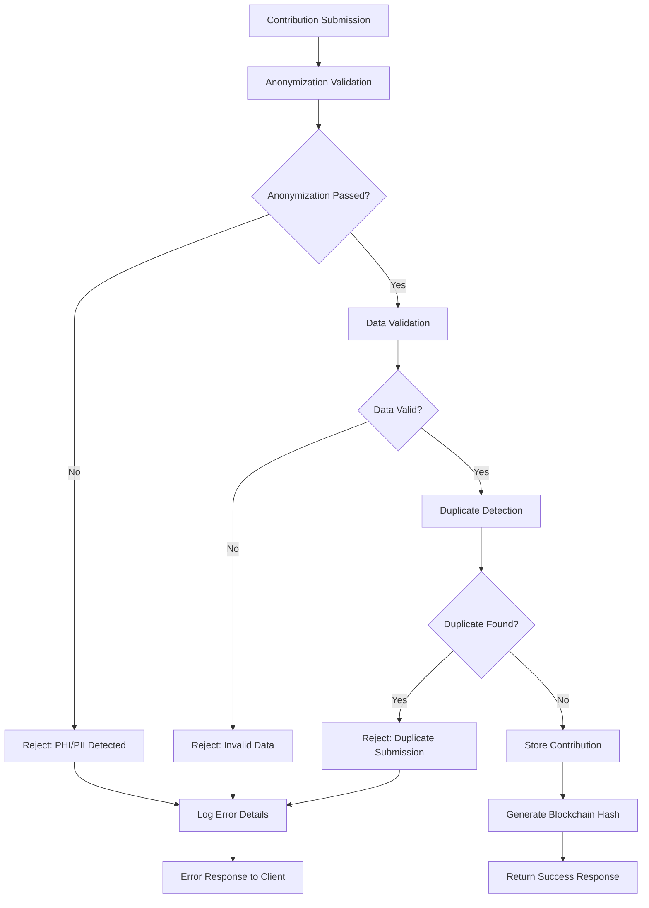
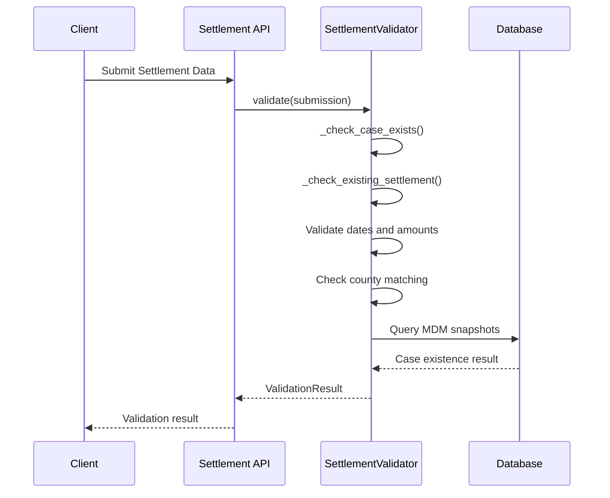
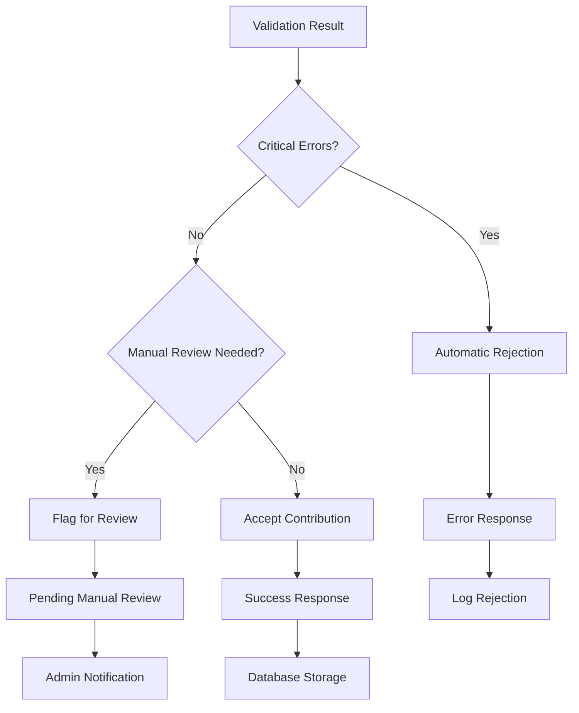

# Validation System

<cite>
**Referenced Files in This Document**
- [settlement_validator.py](file://app/services/settlement_validator.py)
- [validator.py](file://app/services/validator.py)
- [contribution_service.py](file://app/services/contribution_service.py)
- [anonymizer.py](file://app/services/anonymizer.py)
- [case_bank.py](file://app/models/case_bank.py)
- [contribute.py](file://app/api/v1/endpoints/contribute.py)
- [test_validator.py](file://tests/test_validator.py)
- [test_oakwood_e2e.py](file://tests/test_oakwood_e2e.py)
- [INTEGRATION_GUIDE.md](file://docs/INTEGRATION_GUIDE.md)
</cite>

## Table of Contents
1. [Introduction](#introduction)
2. [Project Structure](#project-structure)
3. [Core Components](#core-components)
4. [Architecture Overview](#architecture-overview)
5. [Detailed Component Analysis](#detailed-component-analysis)
6. [Validation Categories](#validation-categories)
7. [Validation Pipeline Integration](#validation-pipeline-integration)
8. [Error Handling Mechanisms](#error-handling-mechanisms)
9. [Examples of Validation Failures](#examples-of-validation-failures)
10. [Relationship Between Validation Errors and Contribution Rejection](#relationship-between-validation-errors-and-contribution-rejection)
11. [Performance Considerations](#performance-considerations)
12. [Troubleshooting Guide](#troubleshooting-guide)
13. [Conclusion](#conclusion)

## Introduction

The SETTLE Service implements a comprehensive data validation system designed to ensure the integrity, completeness, and correctness of settlement contributions. The validation system operates on multiple levels, from basic data format validation to advanced anomaly detection, ensuring that only high-quality, compliant data enters the intelligence dataset.

The system consists of three primary validation components:
- **DataValidator**: Handles general contribution validation with jurisdiction checks, monetary value ranges, and format requirements
- **SettlementValidator**: Enforces strict settlement-specific validation rules for completeness and temporal consistency
- **AnonymizationValidator**: Ensures complete removal of Protected Health Information (PHI) and Personal Identifiable Information (PII)

## Project Structure

The validation system is organized across several key modules within the SETTLE Service architecture:



**Diagram sources**
- [contribute.py:51-125](file://app/api/v1/endpoints/contribute.py#L51-L125)
- [validator.py:25-327](file://app/services/validator.py#L25-L327)
- [settlement_validator.py:59-264](file://app/services/settlement_validator.py#L59-L264)
- [contribution_service.py:69-388](file://app/services/contribution_service.py#L69-L388)

**Section sources**
- [contribute.py:1-164](file://app/api/v1/endpoints/contribute.py#L1-L164)
- [validator.py:1-327](file://app/services/validator.py#L1-L327)
- [settlement_validator.py:1-264](file://app/services/settlement_validator.py#L1-L264)
- [contribution_service.py:1-388](file://app/services/contribution_service.py#L1-L388)

## Core Components

### DataValidator Class

The DataValidator serves as the primary validation engine for settlement contributions, implementing comprehensive validation rules across multiple categories:



**Diagram sources**
- [validator.py:25-327](file://app/services/validator.py#L25-L327)
- [case_bank.py:141-189](file://app/models/case_bank.py#L141-L189)

### SettlementValidator Class

The SettlementValidator enforces strict settlement-specific validation rules with emphasis on temporal consistency and jurisdictional accuracy:



**Diagram sources**
- [settlement_validator.py:59-264](file://app/services/settlement_validator.py#L59-L264)

### AnonymizationValidator Class

The AnonymizationValidator ensures complete compliance with legal and ethical standards by detecting and preventing PHI/PII exposure:



**Diagram sources**
- [anonymizer.py:17-340](file://app/services/anonymizer.py#L17-L340)

**Section sources**
- [validator.py:25-327](file://app/services/validator.py#L25-L327)
- [settlement_validator.py:59-264](file://app/services/settlement_validator.py#L59-L264)
- [anonymizer.py:17-340](file://app/services/anonymizer.py#L17-L340)

## Architecture Overview

The validation system follows a layered architecture with clear separation of concerns:



**Diagram sources**
- [contribute.py:51-125](file://app/api/v1/endpoints/contribute.py#L51-L125)
- [validator.py:52-138](file://app/services/validator.py#L52-L138)
- [anonymizer.py:92-180](file://app/services/anonymizer.py#L92-L180)
- [contribution_service.py:87-159](file://app/services/contribution_service.py#L87-L159)

## Detailed Component Analysis

### DataValidator Implementation

The DataValidator implements comprehensive validation across multiple domains:

#### Jurisdiction Validation
Validates that jurisdiction strings follow the required "County, ST" format with proper state codes:



**Diagram sources**
- [validator.py:140-181](file://app/services/validator.py#L140-L181)

#### Financial Amount Validation
Enforces realistic monetary value ranges with configurable limits:

| Category | Minimum | Maximum | Purpose |
|----------|---------|---------|---------|
| Medical Bills | $1.00 | $10,000,000.00 | Covers typical medical expenses |
| Lost Wages | $0.00 | $5,000,000.00 | Prevents unrealistic income claims |

#### Outlier Detection
Identifies statistically unusual patterns that warrant manual review:

- Unusually high medical bills (> $1,000,000)
- Extreme outcome-to-medical bill ratios (> 15x multiplier)
- Inconsistent injury severity with settlement amounts

**Section sources**
- [validator.py:52-138](file://app/services/validator.py#L52-L138)
- [validator.py:140-181](file://app/services/validator.py#L140-L181)
- [validator.py:183-224](file://app/services/validator.py#L183-L224)
- [validator.py:226-262](file://app/services/validator.py#L226-L262)

### SettlementValidator Implementation

The SettlementValidator focuses on settlement-specific validation with strict temporal and jurisdictional requirements:

#### Validation Rules

| Rule Number | Validation Type | Description | Error Message |
|-------------|----------------|-------------|---------------|
| 1 | Existence Check | Case must exist in MDM | "Case {case_id} not found in MDM" |
| 2 | Uniqueness Check | Only one settlement per case | "Settlement already exists for case {case_id}" |
| 3 | Temporal Consistency | Settlement date must follow incident date | "Settlement date ({date}) must be after incident date ({date})" |
| 4 | Policy Limit Sanity | Settlement must not exceed policy limit by more than 10% | "Settlement (${amount}) exceeds policy limit (${amount}) by more than 10%" |
| 5 | Jurisdiction Match | Incident and settlement counties must match | "County mismatch: incident in {county}, settlement reported in {county}" |

#### Verification Status Flow



**Diagram sources**
- [settlement_validator.py:121-135](file://app/services/settlement_validator.py#L121-L135)

**Section sources**
- [settlement_validator.py:78-135](file://app/services/settlement_validator.py#L78-L135)
- [settlement_validator.py:167-227](file://app/services/settlement_validator.py#L167-L227)

### AnonymizationValidator Implementation

The AnonymizationValidator implements strict compliance checking:

#### Forbidden Patterns Detection

| Pattern Type | Detection Method | Example Matches |
|--------------|------------------|-----------------|
| Social Security Numbers | Regex pattern `\b\d{3}-\d{2}-\d{4}\b` | "123-45-6789" |
| Dates of Birth | Regex pattern `\b\d{1,2}[/-]\d{1,2}[/-]\d{2,4}\b` | "01/15/85" |
| Phone Numbers | Regex pattern `\b\d{3}[-.]?\d{3}[-.]?\d{4}\b` | "(555) 123-4567" |
| Email Addresses | Regex pattern `\b[A-Za-z0-9._%+-]+@[A-Za-z0-9.-]+\.[A-Z|a-z]{2,}\b` | "john.doe@example.com" |
| Case Numbers | Regex pattern `\bcase\s*#?\s*\d+\b` | "Case #12345" |
| Medical Records | Regex pattern `\bMRN\s*:?\s*\d+\b` | "MRN: 987654321" |

#### Compliance Requirements

The validator enforces strict compliance with Part 7, Section 7.3 (Anonymization Logic) and 7.6 (Legal & Compliance):

- ❌ **Never Allow**: Names, SSNs, DOBs, medical record numbers, case numbers
- ❌ **Never Allow**: Free-text narratives (injury descriptions, fault assessments)
- ❌ **Never Allow**: Specific business names ("Kroger #342")
- ❌ **Never Allow**: Addresses, phone numbers, emails
- ❌ **Never Allow**: CPT/ICD diagnostic codes

- ✅ **Only Allow**: Drop-down values, generic categories, bucketed amounts

**Section sources**
- [anonymizer.py:92-180](file://app/services/anonymizer.py#L92-L180)
- [anonymizer.py:182-215](file://app/services/anonymizer.py#L182-L215)
- [anonymizer.py:217-261](file://app/services/anonymizer.py#L217-L261)

## Validation Categories

### Case Type Validation

The system validates case types against predefined dropdown options to ensure consistency and prevent data pollution:

**Valid Case Types:**
- Motor Vehicle Accident
- Motorcycle Accident
- Truck Accident
- Pedestrian Accident
- Bicycle Accident
- Premises Liability (Slip/Trip/Fall)
- Dog Bite
- Medical Malpractice
- Nursing Home Abuse
- Product Liability
- Workers Compensation
- Wrongful Death
- Other

### Monetary Value Ranges

Financial validation ensures realistic monetary values while allowing flexibility for legitimate variations:

#### Medical Bills Validation
- **Minimum**: $1.00 (covers minimal medical expenses)
- **Maximum**: $10,000,000.00 (extremely high-value cases require special handling)
- **Validation**: Numeric values with proper decimal formatting

#### Lost Wages Validation
- **Minimum**: $0.00 (no negative wages)
- **Maximum**: $5,000,000.00 (extremely high-income claims)
- **Validation**: Non-negative numeric values

### Jurisdiction Checks

Geographic validation ensures data accuracy and prevents jurisdictional inconsistencies:

#### Jurisdiction Format Validation
- **Required Format**: "County Name, State Code"
- **State Validation**: 2-letter US state codes only
- **County Validation**: Minimum 2 characters, properly capitalized

#### County Matching Validation
- **Incident County**: Reported incident location
- **Settlement County**: Reported settlement location
- **Requirement**: Counties must match exactly (case-insensitive)

### Temporal Consistency

Time-based validation ensures logical chronological order:

#### Date Validation Rules
- **Incident Date**: Must be valid date in the past
- **Settlement Date**: Must be after incident date
- **Future Dates**: Settlement dates cannot be in the future
- **Date Format**: ISO 8601 format (YYYY-MM-DD)

### Outcome Amount Range Validation

Bucketed outcome validation ensures consistent categorization:

**Outcome Range Buckets:**
- $0-$50k
- $50k-$100k
- $100k-$150k
- $150k-$225k
- $225k-$300k
- $300k-$600k
- $600k-$1M
- $1M+

**Section sources**
- [validator.py:209-268](file://app/services/validator.py#L209-L268)
- [validator.py:225-234](file://app/services/validator.py#L225-L234)
- [validator.py:140-181](file://app/services/validator.py#L140-L181)
- [settlement_validator.py:98-119](file://app/services/settlement_validator.py#L98-L119)

## Validation Pipeline Integration

### Contribution Workflow Integration

The validation system integrates seamlessly into the contribution workflow:



**Diagram sources**
- [contribution_service.py:87-159](file://app/services/contribution_service.py#L87-L159)
- [anonymizer.py:92-180](file://app/services/anonymizer.py#L92-L180)
- [validator.py:52-138](file://app/services/validator.py#L52-L138)

### Settlement-Specific Validation Integration

Settlement validation occurs during the settlement contribution process:



**Diagram sources**
- [settlement_validator.py:78-135](file://app/services/settlement_validator.py#L78-L135)
- [settlement_validator.py:137-165](file://app/services/settlement_validator.py#L137-L165)

**Section sources**
- [contribution_service.py:87-159](file://app/services/contribution_service.py#L87-L159)
- [settlement_validator.py:78-135](file://app/services/settlement_validator.py#L78-L135)

## Error Handling Mechanisms

### Error Classification

The validation system categorizes errors into distinct types:

#### Validation Errors
Critical errors that prevent data acceptance:

- **Missing Required Fields**: Essential fields not provided
- **Invalid Data Formats**: Incorrect data types or formats
- **PHI/PII Detection**: Protected information exposure
- **Jurisdiction Mismatch**: Geographic inconsistencies
- **Temporal Inconsistencies**: Logical date ordering violations

#### Warning Messages
Non-blocking issues requiring attention:

- **Outlier Detection**: Statistically unusual patterns
- **Policy Limit Exceedance**: Settlements exceeding policy limits by >10%
- **High-Value Claims**: Medical bills > $1,000,000

#### Verification Status Impact

| Error Type | Verification Status | Impact |
|------------|-------------------|---------|
| Critical Errors | Rejected | Contribution rejected permanently |
| Manual Review Required | Flagged | Requires human intervention |
| No Errors | Pending | Awaiting manual verification |
| Verified | Verified | Counts toward rewards |

### Error Response Format

Standardized error response structure:

```json
{
  "detail": {
    "message": "Human-readable error message",
    "error": "Technical error details",
    "errors": ["Validation error 1", "Validation error 2"],
    "request_id": "550e8400-e29b-41d4-a716-446655440000"
  }
}
```

**Section sources**
- [contribution_service.py:151-159](file://app/services/contribution_service.py#L151-L159)
- [validator.py:133-137](file://app/services/validator.py#L133-L137)
- [settlement_validator.py:121-127](file://app/services/settlement_validator.py#L121-L127)

## Examples of Validation Failures

### Jurisdiction Format Errors

**Failure Scenario**: Invalid jurisdiction format
- **Input**: "MaricopaAZ" (missing comma)
- **Expected**: "Maricopa County, AZ"
- **Error Message**: "Jurisdiction must be in format 'County, ST' (e.g., 'Maricopa County, AZ')"
- **Resolution Steps**:
  1. Add comma separator between county and state
  2. Ensure state is 2-letter code
  3. Capitalize county name properly

### Financial Amount Validation Errors

**Failure Scenario**: Negative medical bills
- **Input**: medical_bills = -1000.00
- **Error Message**: "medical_bills must be at least $1.00"
- **Resolution Steps**:
  1. Enter positive dollar amount
  2. Use absolute value for calculations
  3. Verify data entry accuracy

**Failure Scenario**: Excessive lost wages
- **Input**: lost_wages = 10000000.00
- **Error Message**: "lost_wages exceeds maximum of $5,000,000.00"
- **Resolution Steps**:
  1. Reduce wage claim to realistic amount
  2. Provide supporting documentation
  3. Contact support for high-value cases

### Anonymization Violations

**Failure Scenario**: PHI Exposure
- **Input**: "Patient: John Smith, DOB: 01/15/85"
- **Error Message**: "jurisdiction contains potential DOB: 'DOB: 01/15/85'"
- **Resolution Steps**:
  1. Remove all personal identifiers
  2. Use generic jurisdiction format
  3. Apply anonymization patterns

### Settlement Validation Errors

**Failure Scenario**: Future Settlement Date
- **Input**: settlement_date = 2026-01-15 (future date)
- **Error Message**: "Settlement date must be in the past"
- **Resolution Steps**:
  1. Use actual settlement date
  2. Verify date accuracy
  3. Check for date format issues

**Failure Scenario**: County Mismatch
- **Input**: incident_county = "Maricopa", settlement_county = "Los Angeles"
- **Error Message**: "County mismatch: incident in Maricopa, settlement reported in Los Angeles"
- **Resolution Steps**:
  1. Verify incident location
  2. Confirm settlement location
  3. Correct county information

**Section sources**
- [test_validator.py:11-54](file://tests/test_validator.py#L11-L54)
- [test_oakwood_e2e.py:205-212](file://tests/test_oakwood_e2e.py#L205-L212)

## Relationship Between Validation Errors and Contribution Rejection

### Automatic Rejection Criteria

Contributions are automatically rejected when critical validation errors are detected:



**Diagram sources**
- [settlement_validator.py:121-127](file://app/services/settlement_validator.py#L121-L127)
- [validator.py:133-137](file://app/services/validator.py#L133-L137)

### Manual Review Trigger Conditions

Contributions requiring manual review include:

- **Policy Limit Exceedance**: Settlements > 10% above policy limit
- **Statistical Outliers**: Extreme value ratios or patterns
- **PHI/PII Concerns**: Potential privacy violations requiring investigation
- **Complex Cases**: Multi-million dollar settlements requiring verification

### Verification Status Impact on Rewards

Only verified settlements count toward rewards:

| Verification Status | Reward Eligibility | Processing Impact |
|---------------------|-------------------|-------------------|
| Pending | ❌ Not eligible | Awaiting manual review |
| Flagged | ❌ Not eligible | Requires manual review |
| Rejected | ❌ Not eligible | Permanently rejected |
| Verified | ✅ Eligible | Counts toward rewards |

**Section sources**
- [settlement_validator.py:11-12](file://app/services/settlement_validator.py#L11-L12)
- [settlement_validator.py:229-247](file://app/services/settlement_validator.py#L229-L247)

## Performance Considerations

### Validation Performance Optimization

The validation system implements several performance optimizations:

#### Database Query Optimization
- **Connection Pooling**: Reuse database connections across validations
- **Efficient Queries**: Use targeted SELECT statements with WHERE clauses
- **Index Utilization**: Leverage database indexes on frequently queried fields

#### Memory Management
- **Lazy Loading**: Initialize database connections only when needed
- **Resource Cleanup**: Properly close database connections after use
- **Object Reuse**: Reuse validator instances where possible

#### Asynchronous Operations
- **Non-blocking I/O**: Use async database operations for MDM lookups
- **Parallel Processing**: Execute independent validation checks concurrently
- **Timeout Handling**: Implement timeouts for external service calls

### Scalability Considerations

- **Caching**: Cache frequently accessed validation constants
- **Batch Processing**: Process multiple validations in batches when possible
- **Monitoring**: Track validation performance metrics and error rates

## Troubleshooting Guide

### Common Validation Issues

#### Jurisdiction Validation Problems
**Issue**: "Jurisdiction must be in format 'County, ST'"
**Solution**: Ensure format includes comma and state code

#### Financial Validation Issues
**Issue**: "Amount exceeds maximum/minimum limits"
**Solution**: Adjust values to fall within allowed ranges

#### Anonymization Failures
**Issue**: PHI/PII detected in contribution
**Solution**: Remove all personal identifiers and re-submit

#### Database Connection Issues
**Issue**: "Database not initialized"
**Solution**: Ensure proper database connection setup

### Debugging Validation Errors

#### Enable Detailed Logging
- Set logging level to DEBUG for validation components
- Monitor validation error patterns
- Track repeated failure scenarios

#### Validation Testing
- Use unit tests to validate individual validation rules
- Test edge cases and boundary conditions
- Verify error messages are user-friendly

**Section sources**
- [contribution_service.py:151-159](file://app/services/contribution_service.py#L151-L159)
- [validator.py:133-137](file://app/services/validator.py#L133-L137)

## Conclusion

The SETTLE Service's validation system provides comprehensive data quality assurance through multiple layers of validation, from basic format checking to advanced anomaly detection. The system successfully balances strict compliance requirements with user-friendly error messaging, ensuring that only high-quality, anonymized data enters the intelligence dataset.

Key strengths of the validation system include:

- **Comprehensive Coverage**: Multi-layer validation across all data types
- **Clear Error Messaging**: User-friendly error messages with resolution steps
- **Automated Processing**: Streamlined workflows with minimal manual intervention
- **Compliance Focus**: Strict adherence to legal and ethical standards
- **Performance Optimization**: Efficient validation with scalability considerations

The validation system effectively prevents data quality issues while maintaining a smooth user experience, contributing to the overall reliability and trustworthiness of the SETTLE intelligence dataset.