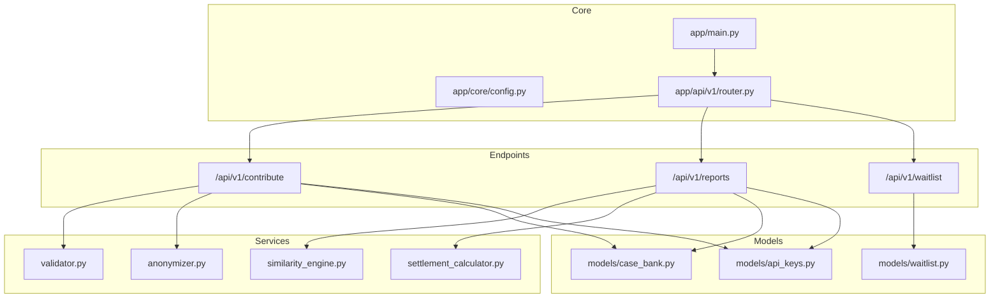
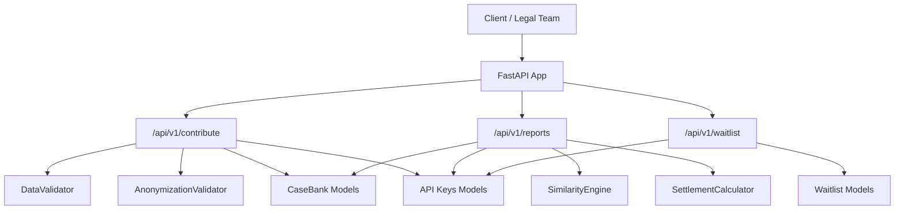
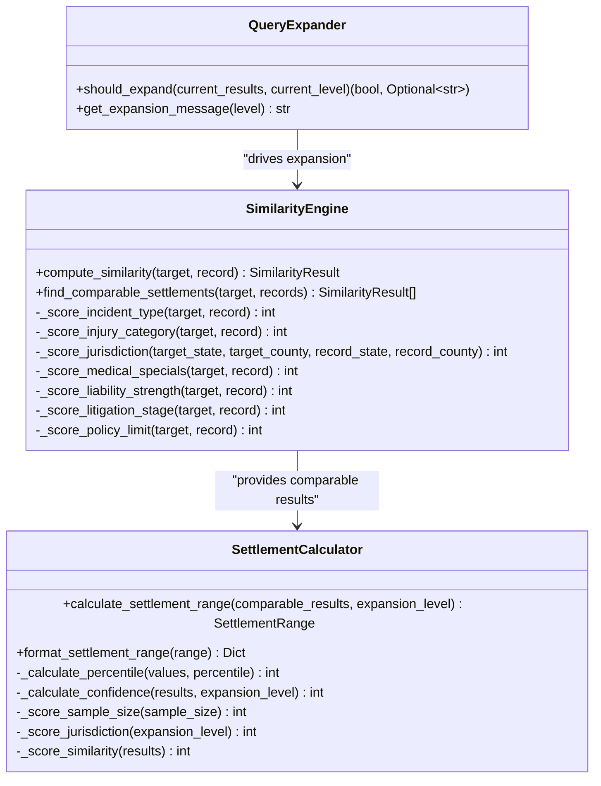
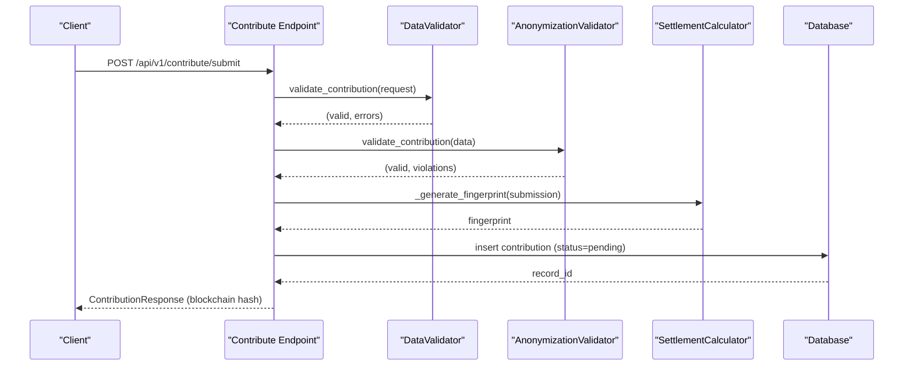
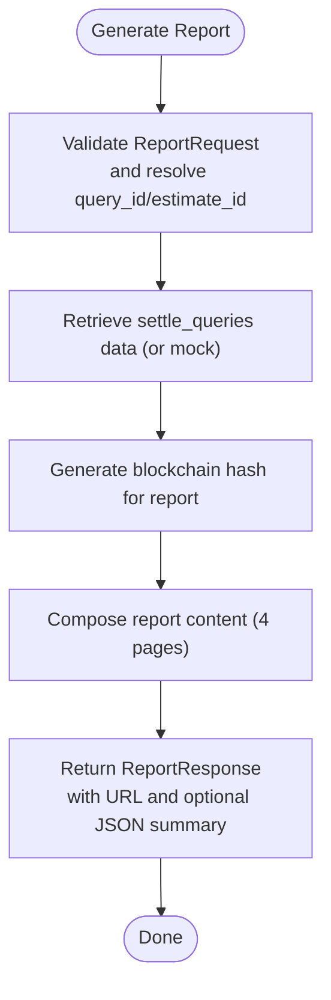
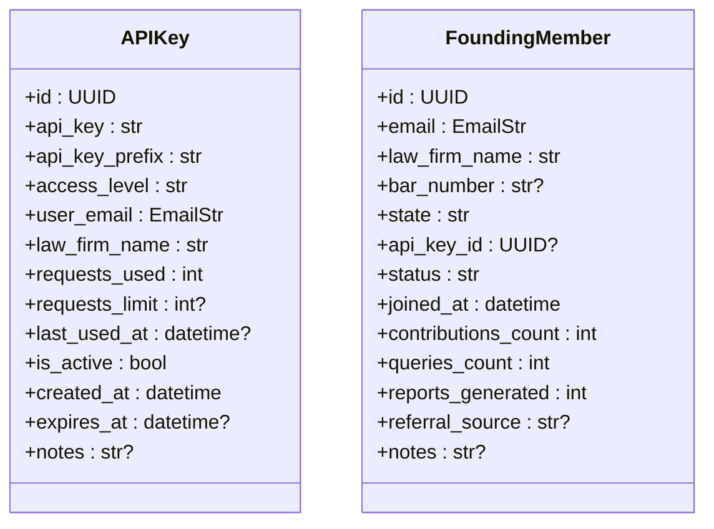
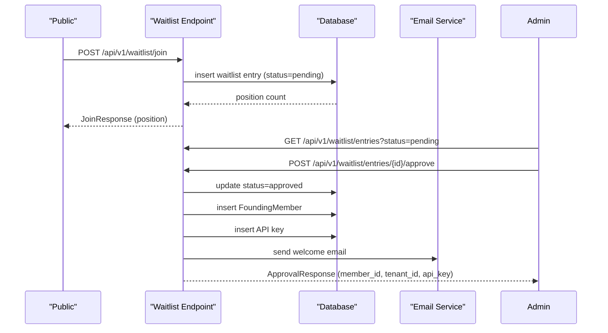
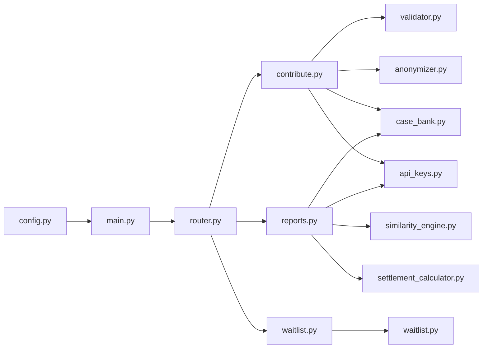

# Key Features

<cite>
**Referenced Files in This Document**
- [app/main.py](file://app/main.py)
- [app/core/config.py](file://app/core/config.py)
- [app/api/v1/router.py](file://app/api/v1/router.py)
- [app/api/v1/endpoints/contribute.py](file://app/api/v1/endpoints/contribute.py)
- [app/api/v1/endpoints/reports.py](file://app/api/v1/endpoints/reports.py)
- [app/api/v1/endpoints/waitlist.py](file://app/api/v1/endpoints/waitlist.py)
- [app/models/case_bank.py](file://app/models/case_bank.py)
- [app/models/api_keys.py](file://app/models/api_keys.py)
- [app/models/waitlist.py](file://app/models/waitlist.py)
- [app/services/similarity_engine.py](file://app/services/similarity_engine.py)
- [app/services/settlement_calculator.py](file://app/services/settlement_calculator.py)
- [app/services/anonymizer.py](file://app/services/anonymizer.py)
- [app/services/validator.py](file://app/services/validator.py)
</cite>

## Table of Contents
1. [Introduction](#introduction)
2. [Project Structure](#project-structure)
3. [Core Components](#core-components)
4. [Architecture Overview](#architecture-overview)
5. [Detailed Component Analysis](#detailed-component-analysis)
6. [Dependency Analysis](#dependency-analysis)
7. [Performance Considerations](#performance-considerations)
8. [Troubleshooting Guide](#troubleshooting-guide)
9. [Conclusion](#conclusion)

## Introduction
This document explains the key features of the SETTLE Service with a focus on:
- Settlement Intelligence Engine: percentile-based calculation algorithms and confidence scoring
- Data Contribution System: validation, anonymization, and blockchain timestamp verification
- Professional Reporting: PDF generation and comparative case analysis
- API Key Management and Access Control
- Waitlist Management and Administrative Features

It also describes the underlying technologies, business value, and integration patterns, and demonstrates how these features work together to serve legal professionals.

## Project Structure
The SETTLE Service is a FastAPI application with modular components:
- Core configuration and lifecycle management
- API routers and endpoints for public and authenticated routes
- Services for intelligence, validation, anonymization, reporting, and waitlist management
- Models for data contracts and domain entities
- Database abstractions and migrations

**Diagram sources**
- [app/main.py:102-136](file://app/main.py#L102-L136)
- [app/api/v1/router.py:5-25](file://app/api/v1/router.py#L5-L25)
- [app/api/v1/endpoints/contribute.py:51-126](file://app/api/v1/endpoints/contribute.py#L51-L126)
- [app/api/v1/endpoints/reports.py:23-189](file://app/api/v1/endpoints/reports.py#L23-L189)
- [app/api/v1/endpoints/waitlist.py:62-120](file://app/api/v1/endpoints/waitlist.py#L62-L120)
- [app/services/similarity_engine.py:188-419](file://app/services/similarity_engine.py#L188-L419)
- [app/services/settlement_calculator.py:41-209](file://app/services/settlement_calculator.py#L41-L209)
- [app/services/anonymizer.py:17-181](file://app/services/anonymizer.py#L17-L181)
- [app/services/validator.py:25-139](file://app/services/validator.py#L25-L139)
- [app/models/case_bank.py:15-63](file://app/models/case_bank.py#L15-L63)
- [app/models/api_keys.py:11-40](file://app/models/api_keys.py#L11-L40)
- [app/models/waitlist.py:11-29](file://app/models/waitlist.py#L11-L29)

**Section sources**
- [app/main.py:102-136](file://app/main.py#L102-L136)
- [app/api/v1/router.py:5-25](file://app/api/v1/router.py#L5-L25)

## Core Components
- Settlement Intelligence Engine: deterministic similarity scoring and percentile-based range calculation with confidence
- Data Contribution System: validation, anonymization, duplicate detection, and blockchain timestamp verification
- Professional Reporting: 4-page report generation with comparative cases and blockchain verification
- API Key Management and Access Control: access levels, rate limiting, and service-to-service auth
- Waitlist Management: public join flow and admin approvals with Founding Member onboarding

**Section sources**
- [app/services/similarity_engine.py:188-419](file://app/services/similarity_engine.py#L188-L419)
- [app/services/settlement_calculator.py:41-209](file://app/services/settlement_calculator.py#L41-L209)
- [app/services/anonymizer.py:17-181](file://app/services/anonymizer.py#L17-L181)
- [app/services/validator.py:25-139](file://app/services/validator.py#L25-L139)
- [app/api/v1/endpoints/contribute.py:51-126](file://app/api/v1/endpoints/contribute.py#L51-L126)
- [app/api/v1/endpoints/reports.py:23-189](file://app/api/v1/endpoints/reports.py#L23-L189)
- [app/models/api_keys.py:11-40](file://app/models/api_keys.py#L11-L40)
- [app/models/case_bank.py:15-63](file://app/models/case_bank.py#L15-L63)
- [app/api/v1/endpoints/waitlist.py:62-120](file://app/api/v1/endpoints/waitlist.py#L62-L120)

## Architecture Overview
The system integrates FastAPI with modular services and strict data governance:
- FastAPI app initializes monitoring, registers with the service registry, and mounts routers
- Endpoints depend on validators and anonymizers to ensure data integrity
- Intelligence services compute similarity and percentile ranges
- Reporting composes anonymized comparable cases and adds blockchain verification
- Waitlist admin endpoints manage approvals and generate API keys for Founding Members

**Diagram sources**
- [app/main.py:102-136](file://app/main.py#L102-L136)
- [app/api/v1/router.py:5-25](file://app/api/v1/router.py#L5-L25)
- [app/api/v1/endpoints/contribute.py:51-126](file://app/api/v1/endpoints/contribute.py#L51-L126)
- [app/api/v1/endpoints/reports.py:23-189](file://app/api/v1/endpoints/reports.py#L23-L189)
- [app/api/v1/endpoints/waitlist.py:62-120](file://app/api/v1/endpoints/waitlist.py#L62-L120)
- [app/services/validator.py:25-139](file://app/services/validator.py#L25-L139)
- [app/services/anonymizer.py:17-181](file://app/services/anonymizer.py#L17-L181)
- [app/services/similarity_engine.py:188-419](file://app/services/similarity_engine.py#L188-L419)
- [app/services/settlement_calculator.py:41-209](file://app/services/settlement_calculator.py#L41-L209)
- [app/models/case_bank.py:15-63](file://app/models/case_bank.py#L15-L63)
- [app/models/api_keys.py:11-40](file://app/models/api_keys.py#L11-L40)
- [app/models/waitlist.py:11-29](file://app/models/waitlist.py#L11-L29)

## Detailed Component Analysis

### Settlement Intelligence Engine
- Deterministic similarity scoring: computes weighted scores (0–100) across incident type, injury category, jurisdiction, medical specials band, liability strength, litigation stage, and policy limit band
- Percentile-based range calculation: derives 25th, median, 75th percentiles from comparable settlements and computes a confidence score from sample size, jurisdiction match, and average similarity
- Query expansion: progressively expands search scope (county → state → regional → national) when sample sizes are insufficient

**Diagram sources**
- [app/services/similarity_engine.py:188-419](file://app/services/similarity_engine.py#L188-L419)
- [app/services/settlement_calculator.py:41-209](file://app/services/settlement_calculator.py#L41-L209)

**Section sources**
- [app/services/similarity_engine.py:188-419](file://app/services/similarity_engine.py#L188-L419)
- [app/services/settlement_calculator.py:41-209](file://app/services/settlement_calculator.py#L41-L209)

### Data Contribution System
- Validation and anonymization: enforces drop-down selections, bucketed outcomes, and jurisdiction format; rejects PHI/PII and liability language
- Duplicate detection: generates a fingerprint from normalized fields and checks for prior submissions
- Blockchain timestamp verification: creates a blockchain hash for contributions and reports to anchor integrity
- Compliance: requires explicit consent and tracks contribution metadata for auditability

**Diagram sources**
- [app/api/v1/endpoints/contribute.py:51-126](file://app/api/v1/endpoints/contribute.py#L51-L126)
- [app/services/validator.py:52-139](file://app/services/validator.py#L52-L139)
- [app/services/anonymizer.py:92-181](file://app/services/anonymizer.py#L92-L181)
- [app/services/settlement_calculator.py:186-211](file://app/services/settlement_calculator.py#L186-L211)

**Section sources**
- [app/api/v1/endpoints/contribute.py:51-126](file://app/api/v1/endpoints/contribute.py#L51-L126)
- [app/services/validator.py:52-139](file://app/services/validator.py#L52-L139)
- [app/services/anonymizer.py:92-181](file://app/services/anonymizer.py#L92-L181)
- [app/models/case_bank.py:141-203](file://app/models/case_bank.py#L141-L203)

### Professional Reporting Capabilities
- Report composition: builds a 4-page report with summary, anonymized comparable cases, methodology justification, and compliance statements
- Comparative case analysis: includes anonymized attributes (jurisdiction, case type, injury, medical bills, outcome range, date)
- Blockchain verification: generates a blockchain hash for the report to enable tamper-evident verification
- Performance targets: optimized for sub-second response times

**Diagram sources**
- [app/api/v1/endpoints/reports.py:23-189](file://app/api/v1/endpoints/reports.py#L23-L189)

**Section sources**
- [app/api/v1/endpoints/reports.py:23-189](file://app/api/v1/endpoints/reports.py#L23-L189)
- [app/models/case_bank.py:95-139](file://app/models/case_bank.py#L95-L139)

### API Key Management and Access Control
- Access levels: founding_member, standard, premium, admin, external
- Usage tracking: requests_used, requests_limit (NULL means unlimited for founding members)
- Service-to-service authentication: headers enforced for internal integrations
- Admin API key: centralized for administrative operations

**Diagram sources**
- [app/models/api_keys.py:11-40](file://app/models/api_keys.py#L11-L40)
- [app/models/api_keys.py:78-101](file://app/models/api_keys.py#L78-L101)

**Section sources**
- [app/models/api_keys.py:11-40](file://app/models/api_keys.py#L11-L40)
- [app/models/api_keys.py:78-101](file://app/models/api_keys.py#L78-L101)
- [app/core/config.py:315-327](file://app/core/config.py#L315-L327)

### Waitlist Management and Administration
- Public join: captures firm and contact details, calculates queue position
- Admin workflow: list entries, get details, approve or reject with notes
- On approval: updates status, creates Founding Member record, generates API key, and sends welcome email

**Diagram sources**
- [app/api/v1/endpoints/waitlist.py:62-120](file://app/api/v1/endpoints/waitlist.py#L62-L120)
- [app/api/v1/endpoints/waitlist.py:224-345](file://app/api/v1/endpoints/waitlist.py#L224-L345)
- [app/models/waitlist.py:11-29](file://app/models/waitlist.py#L11-L29)
- [app/models/api_keys.py:11-40](file://app/models/api_keys.py#L11-L40)

**Section sources**
- [app/api/v1/endpoints/waitlist.py:62-120](file://app/api/v1/endpoints/waitlist.py#L62-L120)
- [app/api/v1/endpoints/waitlist.py:224-345](file://app/api/v1/endpoints/waitlist.py#L224-L345)
- [app/models/waitlist.py:11-29](file://app/models/waitlist.py#L11-L29)
- [app/models/api_keys.py:11-40](file://app/models/api_keys.py#L11-L40)

## Dependency Analysis
- Configuration drives security modes, CORS, rate limiting, and feature flags
- Endpoints depend on validators and anonymizers to gate data quality
- Intelligence services are decoupled from endpoints and can be reused
- Reporting depends on similarity and calculator services and writes to storage via integrations
- Admin and waitlist endpoints coordinate Founding Member onboarding and API key generation

**Diagram sources**
- [app/core/config.py:23-351](file://app/core/config.py#L23-L351)
- [app/main.py:102-136](file://app/main.py#L102-L136)
- [app/api/v1/router.py:5-25](file://app/api/v1/router.py#L5-L25)
- [app/api/v1/endpoints/contribute.py:51-126](file://app/api/v1/endpoints/contribute.py#L51-L126)
- [app/api/v1/endpoints/reports.py:23-189](file://app/api/v1/endpoints/reports.py#L23-L189)
- [app/api/v1/endpoints/waitlist.py:62-120](file://app/api/v1/endpoints/waitlist.py#L62-L120)
- [app/services/validator.py:25-139](file://app/services/validator.py#L25-L139)
- [app/services/anonymizer.py:17-181](file://app/services/anonymizer.py#L17-L181)
- [app/services/similarity_engine.py:188-419](file://app/services/similarity_engine.py#L188-L419)
- [app/services/settlement_calculator.py:41-209](file://app/services/settlement_calculator.py#L41-L209)
- [app/models/case_bank.py:15-63](file://app/models/case_bank.py#L15-L63)
- [app/models/waitlist.py:11-29](file://app/models/waitlist.py#L11-L29)
- [app/models/api_keys.py:11-40](file://app/models/api_keys.py#L11-L40)

**Section sources**
- [app/core/config.py:23-351](file://app/core/config.py#L23-L351)
- [app/main.py:102-136](file://app/main.py#L102-L136)
- [app/api/v1/router.py:5-25](file://app/api/v1/router.py#L5-L25)

## Performance Considerations
- Response time targets are defined in configuration for query and report generation
- Similarity scoring and percentile calculation are deterministic and bounded by thresholds
- Query expansion prevents premature termination while maintaining performance
- Recommendations:
  - Keep comparable sets capped to reduce sorting overhead
  - Use indexed database fields for jurisdiction and outcome ranges
  - Cache frequently accessed configuration and constants

[No sources needed since this section provides general guidance]

## Troubleshooting Guide
- Contribution validation failures: check jurisdiction format, required fields, and outcome ranges
- Anonymization violations: ensure no PHI/PII and avoid liability language
- Report generation errors: confirm a prior query exists or provide a mock fallback
- Waitlist approval issues: verify pending status and ensure email service availability for notifications

**Section sources**
- [app/services/validator.py:52-139](file://app/services/validator.py#L52-L139)
- [app/services/anonymizer.py:92-181](file://app/services/anonymizer.py#L92-L181)
- [app/api/v1/endpoints/reports.py:70-125](file://app/api/v1/endpoints/reports.py#L70-L125)
- [app/api/v1/endpoints/waitlist.py:240-270](file://app/api/v1/endpoints/waitlist.py#L240-L270)

## Conclusion
The SETTLE Service delivers a robust, attorney-focused solution by combining deterministic similarity scoring, rigorous data validation and anonymization, blockchain-backed integrity, and streamlined administrative workflows. Together, these features enable legal teams to confidently estimate settlement ranges, generate professional reports, and manage access and onboarding with strong governance and performance.