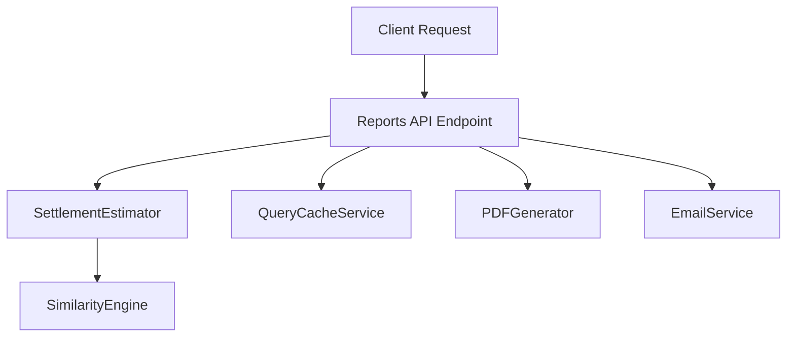
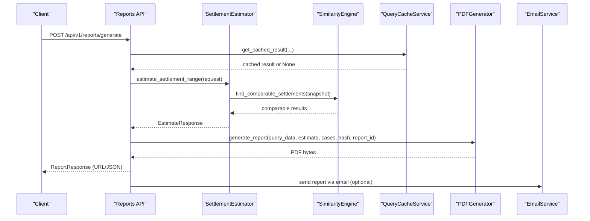
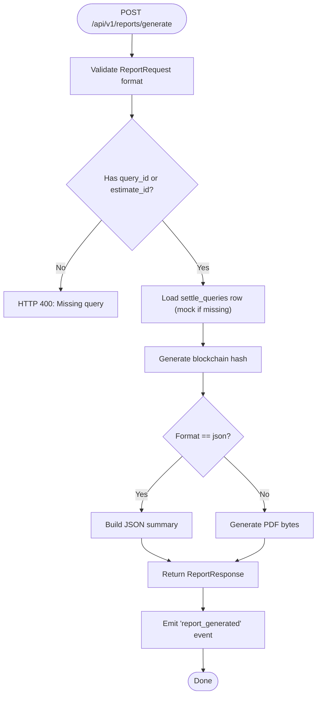
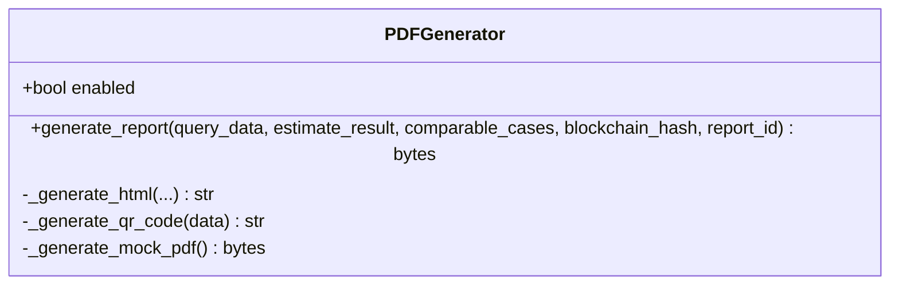
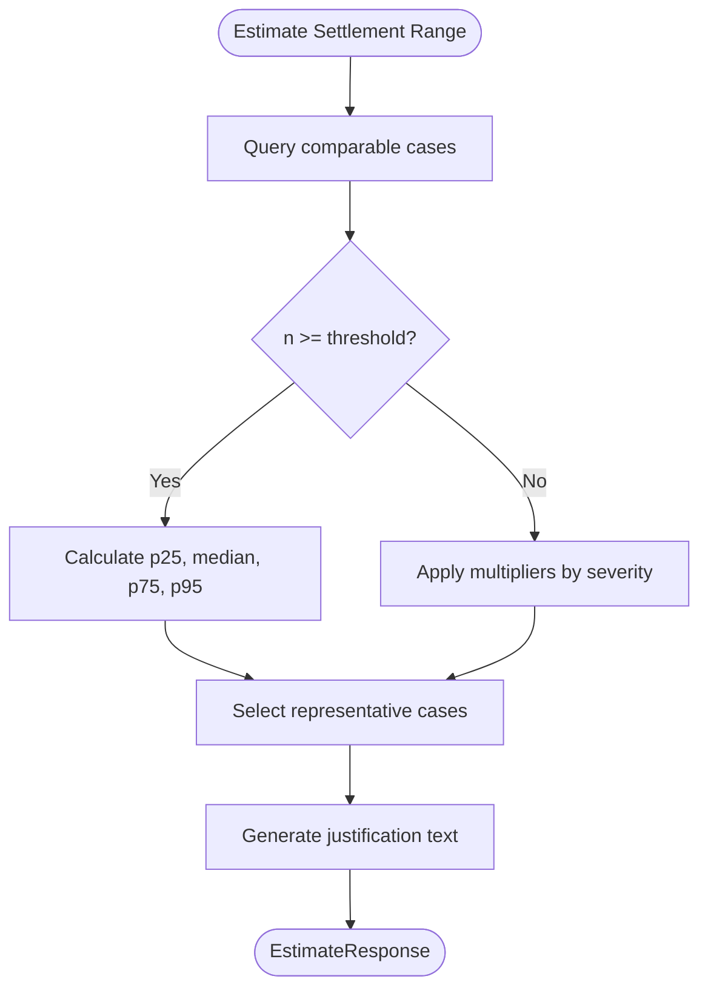
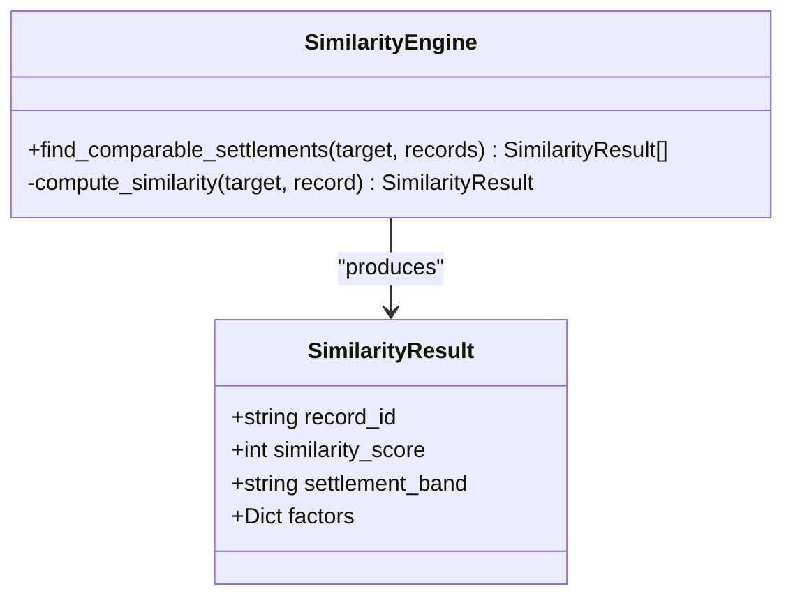
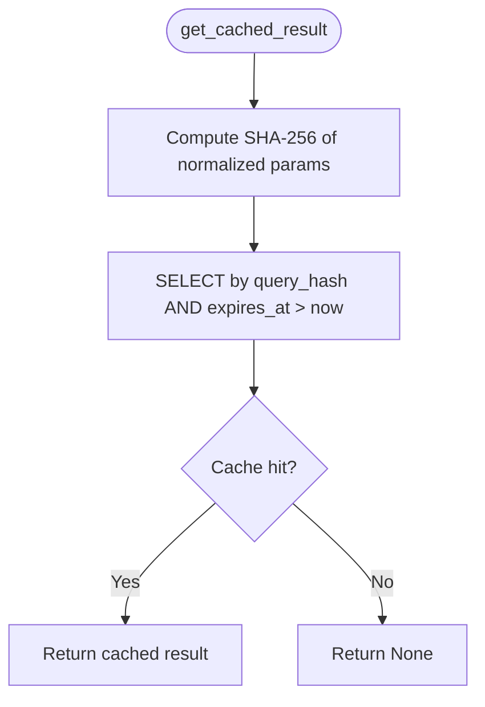
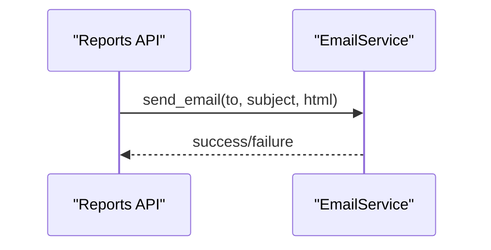
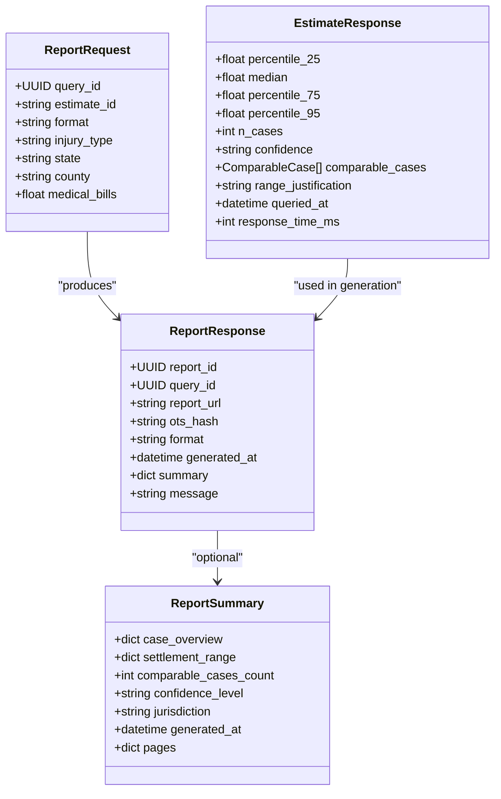
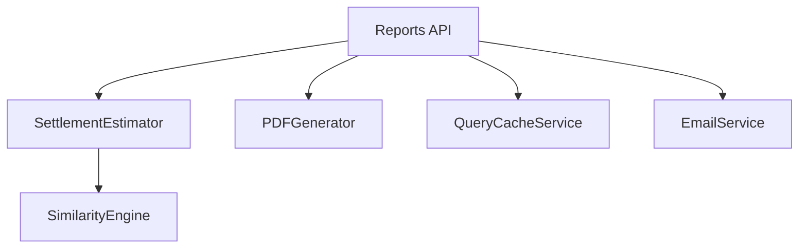

# Professional Reporting System

<cite>
**Referenced Files in This Document**
- [pdf_generator.py](file://app/services/reports/pdf_generator.py)
- [reports.py](file://app/api/v1/endpoints/reports.py)
- [reports.py](file://app/models/reports.py)
- [case_bank.py](file://app/models/case_bank.py)
- [estimator.py](file://app/services/estimator.py)
- [similarity_engine.py](file://app/services/similarity_engine.py)
- [query_cache_service.py](file://app/services/query_cache_service.py)
- [email_service.py](file://app/services/notifications/email_service.py)
- [DATABASE_SCHEMA.md](file://docs/DATABASE_SCHEMA.md)
</cite>

## Table of Contents
1. [Introduction](#introduction)
2. [Project Structure](#project-structure)
3. [Core Components](#core-components)
4. [Architecture Overview](#architecture-overview)
5. [Detailed Component Analysis](#detailed-component-analysis)
6. [Dependency Analysis](#dependency-analysis)
7. [Performance Considerations](#performance-considerations)
8. [Troubleshooting Guide](#troubleshooting-guide)
9. [Conclusion](#conclusion)
10. [Appendices](#appendices)

## Introduction
This document describes the Professional Reporting System that generates bar-compliant, blockchain-verified settlement reports using WeasyPrint. It covers the PDF generation pipeline, report templates, comparative case analysis, and integration with the settlement intelligence engine. It also documents report models, styling options, customization capabilities, distribution methods, and compliance requirements for legal documentation.

## Project Structure
The reporting system spans API endpoints, data models, estimation services, similarity engines, caching, PDF generation, and notifications. The following diagram maps the major components involved in report generation.

**Diagram sources**
- [reports.py:23-197](file://app/api/v1/endpoints/reports.py#L23-L197)
- [estimator.py:60-116](file://app/services/estimator.py#L60-L116)
- [similarity_engine.py:396-418](file://app/services/similarity_engine.py#L396-L418)
- [query_cache_service.py:64-153](file://app/services/query_cache_service.py#L64-L153)
- [pdf_generator.py:41-86](file://app/services/reports/pdf_generator.py#L41-L86)
- [email_service.py:26-80](file://app/services/notifications/email_service.py#L26-L80)

**Section sources**
- [reports.py:23-197](file://app/api/v1/endpoints/reports.py#L23-L197)
- [pdf_generator.py:18-86](file://app/services/reports/pdf_generator.py#L18-L86)
- [estimator.py:25-116](file://app/services/estimator.py#L25-L116)
- [similarity_engine.py:188-418](file://app/services/similarity_engine.py#L188-L418)
- [query_cache_service.py:35-153](file://app/services/query_cache_service.py#L35-L153)
- [email_service.py:15-80](file://app/services/notifications/email_service.py#L15-L80)

## Core Components
- Report generation API: Validates requests, orchestrates estimation, builds report metadata, and returns URLs or JSON summaries.
- PDF generator: Produces a 4-page professional PDF using WeasyPrint with embedded QR codes and blockchain hashes.
- Estimator: Computes settlement ranges using percentile-based analysis or multipliers with confidence scoring.
- Similarity engine: Scores comparable cases deterministically across jurisdiction, injury, and other legal signals.
- Query cache: Reduces latency for repeated queries by caching results for 24 hours.
- Notifications: Provides email delivery for reports and administrative communications.

**Section sources**
- [reports.py:23-197](file://app/api/v1/endpoints/reports.py#L23-L197)
- [pdf_generator.py:18-86](file://app/services/reports/pdf_generator.py#L18-L86)
- [estimator.py:25-116](file://app/services/estimator.py#L25-L116)
- [similarity_engine.py:188-418](file://app/services/similarity_engine.py#L188-L418)
- [query_cache_service.py:35-153](file://app/services/query_cache_service.py#L35-L153)
- [email_service.py:15-80](file://app/services/notifications/email_service.py#L15-L80)

## Architecture Overview
The report generation workflow integrates settlement intelligence with PDF rendering and optional email delivery. The system ensures compliance by anonymizing data, providing zero-PHI statements, and embedding blockchain verification.

**Diagram sources**
- [reports.py:23-197](file://app/api/v1/endpoints/reports.py#L23-L197)
- [estimator.py:60-116](file://app/services/estimator.py#L60-L116)
- [similarity_engine.py:396-418](file://app/services/similarity_engine.py#L396-L418)
- [query_cache_service.py:64-153](file://app/services/query_cache_service.py#L64-L153)
- [pdf_generator.py:41-86](file://app/services/reports/pdf_generator.py#L41-L86)
- [email_service.py:26-80](file://app/services/notifications/email_service.py#L26-L80)

## Detailed Component Analysis

### Report Generation API
- Validates request format and enforces allowed formats (pdf, json, html).
- Retrieves prior query data or falls back to mock data for development.
- Generates OpenTimestamps-style blockchain hash for integrity.
- Returns a report URL and optional JSON summary depending on format.
- Emits a behavioral event upon successful generation.

**Diagram sources**
- [reports.py:23-197](file://app/api/v1/endpoints/reports.py#L23-L197)

**Section sources**
- [reports.py:23-197](file://app/api/v1/endpoints/reports.py#L23-L197)

### PDF Generator
- Initializes WeasyPrint availability and gracefully falls back to a mock PDF when unavailable.
- Builds a 4-page HTML document with:
  - Page 1: Settlement range summary, confidence, comparable count, and disclaimer.
  - Page 2: Comparable cases table (anonymized).
  - Page 3: Methodology and justification.
  - Page 4: Compliance and blockchain verification with QR code and hash.
- Embeds QR code linking to OpenTimestamps verification and includes a footer with page numbers.

**Diagram sources**
- [pdf_generator.py:18-86](file://app/services/reports/pdf_generator.py#L18-L86)

**Section sources**
- [pdf_generator.py:18-86](file://app/services/reports/pdf_generator.py#L18-L86)

### Estimator and Comparative Case Analysis
- Percentile-based estimation when sufficient comparable cases are found.
- Fallback to multipliers when sample size is small.
- Representative case selection across the settlement range and recency.
- Confidence thresholds drive methodology selection.

**Diagram sources**
- [estimator.py:60-116](file://app/services/estimator.py#L60-L116)

**Section sources**
- [estimator.py:25-116](file://app/services/estimator.py#L25-L116)

### Similarity Engine
- Computes deterministic similarity scores across jurisdiction, injury category, incident type, litigation stage, and policy limits.
- Filters results above a minimum threshold and sorts by score.
- Supports configurable weights and adjacency matrices for nuanced matching.

**Diagram sources**
- [similarity_engine.py:188-418](file://app/services/similarity_engine.py#L188-L418)

**Section sources**
- [similarity_engine.py:188-418](file://app/services/similarity_engine.py#L188-L418)

### Query Cache Service
- Caches settlement estimates keyed by normalized query parameters.
- TTL of 24 hours with automatic expiration and cleanup.
- Upserts results and exposes statistics for monitoring.

**Diagram sources**
- [query_cache_service.py:64-104](file://app/services/query_cache_service.py#L64-L104)

**Section sources**
- [query_cache_service.py:35-153](file://app/services/query_cache_service.py#L35-L153)

### Notifications and Distribution
- Email service integrates with Resend API to send HTML emails.
- Can be used to deliver report links or administrative updates.
- Provides helpers for Founding Member onboarding and waitlist decisions.

**Diagram sources**
- [email_service.py:26-80](file://app/services/notifications/email_service.py#L26-L80)

**Section sources**
- [email_service.py:15-80](file://app/services/notifications/email_service.py#L15-L80)

### Report Models and Data Contracts
- ReportRequest: Accepts either a query_id or legacy estimate_id, plus inline query parameters and format.
- ReportResponse: Returns report_id, URL, blockchain hash, format, optional JSON summary, and metadata.
- ReportSummary: Defines the 4-page structure and metadata for report pages.
- Case bank models: Define comparable case data and estimation responses.

**Diagram sources**
- [reports.py:57-121](file://app/models/reports.py#L57-L121)
- [case_bank.py:110-139](file://app/models/case_bank.py#L110-L139)

**Section sources**
- [reports.py:57-121](file://app/models/reports.py#L57-L121)
- [case_bank.py:110-139](file://app/models/case_bank.py#L110-L139)

## Dependency Analysis
- Reports API depends on Estimator and SimilarityEngine for comparable case discovery and range computation.
- PDFGenerator depends on WeasyPrint and qrcode for rendering and verification.
- QueryCacheService reduces Estimator load by serving cached results.
- EmailService is optional and used for distribution.

**Diagram sources**
- [reports.py:23-197](file://app/api/v1/endpoints/reports.py#L23-L197)
- [estimator.py:60-116](file://app/services/estimator.py#L60-L116)
- [similarity_engine.py:396-418](file://app/services/similarity_engine.py#L396-L418)
- [query_cache_service.py:64-153](file://app/services/query_cache_service.py#L64-L153)
- [pdf_generator.py:41-86](file://app/services/reports/pdf_generator.py#L41-L86)
- [email_service.py:26-80](file://app/services/notifications/email_service.py#L26-L80)

**Section sources**
- [reports.py:23-197](file://app/api/v1/endpoints/reports.py#L23-L197)
- [estimator.py:60-116](file://app/services/estimator.py#L60-L116)
- [similarity_engine.py:396-418](file://app/services/similarity_engine.py#L396-L418)
- [query_cache_service.py:64-153](file://app/services/query_cache_service.py#L64-L153)
- [pdf_generator.py:41-86](file://app/services/reports/pdf_generator.py#L41-L86)
- [email_service.py:26-80](file://app/services/notifications/email_service.py#L26-L80)

## Performance Considerations
- PDF generation is CPU-bound; WeasyPrint availability is checked at startup and gracefully falls back to a mock PDF when unavailable.
- Estimator uses NumPy for percentile calculations and includes a representative sampling strategy to limit report table size.
- Query cache reduces repeated computation and database load with a 24-hour TTL.
- Recommendations:
  - Scale PDF generation behind a queue or worker pool if throughput increases.
  - Monitor cache hit rates and tune TTL as needed.
  - Consider precomputing and storing top-k comparable cases per jurisdiction for faster retrieval.

[No sources needed since this section provides general guidance]

## Troubleshooting Guide
- WeasyPrint not installed:
  - Symptom: PDF generation logs a warning and returns a mock PDF.
  - Resolution: Install WeasyPrint or ensure the environment includes it.
- Missing query data:
  - Symptom: Reports API falls back to mock estimate data.
  - Resolution: Ensure a prior query exists or supply inline parameters.
- Email delivery failures:
  - Symptom: EmailService logs errors and returns False.
  - Resolution: Verify Resend API key and network connectivity.

**Section sources**
- [pdf_generator.py:32-40](file://app/services/reports/pdf_generator.py#L32-L40)
- [reports.py:106-117](file://app/api/v1/endpoints/reports.py#L106-L117)
- [email_service.py:46-80](file://app/services/notifications/email_service.py#L46-L80)

## Conclusion
The Professional Reporting System delivers bar-compliant, blockchain-verified settlement reports with a robust pipeline integrating estimation, similarity matching, caching, and PDF generation. It supports flexible distribution channels and maintains strict privacy and integrity guarantees suitable for legal practice.

[No sources needed since this section summarizes without analyzing specific files]

## Appendices

### Report Template Structure
- Page 1: Settlement Range Summary (visual presentation, confidence, comparable count).
- Page 2: Comparable Cases Table (anonymized, limited to 15 rows).
- Page 3: Range Justification (methodology, adjustment factors, confidence).
- Page 4: Compliance & Integrity (zero-PHI statement, blockchain verification, QR code).

**Section sources**
- [reports.py:31-55](file://app/api/v1/endpoints/reports.py#L31-L55)
- [pdf_generator.py:306-506](file://app/services/reports/pdf_generator.py#L306-L506)

### Styling Options and Customization
- Built-in CSS defines typography, colors, spacing, and page layout.
- QR code embedded via base64 image for verification.
- Customization hooks:
  - Modify HTML template sections to change content.
  - Adjust CSS classes for branding and layout.
  - Replace mock PDF with real PDF generation when WeasyPrint is available.

**Section sources**
- [pdf_generator.py:126-506](file://app/services/reports/pdf_generator.py#L126-L506)

### Compliance and Legal Requirements
- Zero Protected Health Information (PHI) statement on every report.
- Blockchain hash for cryptographic timestamping and integrity verification.
- Disclaimers emphasize descriptive statistics and absence of legal advice.
- Attorneys receive guarantees around data handling and auditability.

**Section sources**
- [pdf_generator.py:454-498](file://app/services/reports/pdf_generator.py#L454-L498)
- [reports.py:29-55](file://app/api/v1/endpoints/reports.py#L29-L55)

### Database Schema References
- Reports tracking table: settle_reports with foreign key to queries and format enforcement.
- Query cache table: settlement_query_cache with TTL and indexed fields.

**Section sources**
- [DATABASE_SCHEMA.md:425-465](file://docs/DATABASE_SCHEMA.md#L425-L465)