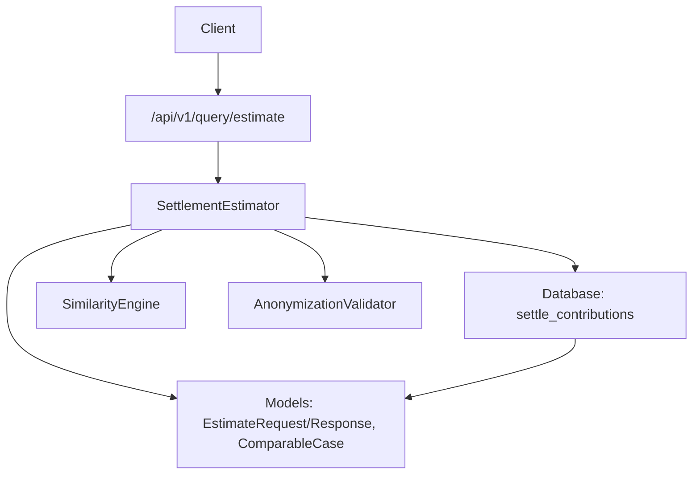
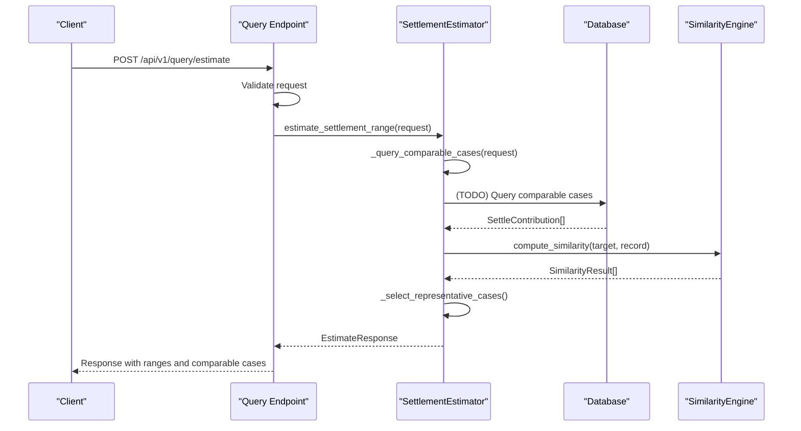
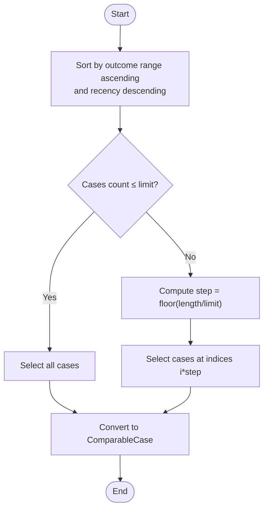
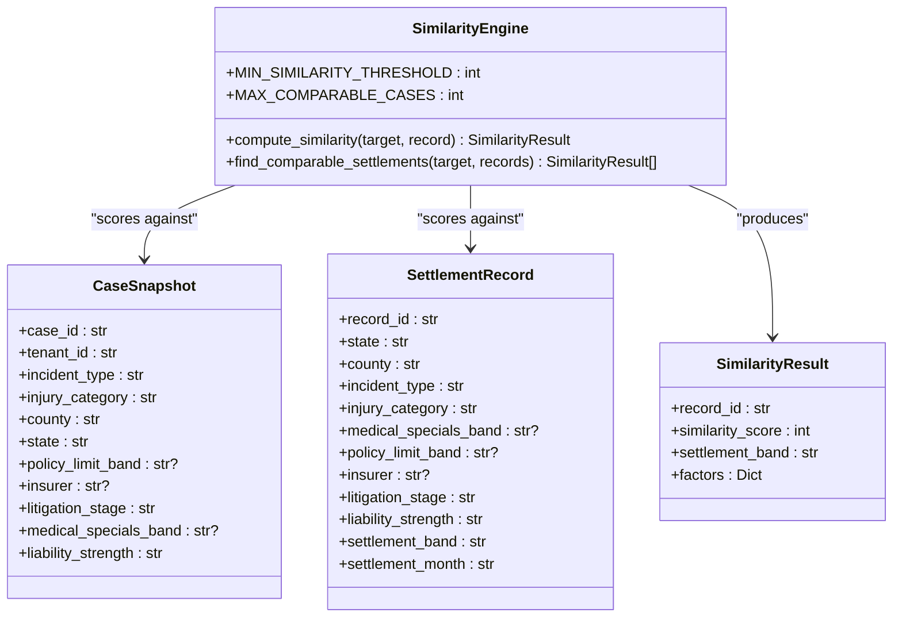
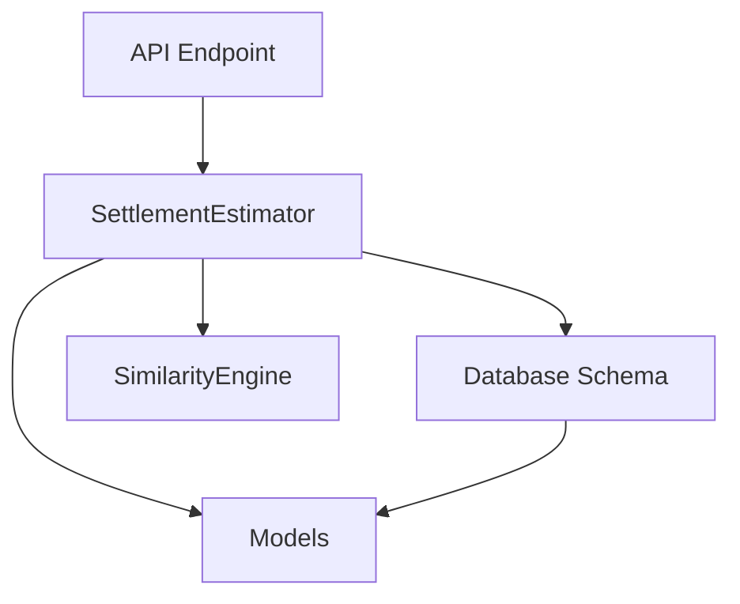

# Comparable Case Matching

<cite>
**Referenced Files in This Document**
- [similarity_engine.py](file://app/services/similarity_engine.py)
- [estimator.py](file://app/services/estimator.py)
- [query.py](file://app/api/v1/endpoints/query.py)
- [case_bank.py](file://app/models/case_bank.py)
- [anonymizer.py](file://app/services/anonymizer.py)
- [settle_supabase.sql](file://database/schemas/settle_supabase.sql)
- [6244ebfd45df_add_settle_case_snapshots_table.py](file://alembic/versions/6244ebfd45df_add_settle_case_snapshots_table.py)
- [TESTING_GUIDE.md](file://docs/TESTING_GUIDE.md)
- [DATA_AUTHENTICITY_WARNING.md](file://scripts/data-collection/DATA_AUTHENTICITY_WARNING.md)
</cite>

## Table of Contents
1. [Introduction](#introduction)
2. [Project Structure](#project-structure)
3. [Core Components](#core-components)
4. [Architecture Overview](#architecture-overview)
5. [Detailed Component Analysis](#detailed-component-analysis)
6. [Dependency Analysis](#dependency-analysis)
7. [Performance Considerations](#performance-considerations)
8. [Troubleshooting Guide](#troubleshooting-guide)
9. [Conclusion](#conclusion)

## Introduction
This document explains the comparable case matching and filtering system used to estimate settlement ranges. It covers the five-tier matching priority, database query logic, temporary mock implementation, case selection strategy, anonymization process, and conversion to ComparableCase objects. It also provides examples, optimization considerations, and rationale for each matching criterion.

## Project Structure
The comparable case system spans API endpoints, services, models, and database schemas:
- API endpoint validates requests and delegates estimation to the estimator service.
- Estimator service queries comparable cases, calculates ranges, selects representative cases, and generates a report-friendly justification.
- Similarity engine provides deterministic scoring for jurisdiction, case type, injury category, and related attributes.
- Models define request/response structures and anonymized comparable case representation.
- Database schema defines the authoritative table for contributions and indexes for efficient querying.
- Temporary mock implementation supports development and testing until the database is fully integrated.

**Diagram sources**
- [query.py:20-98](file://app/api/v1/endpoints/query.py#L20-L98)
- [estimator.py:60-116](file://app/services/estimator.py#L60-L116)
- [similarity_engine.py:188-418](file://app/services/similarity_engine.py#L188-L418)
- [case_bank.py:95-139](file://app/models/case_bank.py#L95-L139)
- [settle_supabase.sql:31-137](file://database/schemas/settle_supabase.sql#L31-L137)

**Section sources**
- [query.py:1-119](file://app/api/v1/endpoints/query.py#L1-L119)
- [estimator.py:1-443](file://app/services/estimator.py#L1-L443)
- [similarity_engine.py:1-441](file://app/services/similarity_engine.py#L1-L441)
- [case_bank.py:1-269](file://app/models/case_bank.py#L1-L269)
- [settle_supabase.sql:1-505](file://database/schemas/settle_supabase.sql#L1-L505)

## Core Components
- SimilarityEngine: Computes deterministic similarity scores across jurisdiction, case type, injury category, medical specials band, liability strength, litigation stage, and policy limit band. Implements weighted scoring and adjacency matrices.
- SettlementEstimator: Orchestrates comparable case discovery, percentile/multiplier range calculation, representative case selection, and justification generation. Contains a temporary mock implementation for testing.
- Models: Define EstimateRequest, EstimateResponse, ComparableCase, and SettleContribution for request/response and anonymized reporting.
- AnonymizationValidator: Enforces bar-compliant anonymization and validates contributions before acceptance.
- Database Schema: Defines settle_contributions with indexes and constraints for efficient querying and compliance.

**Section sources**
- [similarity_engine.py:188-418](file://app/services/similarity_engine.py#L188-L418)
- [estimator.py:25-116](file://app/services/estimator.py#L25-L116)
- [case_bank.py:95-139](file://app/models/case_bank.py#L95-L139)
- [anonymizer.py:17-180](file://app/services/anonymizer.py#L17-L180)
- [settle_supabase.sql:31-137](file://database/schemas/settle_supabase.sql#L31-L137)

## Architecture Overview
The system follows a layered architecture:
- API layer validates and authenticates requests.
- Service layer performs matching, scoring, and selection.
- Model layer standardizes data structures.
- Data layer persists contributions and exposes indexes for fast queries.
- Temporary mock implementation enables iterative development while the database remains under construction.

**Diagram sources**
- [query.py:20-98](file://app/api/v1/endpoints/query.py#L20-L98)
- [estimator.py:60-116](file://app/services/estimator.py#L60-L116)
- [similarity_engine.py:202-258](file://app/services/similarity_engine.py#L202-L258)

## Detailed Component Analysis

### Five-Tier Matching Priority
The estimator’s comparable case discovery uses the following priority order:
1. Jurisdiction (county + state)
2. Case type (if provided)
3. Injury category/type
4. Medical bills range (±50%)
5. Status = 'approved' only

These criteria are documented in the estimator’s query method and align with the database schema’s approved contributions view and indexes.

- Jurisdiction: Matches exact county and state, same-state different county, or neighboring state (placeholder).
- Case type: Exact match preferred; relatedness matrix provides partial credit for related incident types.
- Injury category: Exact match or adjacent levels (minor/moderate/serious/catastrophic) receive partial points.
- Medical bills: Matches within ±50% of the target case’s medical bills.
- Status: Filters to approved contributions only.

**Section sources**
- [estimator.py:118-146](file://app/services/estimator.py#L118-L146)
- [settle_supabase.sql:357-359](file://database/schemas/settle_supabase.sql#L357-L359)

### Database Query Logic
The database schema defines settle_contributions with:
- Primary key id
- Venue and case type fields
- Multi-select arrays for injuries, treatments, and imaging
- Financial fields (medical bills, lost wages, policy limits)
- Outcome fields (outcome type, outcome amount range)
- Compliance and audit fields (contributed_at, blockchain_hash, consent_confirmed)
- Contributor tracking and metadata (created_at, updated_at, status, rejection_reason)
- Data quality flags (is_outlier, confidence_score)
- Indexes for jurisdiction, case_type, injury_category (GIN), outcome_range, status, created_at, medical_bills, contributor_user_id, and a composite index for approved queries

The approved contributions view and composite index support fast retrieval of comparable cases filtered by jurisdiction, case type, and status.

**Section sources**
- [settle_supabase.sql:31-137](file://database/schemas/settle_supabase.sql#L31-L137)
- [settle_supabase.sql:357-359](file://database/schemas/settle_supabase.sql#L357-L359)

### Temporary Mock Implementation
Until the database is fully integrated, the estimator uses a mock implementation that:
- Generates 25 mock SettleContribution objects
- Spreads outcome ranges across predefined buckets
- Varies medical bills around the target ±30%
- Assigns recent timestamps with decreasing recency
- Sets status to approved

This ensures the estimator can calculate ranges and select representative cases during development and testing.

**Section sources**
- [estimator.py:118-146](file://app/services/estimator.py#L118-L146)
- [estimator.py:390-441](file://app/services/estimator.py#L390-L441)

### Case Selection Strategy
The estimator selects representative cases for reports using:
- Sort by outcome range ascending and recency descending
- Evenly distribute selection across the range (step sampling)
- Convert to ComparableCase objects (anonymized fields only)

This prioritizes recent cases while ensuring spread across the settlement spectrum.

**Diagram sources**
- [estimator.py:291-343](file://app/services/estimator.py#L291-L343)

**Section sources**
- [estimator.py:291-343](file://app/services/estimator.py#L291-L343)
- [case_bank.py:95-108](file://app/models/case_bank.py#L95-L108)

### Anonymization Process and ComparableCase Conversion
AnonymizationValidator enforces bar-compliant anonymization:
- Validates drop-down values against allowed lists
- Ensures jurisdiction format is "County, ST"
- Checks for PHI/PII patterns and forbids free-text narratives
- Validates financial amounts and liability language
- Provides sanitization for legacy data cleanup

ComparableCase is a minimal, anonymized representation used in reports, containing jurisdiction, case type, injury categories, primary diagnosis, medical bills, outcome range, outcome type, and contributed_at.

**Section sources**
- [anonymizer.py:17-180](file://app/services/anonymizer.py#L17-L180)
- [case_bank.py:95-108](file://app/models/case_bank.py#L95-L108)

### Similarity Engine (Deterministic Scoring)
The SimilarityEngine computes weighted similarity scores:
- Weights: incident_type (25), injury_category (20), jurisdiction (20), medical_specials (15), liability_strength (10), litigation_stage (5), policy_limit (5)
- Adjacency matrices and ordered enums enable partial credit for near matches
- Threshold: minimum similarity score 60; maximum comparable cases 200

**Diagram sources**
- [similarity_engine.py:75-115](file://app/services/similarity_engine.py#L75-L115)
- [similarity_engine.py:188-418](file://app/services/similarity_engine.py#L188-L418)

**Section sources**
- [similarity_engine.py:117-130](file://app/services/similarity_engine.py#L117-L130)
- [similarity_engine.py:188-418](file://app/services/similarity_engine.py#L188-L418)

### Examples of Matching Scenarios
- Exact match: Same county and state, identical case type and injury categories, medical bills within ±50%, approved status.
- Near match: Same state, different county; related incident types; adjacent injury severity; within ±50%; approved.
- Partial match: Different state; unrelated incident types; distant injury severity; approved; within ±50%.

These scenarios illustrate how the five-tier priority and adjacency scoring combine to produce comparable sets.

**Section sources**
- [similarity_engine.py:294-313](file://app/services/similarity_engine.py#L294-L313)
- [similarity_engine.py:260-293](file://app/services/similarity_engine.py#L260-L293)

### Query Optimization Considerations
- Indexes: jurisdiction, case_type, injury_category (GIN), outcome_range, status, created_at, medical_bills, contributor_user_id, and a composite index for approved queries.
- Filtering: status = 'approved' reduces dataset size.
- Sorting: outcome range ascending plus recency descending ensures representative selection across the spectrum.
- Bucketing: outcome_amount_range uses predefined buckets; estimator converts to midpoints for percentile calculation.
- Confidence thresholds: ≥15 cases use percentile calculation; <15 uses multipliers for fallback.

**Section sources**
- [settle_supabase.sql:115-137](file://database/schemas/settle_supabase.sql#L115-L137)
- [estimator.py:148-210](file://app/services/estimator.py#L148-L210)
- [estimator.py:212-262](file://app/services/estimator.py#L212-L262)

### Rationale for Each Matching Criterion
- Jurisdiction (county + state): Highest priority because local legal standards, judge behavior, and settlement culture vary widely.
- Case type: Important for specialized practice areas; relatedness matrix allows partial credit for similar types.
- Injury category/type: Severity affects settlement expectations; adjacency scoring captures near misses.
- Medical bills range (±50%): Ensures comparable financial impact; prevents outliers skewing results.
- Status = 'approved': Ensures only vetted, bar-compliant contributions are used.

**Section sources**
- [estimator.py:125-130](file://app/services/estimator.py#L125-L130)
- [similarity_engine.py:121-129](file://app/services/similarity_engine.py#L121-L129)

## Dependency Analysis
The system exhibits clean separation of concerns:
- API depends on DataValidator and SettlementEstimator
- Estimator depends on SimilarityEngine and models
- Models define request/response and anonymized case structures
- Database schema defines persistence and indexes
- Temporary mock replaces database dependency during development

**Diagram sources**
- [query.py:20-98](file://app/api/v1/endpoints/query.py#L20-L98)
- [estimator.py:60-116](file://app/services/estimator.py#L60-L116)
- [similarity_engine.py:188-418](file://app/services/similarity_engine.py#L188-L418)
- [settle_supabase.sql:31-137](file://database/schemas/settle_supabase.sql#L31-L137)

**Section sources**
- [query.py:1-119](file://app/api/v1/endpoints/query.py#L1-L119)
- [estimator.py:1-443](file://app/services/estimator.py#L1-L443)
- [similarity_engine.py:1-441](file://app/services/similarity_engine.py#L1-L441)
- [settle_supabase.sql:1-505](file://database/schemas/settle_supabase.sql#L1-L505)

## Performance Considerations
- Response time: Target <1 second (p95) for percentile calculations.
- Confidence thresholds: ≥15 cases yield high confidence; <15 triggers multiplier fallback.
- Index utilization: Composite index on jurisdiction, case_type, status (approved) accelerates queries.
- Sorting and sampling: Efficiently selects representative cases across the range.
- Bucket conversion: Midpoints enable numerical percentile computation.

**Section sources**
- [query.py:33-46](file://app/api/v1/endpoints/query.py#L33-L46)
- [settle_supabase.sql:125-128](file://database/schemas/settle_supabase.sql#L125-L128)
- [estimator.py:148-210](file://app/services/estimator.py#L148-L210)

## Troubleshooting Guide
Common issues and resolutions:
- Validation failures: Ensure jurisdiction format is "County, ST", outcome range is one of allowed buckets, and drop-down values are from allowed lists.
- Low case counts: Expect multiplier fallback; increase data volume or refine matching criteria.
- Mock-only environment: Confirm estimator is using mock cases; replace with database query upon integration.
- Compliance warnings: Address PHI/PII patterns and forbidden liability language detected by anonymization validator.

**Section sources**
- [anonymizer.py:92-180](file://app/services/anonymizer.py#L92-L180)
- [estimator.py:118-146](file://app/services/estimator.py#L118-L146)
- [DATA_AUTHENTICITY_WARNING.md:182-196](file://scripts/data-collection/DATA_AUTHENTICITY_WARNING.md#L182-L196)

## Conclusion
The comparable case matching system combines deterministic similarity scoring, strict anonymization, and robust selection strategies to deliver reliable settlement range estimates. The five-tier matching priority, database-backed indexes, and percentile/multiplier fallback ensure both accuracy and performance. The temporary mock implementation facilitates development and testing, while the anonymization validator enforces bar-compliant data handling.