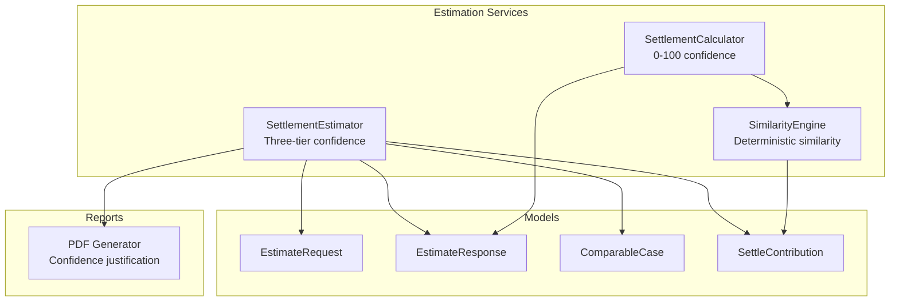
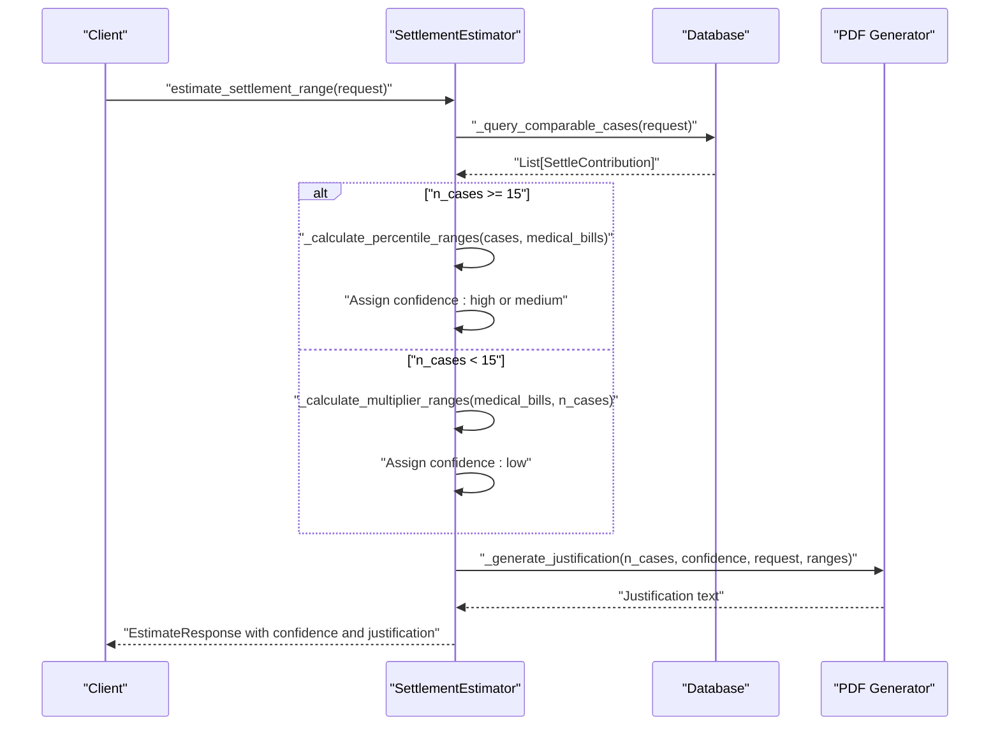
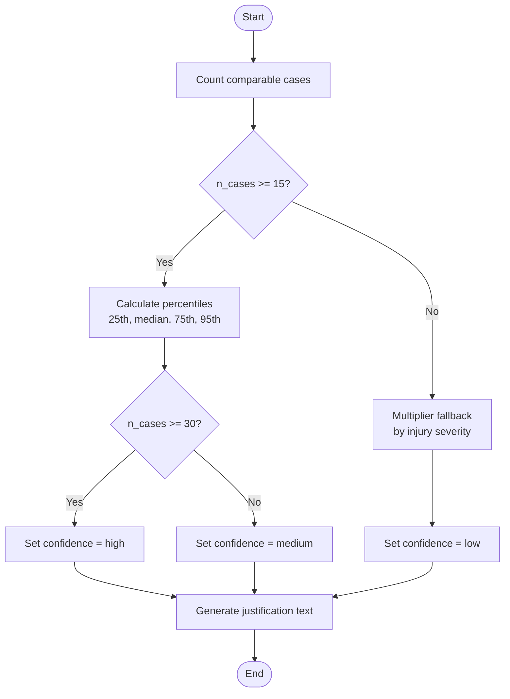
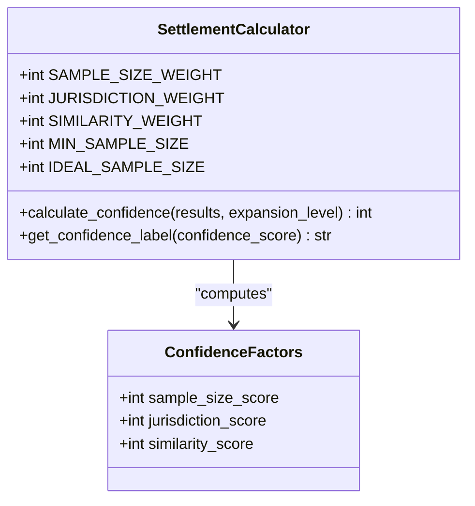
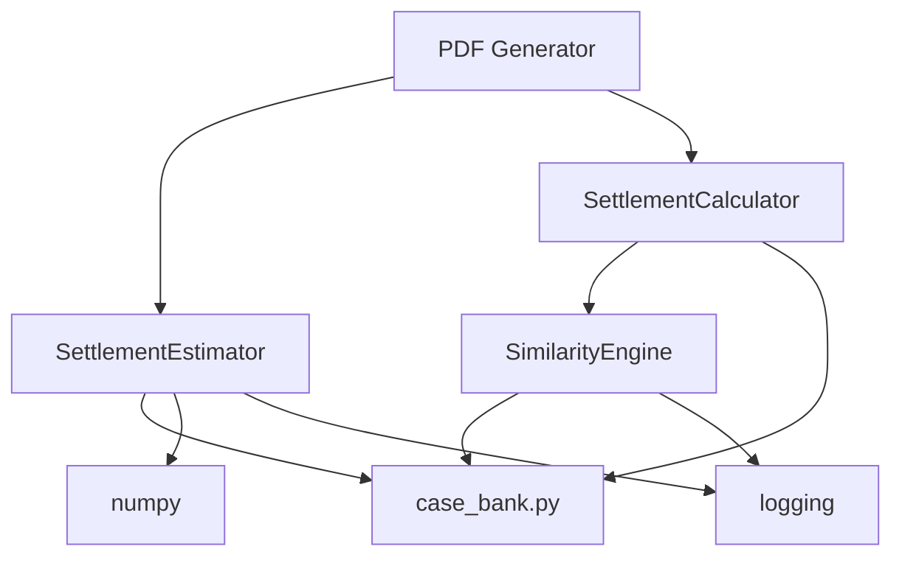

# Confidence Scoring System

<cite>
**Referenced Files in This Document**
- [estimator.py](file://app/services/estimator.py)
- [settlement_calculator.py](file://app/services/settlement_calculator.py)
- [similarity_engine.py](file://app/services/similarity_engine.py)
- [case_bank.py](file://app/models/case_bank.py)
- [pdf_generator.py](file://app/services/reports/pdf_generator.py)
- [TESTING_GUIDE.md](file://docs/TESTING_GUIDE.md)
</cite>

## Table of Contents
1. [Introduction](#introduction)
2. [Project Structure](#project-structure)
3. [Core Components](#core-components)
4. [Architecture Overview](#architecture-overview)
5. [Detailed Component Analysis](#detailed-component-analysis)
6. [Dependency Analysis](#dependency-analysis)
7. [Performance Considerations](#performance-considerations)
8. [Troubleshooting Guide](#troubleshooting-guide)
9. [Conclusion](#conclusion)

## Introduction
This document explains the confidence scoring system that determines the reliability of settlement estimates. It covers two complementary approaches:
- A three-tier confidence system for percentile-based estimation with case volume thresholds
- A 0–100 point confidence scoring system for similarity-based estimation with weighted factors

The document details threshold constants, calculation methods, report generation, and conservative interpretation guidelines for low-confidence scenarios.

## Project Structure
The confidence scoring system spans multiple modules:
- Estimator service: percentile-based calculation with three-tier confidence
- Similarity engine: deterministic similarity scoring for comparable case discovery
- Settlement calculator: 0–100 confidence scoring with weighted factors
- Reports: confidence-based justification text generation and presentation
- Models: shared data structures for requests, responses, and comparable cases

**Diagram sources**
- [estimator.py:60-116](file://app/services/estimator.py#L60-L116)
- [settlement_calculator.py:57-103](file://app/services/settlement_calculator.py#L57-L103)
- [similarity_engine.py:202-258](file://app/services/similarity_engine.py#L202-L258)
- [case_bank.py:110-139](file://app/models/case_bank.py#L110-L139)
- [pdf_generator.py:428-434](file://app/services/reports/pdf_generator.py#L428-L434)

**Section sources**
- [estimator.py:25-35](file://app/services/estimator.py#L25-L35)
- [settlement_calculator.py:41-46](file://app/services/settlement_calculator.py#L41-L46)
- [similarity_engine.py:188-194](file://app/services/similarity_engine.py#L188-L194)

## Core Components
- Three-tier confidence thresholds:
  - High: 30+ comparable cases
  - Medium: 15–29 comparable cases
  - Low: <15 comparable cases
- Multiplier fallback for low-confidence scenarios using industry-standard multipliers scaled by injury severity
- Confidence-based justification text generation for reports
- 0–100 confidence scoring for similarity-based estimation with weighted factors (sample size, jurisdiction match, similarity score)

**Section sources**
- [estimator.py:44-49](file://app/services/estimator.py#L44-L49)
- [estimator.py:212-262](file://app/services/estimator.py#L212-L262)
- [settlement_calculator.py:48-51](file://app/services/settlement_calculator.py#L48-L51)
- [settlement_calculator.py:117-142](file://app/services/settlement_calculator.py#L117-L142)

## Architecture Overview
The confidence scoring system integrates estimation, similarity matching, and reporting:

**Diagram sources**
- [estimator.py:60-116](file://app/services/estimator.py#L60-L116)
- [estimator.py:148-210](file://app/services/estimator.py#L148-L210)
- [estimator.py:212-262](file://app/services/estimator.py#L212-L262)
- [estimator.py:345-388](file://app/services/estimator.py#L345-L388)

## Detailed Component Analysis

### Three-Tier Confidence System (Percentile-Based Estimator)
- Thresholds:
  - High: ≥30 cases
  - Medium: 15–29 cases
  - Low: <15 cases
- Calculation method selection:
  - If sufficient cases (≥15): percentile-based calculation (25th, median, 75th, 95th)
  - If insufficient cases (<15): multiplier fallback using industry-standard multipliers
- Confidence-based justification text:
  - Tailored messaging based on confidence level and number of cases
  - Conservative interpretation guidance for low-confidence scenarios

**Diagram sources**
- [estimator.py:78-90](file://app/services/estimator.py#L78-L90)
- [estimator.py:194-200](file://app/services/estimator.py#L194-L200)
- [estimator.py:212-262](file://app/services/estimator.py#L212-L262)
- [estimator.py:345-388](file://app/services/estimator.py#L345-L388)

**Section sources**
- [estimator.py:44-49](file://app/services/estimator.py#L44-L49)
- [estimator.py:148-210](file://app/services/estimator.py#L148-L210)
- [estimator.py:212-262](file://app/services/estimator.py#L212-L262)
- [estimator.py:345-388](file://app/services/estimator.py#L345-L388)

### Multiplier Fallback and Conservative Interpretation
- Multiplier ranges by severity:
  - Low severity: min 1.5×, typical 2.0×, high 3.0×
  - Medium severity: min 2.0×, typical 3.5×, high 5.0×
  - High severity: min 3.0×, typical 5.0×, high 8.0×
- Adjustment for medical bills:
  - If current case’s medical bills differ significantly from the average, apply a partial proportional adjustment
- Conservative interpretation:
  - Low-confidence estimates use conservative multipliers and are labeled as preliminary

**Section sources**
- [estimator.py:37-42](file://app/services/estimator.py#L37-L42)
- [estimator.py:234-249](file://app/services/estimator.py#L234-L249)
- [estimator.py:180-193](file://app/services/estimator.py#L180-L193)
- [estimator.py:381-386](file://app/services/estimator.py#L381-L386)

### Confidence-Based Justification Text Generation
- Dynamic justification text includes:
  - Methodology used (percentile analysis vs. multiplier fallback)
  - Number of comparable cases
  - Percentile values (25th, median, 75th, 95th)
  - Jurisdiction and injury profile context
- Low-confidence note:
  - Adds a conservative interpretation disclaimer indicating preliminary nature of estimates

**Section sources**
- [estimator.py:345-388](file://app/services/estimator.py#L345-L388)
- [pdf_generator.py:428-434](file://app/services/reports/pdf_generator.py#L428-L434)

### 0–100 Confidence Scoring (Similarity-Based Calculator)
- Weighted factors:
  - Sample size: 40 points (linearly scored between minimum and ideal sample sizes)
  - Jurisdiction match: 30 points (county/state/regional/national)
  - Average similarity score: 30 points (scaled from 60–100)
- Labels:
  - High: ≥80
  - Moderate: ≥60
  - Low: ≥40
  - Very Low: <40

**Diagram sources**
- [settlement_calculator.py:33-39](file://app/services/settlement_calculator.py#L33-L39)
- [settlement_calculator.py:48-55](file://app/services/settlement_calculator.py#L48-L55)
- [settlement_calculator.py:117-142](file://app/services/settlement_calculator.py#L117-L142)
- [settlement_calculator.py:182-191](file://app/services/settlement_calculator.py#L182-L191)

**Section sources**
- [settlement_calculator.py:48-51](file://app/services/settlement_calculator.py#L48-L51)
- [settlement_calculator.py:117-142](file://app/services/settlement_calculator.py#L117-L142)
- [settlement_calculator.py:182-191](file://app/services/settlement_calculator.py#L182-L191)

### Similarity Engine and Comparable Case Discovery
- Deterministic similarity scoring (0–100) with weighted factors:
  - Incident type, injury category, jurisdiction, medical specials, liability strength, litigation stage, policy limit
- Minimum similarity threshold: 60
- Comparable case selection:
  - Filter by similarity ≥60
  - Sort by score descending
  - Limit to maximum comparable cases

**Section sources**
- [similarity_engine.py:121-129](file://app/services/similarity_engine.py#L121-L129)
- [similarity_engine.py:196-197](file://app/services/similarity_engine.py#L196-L197)
- [similarity_engine.py:400-418](file://app/services/similarity_engine.py#L400-L418)

## Dependency Analysis
- Estimator depends on:
  - Case bank models for requests/responses/comparable cases
  - Numpy for percentile calculations
  - Logging for audit trails
- Similarity engine provides:
  - Comparable results with similarity scores and settlement bands
- Settlement calculator consumes:
  - Similarity results and expansion level to compute 0–100 confidence
- Reports consume:
  - Confidence level and justification text for presentation

**Diagram sources**
- [estimator.py:10-22](file://app/services/estimator.py#L10-L22)
- [similarity_engine.py:10-16](file://app/services/similarity_engine.py#L10-L16)
- [settlement_calculator.py:8-18](file://app/services/settlement_calculator.py#L8-L18)
- [pdf_generator.py:110-121](file://app/services/reports/pdf_generator.py#L110-L121)

**Section sources**
- [estimator.py:15-20](file://app/services/estimator.py#L15-L20)
- [similarity_engine.py:188-201](file://app/services/similarity_engine.py#L188-L201)
- [settlement_calculator.py:41-46](file://app/services/settlement_calculator.py#L41-L46)

## Performance Considerations
- Response time targets:
  - Estimator enforces sub-second response time for user experience
- Sampling strategy:
  - Representative case selection limits report payload while preserving diversity
- Confidence scoring:
  - Deterministic calculations minimize computational overhead compared to probabilistic methods

**Section sources**
- [estimator.py:103-105](file://app/services/estimator.py#L103-L105)
- [estimator.py:291-343](file://app/services/estimator.py#L291-L343)

## Troubleshooting Guide
- Low-confidence estimates:
  - Verify case volume thresholds and ensure sufficient comparable cases are available
  - Confirm jurisdiction and injury category filters align with available data
- Multiplier fallback:
  - Check medical bill severity thresholds and multiplier ranges
  - Validate that the fallback is triggered only when cases <15
- Confidence justification:
  - Confirm confidence level assignment and justification text generation
  - Review conservative interpretation note for low-confidence scenarios

**Section sources**
- [estimator.py:78-90](file://app/services/estimator.py#L78-L90)
- [estimator.py:194-200](file://app/services/estimator.py#L194-L200)
- [estimator.py:345-388](file://app/services/estimator.py#L345-L388)

## Conclusion
The confidence scoring system provides two complementary approaches:
- A practical three-tier system for percentile-based estimation with clear thresholds and conservative fallbacks
- A robust 0–100 scoring system for similarity-based estimation with weighted factors and labeled confidence levels

Together, these systems enable reliable, transparent, and conservative settlement estimates across varying data availability conditions.