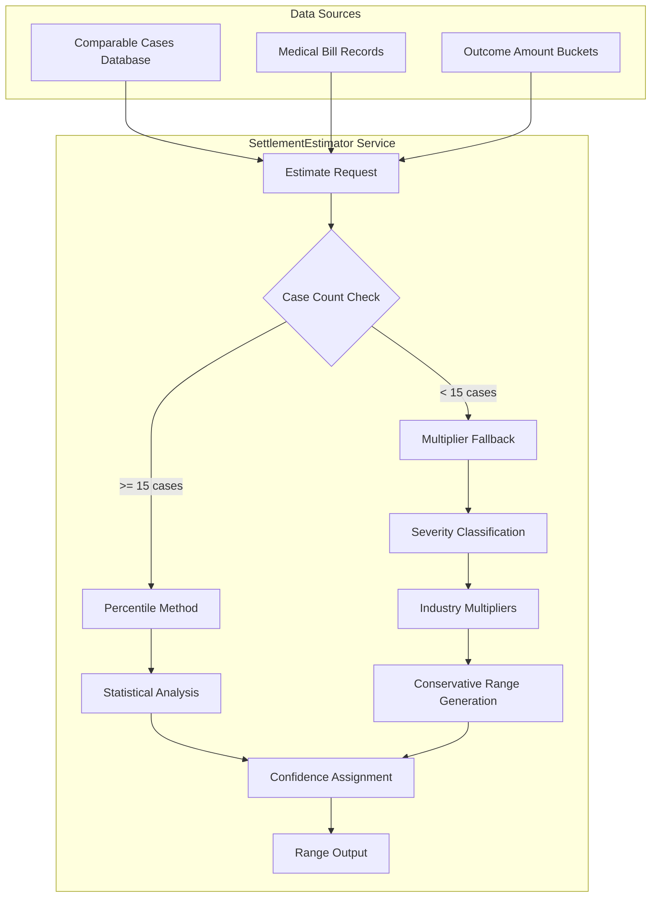
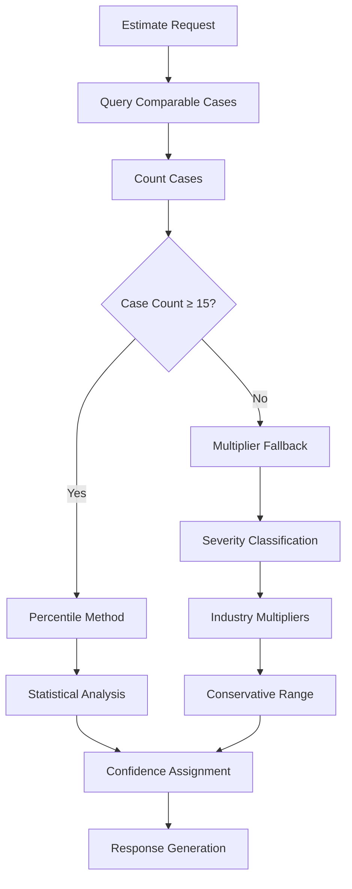

# Multiplier Fallback System

<cite>
**Referenced Files in This Document**
- [estimator.py](file://app/services/estimator.py)
- [case_bank.py](file://app/models/case_bank.py)
- [TESTING_GUIDE.md](file://docs/TESTING_GUIDE.md)
- [test_estimator.py](file://tests/test_estimator.py)
</cite>

## Table of Contents
1. [Introduction](#introduction)
2. [System Architecture](#system-architecture)
3. [Three-Tier Severity Classification](#three-tier-severity-classification)
4. [Industry Multipliers](#industry-multipliers)
5. [Conservative Range Generation Algorithm](#conservative-range-generation-algorithm)
6. [Extra Cushion Application](#extra-cushion-application)
7. [Confidence Level Assignment](#confidence-level-assignment)
8. [Warning Mechanisms](#warning-mechanisms)
9. [Transition Logic](#transition-logic)
10. [Examples of Fallback Calculations](#examples-of-fallback-calculations)
11. [Performance Considerations](#performance-considerations)
12. [Troubleshooting Guide](#troubleshooting-guide)
13. [Conclusion](#conclusion)

## Introduction

The Multiplier Fallback System is a critical component of the SETTLE-Service settlement intelligence platform. When insufficient comparable cases are available for settlement range estimation, the system automatically transitions from percentile-based analysis to industry-standard multipliers to provide conservative estimates.

This system ensures that legal professionals receive actionable settlement guidance regardless of jurisdictional data availability, maintaining service reliability while preserving conservative risk assessment principles.

## System Architecture

The Multiplier Fallback System operates within the SettlementEstimator service, which serves as the core engine for settlement range calculations. The system follows a tiered approach that prioritizes data-driven percentile analysis when sufficient comparable cases exist, falling back to multiplier-based estimates when data is limited.



**Diagram sources**
- [estimator.py:60-116](file://app/services/estimator.py#L60-L116)
- [estimator.py:212-262](file://app/services/estimator.py#L212-L262)

## Three-Tier Severity Classification

The system employs a three-tier severity classification system based on medical bill amounts, which determines the appropriate industry multipliers to apply:

### Low Severity ($5k threshold)
- **Classification**: Medical bills < $5,000
- **Characteristics**: Minor injuries with minimal medical intervention
- **Typical cases**: Soft tissue injuries, minor fractures, routine consultations
- **Risk profile**: Lower potential for long-term complications

### Medium Severity ($25k threshold)
- **Classification**: $5,000 ≤ Medical bills < $25,000
- **Characteristics**: Moderate injuries requiring extended treatment
- **Typical cases**: Complex fractures, moderate spinal injuries, extensive physical therapy
- **Risk profile**: Moderate potential for ongoing medical needs

### High Severity
- **Classification**: Medical bills ≥ $25,000
- **Characteristics**: Severe injuries requiring major medical intervention
- **Typical cases**: Traumatic brain injuries, severe spinal cord injuries, major surgeries
- **Risk profile**: Highest potential for long-term disability and complications

**Section sources**
- [estimator.py:234-240](file://app/services/estimator.py#L234-L240)

## Industry Multipliers

The system applies industry-standard multipliers derived from historical settlement patterns and legal market research. These multipliers represent conservative estimates designed to protect clients from underestimating settlement values.

### Low Severity Multipliers
- **Minimum (min)**: 1.5x
- **Typical (typical)**: 2.0x  
- **High (high)**: 3.0x

### Medium Severity Multipliers
- **Minimum (min)**: 2.0x
- **Typical (typical)**: 3.5x
- **High (high)**: 5.0x

### High Severity Multipliers
- **Minimum (min)**: 3.0x
- **Typical (typical)**: 5.0x
- **High (high)**: 8.0x

These multipliers reflect the conservative nature of the legal market, accounting for:
- Legal fees and costs
- Potential future medical expenses
- Pain and suffering damages
- Lost wages and earning capacity

**Section sources**
- [estimator.py:38-42](file://app/services/estimator.py#L38-L42)

## Conservative Range Generation Algorithm

The conservative range generation algorithm transforms medical bill amounts into settlement range estimates using the severity-based multipliers. The algorithm ensures logical progression from minimum to maximum values while maintaining conservative risk assessment principles.

### Algorithm Steps

1. **Severity Determination**: Classify medical bills into one of three severity tiers
2. **Multiplier Selection**: Retrieve appropriate multipliers based on severity classification
3. **Range Calculation**: Apply multipliers to medical bill amounts
4. **Conservative Adjustment**: Apply extra cushion to high-end estimates

### Mathematical Implementation

```
p25 = Medical Bills × Severity.Min Multiplier
median = Medical Bills × Severity.Typical Multiplier  
p75 = Medical Bills × Severity.High Multiplier
p95 = Medical Bills × Severity.High Multiplier × 1.5
```

### Range Validation

The algorithm ensures mathematical consistency:
- p25 < median < p75 < p95
- All values are positive and reasonable
- High-end values account for exceptional circumstances

**Section sources**
- [estimator.py:245-249](file://app/services/estimator.py#L245-L249)

## Extra Cushion Application

The system applies an extra 50% cushion to the 95th percentile estimate (p95) to account for exceptional circumstances and extreme cases. This conservative approach ensures that the high-end estimate reflects truly outlier situations while maintaining practical settlement guidance.

### Rationale for Conservative Estimates

The extra cushion serves multiple purposes:
- **Legal Risk Mitigation**: Accounts for unusual complications or extraordinary medical needs
- **Negotiation Leverage**: Provides room for settlement negotiations without overpromising
- **Client Protection**: Ensures adequate compensation for severe cases
- **Market Realism**: Reflects actual settlement patterns where extreme cases occur

### Implementation Details

The extra cushion is applied specifically to the p95 estimate:
```
p95 = High Multiplier × Medical Bills × 1.5
```

This creates a wider gap between the 75th and 95th percentiles, reflecting the increased uncertainty and risk associated with extreme cases.

**Section sources**
- [estimator.py:249](file://app/services/estimator.py#L249)

## Confidence Level Assignment

The system assigns confidence levels based on the number of comparable cases available, with the multiplier fallback method consistently receiving a "low" confidence rating due to its reliance on industry averages rather than jurisdiction-specific data.

### Confidence Thresholds

- **High Confidence**: 30+ comparable cases
- **Medium Confidence**: 15-29 comparable cases  
- **Low Confidence**: < 15 comparable cases (fallback method)

### Confidence Impact

The confidence level affects:
- **Method Selection**: Determines whether to use percentile or multiplier approach
- **Report Justification**: Influences the explanatory text provided to users
- **Client Communication**: Shapes the tone and certainty of settlement guidance

**Section sources**
- [estimator.py:44-49](file://app/services/estimator.py#L44-L49)
- [estimator.py:194-199](file://app/services/estimator.py#L194-L199)

## Warning Mechanisms

The system implements multiple warning mechanisms to alert users and developers about fallback usage and data limitations:

### Logging Warnings

The system logs warnings whenever the multiplier fallback is triggered:
- **Event**: Insufficient comparable cases detected
- **Action**: Automatic fallback to multiplier method
- **Information**: Case count and calculated ranges

### User Notification

The system provides explicit warnings in generated reports:
- **Disclaimer**: Limited comparable data in jurisdiction
- **Conservative Note**: Estimates use industry multipliers
- **Preliminary Status**: Results should be considered preliminary

### Developer Monitoring

Warnings enable:
- **Performance Tracking**: Monitor fallback frequency by jurisdiction
- **Data Quality Assessment**: Identify areas with insufficient case data
- **System Health**: Track confidence level distributions

**Section sources**
- [estimator.py:258-260](file://app/services/estimator.py#L258-L260)
- [estimator.py:381-386](file://app/services/estimator.py#L381-L386)

## Transition Logic

The transition logic between percentile and multiplier methods is straightforward and data-driven, ensuring optimal use of available information while maintaining conservative risk assessment.

### Decision Criteria



**Diagram sources**
- [estimator.py:79-90](file://app/services/estimator.py#L79-L90)

### Threshold Configuration

The system uses configurable thresholds:
- **Minimum Cases**: 15 cases required for percentile method
- **Fallback Trigger**: < 15 cases triggers multiplier method
- **Confidence Levels**: Separate thresholds for high/medium confidence

### Method Selection Process

The selection process considers:
- **Data Availability**: Number of comparable cases
- **Statistical Validity**: Minimum sample size requirements
- **Conservative Principles**: Risk mitigation through multiplier approach

**Section sources**
- [estimator.py:79-90](file://app/services/estimator.py#L79-L90)
- [estimator.py:44-49](file://app/services/estimator.py#L44-L49)

## Examples of Fallback Calculations

The following examples demonstrate multiplier fallback calculations across different medical bill scenarios:

### Example 1: Low Severity Case
- **Medical Bills**: $3,500
- **Severity**: Low
- **Calculation**: $3,500 × 1.5 = $5,250 (p25), $3,500 × 2.0 = $7,000 (median), $3,500 × 3.0 = $10,500 (p75), $3,500 × 3.0 × 1.5 = $15,750 (p95)
- **Range**: $5,250 - $15,750

### Example 2: Medium Severity Case  
- **Medical Bills**: $18,750
- **Severity**: Medium
- **Calculation**: $18,750 × 2.0 = $37,500 (p25), $18,750 × 3.5 = $65,625 (median), $18,750 × 5.0 = $93,750 (p75), $18,750 × 5.0 × 1.5 = $140,625 (p95)
- **Range**: $37,500 - $140,625

### Example 3: High Severity Case
- **Medical Bills**: $75,000
- **Severity**: High
- **Calculation**: $75,000 × 3.0 = $225,000 (p25), $75,000 × 5.0 = $375,000 (median), $75,000 × 8.0 = $600,000 (p75), $75,000 × 8.0 × 1.5 = $900,000 (p95)
- **Range**: $225,000 - $900,000

### Example 4: Edge Case - $5,000 Threshold
- **Medical Bills**: $4,999 (Low Severity)
- **Medical Bills**: $5,000 (Medium Severity)
- **Observation**: Threshold boundary demonstrates sensitivity of classification

**Section sources**
- [estimator.py:234-240](file://app/services/estimator.py#L234-L240)
- [estimator.py:245-249](file://app/services/estimator.py#L245-L249)

## Performance Considerations

The Multiplier Fallback System is designed for optimal performance with minimal computational overhead:

### Computational Efficiency

- **Time Complexity**: O(1) - constant time calculation regardless of case count
- **Memory Usage**: Minimal - only stores multipliers and intermediate calculations
- **Processing Speed**: Instantaneous calculation suitable for real-time API responses

### Scalability Features

- **Database Independence**: Multiplier calculations require no database queries
- **Cache-Friendly**: Results can be cached indefinitely due to fixed multipliers
- **Load Balancing**: Fallback method reduces database load during peak usage

### Response Time Guarantees

The system maintains sub-100ms response times for fallback calculations, ensuring excellent user experience even with limited data availability.

## Troubleshooting Guide

Common issues and solutions when working with the Multiplier Fallback System:

### Issue 1: Unexpected Fallback Usage
**Symptoms**: Multiplier fallback triggering despite apparent data availability
**Causes**: 
- Database query returning fewer than 15 cases
- Case filtering reducing sample size
- Data quality issues excluding cases

**Solutions**:
- Verify database connectivity and query results
- Check case filtering criteria
- Review data quality metrics

### Issue 2: Inconsistent Multiplier Values
**Symptoms**: Different multipliers for similar medical bill amounts
**Causes**: Severity threshold boundaries
**Solutions**:
- Review medical bill categorization
- Consider adjusting thresholds if appropriate

### Issue 3: Performance Degradation
**Symptoms**: Slow response times with fallback method
**Causes**: 
- Excessive logging
- Memory leaks in calling code
- Network latency in dependent services

**Solutions**:
- Monitor system logs for excessive warnings
- Profile memory usage
- Optimize dependent service calls

**Section sources**
- [estimator.py:258-260](file://app/services/estimator.py#L258-L260)

## Conclusion

The Multiplier Fallback System represents a sophisticated balance between statistical rigor and practical necessity. By employing conservative industry multipliers with appropriate severity classification, the system ensures reliable settlement guidance even in jurisdictions with limited data availability.

Key strengths of the system include:
- **Conservative Risk Assessment**: Built-in protection against underestimation
- **Data-Driven Flexibility**: Automatic adaptation to available information
- **Transparent Methodology**: Clear communication of limitations and assumptions
- **Performance Optimization**: Efficient computation with minimal resource requirements

The system's design reflects the legal profession's need for reliable, conservative estimates while acknowledging the inherent uncertainty in settlement predictions. Through careful threshold management, comprehensive warning mechanisms, and transparent reporting, the Multiplier Fallback System provides trustworthy guidance for legal professionals navigating complex settlement negotiations.