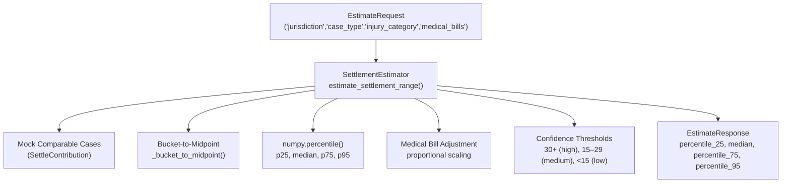
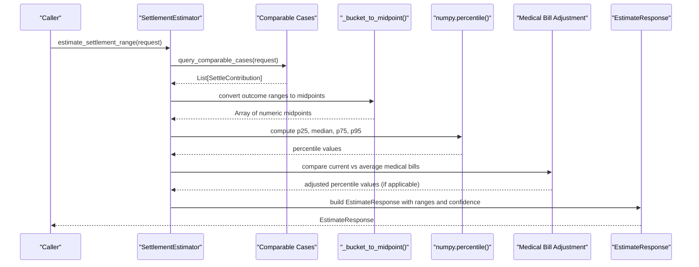
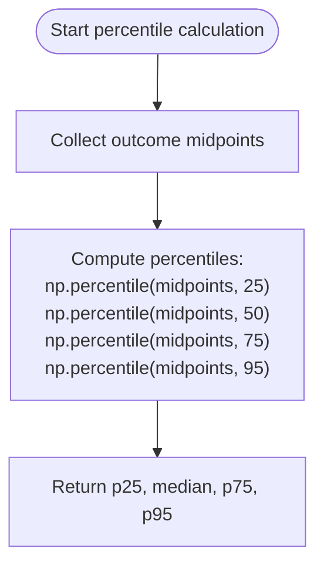
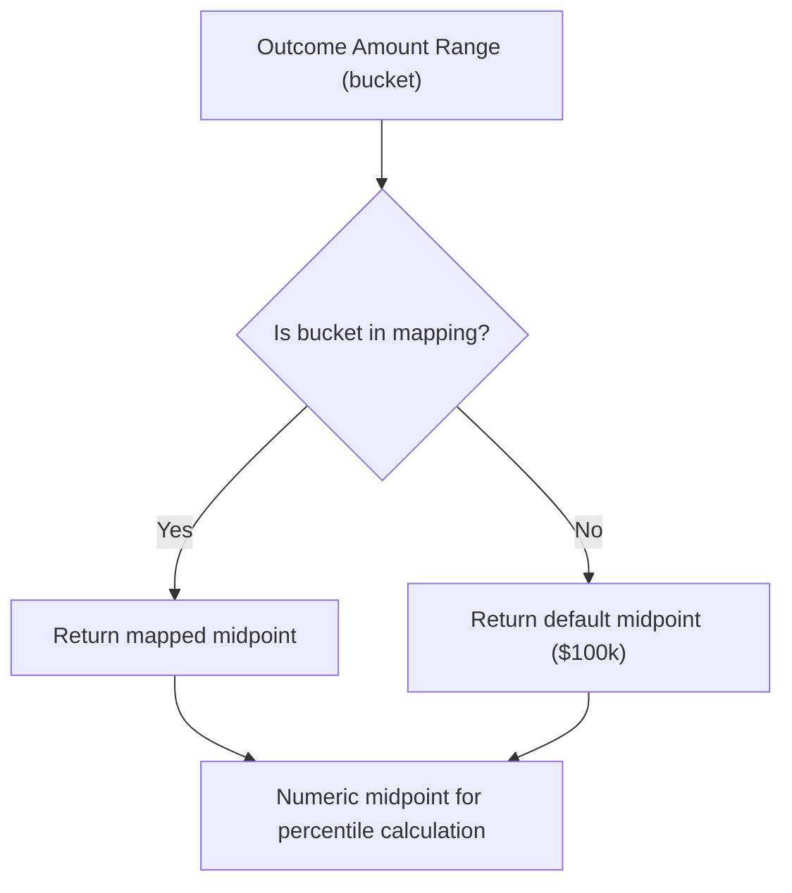
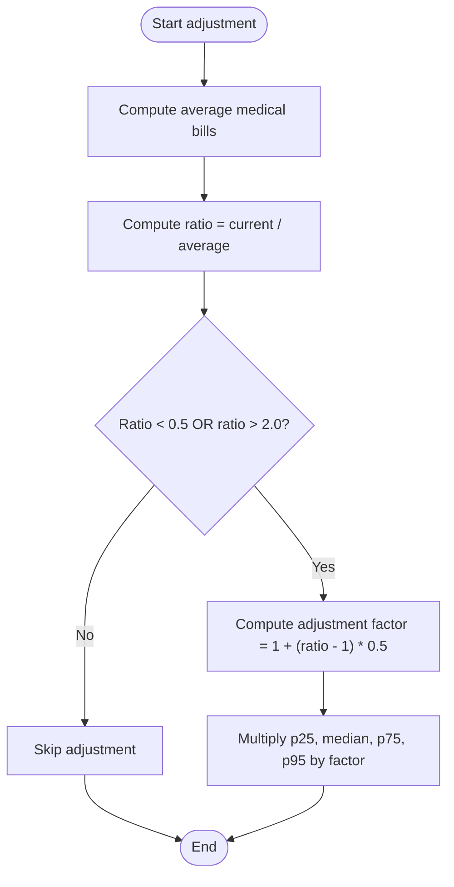
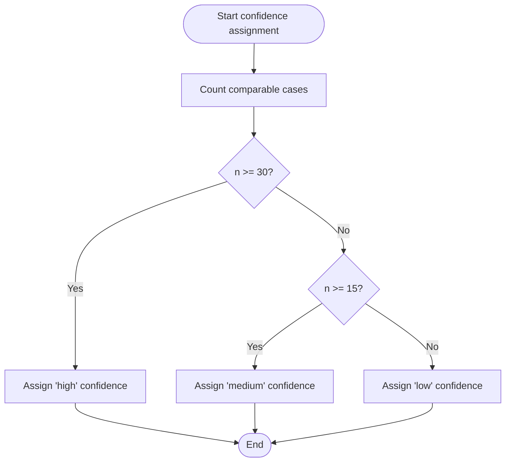
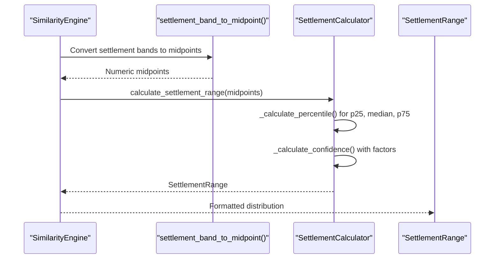
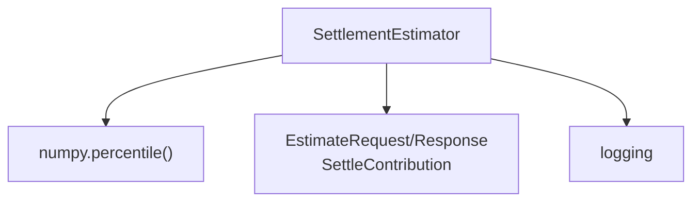

# Percentile Calculation Algorithm

<cite>
**Referenced Files in This Document**
- [estimator.py](file://app/services/estimator.py)
- [test_estimator.py](file://tests/test_estimator.py)
- [case_bank.py](file://app/models/case_bank.py)
- [similarity_engine.py](file://app/services/similarity_engine.py)
- [settlement_calculator.py](file://app/services/settlement_calculator.py)
</cite>

## Table of Contents
1. [Introduction](#introduction)
2. [Project Structure](#project-structure)
3. [Core Components](#core-components)
4. [Architecture Overview](#architecture-overview)
5. [Detailed Component Analysis](#detailed-component-analysis)
6. [Dependency Analysis](#dependency-analysis)
7. [Performance Considerations](#performance-considerations)
8. [Troubleshooting Guide](#troubleshooting-guide)
9. [Conclusion](#conclusion)

## Introduction
This document explains the percentile calculation algorithm used to estimate settlement ranges from comparable cases. It covers:
- Mathematical implementation using numpy.percentile() for 25th, median (50th), 75th, and 95th percentiles
- Bucket-to-midpoint conversion system for outcome amount ranges, including mapping and conservative estimates for open-ended ranges
- Medical bill adjustment mechanism that applies proportional scaling when current medical bills differ significantly from the average
- Confidence threshold system (30+ cases = high confidence, 15–29 = medium, <15 = low)
- Concrete examples of calculation workflows, edge cases, and performance considerations for real-time processing

## Project Structure
The percentile calculation algorithm is implemented in the settlement estimator service and integrates with supporting models and utilities:
- Estimator service orchestrates percentile computation, bucket conversion, medical bill adjustment, and confidence assignment
- Data models define the request/response structures and allowable outcome ranges
- Similarity engine provides settlement band utilities for alternative percentile-based workflows
- Additional calculator service demonstrates confidence scoring for a different percentile method

**Diagram sources**
- [estimator.py:60-116](file://app/services/estimator.py#L60-L116)
- [estimator.py:148-210](file://app/services/estimator.py#L148-L210)
- [estimator.py:264-289](file://app/services/estimator.py#L264-L289)
- [case_bank.py:69-139](file://app/models/case_bank.py#L69-L139)

**Section sources**
- [estimator.py:1-443](file://app/services/estimator.py#L1-L443)
- [case_bank.py:1-269](file://app/models/case_bank.py#L1-L269)

## Core Components
- SettlementEstimator: Orchestrates percentile-based settlement range estimation
- Outcome range bucket mapping: Converts categorical outcome ranges to numeric midpoints
- Medical bill adjustment: Applies proportional scaling when current medical bills differ significantly from the average
- Confidence thresholds: Determines confidence level based on number of comparable cases
- Data models: Define request/response structures and allowable outcome ranges

Key implementation references:
- Percentile calculation and confidence thresholds: [estimator.py:148-210](file://app/services/estimator.py#L148-L210)
- Bucket-to-midpoint mapping: [estimator.py:264-289](file://app/services/estimator.py#L264-L289)
- Medical bill adjustment: [estimator.py:179-193](file://app/services/estimator.py#L179-L193)
- Confidence thresholds: [estimator.py:44-49](file://app/services/estimator.py#L44-L49)
- Data models: [case_bank.py:69-139](file://app/models/case_bank.py#L69-L139)

**Section sources**
- [estimator.py:44-49](file://app/services/estimator.py#L44-L49)
- [estimator.py:148-210](file://app/services/estimator.py#L148-L210)
- [estimator.py:264-289](file://app/services/estimator.py#L264-L289)
- [case_bank.py:69-139](file://app/models/case_bank.py#L69-L139)

## Architecture Overview
The estimator service follows a deterministic pipeline:
1. Query comparable cases (mocked in current implementation)
2. Convert outcome ranges to numeric midpoints
3. Compute percentiles using numpy.percentile()
4. Optionally adjust ranges based on medical bill differences
5. Assign confidence level based on case count
6. Return structured response with ranges and comparable cases

**Diagram sources**
- [estimator.py:60-116](file://app/services/estimator.py#L60-L116)
- [estimator.py:148-210](file://app/services/estimator.py#L148-L210)
- [estimator.py:264-289](file://app/services/estimator.py#L264-L289)

## Detailed Component Analysis

### Percentile Calculation with numpy.percentile()
- Inputs: Numeric midpoints derived from outcome amount ranges
- Outputs: p25, median, p75, p95 values
- Implementation: Uses numpy.percentile() for robust percentile computation

**Diagram sources**
- [estimator.py:173-177](file://app/services/estimator.py#L173-L177)

**Section sources**
- [estimator.py:173-177](file://app/services/estimator.py#L173-L177)

### Bucket-to-Midpoint Conversion System
- Purpose: Convert categorical outcome ranges to numeric midpoints for percentile computation
- Mapping table: Defines midpoints for each outcome range bucket
- Open-ended ranges: Conservative estimates are used for upper bounds

**Diagram sources**
- [estimator.py:264-289](file://app/services/estimator.py#L264-L289)

**Section sources**
- [estimator.py:264-289](file://app/services/estimator.py#L264-L289)

### Medical Bill Adjustment Mechanism
- Objective: Scale percentile ranges proportionally when current medical bills significantly differ from the average
- Trigger: Ratio of current to average medical bills outside thresholds (<0.5 or >2.0)
- Adjustment: Partial adjustment (50% weight) applied to all percentiles

**Diagram sources**
- [estimator.py:179-193](file://app/services/estimator.py#L179-L193)

**Section sources**
- [estimator.py:179-193](file://app/services/estimator.py#L179-L193)

### Confidence Threshold System
- High confidence: 30+ comparable cases
- Medium confidence: 15–29 comparable cases
- Low confidence: <15 comparable cases (fallback to multipliers)

**Diagram sources**
- [estimator.py:44-49](file://app/services/estimator.py#L44-L49)
- [estimator.py:195-200](file://app/services/estimator.py#L195-L200)

**Section sources**
- [estimator.py:44-49](file://app/services/estimator.py#L44-L49)
- [estimator.py:195-200](file://app/services/estimator.py#L195-L200)

### Alternative Workflow: Settlement Band Percentiles
While the estimator service uses outcome amount ranges, the similarity engine demonstrates an alternative percentile-based approach using settlement bands and a deterministic percentile calculation method.

**Diagram sources**
- [similarity_engine.py:435-441](file://app/services/similarity_engine.py#L435-L441)
- [settlement_calculator.py:57-103](file://app/services/settlement_calculator.py#L57-L103)

**Section sources**
- [similarity_engine.py:425-441](file://app/services/similarity_engine.py#L425-L441)
- [settlement_calculator.py:105-116](file://app/services/settlement_calculator.py#L105-L116)

## Dependency Analysis
- SettlementEstimator depends on:
  - numpy for percentile computation
  - SettleContribution and EstimateResponse models for data structures
  - Logging for observability
- Bucket-to-midpoint mapping is self-contained within the estimator
- Confidence thresholds are constants configured in the estimator class

**Diagram sources**
- [estimator.py:10](file://app/services/estimator.py#L10)
- [estimator.py:15-22](file://app/services/estimator.py#L15-L22)

**Section sources**
- [estimator.py:10](file://app/services/estimator.py#L10)
- [estimator.py:15-22](file://app/services/estimator.py#L15-L22)

## Performance Considerations
- Real-time processing targets: Response time under 1000 ms
- Data volume: Up to 25 comparable cases in mock implementation
- Computational complexity: O(n log n) due to sorting for percentile calculation
- Memory footprint: Linear with number of comparable cases
- Recommendations:
  - Pre-sort midpoints if percentile computation is repeated frequently
  - Cache bucket-to-midpoint mapping for reuse
  - Monitor response time metrics and alert on latency spikes

Evidence from tests:
- Response time assertion under 1000 ms: [test_estimator.py:32](file://tests/test_estimator.py#L32)
- Response time measurement in estimator: [estimator.py:104](file://app/services/estimator.py#L104)

**Section sources**
- [test_estimator.py:85-102](file://tests/test_estimator.py#L85-L102)
- [estimator.py:104](file://app/services/estimator.py#L104)

## Troubleshooting Guide
Common issues and resolutions:
- Unexpected confidence level:
  - Verify case count meets thresholds: [estimator.py:44-49](file://app/services/estimator.py#L44-L49)
- Incorrect percentile values:
  - Confirm bucket-to-midpoint mapping is correct: [estimator.py:264-289](file://app/services/estimator.py#L264-L289)
- Medical bill adjustment not applied:
  - Check ratio thresholds and adjustment factor: [estimator.py:179-193](file://app/services/estimator.py#L179-L193)
- Data validation errors:
  - Outcome range must be one of allowed buckets: [case_bank.py:170-180](file://app/models/case_bank.py#L170-L180)

Validation references:
- Outcome range validation: [case_bank.py:170-180](file://app/models/case_bank.py#L170-L180)
- Bucket midpoint tests: [test_estimator.py:58-66](file://tests/test_estimator.py#L58-L66)

**Section sources**
- [estimator.py:44-49](file://app/services/estimator.py#L44-L49)
- [estimator.py:179-193](file://app/services/estimator.py#L179-L193)
- [estimator.py:264-289](file://app/services/estimator.py#L264-L289)
- [case_bank.py:170-180](file://app/models/case_bank.py#L170-L180)
- [test_estimator.py:58-66](file://tests/test_estimator.py#L58-L66)

## Conclusion
The percentile calculation algorithm provides a deterministic, transparent method for estimating settlement ranges:
- Uses numpy.percentile() to compute robust percentiles from mapped outcome midpoints
- Applies conservative bucket-to-midpoint mapping with open-ended range estimates
- Incorporates proportional scaling when medical bills differ significantly from the average
- Assigns confidence levels based on case count thresholds
- Designed for real-time performance with clear validation and logging

Future enhancements could include:
- Production database integration for comparable case queries
- Dynamic bucket mapping updates based on new data
- Confidence scoring alignment with estimator thresholds
- Multi-modal fallback strategies for sparse jurisdictions