# Settlement Intelligence Engine

<cite>
**Referenced Files in This Document**
- [settlement_calculator.py](file://app/services/settlement_calculator.py)
- [estimator.py](file://app/services/estimator.py)
- [similarity_engine.py](file://app/services/similarity_engine.py)
- [case_bank.py](file://app/models/case_bank.py)
- [query.py](file://app/api/v1/endpoints/query.py)
- [router.py](file://app/api/v1/router.py)
- [reports.py](file://app/api/v1/endpoints/reports.py)
- [pdf_generator.py](file://app/services/reports/pdf_generator.py)
- [validator.py](file://app/services/validator.py)
- [anonymizer.py](file://app/services/anonymizer.py)
- [billing_event_service.py](file://app/services/billing_event_service.py)
</cite>

## Table of Contents
1. [Introduction](#introduction)
2. [Project Structure](#project-structure)
3. [Core Components](#core-components)
4. [Architecture Overview](#architecture-overview)
5. [Detailed Component Analysis](#detailed-component-analysis)
6. [Dependency Analysis](#dependency-analysis)
7. [Performance Considerations](#performance-considerations)
8. [Troubleshooting Guide](#troubleshooting-guide)
9. [Conclusion](#conclusion)
10. [Appendices](#appendices)

## Introduction
The Settlement Intelligence Engine provides percentile-based settlement range estimation using two complementary methodologies:
- Database-driven percentile calculation when sufficient comparable cases are available
- Multiplier fallback system for limited-data scenarios

The system integrates a deterministic similarity engine for comparable case discovery, a robust confidence scoring framework, and comprehensive reporting with blockchain verification. It supports both authenticated API access and compliance-focused data handling.

## Project Structure
The Settlement Intelligence Engine is organized around three primary layers:
- API Layer: FastAPI endpoints for estimation, reporting, and administrative functions
- Services Layer: Core algorithms for estimation, similarity matching, validation, and reporting
- Models Layer: Pydantic models defining request/response schemas and domain entities

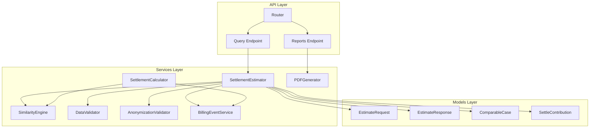

**Diagram sources**
- [router.py:1-26](file://app/api/v1/router.py#L1-L26)
- [query.py:1-119](file://app/api/v1/endpoints/query.py#L1-L119)
- [reports.py:1-259](file://app/api/v1/endpoints/reports.py#L1-L259)
- [estimator.py:25-443](file://app/services/estimator.py#L25-L443)
- [settlement_calculator.py:41-257](file://app/services/settlement_calculator.py#L41-L257)
- [similarity_engine.py:188-441](file://app/services/similarity_engine.py#L188-L441)
- [case_bank.py:69-139](file://app/models/case_bank.py#L69-L139)

**Section sources**
- [router.py:1-26](file://app/api/v1/router.py#L1-L26)
- [query.py:1-119](file://app/api/v1/endpoints/query.py#L1-L119)
- [reports.py:1-259](file://app/api/v1/endpoints/reports.py#L1-L259)

## Core Components
This section documents the primary algorithms and services that power the Settlement Intelligence Engine.

### Percentile-Based Settlement Range Estimator
The SettlementEstimator implements the dual-methodology approach:
- Database-driven percentile calculation for ≥15 cases using 25th, median, 75th, and 95th percentiles
- Multiplier fallback system for <15 cases using industry-standard multipliers
- Confidence scoring thresholds: high (≥30), medium (15-29), low (<15)

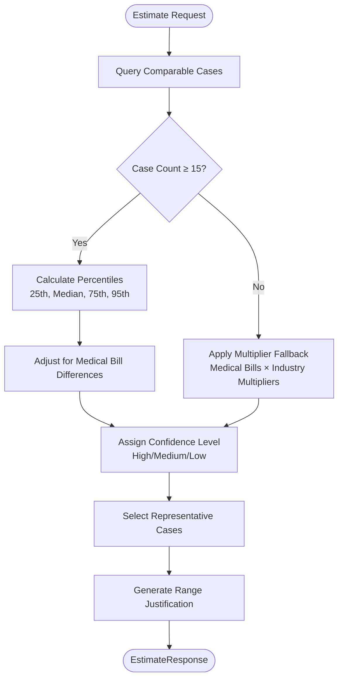

**Diagram sources**
- [estimator.py:60-116](file://app/services/estimator.py#L60-L116)
- [estimator.py:148-210](file://app/services/estimator.py#L148-L210)
- [estimator.py:212-262](file://app/services/estimator.py#L212-L262)
- [estimator.py:291-343](file://app/services/estimator.py#L291-L343)
- [estimator.py:345-388](file://app/services/estimator.py#L345-L388)

### Deterministic Similarity Engine
The SimilarityEngine computes weighted similarity scores (0-100) between target cases and historical settlement records using structured legal signals:
- Incident type matching with relatedness matrix
- Injury category severity levels
- Jurisdiction scoring (exact county, same state, neighboring state)
- Medical specials band adjacency
- Liability strength and litigation stage matching

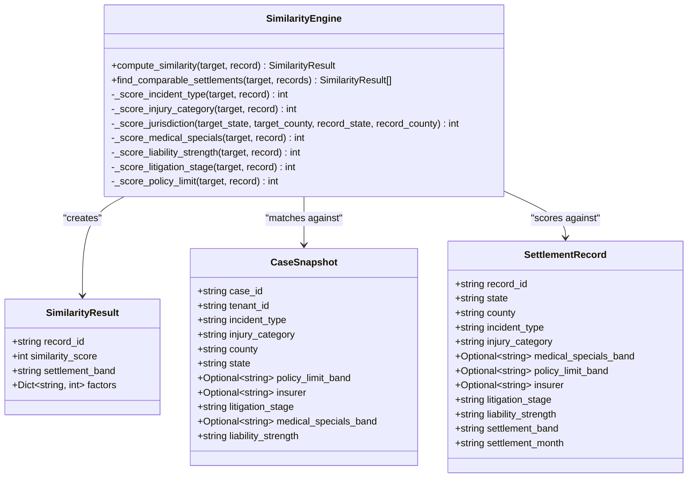

**Diagram sources**
- [similarity_engine.py:188-418](file://app/services/similarity_engine.py#L188-L418)
- [similarity_engine.py:75-115](file://app/services/similarity_engine.py#L75-L115)
- [similarity_engine.py:91-106](file://app/services/similarity_engine.py#L91-L106)

### Confidence Scoring System
The SettlementCalculator implements a weighted confidence scoring system:
- Sample size contribution (0-40 points)
- Jurisdiction match strength (0-30 points)
- Average similarity score (0-30 points)

Confidence labels: High (80+), Moderate (60+), Low (40+), Very Low (<40)

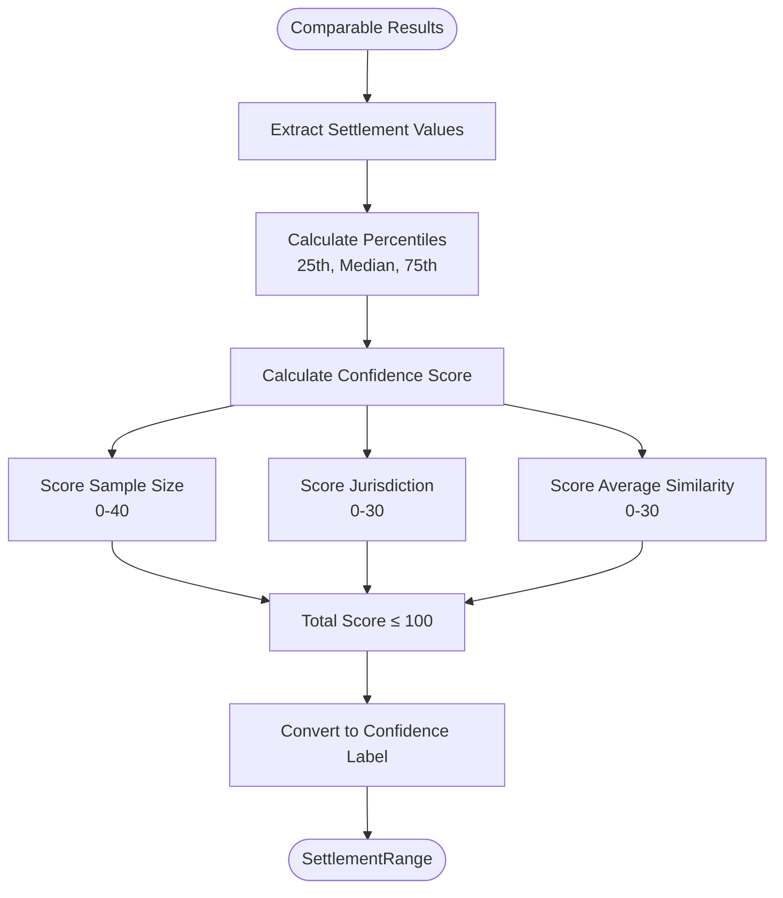

**Diagram sources**
- [settlement_calculator.py:57-103](file://app/services/settlement_calculator.py#L57-L103)
- [settlement_calculator.py:117-191](file://app/services/settlement_calculator.py#L117-L191)

**Section sources**
- [estimator.py:25-50](file://app/services/estimator.py#L25-L50)
- [settlement_calculator.py:41-191](file://app/services/settlement_calculator.py#L41-L191)
- [similarity_engine.py:188-418](file://app/services/similarity_engine.py#L188-L418)

## Architecture Overview
The Settlement Intelligence Engine follows a layered architecture with clear separation of concerns:

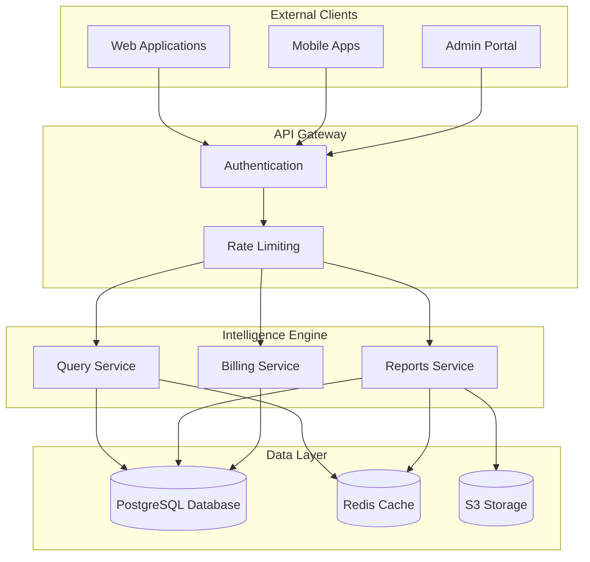

**Diagram sources**
- [query.py:20-98](file://app/api/v1/endpoints/query.py#L20-L98)
- [reports.py:23-188](file://app/api/v1/endpoints/reports.py#L23-L188)
- [billing_event_service.py:62-169](file://app/services/billing_event_service.py#L62-L169)

### API Integration Patterns
The engine exposes RESTful endpoints with standardized request/response patterns:

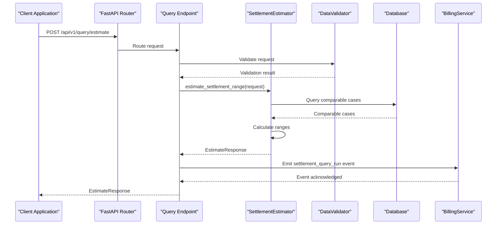

**Diagram sources**
- [query.py:20-98](file://app/api/v1/endpoints/query.py#L20-L98)
- [estimator.py:60-116](file://app/services/estimator.py#L60-L116)
- [billing_event_service.py:271-285](file://app/services/billing_event_service.py#L271-L285)

**Section sources**
- [router.py:1-26](file://app/api/v1/router.py#L1-L26)
- [query.py:20-98](file://app/api/v1/endpoints/query.py#L20-L98)
- [reports.py:23-188](file://app/api/v1/endpoints/reports.py#L23-L188)

## Detailed Component Analysis

### Percentile-Based Calculation Algorithm
The percentile calculation uses numpy's percentile function to compute quartiles and quintiles from comparable case outcomes:

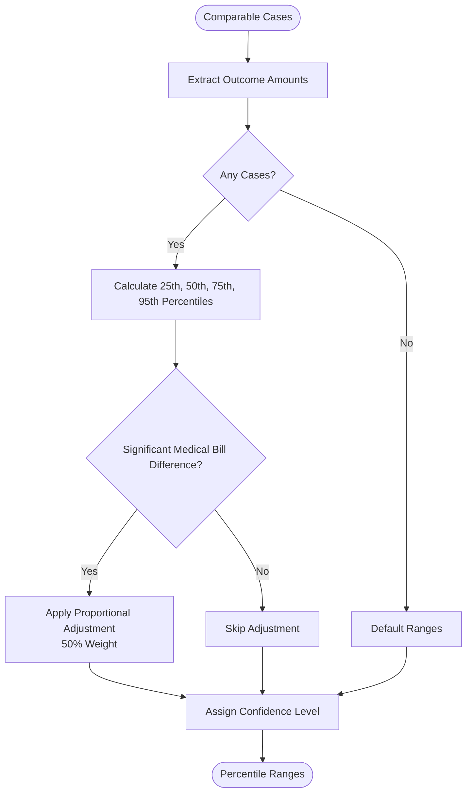

**Diagram sources**
- [estimator.py:148-210](file://app/services/estimator.py#L148-L210)

#### Multiplier Fallback System
For limited-data scenarios (<15 cases), the engine applies industry-standard multipliers based on medical bill severity:

| Severity Level | Medical Bill Threshold | Multipliers |
|---------------|----------------------|-------------|
| Low | < $5,000 | Min: 1.5x, Typical: 2.0x, High: 3.0x |
| Medium | $5,000-$25,000 | Min: 2.0x, Typical: 3.5x, High: 5.0x |
| High | > $25,000 | Min: 3.0x, Typical: 5.0x, High: 8.0x |

#### Medical Bill Adjustment Mechanism
The system adjusts settlement ranges when current medical bills differ significantly from comparable cases:
- Ratio threshold: < 0.5 or > 2.0 indicates significant difference
- Partial adjustment applied (50% weight) to reduce impact bias

**Section sources**
- [estimator.py:148-210](file://app/services/estimator.py#L148-L210)
- [estimator.py:212-262](file://app/services/estimator.py#L212-L262)
- [estimator.py:179-193](file://app/services/estimator.py#L179-L193)

### Representative Case Selection Algorithm
The engine selects diverse, representative comparable cases for reporting:

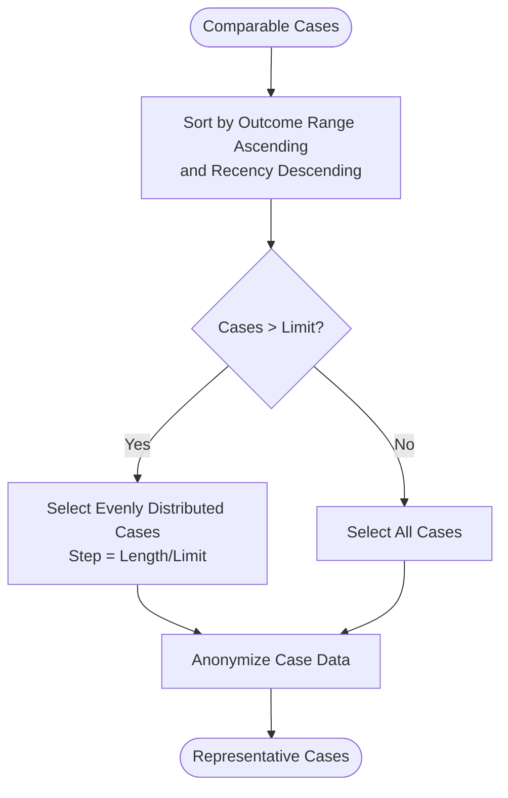

**Diagram sources**
- [estimator.py:291-343](file://app/services/estimator.py#L291-L343)

#### Jurisdiction Matching Criteria
The similarity engine implements hierarchical jurisdiction matching:
- Exact county match: 20 points
- Same state, different county: 12 points
- Neighboring state: 6 points
- Different region: 0 points

**Section sources**
- [estimator.py:291-343](file://app/services/estimator.py#L291-L343)
- [similarity_engine.py:294-313](file://app/services/similarity_engine.py#L294-L313)

### Confidence Scoring Implementation
The SettlementCalculator implements a weighted scoring system:

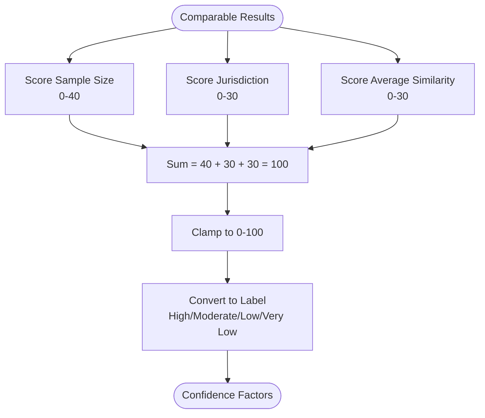

**Diagram sources**
- [settlement_calculator.py:117-191](file://app/services/settlement_calculator.py#L117-L191)

**Section sources**
- [settlement_calculator.py:117-191](file://app/services/settlement_calculator.py#L117-L191)

### Reporting and Compliance Features
The engine generates comprehensive reports with blockchain verification:

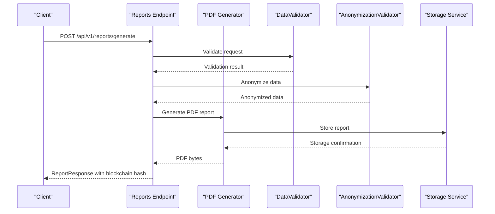

**Diagram sources**
- [reports.py:23-188](file://app/api/v1/endpoints/reports.py#L23-L188)
- [pdf_generator.py:41-86](file://app/services/reports/pdf_generator.py#L41-L86)

**Section sources**
- [reports.py:23-188](file://app/api/v1/endpoints/reports.py#L23-L188)
- [pdf_generator.py:41-86](file://app/services/reports/pdf_generator.py#L41-L86)

## Dependency Analysis
The Settlement Intelligence Engine exhibits clean dependency relationships with minimal coupling:

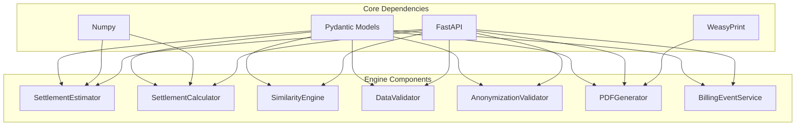

**Diagram sources**
- [estimator.py:10-22](file://app/services/estimator.py#L10-L22)
- [settlement_calculator.py:8-18](file://app/services/settlement_calculator.py#L8-L18)
- [similarity_engine.py:10-15](file://app/services/similarity_engine.py#L10-L15)
- [pdf_generator.py:32-39](file://app/services/reports/pdf_generator.py#L32-L39)

### Data Model Relationships
The system uses Pydantic models to define request/response schemas and domain entities:

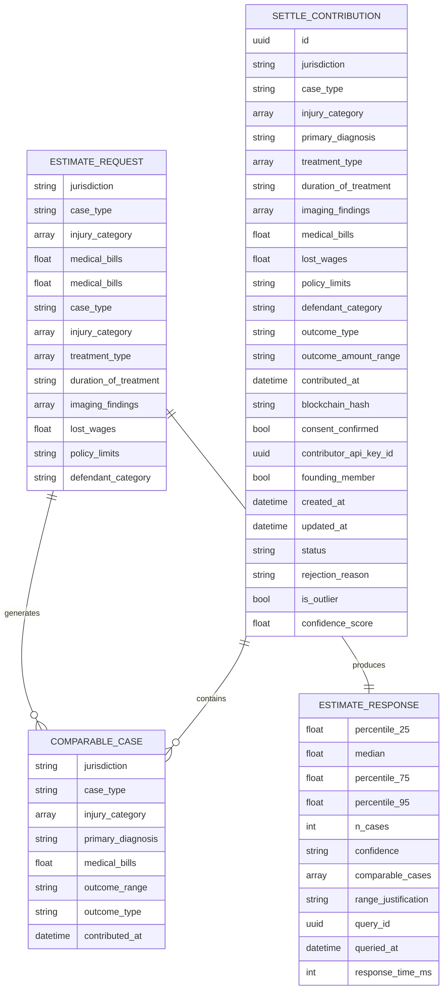

**Diagram sources**
- [case_bank.py:69-139](file://app/models/case_bank.py#L69-L139)
- [case_bank.py:15-63](file://app/models/case_bank.py#L15-L63)

**Section sources**
- [case_bank.py:69-139](file://app/models/case_bank.py#L69-L139)
- [case_bank.py:15-63](file://app/models/case_bank.py#L15-L63)

## Performance Considerations
The Settlement Intelligence Engine is optimized for low-latency responses:

### Response Time Targets
- Query endpoint: <1 second (p95)
- Report generation: <2 seconds (p95)
- PDF generation: Mock fallback available when WeasyPrint unavailable

### Scalability Patterns
- Database query expansion: progressive expansion from county → state → regional → national
- Similarity scoring: capped at 200 comparable cases per query
- Confidence scoring: O(n) complexity for sample size evaluation
- Memory usage: bounded by case collection limits

### Database Integration
The estimator currently uses mock data but includes database connectivity hooks for production deployment. The query endpoint demonstrates proper database connection patterns and error handling.

## Troubleshooting Guide

### Common Issues and Resolutions
1. **Insufficient Comparable Cases**
   - Symptom: Multiplier fallback activation
   - Resolution: Expand jurisdiction scope or increase data contribution

2. **Similarity Score Too Low**
   - Symptom: No comparable cases found
   - Resolution: Adjust injury categories or expand case type filters

3. **Validation Errors**
   - Symptom: Request rejected with validation errors
   - Resolution: Check jurisdiction format, required fields, and value ranges

4. **Report Generation Failures**
   - Symptom: PDF generation errors
   - Resolution: Install WeasyPrint dependency or use JSON format

### Error Handling Patterns
The system implements comprehensive error handling:
- HTTP 400 for validation failures
- HTTP 500 for internal server errors
- Detailed error messages with stack traces in debug mode
- Graceful degradation for missing dependencies

**Section sources**
- [query.py:100-107](file://app/api/v1/endpoints/query.py#L100-L107)
- [reports.py:190-197](file://app/api/v1/endpoints/reports.py#L190-L197)
- [pdf_generator.py:83-85](file://app/services/reports/pdf_generator.py#L83-L85)

## Conclusion
The Settlement Intelligence Engine provides a robust, compliant solution for percentile-based settlement range estimation. Its dual-methodology approach ensures reliable estimates across varying data availability scenarios, while comprehensive validation and anonymization maintain legal and ethical standards. The modular architecture supports easy integration, scalability, and future enhancements.

Key strengths include:
- Deterministic algorithms with transparent scoring
- Comprehensive compliance with legal and privacy requirements
- Flexible reporting with blockchain verification
- Scalable architecture supporting growth

## Appendices

### API Reference Summary
- **POST /api/v1/query/estimate**: Settlement range estimation with percentile calculation
- **POST /api/v1/reports/generate**: Report generation with blockchain verification
- **GET /api/v1/query/health**: Health check endpoint
- **GET /api/v1/reports/health**: Reports service health check

### Configuration Options
- Minimum sample size: 15 cases for percentile calculation
- Confidence thresholds: High (≥30), Medium (15-29), Low (<15)
- Similarity threshold: ≥60 for comparable case inclusion
- Maximum comparable cases: 200 per query

### Integration Guidelines
- Authentication: API Key or JWT tokens supported
- Rate limiting: Implemented at gateway level
- Monitoring: Built-in event emission for behavioral analytics
- Compliance: Zero PHI/PII data handling with blockchain verification