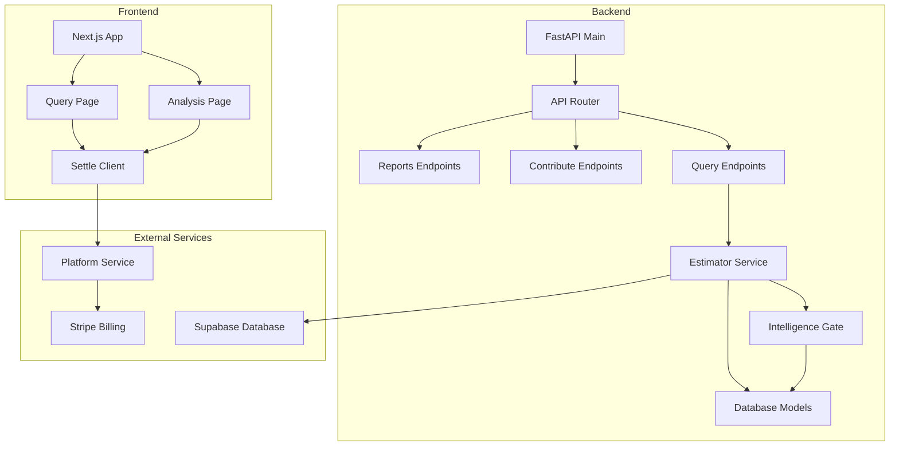
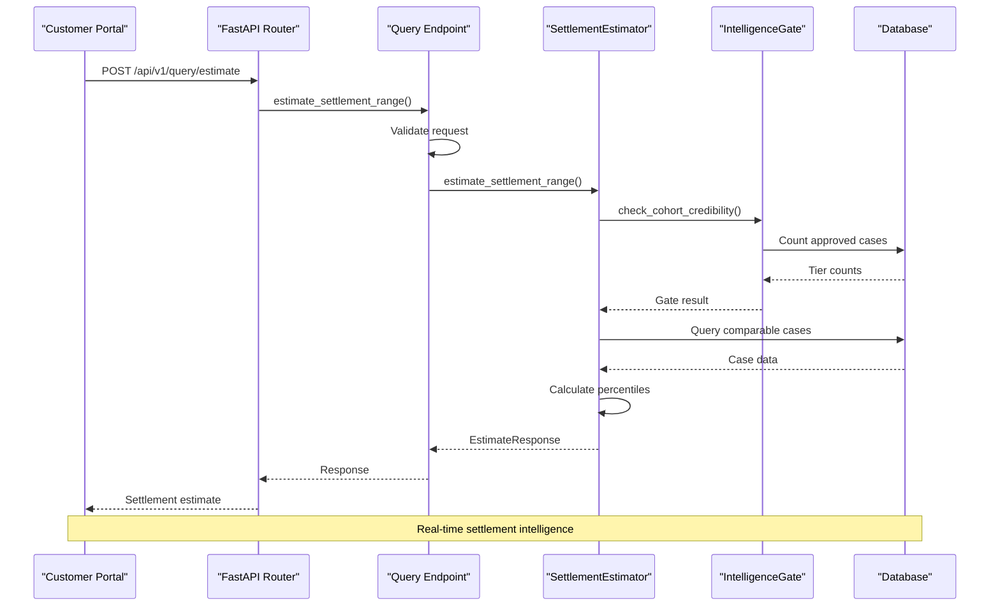
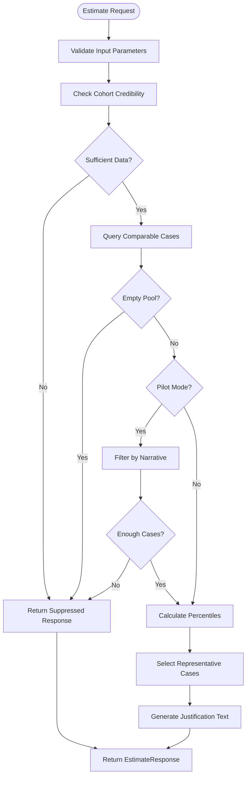
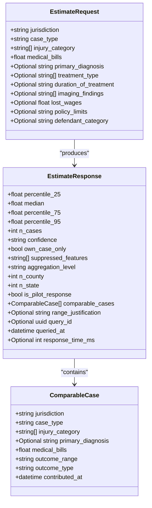
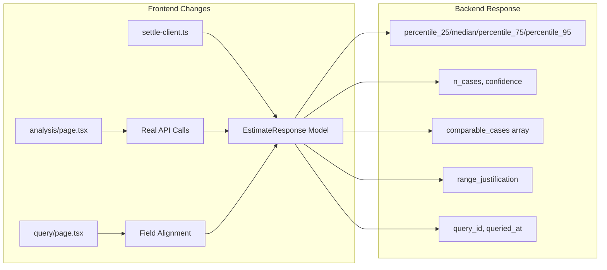
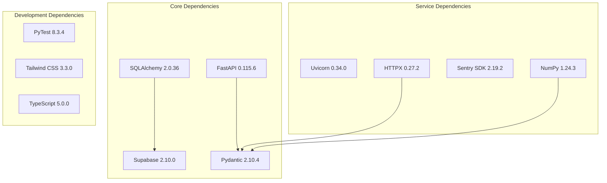

# Milestone Cohort V-front-2 Checkpoint

<cite>
**Referenced Files in This Document**
- [MILESTONE_COHORT_V_FRONT_2_CHECKPOINT.md](file://docs/01-main/MILESTONE_COHORT_V_FRONT_2_CHECKPOINT.md)
- [main.py](file://app/main.py)
- [router.py](file://app/api/v1/router.py)
- [config.py](file://app/core/config.py)
- [requirements.txt](file://requirements.txt)
- [query.py](file://app/api/v1/endpoints/query.py)
- [estimator.py](file://app/services/estimator.py)
- [case_bank.py](file://app/models/case_bank.py)
- [intelligence_gate.py](file://app/services/intelligence_gate.py)
- [package.json](file://frontend/package.json)
</cite>

## Table of Contents
1. [Introduction](#introduction)
2. [Project Structure](#project-structure)
3. [Core Components](#core-components)
4. [Architecture Overview](#architecture-overview)
5. [Detailed Component Analysis](#detailed-component-analysis)
6. [Dependency Analysis](#dependency-analysis)
7. [Performance Considerations](#performance-considerations)
8. [Troubleshooting Guide](#troubleshooting-guide)
9. [Conclusion](#conclusion)

## Introduction
This document provides a comprehensive analysis of the Milestone Cohort V-front-2 Checkpoint for the TrueVow SETTLE Service. The checkpoint focuses on integrating the customer portal frontend with the live backend settlement intelligence API. It documents the backend FastAPI service architecture, the settlement estimation algorithm, data models, and the frontend integration changes that replaced mock data with real API responses.

The checkpoint summary highlights:
- Replacing the MOCK_INTEL constant with a live settleClient.getEstimate() call
- Aligning frontend EstimateResponse interface with the backend Pydantic model
- Dropping 5 mock-only UI fields per Option A product decision
- Updating query and analysis pages to use aligned field names
- Implementing pilot-mode and guardrail fields in the response model

**Section sources**
- [MILESTONE_COHORT_V_FRONT_2_CHECKPOINT.md:1-40](file://docs/01-main/MILESTONE_COHORT_V_FRONT_2_CHECKPOINT.md#L1-L40)

## Project Structure
The project follows a layered architecture with clear separation between frontend and backend components. The backend is structured around FastAPI with modular services, while the frontend uses Next.js for the customer portal.

**Diagram sources**
- [main.py:1-87](file://app/main.py#L1-L87)
- [router.py:1-22](file://app/api/v1/router.py#L1-L22)
- [query.py:1-153](file://app/api/v1/endpoints/query.py#L1-L153)
- [estimator.py:1-734](file://app/services/estimator.py#L1-L734)

**Section sources**
- [main.py:1-87](file://app/main.py#L1-L87)
- [router.py:1-22](file://app/api/v1/router.py#L1-L22)
- [config.py:1-363](file://app/core/config.py#L1-L363)

## Core Components
The backend service consists of several key components working together to provide settlement intelligence:

### FastAPI Application
The main application initializes logging, monitoring, CORS middleware, and includes all API routers. It supports both development and production environments with configurable settings.

### API Endpoints
The query endpoint handles settlement range estimation requests, validating input data and delegating to the estimator service. It supports multiple authentication methods and includes comprehensive error handling.

### Estimator Service
The core algorithm calculates settlement ranges using percentile-based statistics with hierarchical jurisdiction fallback. It implements the "Never Sell Empty Dashboards" guardrail with a minimum aggregation threshold of 50 cases.

### Data Models
Pydantic models define the request/response schemas for settlement estimation, including comparable case data and pilot-mode enhancements.

**Section sources**
- [main.py:46-87](file://app/main.py#L46-L87)
- [query.py:20-153](file://app/api/v1/endpoints/query.py#L20-L153)
- [estimator.py:32-288](file://app/services/estimator.py#L32-L288)
- [case_bank.py:117-189](file://app/models/case_bank.py#L117-L189)

## Architecture Overview
The system implements a service-oriented architecture with clear separation of concerns:

**Diagram sources**
- [query.py:20-132](file://app/api/v1/endpoints/query.py#L20-L132)
- [estimator.py:71-287](file://app/services/estimator.py#L71-L287)
- [intelligence_gate.py:158-309](file://app/services/intelligence_gate.py#L158-L309)

The architecture enforces data quality through:
- Minimum aggregation threshold (50 cases per tier)
- Hierarchical jurisdiction fallback (county → state)
- Pilot-mode enhancements for limited data scenarios
- Comprehensive input validation and error handling

## Detailed Component Analysis

### Settlement Estimator Service
The estimator implements a sophisticated algorithm for calculating settlement ranges:

**Diagram sources**
- [estimator.py:71-287](file://app/services/estimator.py#L71-L287)
- [intelligence_gate.py:158-309](file://app/services/intelligence_gate.py#L158-L309)

Key features include:
- **Hierarchical Aggregation**: County-exact matching followed by state-wide aggregation
- **Percentile Calculation**: 25th, median, 75th, and 95th percentile computation
- **Pilot Mode**: Special handling for limited data scenarios with narrative requirements
- **Confidence Scoring**: High (≥30 cases) and medium (<30 cases) confidence levels

**Section sources**
- [estimator.py:32-288](file://app/services/estimator.py#L32-L288)
- [intelligence_gate.py:119-309](file://app/services/intelligence_gate.py#L119-L309)

### Data Models and Validation
The backend uses Pydantic models to ensure data integrity:

**Diagram sources**
- [case_bank.py:76-189](file://app/models/case_bank.py#L76-L189)

The models enforce:
- **Jurisdiction Format**: County and state validation
- **Outcome Range Buckets**: Predefined monetary ranges
- **Medical Bill Constraints**: Non-negative values
- **Injury Category Validation**: Multi-select with specific categories

**Section sources**
- [case_bank.py:15-70](file://app/models/case_bank.py#L15-L70)
- [case_bank.py:76-189](file://app/models/case_bank.py#L76-L189)

### Frontend Integration Changes
The frontend underwent significant updates to integrate with the live backend:

**Diagram sources**
- [MILESTONE_COHORT_V_FRONT_2_CHECKPOINT.md:11-13](file://docs/01-main/MILESTONE_COHORT_V_FRONT_2_CHECKPOINT.md#L11-L13)

Key frontend modifications:
- **Type Alignment**: Complete replacement of MOCK_INTEL with real API responses
- **Field Renaming**: Updated from settlement_range.* to flat percentile fields
- **UI Enhancement**: Added pilot-mode banner and guardrail displays
- **Mock Data Preservation**: Kept MOCK_CASES for case input display

**Section sources**
- [MILESTONE_COHORT_V_FRONT_2_CHECKPOINT.md:11-29](file://docs/01-main/MILESTONE_COHORT_V_FRONT_2_CHECKPOINT.md#L11-L29)

## Dependency Analysis
The system maintains clean dependency boundaries with clear interfaces:

**Diagram sources**
- [requirements.txt:1-52](file://requirements.txt#L1-L52)

The dependency structure supports:
- **Modular Architecture**: Clear separation between core and service dependencies
- **Testing Infrastructure**: Comprehensive test suite with async support
- **Monitoring Integration**: Production-ready error tracking and performance monitoring
- **Frontend Tooling**: Modern development environment with TypeScript and Tailwind CSS

**Section sources**
- [requirements.txt:1-52](file://requirements.txt#L1-L52)
- [package.json:12-25](file://frontend/package.json#L12-L25)

## Performance Considerations
The system implements several performance optimizations:

### Response Time Targets
- **p95 Response Time**: Under 1 second for settlement range estimation
- **Database Query Limits**: Maximum 50 rows per tier query
- **Processing Time**: Optimized percentile calculations and case sampling

### Scalability Features
- **Hierarchical Fallback**: State-wide aggregation when county data is insufficient
- **Pilot Mode**: Special handling for limited datasets with narrative requirements
- **Feature Flagging**: Configurable service features and pilot mode activation

### Monitoring and Observability
- **Sentry Integration**: Production error tracking with environment-specific sampling rates
- **Logging**: Comprehensive request/response logging with timing information
- **Health Checks**: Dedicated endpoints for service monitoring

**Section sources**
- [query.py:54-55](file://app/api/v1/endpoints/query.py#L54-L55)
- [config.py:233-234](file://app/core/config.py#L233-L234)
- [main.py:22-29](file://app/main.py#L22-L29)

## Troubleshooting Guide
Common issues and their resolutions:

### Authentication Problems
- **API Key Issues**: Verify API key format and permissions
- **JWT Token Validation**: Check token expiration and audience claims
- **Proxy Header Configuration**: Ensure X-Settle-User-Id header is properly forwarded

### Data Quality Issues
- **Insufficient Data Responses**: Check jurisdiction format and case type filters
- **Empty Pool Errors**: Verify injury category filtering and database connectivity
- **Pilot Mode Restrictions**: Confirm pilot user status and narrative requirements

### Performance Issues
- **Slow Response Times**: Monitor database query performance and connection pooling
- **Memory Usage**: Check NumPy array operations and case sampling limits
- **External Service Failures**: Verify Platform Service and Stripe integration

**Section sources**
- [query.py:29-44](file://app/api/v1/endpoints/query.py#L29-L44)
- [estimator.py:104-134](file://app/services/estimator.py#L104-L134)
- [intelligence_gate.py:182-199](file://app/services/intelligence_gate.py#L182-L199)

## Conclusion
The Milestone Cohort V-front-2 Checkpoint represents a significant advancement in the SETTLE Service's maturity and reliability. The integration of live backend APIs with the customer portal demonstrates:

- **Production-Ready Architecture**: Robust settlement estimation with proper guardrails
- **Data Integrity**: Comprehensive validation and quality controls
- **User Experience**: Enhanced transparency with pilot-mode disclosures and guardrail indicators
- **Technical Excellence**: Clean separation of concerns and maintainable codebase

The checkpoint establishes a solid foundation for future enhancements while maintaining backward compatibility and operational excellence. The combination of rigorous data validation, hierarchical aggregation strategies, and comprehensive monitoring ensures reliable operation in production environments.