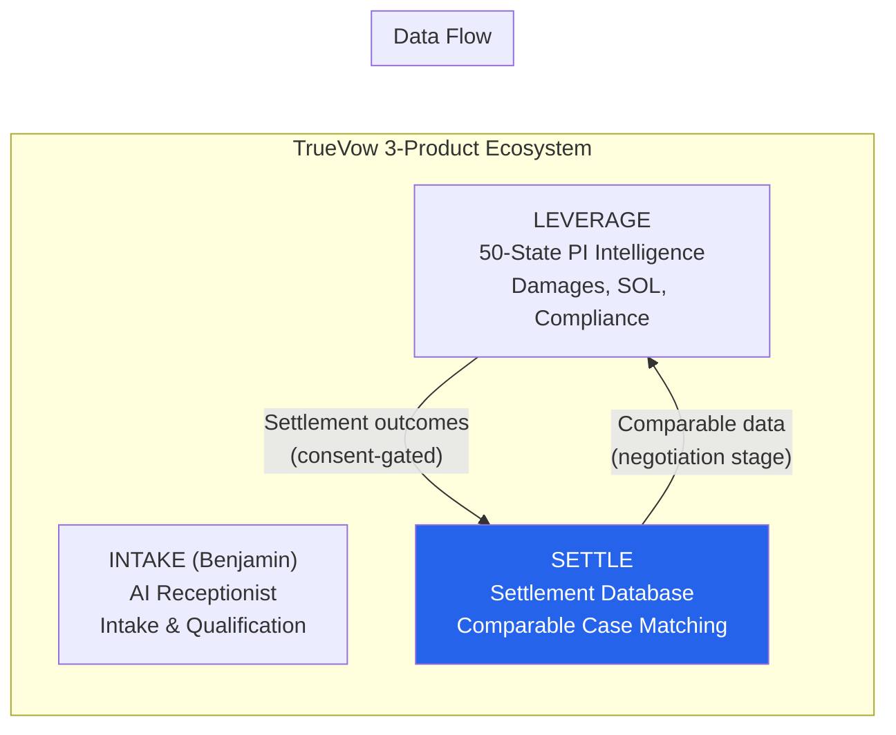
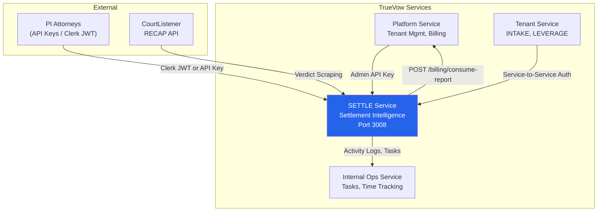
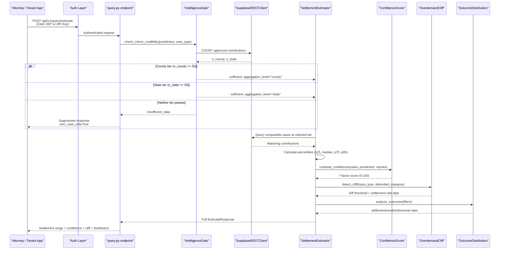
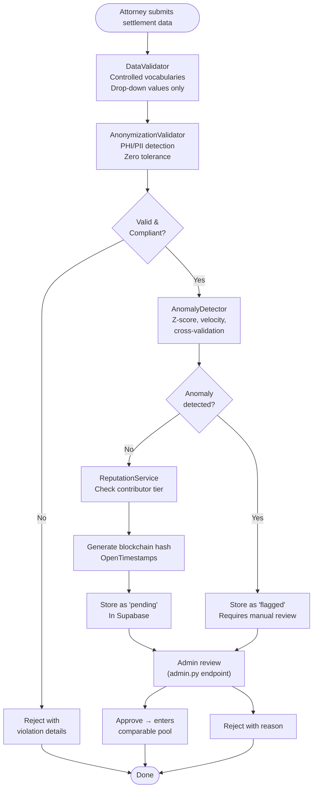
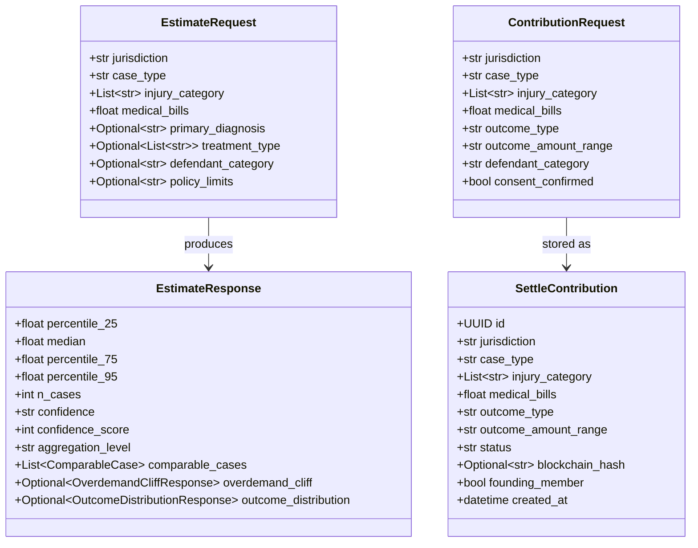
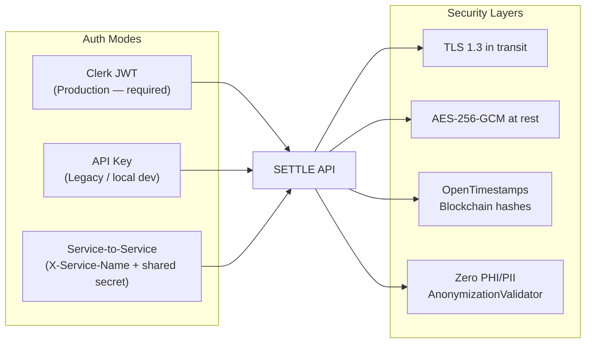
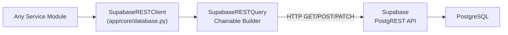

```mermaid
graph TB
    subgraph "Endpoints (app/api/v1/endpoints/)"
        QueryEP["query.py<br/>POST /estimate"]
        ContributeEP["contribute.py<br/>POST /contribute"]
        AdminEP["admin.py<br/>Contribution Review"]
        ReportsEP["reports.py<br/>PDF Generation"]
        CarrierEP["carrier_analytics.py<br/>Carrier Patterns"]
        TrendsEP["trend_reports.py<br/>Market Trends"]
        OverrideEP["override_tracking.py<br/>Accuracy Tracking"]
        VerdictsEP["verdicts.py<br/>Internal Verdict Search"]
        StatsEP["stats.py<br/>Public Stats"]
        WaitlistEP["waitlist.py<br/>Waitlist Signup"]
    end

    subgraph "Core Services (app/services/)"
        Estimator["estimator.py"]
        Gate["intelligence_gate.py"]
        Confidence["confidence_score.py"]
        Cliff["overdemand_cliff.py"]
        Outcome["outcome_distribution.py"]
        Contributor["contributor.py"]
        Anonymizer["anonymizer.py"]
        Validator["validator.py"]
        Anomaly["anomaly_detector.py"]
        Reputation["reputation_service.py"]
        Carrier["carrier_patterns.py"]
        InjuryClassifier["injury_classifier/"]
        VerdictSearch["verdict_search.py"]
    end

    subgraph "Infrastructure (app/core/)"
        Config["config.py"]
        DB["database.py<br/>SupabaseRESTClient"]
        Auth["auth.py + service_auth.py"]
        Monitoring["monitoring.py<br/>Sentry"]
    end

    QueryEP --> Estimator
    Estimator --> Gate
    Estimator --> Confidence
    Estimator --> Cliff
    Estimator --> Outcome
    ContributeEP --> Contributor
    Contributor --> Validator
    Contributor --> Anonymizer
    Contributor --> Anomaly
    Contributor --> Reputation
    CarrierEP --> Carrier
    VerdictsEP --> VerdictSearch
    
    Estimator --> DB
    Gate --> DB
    Contributor --> DB
    Auth --> Config
```

# Project Overview

<cite>
**Referenced Files in This Document**
- [README.md](file://README.md)
- [app/main.py](file://app/main.py)
- [app/api/v1/router.py](file://app/api/v1/router.py)
- [app/api/v1/endpoints/query.py](file://app/api/v1/endpoints/query.py)
- [app/api/v1/endpoints/contribute.py](file://app/api/v1/endpoints/contribute.py)
- [app/api/v1/endpoints/admin.py](file://app/api/v1/endpoints/admin.py)
- [app/api/v1/endpoints/stats.py](file://app/api/v1/endpoints/stats.py)
- [app/api/v1/endpoints/waitlist.py](file://app/api/v1/endpoints/waitlist.py)
- [app/api/v1/endpoints/reports.py](file://app/api/v1/endpoints/reports.py)
- [app/api/v1/endpoints/carrier_analytics.py](file://app/api/v1/endpoints/carrier_analytics.py)
- [app/api/v1/endpoints/trend_reports.py](file://app/api/v1/endpoints/trend_reports.py)
- [app/api/v1/endpoints/override_tracking.py](file://app/api/v1/endpoints/override_tracking.py)
- [app/api/v1/endpoints/verdicts.py](file://app/api/v1/endpoints/verdicts.py)
- [app/services/estimator.py](file://app/services/estimator.py)
- [app/services/intelligence_gate.py](file://app/services/intelligence_gate.py)
- [app/services/confidence_score.py](file://app/services/confidence_score.py)
- [app/services/carrier_patterns.py](file://app/services/carrier_patterns.py)
- [app/services/outcome_distribution.py](file://app/services/outcome_distribution.py)
- [app/services/overdemand_cliff.py](file://app/services/overdemand_cliff.py)
- [app/services/override_tracking.py](file://app/services/override_tracking.py)
- [app/services/reputation_service.py](file://app/services/reputation_service.py)
- [app/services/anomaly_detector.py](file://app/services/anomaly_detector.py)
- [app/services/trend_reports.py](file://app/services/trend_reports.py)
- [app/services/weekly_digest.py](file://app/services/weekly_digest.py)
- [app/services/verdict_search.py](file://app/services/verdict_search.py)
- [app/services/contributor.py](file://app/services/contributor.py)
- [app/services/anonymizer.py](file://app/services/anonymizer.py)
- [app/services/validator.py](file://app/services/validator.py)
- [app/services/injury_classifier/engine.py](file://app/services/injury_classifier/engine.py)
- [app/services/billing/stripe_service.py](file://app/services/billing/stripe_service.py)
- [app/services/notifications/email_service.py](file://app/services/notifications/email_service.py)
- [app/services/reports/pdf_generator.py](file://app/services/reports/pdf_generator.py)
- [app/services/storage/s3_service.py](file://app/services/storage/s3_service.py)
- [app/services/integrations/platform/client.py](file://app/services/integrations/platform/client.py)
- [app/services/integrations/internal_ops/client.py](file://app/services/integrations/internal_ops/client.py)
- [app/models/case_bank.py](file://app/models/case_bank.py)
- [app/models/verdicts.py](file://app/models/verdicts.py)
- [app/models/api_keys.py](file://app/models/api_keys.py)
- [app/models/reports.py](file://app/models/reports.py)
- [app/models/waitlist.py](file://app/models/waitlist.py)
- [app/core/config.py](file://app/core/config.py)
- [app/core/database.py](file://app/core/database.py)
- [app/core/auth.py](file://app/core/auth.py)
- [app/core/service_auth.py](file://app/core/service_auth.py)
- [app/core/monitoring.py](file://app/core/monitoring.py)
- [DOCKET-Service/app/services/scraping/courtlistener_scraper.py](file://DOCKET-Service/app/services/scraping/courtlistener_scraper.py)
</cite>

## Table of Contents
1. [Introduction — What Is SETTLE?](#introduction--what-is-settle)
2. [TrueVow 3-Product Ecosystem](#truevow-3-product-ecosystem)
3. [Ideal Customer Profile (ICP)](#ideal-customer-profile-icp)
4. [Project Structure](#project-structure)
5. [Core Components](#core-components)
6. [Architecture Overview](#architecture-overview)
7. [Estimation Pipeline (Deep Dive)](#estimation-pipeline-deep-dive)
8. [Contribution Pipeline (Deep Dive)](#contribution-pipeline-deep-dive)
9. [Data Models](#data-models)
10. [Intelligence Services](#intelligence-services)
11. [DOCKET Sub-Service](#docket-sub-service)
12. [Authentication & Security](#authentication--security)
13. [Database Layer](#database-layer)
14. [Testing](#testing)
15. [Performance & Monitoring](#performance--monitoring)
16. [Troubleshooting Guide](#troubleshooting-guide)

## Introduction — What Is SETTLE?

SETTLE is TrueVow's **Settlement Intelligence Network** — a community-contributed settlement database that provides plaintiff PI attorneys with comparable case matching and settlement range estimates. It is **not** a predictive tool. All language is descriptive ("Historical data shows...") to maintain bar compliance across all 50 states.

Key capabilities:
- Instant settlement range estimates with hierarchical jurisdiction fallback
- Community-contributed data with strict anonymization (zero PHI/PII)
- Blockchain verification via OpenTimestamps
- 7-factor confidence scoring (0-100 scale)
- Overdemand cliff detection and outcome distribution analysis
- Carrier/defendant pattern analytics (plaintiff-side equivalent of SigmaSight/CLARA)
- Deterministic injury classification (zero LLM, zero non-determinism)
- Professional PDF reports with integrity verification
- 440+ approved contributions in the case bank
- 186 unit tests, 14 E2E tests — all passing

SETTLE operates as a **centralized shared service** outside tenant boundaries, serving both TrueVow customers and external partners via API keys and Clerk JWT authentication.

**Section sources**
- [README.md](file://README.md)
- [app/main.py:46-53](file://app/main.py#L46-L53)
- [app/services/estimator.py:1-9](file://app/services/estimator.py#L1-L9)

## TrueVow 3-Product Ecosystem

SETTLE is Product 3 in TrueVow's ecosystem, each serving a different stage of the PI attorney workflow:

| # | Product | Codename | What It Does |
|---|---------|----------|--------------|
| 1 | **INTAKE** | Benjamin | AI receptionist for PI attorneys — intake calls, qualification, scheduling |
| 2 | **LEVERAGE** | — | 50-state PI Case Intelligence — damages research, statutes of limitations, compliance rules |
| 3 | **SETTLE** | — | Community-contributed settlement data + comparable case matching |



**Critical data flow:** LEVERAGE settlement outcomes flow into SETTLE (consent-gated). SETTLE's comparable case data is consumed back by LEVERAGE during its negotiation stage. This creates a reinforcing data flywheel — more cases settled through LEVERAGE means better comparables in SETTLE.

**Section sources**
- [app/services/integrations/platform/client.py:1-27](file://app/services/integrations/platform/client.py#L1-L27)

## Ideal Customer Profile (ICP)

Understanding the ICP is critical to every design decision in this codebase:

- **Market size:** 50,435 PI firms in the US, ~20K addressable (solo practitioners + small firms)
- **Key insight:** Attorneys don't configure tools — SETTLE must work out-of-the-box with zero setup friction
- **Bar compliance:** Descriptive-not-predictive language everywhere. Never "AI predicts..." always "Historical data shows..."
- **Confidence labeling is critical:** Attorneys need to know *how reliable* an estimate is. The 7-factor confidence score, intelligence gate, and aggregation-level labels all exist for this reason
- **Defense already has this data:** Tools like SigmaSight and CLARA give the defense side settlement analytics. SETTLE is the plaintiff-side equivalent

## Project Structure

```
app/
  main.py                           # FastAPI entrypoint, lifespan, CORS, Sentry init
  api/v1/
    router.py                       # Route registration (public, auth, admin, internal)
    endpoints/
      query.py                      # POST /estimate — settlement range estimation
      contribute.py                 # POST /contribute — submit settlement data
      admin.py                      # Contribution review, founding member management
      stats.py                      # Public stats (no auth required)
      waitlist.py                   # Waitlist signup (no auth required)
      reports.py                    # PDF report generation
      carrier_analytics.py          # Defendant/carrier pattern analytics
      trend_reports.py              # Quarterly trend studies
      override_tracking.py          # Estimate vs actual outcome tracking
      verdicts.py                   # Internal-only verdict search (17 filters)
  services/
    estimator.py                    # Core estimation algorithm (percentile + gate)
    intelligence_gate.py            # "Never Sell Empty Dashboards" — n>=50 gate
    confidence_score.py             # 7-factor 0-100 confidence score
    carrier_patterns.py             # Defendant category settlement patterns
    outcome_distribution.py         # Historical outcome distribution analysis
    overdemand_cliff.py             # Demand cliff detection (settlement rate drop)
    override_tracking.py            # Estimate accuracy tracking over time
    reputation_service.py           # Per-attorney trust scoring (4 tiers)
    anomaly_detector.py             # Statistical anomaly detection (z-score, velocity)
    trend_reports.py                # Quarterly "State of Settlement" reports
    weekly_digest.py                # Automated email digests
    verdict_search.py               # 17-filter internal verdict search engine
    contributor.py                  # Contribution workflow orchestrator
    anonymizer.py                   # PHI/PII detection and enforcement
    validator.py                    # Data validation (drop-downs, completeness)
    injury_classifier/              # Deterministic injury tagging
      engine.py                     # Core classifier (zero LLM)
      rules.py                      # TagRule registry (patterns, exclusions)
      schema.py                     # InjuryClassification, InjuryTag models
      synth.py                      # Synthetic test data generation
      triggers.py                   # Co-occurrence enforcement rules
      version.py                    # CLASSIFIER_VERSION (semver)
    billing/stripe_service.py       # Stripe integration
    notifications/email_service.py  # Email sending (digest templates)
    reports/pdf_generator.py        # Professional PDF report generation
    integrations/
      platform/client.py            # SETTLE -> Billing Service (consume-report)
      internal_ops/client.py        # SETTLE -> Internal Ops (activity logs, tasks)
    storage/s3_service.py           # S3 report storage
  models/
    case_bank.py                    # Core Pydantic models (contributions, estimates)
    verdicts.py                     # Verdict search models (17 filters)
    api_keys.py                     # API key models
    reports.py                      # Report models
    waitlist.py                     # Waitlist models
  core/
    config.py                       # pydantic-settings, env vars, feature flags
    database.py                     # SupabaseRESTClient (custom httpx query builder)
    auth.py                         # API key + Clerk JWT authentication
    service_auth.py                 # Service-to-service authentication
    security.py                     # API key verification utilities
    monitoring.py                   # Sentry error tracking & performance monitoring
DOCKET-Service/                     # Separate sub-service
  app/services/scraping/
    courtlistener_scraper.py        # CourtListener RECAP API scraper
  app/services/docket_search.py     # Docket search/CRUD
  tests/                            # 23/24 tests passing
database/                           # Schemas, Alembic migrations
tests/                              # 186/186 unit tests + 14 E2E tests
docs/                               # API docs, schema docs, integration guides, architecture
```



**Diagram sources**
- [app/api/v1/router.py:1-27](file://app/api/v1/router.py#L1-L27)
- [app/services/estimator.py:24-31](file://app/services/estimator.py#L24-L31)
- [app/services/contributor.py:27-31](file://app/services/contributor.py#L27-L31)

## Core Components

### Router Organization (`app/api/v1/router.py`)

The API is organized into four tiers:

| Tier | Endpoints | Auth Required |
|------|-----------|---------------|
| **Public** | `/waitlist`, `/stats` | None |
| **Authenticated** | `/query`, `/contribute`, `/reports`, `/analytics`, `/trends` | API Key or Clerk JWT |
| **Admin** | `/admin`, `/admin-overrides` | Admin-level API key |
| **Internal** | `/internal` (verdicts) | Admin-only, not customer-facing |

### Service Layer (17+ Modules)

| Service | Purpose |
|---------|---------|
| `estimator.py` | Core percentile calculation with intelligence gate integration |
| `intelligence_gate.py` | Hierarchical n>=50 credibility gate (county -> state -> suppress) |
| `confidence_score.py` | 7-factor weighted confidence score (0-100, clamped 10-95) |
| `carrier_patterns.py` | Defendant category settlement pattern analytics |
| `outcome_distribution.py` | Historical outcome breakdown (settlement, verdict, dismissal rates) |
| `overdemand_cliff.py` | Identifies demand band where settlement rate drops >20% |
| `override_tracking.py` | Tracks estimate-vs-actual for accuracy improvement |
| `reputation_service.py` | Per-attorney trust score (4 tiers: unverified -> founding) |
| `anomaly_detector.py` | Z-score, velocity, and cross-validation anomaly detection |
| `trend_reports.py` | Quarterly "State of Settlement" market reports |
| `weekly_digest.py` | Automated email digests for active users |
| `verdict_search.py` | 17-filter internal verdict research engine |
| `contributor.py` | Contribution workflow orchestrator (validate -> anonymize -> hash -> store) |
| `anonymizer.py` | PHI/PII detection and enforcement |
| `validator.py` | Data validation against controlled vocabularies |
| `injury_classifier/` | Deterministic injury tagging engine (zero LLM) |
| `billing/stripe_service.py` | Stripe payment integration |

**Section sources**
- [app/api/v1/router.py:1-27](file://app/api/v1/router.py#L1-L27)
- [app/services/estimator.py:35-54](file://app/services/estimator.py#L35-L54)
- [app/services/intelligence_gate.py:1-58](file://app/services/intelligence_gate.py#L1-L58)
- [app/services/confidence_score.py:1-16](file://app/services/confidence_score.py#L1-L16)

## Architecture Overview

SETTLE is a centralized shared service in TrueVow's architecture. It communicates with other TrueVow services via authenticated HTTP calls:



Key architecture decisions:
- **Database:** `SupabaseRESTClient` — custom `httpx`-based REST client with chainable query builder. NOT asyncpg. NOT the official Supabase Python client.
- **Auth:** Dual-mode — Clerk JWT (production, `AUTH_MODE=clerk`) + API Key (legacy, `AUTH_MODE=local`). Production MUST use Clerk per TrueVow Security Contract v1.
- **Billing boundary:** SETTLE calls `POST /api/v1/billing/consume-report` on the Billing Service. SETTLE has ZERO knowledge of usage tables, pricing, or entitlements. It generates reports only.
- **Monitoring:** Sentry for error tracking + performance profiling (staging/production only)

**Diagram sources**
- [app/core/service_auth.py:34-40](file://app/core/service_auth.py#L34-L40)
- [app/services/integrations/platform/client.py:1-27](file://app/services/integrations/platform/client.py#L1-L27)
- [app/services/integrations/internal_ops/client.py:1-28](file://app/services/integrations/internal_ops/client.py#L1-L28)

## Estimation Pipeline (Deep Dive)

This is the most important flow in the system. Every settlement estimate passes through this pipeline:



### Intelligence Gate Rules

The Intelligence Gate is the "Never Sell Empty Dashboards" guardrail. It is a **hard gate**, not a soft confidence downgrade.

| Tier | Condition | Result | Aggregation Label |
|------|-----------|--------|-------------------|
| County | `n_county >= 50` | Pass — use county-specific pool | `"county"` |
| State | `n_state >= 50` | Pass — use statewide + sentinel pool | `"state"` |
| Suppressed | Neither tier passes | Block all aggregate widgets | N/A |

When suppressed, the following features are blocked (authoritative list from `intelligence_gate.py`):
- `insurer_pattern_insights` — carrier lowball analysis
- `defense_firm_behavior` — defense firm settlement history
- `venue_analytics` — county-level outcome patterns
- `percentile_ranges` — p25/median/p75/p95 tables
- `time_to_resolution_trend` — resolution-days histograms
- `policy_limit_distribution` — policy-limit bucket charts
- `litigation_vs_settlement_roi` — ROI modeling

There is **no multiplier fallback**. Synthesizing ranges from sub-threshold data is the exact anti-pattern this gate exists to prevent.

### Confidence Score Factors

The confidence score is a customer-facing 0-100 score (clamped 10-95) composed of 7 weighted factors:

| Factor | Weight | What It Measures |
|--------|--------|------------------|
| Comp set depth | 20% | n>=50 full credit, n>=20 partial, n<20 suppressed |
| Reputation distribution | 15% | Average contributor trust score |
| Jurisdiction coverage | 15% | County vs state vs sentinel aggregation |
| Injury type specificity | 15% | Tag match depth between query and comparables |
| Data recency | 10% | Days since last submission in cohort |
| Outlier rate | 15% | Percentage of cases flagged as anomalies |
| Completeness | 10% | Required field fill rate in comparable set |

**Section sources**
- [app/services/estimator.py:35-54](file://app/services/estimator.py#L35-L54)
- [app/services/intelligence_gate.py:1-58](file://app/services/intelligence_gate.py#L1-L58)
- [app/services/confidence_score.py:1-16](file://app/services/confidence_score.py#L1-L16)
- [app/api/v1/endpoints/query.py:20-50](file://app/api/v1/endpoints/query.py#L20-L50)

## Contribution Pipeline (Deep Dive)

When an attorney submits settlement data, it passes through a multi-stage integrity pipeline:



### Reputation Tiers

The reputation service assigns per-attorney trust scores that affect how submissions are weighted and routed:

| Tier | Score Range | Behavior |
|------|------------|----------|
| `unverified` | 0.00 – 0.15 | Held for review, no aggregate access |
| `probationary` | 0.15 – 0.35 | Auto-approved after 24h delay, basic access |
| `trusted` | 0.35 – 0.65 | Immediate approval, full access, higher weight |
| `founding` | 0.65 – 1.00 | Immediate approval, highest weight, peer flag immunity |

Formula: `reputation = base_weight(0.3) + verification_weight(0.4) + consistency_weight(0.3)`

### Anomaly Detection

Real-time per-submission checks AND nightly batch processing:
- **Z-score outliers:** Warning at z >= 2.0, critical at z >= 3.0
- **Medical bills ratio:** Flags if outcome > 50x medical bills or < 0.5x
- **Velocity checks:** Warning at 5 submissions/day, critical at 10/day
- **Cross-validation:** Checks against scraped verdict data for consistency

**Section sources**
- [app/services/contributor.py:35-47](file://app/services/contributor.py#L35-L47)
- [app/services/reputation_service.py:1-16](file://app/services/reputation_service.py#L1-L16)
- [app/services/anomaly_detector.py:1-40](file://app/services/anomaly_detector.py#L1-L40)
- [app/services/anonymizer.py](file://app/services/anonymizer.py)

## Data Models

Core Pydantic models are in `app/models/case_bank.py`:



**Section sources**
- [app/models/case_bank.py:15-60](file://app/models/case_bank.py#L15-L60)

## Intelligence Services

### Injury Classifier (`app/services/injury_classifier/`)

A fully deterministic, zero-LLM injury tagging engine:

- **`engine.py`** — Core algorithm: scan narrative against TagRule registry, apply exclusions, calculate confidence from fixed schedule
- **`rules.py`** — Pattern registry: strong patterns (high confidence), contextual patterns (lower), exclusion patterns (disqualify)
- **`schema.py`** — `InjuryClassification`, `InjuryTag` output models with full provenance
- **`triggers.py`** — Co-occurrence enforcement (e.g., "TBI" requires "head" context)
- **`version.py`** — Semver `CLASSIFIER_VERSION` — must be bumped on any rule change

Confidence schedule (deterministic):
| Match Type | Confidence |
|------------|------------|
| 2+ strong patterns | 0.99 |
| 1 strong pattern | 0.95 |
| 3+ contextual patterns | 0.80 |
| 2 contextual patterns | 0.70 |
| 1 contextual pattern | 0.60 |

### Carrier Pattern Analytics

Plaintiff-side equivalent of defense tools (SigmaSight, CLARA). Analyzes settlement patterns by defendant category (Individual/Business/Government/Unknown) and industry sub-category. Carrier names are NOT stored (PHI risk) — only categories.

### Overdemand Cliff Detection

Identifies the demand amount above which settlement rate drops >20%. Groups historical cases by injury type + defendant category, calculates settlement rate per outcome bucket, finds the cliff. All output is descriptive framing only.

### Trend Reports

Quarterly "State of Settlement" reports: by injury type, by state, by carrier category. Used for marketing, retention, attorney education. Descriptive statistics only.

### Override Tracking

Tracks when actual settlement outcomes differ from SETTLE's estimates. Captures `delta_pct` and `delta_direction` for continuous accuracy improvement.

**Section sources**
- [app/services/injury_classifier/engine.py:1-40](file://app/services/injury_classifier/engine.py#L1-L40)
- [app/services/carrier_patterns.py:1-12](file://app/services/carrier_patterns.py#L1-L12)
- [app/services/overdemand_cliff.py:1-12](file://app/services/overdemand_cliff.py#L1-L12)
- [app/services/trend_reports.py:1-13](file://app/services/trend_reports.py#L1-L13)
- [app/services/override_tracking.py:1-6](file://app/services/override_tracking.py#L1-L6)

## DOCKET Sub-Service

`DOCKET-Service/` is a separate FastAPI application within this repo that scrapes public court data:

- **Source:** CourtListener RECAP API (`https://www.courtlistener.com/api/rest/v4`)
- **Purpose:** Populates the internal verdict database (`settle_verdicts` table) with scraped docket/opinion data for cross-validation against community-contributed settlements
- **Modules:**
  - `app/services/scraping/courtlistener_scraper.py` — API client for CourtListener
  - `app/services/docket_search.py` — CRUD operations for docket records
  - `app/api/v1/endpoints/dockets.py` — REST endpoints for docket access
- **Tests:** 23/24 tests passing (separate test suite)

The verdict data scraped by DOCKET feeds into `verdict_search.py` (17-filter internal search) and the anomaly detector's cross-validation checks.

**Section sources**
- [DOCKET-Service/app/services/scraping/courtlistener_scraper.py:1-30](file://DOCKET-Service/app/services/scraping/courtlistener_scraper.py#L1-L30)

## Authentication & Security



- **`app/core/auth.py`** — `APIKeyAuth` dependency with access level enforcement (admin, founding_member, etc.)
- **`app/core/service_auth.py`** — `ServiceAuth` dependency for service-to-service calls. Authorized services: `truevow-platform-service`, `truevow-internal-ops-service`, `truevow-sales-service`, `truevow-support-service`, `truevow-tenant-service`
- **`app/core/config.py`** — `AUTH_MODE` setting: must be `"clerk"` in production per TrueVow Security Contract v1. `PERMISSION_FAIL_OPEN` is only true in dev.

**Section sources**
- [app/core/auth.py:19-40](file://app/core/auth.py#L19-L40)
- [app/core/service_auth.py:20-40](file://app/core/service_auth.py#L20-L40)
- [app/core/config.py:47-50](file://app/core/config.py#L47-L50)

## Database Layer

SETTLE uses a **custom `SupabaseRESTClient`** built on `httpx`. This is NOT asyncpg, NOT the official Supabase Python client.



Query builder supports chainable methods:
```
db.table("settle_contributions")
  .select("*", count="exact")
  .eq("status", "approved")
  .eq("case_type", "Motor Vehicle Accident")
  .ilike("jurisdiction", "%FL%")
  .order("created_at", desc=True)
  .limit(100)
  .execute()
```

Key tables: `settle_contributions` (440+ approved), `settle_verdicts`, `settle_api_keys`, `settle_reports`, `settle_waitlist`

Migrations managed via Alembic in `database/` directory.

**Section sources**
- [app/core/database.py:1-60](file://app/core/database.py#L1-L60)

## Testing

| Suite | Count | Status |
|-------|-------|--------|
| Unit tests (`tests/`) | 186 | All passing |
| E2E tests | 14 | All passing |
| DOCKET-Service tests | 23/24 | 23 passing |

**Section sources**
- Test files in `tests/` directory

## Performance & Monitoring

- **Response target:** <1 second for settlement estimates (p95)
- **Sentry integration:** Enabled for staging/production (`app/core/monitoring.py`). Traces sample rate: 10% production, 50% staging. Profile sample rate: 10%.
- **Feature flags:** Environment variables control expensive operations (PDF generation, blockchain verification, pilot-mode gate overrides)
- **Database indexing:** Optimized for jurisdiction, case_type, and status filters via Supabase/PostgreSQL indexes

**Section sources**
- [app/main.py:22-31](file://app/main.py#L22-L31)
- [app/core/monitoring.py:14-30](file://app/core/monitoring.py#L14-L30)

## Troubleshooting Guide

| Issue | Likely Cause | Fix |
|-------|-------------|-----|
| `insufficient_data` on every estimate | Intelligence gate — cohort has <50 approved cases for jurisdiction + case_type | Verify case bank has enough data for the jurisdiction. Check with `stats` endpoint. |
| Auth 401 errors | `AUTH_MODE` mismatch — production requires `clerk`, dev uses `local` | Check `AUTH_MODE` in `.env.local`. Verify Clerk JWT is valid. |
| Service-to-service 403 | Missing `X-Service-Name` header or unrecognized service name | Ensure calling service is in `ServiceAuth.AUTHORIZED_SERVICES` list |
| Contribution rejected | Anonymization violation (PHI/PII detected) or invalid drop-down value | Check `AnonymizationValidator` rules. Use only controlled vocabulary values. |
| Anomaly flagged | Z-score > 2.0, velocity > 5/day, or medical bills ratio outside 0.5x-50x | Review the contribution data. Flagged items require admin approval. |
| Database connection errors | `SupabaseRESTClient` can't reach PostgREST API | Verify `SUPABASE_URL` and `SUPABASE_SERVICE_ROLE_KEY` in `.env.local` |
| Confidence score seems low | One or more of the 7 factors is dragging the score down | Check individual factor breakdown in the response — identify which factor is weak |
| PDF reports fail | S3 credentials or Billing Service authorization failure | Verify S3 config. Check that `POST /billing/consume-report` returns `authorized=true`. |
