# Technology Stack

<cite>
**Referenced Files in This Document**
- [requirements.txt](file://requirements.txt)
- [package.json](file://frontend/package.json)
- [alembic.ini](file://alembic.ini)
- [env.template](file://env.template)
- [app/main.py](file://app/main.py)
- [app/core/config.py](file://app/core/config.py)
- [app/core/database.py](file://app/core/database.py)
- [app/api/v1/router.py](file://app/api/v1/router.py)
- [frontend/tailwind.config.js](file://frontend/tailwind.config.js)
- [frontend/postcss.config.js](file://frontend/postcss.config.js)
- [app/services/reports/pdf_generator.py](file://app/services/reports/pdf_generator.py)
- [app/services/storage/s3_service.py](file://app/services/storage/s3_service.py)
- [app/services/integrations/platform/client.py](file://app/services/integrations/platform/client.py)
- [app/core/monitoring.py](file://app/core/monitoring.py)
- [database/FIXES_APPLIED.md](file://database/FIXES_APPLIED.md)
</cite>

## Table of Contents
1. [Introduction](#introduction)
2. [Project Structure](#project-structure)
3. [Core Technologies](#core-technologies)
4. [Architecture Overview](#architecture-overview)
5. [Detailed Component Analysis](#detailed-component-analysis)
6. [Dependency Analysis](#dependency-analysis)
7. [Performance Considerations](#performance-considerations)
8. [Troubleshooting Guide](#troubleshooting-guide)
9. [Conclusion](#conclusion)
10. [Appendices](#appendices)

## Introduction
This document describes the technology stack powering the SETTLE Service, focusing on backend and frontend frameworks, database and migration tooling, external dependencies for blockchain verification, PDF generation, and error tracking, along with version compatibility, development dependencies, and production deployment considerations. The stack emphasizes legal technology needs: bar-compliant data handling, auditability, and transparency.

## Project Structure
The repository is organized into:
- Backend: FastAPI application under app/, with routers, services, core modules, and database utilities
- Frontend: Next.js application under frontend/ with React and Tailwind CSS
- Database: Alembic migrations under alembic/, SQL schemas and setup guides under database/
- Scripts and tests: Under scripts/ and tests/ for operational tasks and validation
- Dependencies: Declared in requirements.txt (backend) and frontend/package.json (frontend)

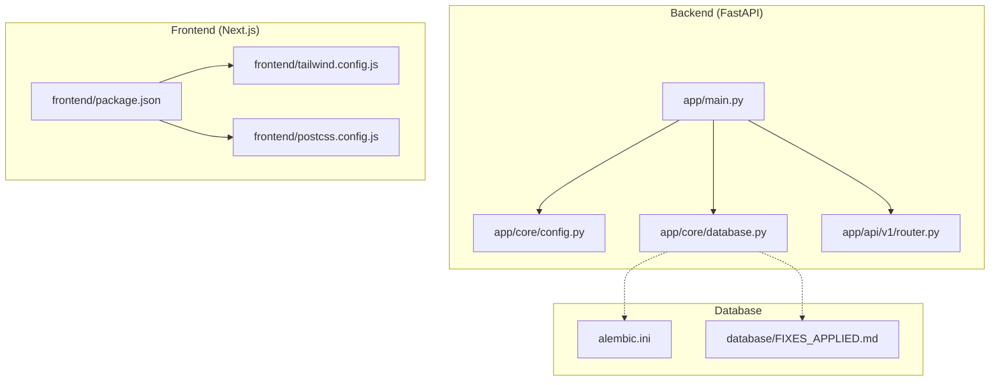

**Diagram sources**
- [app/main.py:1-157](file://app/main.py#L1-L157)
- [app/core/config.py:1-351](file://app/core/config.py#L1-L351)
- [app/core/database.py:1-549](file://app/core/database.py#L1-L549)
- [app/api/v1/router.py:1-26](file://app/api/v1/router.py#L1-L26)
- [frontend/package.json:1-26](file://frontend/package.json#L1-L26)
- [frontend/tailwind.config.js:1-30](file://frontend/tailwind.config.js#L1-L30)
- [frontend/postcss.config.js:1-6](file://frontend/postcss.config.js#L1-L6)
- [alembic.ini:1-117](file://alembic.ini#L1-L117)
- [database/FIXES_APPLIED.md:1-319](file://database/FIXES_APPLIED.md#L1-L319)

**Section sources**
- [app/main.py:1-157](file://app/main.py#L1-L157)
- [app/api/v1/router.py:1-26](file://app/api/v1/router.py#L1-L26)
- [frontend/package.json:1-26](file://frontend/package.json#L1-L26)
- [alembic.ini:1-117](file://alembic.ini#L1-L117)
- [database/FIXES_APPLIED.md:1-319](file://database/FIXES_APPLIED.md#L1-L319)

## Core Technologies
- Web Framework: FastAPI 0.115.6
- Data Validation: Pydantic 2.10.4
- Database ORM and Connectivity: SQLAlchemy 2.0.36
- Migration Management: Alembic 1.14.0
- Database Provider: Supabase (PostgreSQL)
- Frontend: Next.js, React, Tailwind CSS
- External Dependencies:
  - OpenTimestamps 0.3.0 for blockchain verification
  - WeasyPrint 63.1 for PDF generation
  - Sentry SDK 2.19.2 for error tracking and performance monitoring
- Development Dependencies:
  - pytest 8.3.4, pytest-asyncio 0.24.0
  - TypeScript, PostCSS, Autoprefixer, Tailwind CSS

Version compatibility is explicitly declared in requirements.txt and frontend/package.json. The backend leverages Pydantic Settings 2.7.0 for environment-driven configuration, and the frontend uses Next.js 14 with React 18 and Tailwind 3.3.

**Section sources**
- [requirements.txt:1-53](file://requirements.txt#L1-L53)
- [frontend/package.json:1-26](file://frontend/package.json#L1-L26)
- [app/core/config.py:1-351](file://app/core/config.py#L1-L351)

## Architecture Overview
The SETTLE Service follows a modular backend built on FastAPI, with a Supabase-backed data layer and optional external integrations. The frontend is a Next.js application styled with Tailwind CSS. Monitoring integrates Sentry for error tracking and performance insights.

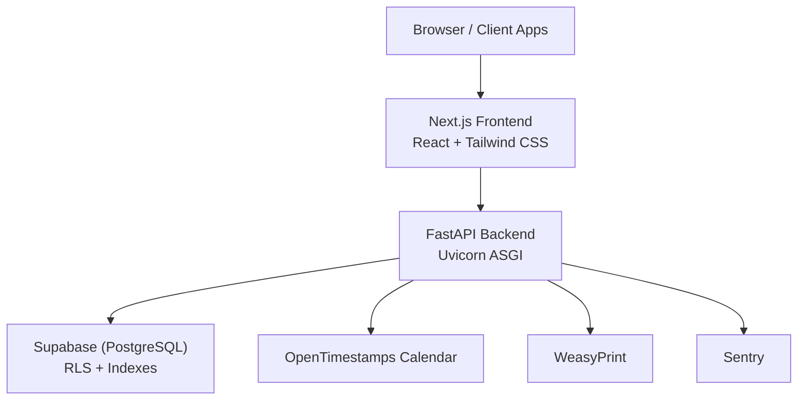

**Diagram sources**
- [app/main.py:102-157](file://app/main.py#L102-L157)
- [app/core/database.py:412-549](file://app/core/database.py#L412-L549)
- [app/services/reports/pdf_generator.py:18-86](file://app/services/reports/pdf_generator.py#L18-L86)
- [app/core/monitoring.py:14-83](file://app/core/monitoring.py#L14-L83)
- [env.template:115-128](file://env.template#L115-L128)

## Detailed Component Analysis

### Backend Application (FastAPI)
- Application lifecycle and middleware:
  - Request ID middleware for tracing
  - CORS configuration
  - Service registry integration and heartbeat
  - Sentry initialization in staging/production
- Root and health endpoints
- API routing under /api/v1 with public, authenticated, admin, and webhook endpoints

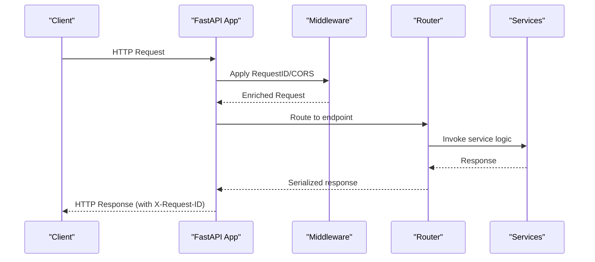

**Diagram sources**
- [app/main.py:121-135](file://app/main.py#L121-L135)
- [app/api/v1/router.py:5-26](file://app/api/v1/router.py#L5-L26)

**Section sources**
- [app/main.py:1-157](file://app/main.py#L1-L157)
- [app/api/v1/router.py:1-26](file://app/api/v1/router.py#L1-L26)

### Configuration and Environment
- Settings class loads environment variables with support for both SETTLE_ prefixed and unprefixed names
- Database abstraction supports multiple providers via unified keys
- Feature flags enable/disable PDF generation, blockchain verification, and notifications
- Monitoring and rate limiting configurations

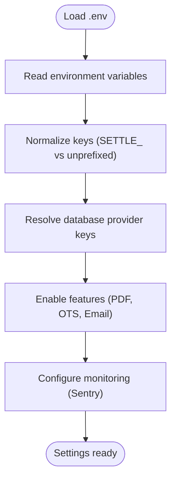

**Diagram sources**
- [app/core/config.py:23-349](file://app/core/config.py#L23-L349)

**Section sources**
- [app/core/config.py:1-351](file://app/core/config.py#L1-L351)
- [env.template:1-201](file://env.template#L1-L201)

### Database Layer and Supabase Integration
- REST client abstraction for Supabase avoids client dependency issues
- Query builders emulate Supabase client APIs using httpx
- Retry decorator and health checks
- Provider-agnostic configuration supports both direct PostgreSQL and Supabase REST URLs

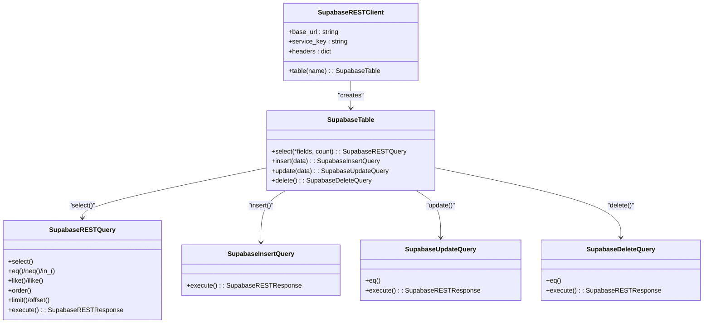

**Diagram sources**
- [app/core/database.py:220-372](file://app/core/database.py#L220-L372)

**Section sources**
- [app/core/database.py:1-549](file://app/core/database.py#L1-L549)
- [database/FIXES_APPLIED.md:33-72](file://database/FIXES_APPLIED.md#L33-L72)

### PDF Generation Service (WeasyPrint)
- Generates 4-page settlement reports with charts, tables, methodology, and compliance sections
- QR code embedding for OpenTimestamps verification
- Fallback to mock PDF when WeasyPrint unavailable

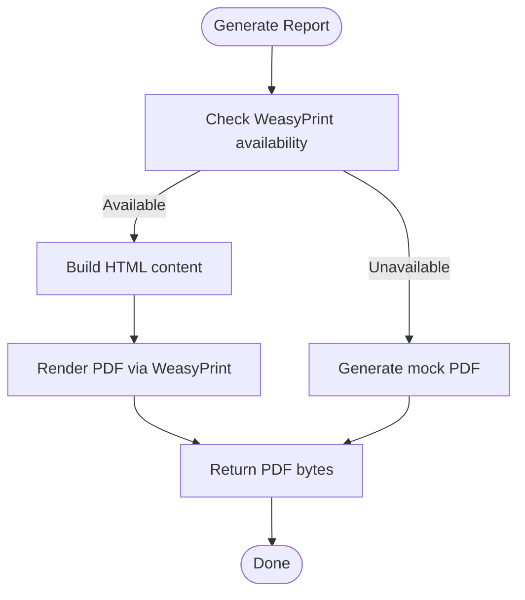

**Diagram sources**
- [app/services/reports/pdf_generator.py:18-86](file://app/services/reports/pdf_generator.py#L18-L86)

**Section sources**
- [app/services/reports/pdf_generator.py:1-622](file://app/services/reports/pdf_generator.py#L1-L622)

### Storage Service (AWS S3)
- Uploads, presigned URL generation, deletion, and cleanup of expired reports
- Uses boto3 with encryption at rest and standardized storage class

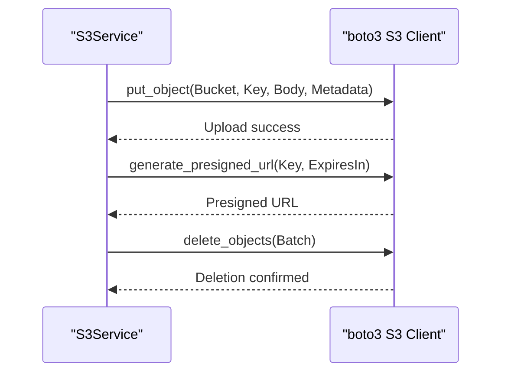

**Diagram sources**
- [app/services/storage/s3_service.py:60-182](file://app/services/storage/s3_service.py#L60-L182)

**Section sources**
- [app/services/storage/s3_service.py:1-317](file://app/services/storage/s3_service.py#L1-L317)

### Monitoring and Error Tracking (Sentry)
- Initializes Sentry with FastAPI and Starlette integrations
- Filters sensitive data before sending to Sentry
- Provides helpers to capture exceptions and messages with context

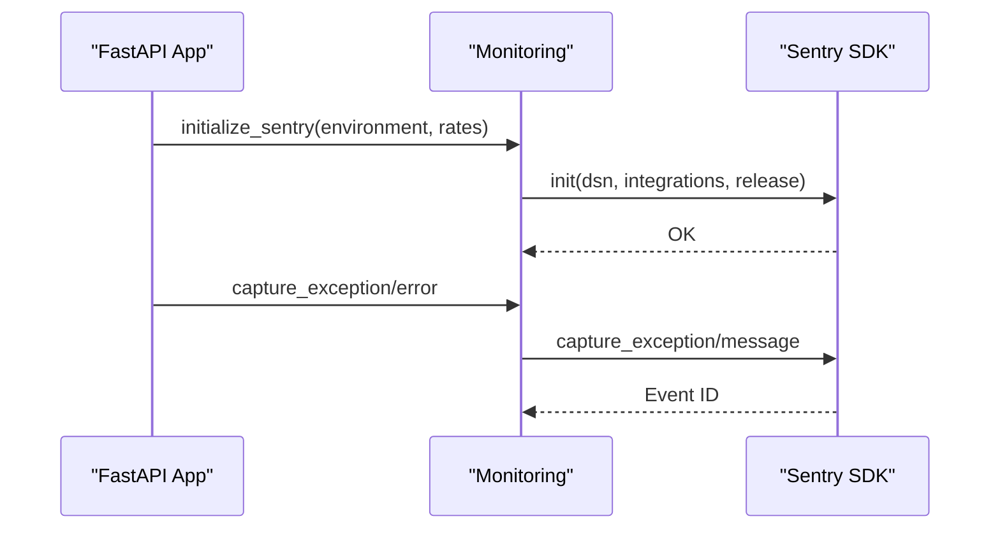

**Diagram sources**
- [app/core/monitoring.py:14-83](file://app/core/monitoring.py#L14-L83)
- [app/main.py:31-40](file://app/main.py#L31-L40)

**Section sources**
- [app/core/monitoring.py:1-306](file://app/core/monitoring.py#L1-L306)
- [app/main.py:1-50](file://app/main.py#L1-L50)

### Frontend Stack (Next.js, React, Tailwind CSS)
- Next.js 14 with React 18
- Tailwind CSS 3.3 with PostCSS and Autoprefixer
- TypeScript support

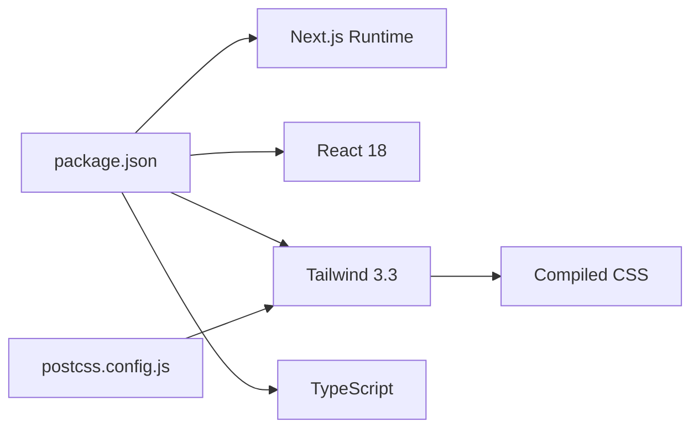

**Diagram sources**
- [frontend/package.json:1-26](file://frontend/package.json#L1-L26)
- [frontend/tailwind.config.js:1-30](file://frontend/tailwind.config.js#L1-L30)
- [frontend/postcss.config.js:1-6](file://frontend/postcss.config.js#L1-L6)

**Section sources**
- [frontend/package.json:1-26](file://frontend/package.json#L1-L26)
- [frontend/tailwind.config.js:1-30](file://frontend/tailwind.config.js#L1-L30)
- [frontend/postcss.config.js:1-6](file://frontend/postcss.config.js#L1-L6)

### External Integrations
- Platform Service client for usage reporting, API key synchronization, and tenant info retrieval
- Integration adheres to service-to-service contract and timeouts

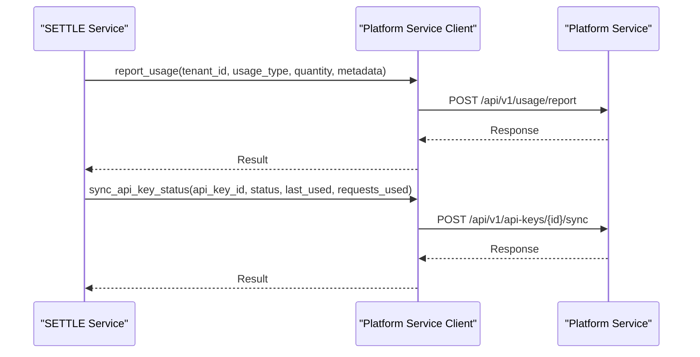

**Diagram sources**
- [app/services/integrations/platform/client.py:34-123](file://app/services/integrations/platform/client.py#L34-L123)

**Section sources**
- [app/services/integrations/platform/client.py:1-146](file://app/services/integrations/platform/client.py#L1-L146)

## Dependency Analysis
- Backend dependencies pinned in requirements.txt include FastAPI, Uvicorn, Pydantic, SQLAlchemy, Alembic, Supabase, OpenTimestamps, WeasyPrint, Sentry, boto3, Stripe, and testing libraries
- Frontend dependencies pinned in package.json include Next.js, React, Tailwind CSS, and dev dependencies for TypeScript tooling
- Alembic configuration points to Supabase connection string and logging configuration

```mermaid
graph TB
R["requirements.txt"]
P["frontend/package.json"]
A["alembic.ini"]
R --> FastAPI["fastapi==0.115.6"]
R --> Uvicorn["uvicorn[standard]==0.34.0"]
R --> Pydantic["pydantic==2.10.4"]
R --> SQLAlchemy["sqlalchemy==2.0.36"]
R --> Alembic["alembic==1.14.0"]
R --> Supabase["supabase>=2.15.0"]
R --> OTS["opentimestamps==0.3.0"]
R --> WeasyPrint["weasyprint==63.1"]
R --> Sentry["sentry-sdk[fastapi]==2.19.2"]
R --> Boto3["boto3==1.35.99"]
R --> Stripe["stripe==11.3.0"]
R --> Pytest["pytest==8.3.4"]
P --> Next["next==^14.0.0"]
P --> React["react==^18.2.0"]
P --> Tailwind["tailwindcss==^3.3.0"]
A --> DBURL["sqlalchemy.url = postgresql://..."]
```

**Diagram sources**
- [requirements.txt:1-53](file://requirements.txt#L1-L53)
- [frontend/package.json:1-26](file://frontend/package.json#L1-L26)
- [alembic.ini:63-63](file://alembic.ini#L63-L63)

**Section sources**
- [requirements.txt:1-53](file://requirements.txt#L1-L53)
- [frontend/package.json:1-26](file://frontend/package.json#L1-L26)
- [alembic.ini:1-117](file://alembic.ini#L1-L117)

## Performance Considerations
- Database pooling and overflow are configurable via environment variables
- Query caching and TTL are supported via feature flags and settings
- PDF generation and S3 operations include timeouts and fallbacks
- Monitoring sampling rates can be tuned per environment

[No sources needed since this section provides general guidance]

## Troubleshooting Guide
- Database connectivity:
  - Verify Supabase credentials and URL resolution logic
  - Use health check endpoint and database health checker
- PDF generation:
  - Confirm WeasyPrint installation; fallback to mock PDF when unavailable
- Monitoring:
  - Ensure Sentry DSN is configured; review before-send filtering for compliance
- Frontend build:
  - Confirm Tailwind content paths and PostCSS/Autoprefixer configuration

**Section sources**
- [app/core/database.py:509-539](file://app/core/database.py#L509-L539)
- [app/services/reports/pdf_generator.py:29-40](file://app/services/reports/pdf_generator.py#L29-L40)
- [app/core/monitoring.py:30-82](file://app/core/monitoring.py#L30-L82)
- [frontend/tailwind.config.js:1-30](file://frontend/tailwind.config.js#L1-L30)
- [frontend/postcss.config.js:1-6](file://frontend/postcss.config.js#L1-L6)

## Conclusion
The SETTLE Service employs a modern, secure, and compliant technology stack tailored for legal technology. FastAPI and Pydantic deliver robust APIs with strong validation; SQLAlchemy and Alembic manage database operations and migrations; Supabase provides a secure, RLS-enabled PostgreSQL backend. External integrations for blockchain verification, PDF generation, and error tracking align with bar compliance and transparency requirements. The frontend stack ensures maintainable UI development with Next.js and Tailwind CSS.

[No sources needed since this section summarizes without analyzing specific files]

## Appendices

### Version Compatibility and Requirements
- Backend:
  - FastAPI 0.115.6, Uvicorn 0.34.0
  - Pydantic 2.10.4, Pydantic Settings 2.7.0
  - SQLAlchemy 2.0.36, Alembic 1.14.0, asyncpg 0.30.0, psycopg2-binary 2.9.10
  - Supabase 2.15.0+
  - OpenTimestamps 0.3.0, WeasyPrint 63.1, Sentry SDK 2.19.2
  - boto3 1.35.99, stripe 11.3.0
  - pytest 8.3.4, pytest-asyncio 0.24.0
- Frontend:
  - Next.js 14, React 18, Tailwind CSS 3.3, TypeScript 5

**Section sources**
- [requirements.txt:1-53](file://requirements.txt#L1-L53)
- [frontend/package.json:1-26](file://frontend/package.json#L1-L26)

### Database Schema and Supabase Setup
- Production-ready schema with table prefixes, RLS, indexes, constraints, views, and triggers
- Central user references to avoid duplication
- Setup guide and validation scripts included

**Section sources**
- [database/FIXES_APPLIED.md:33-72](file://database/FIXES_APPLIED.md#L33-L72)
- [database/FIXES_APPLIED.md:165-207](file://database/FIXES_APPLIED.md#L165-L207)