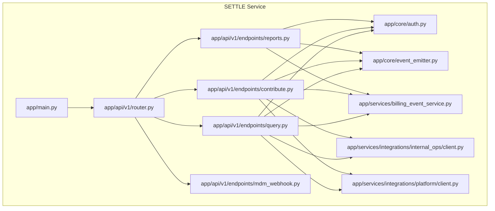
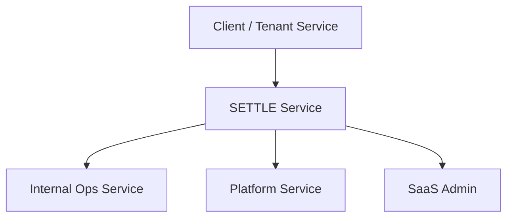
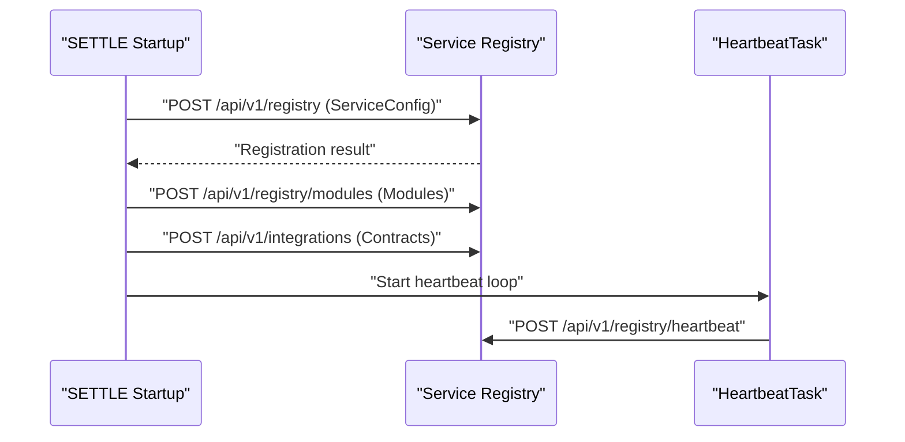
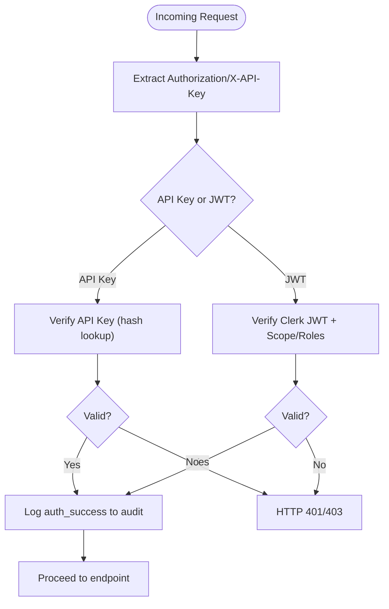
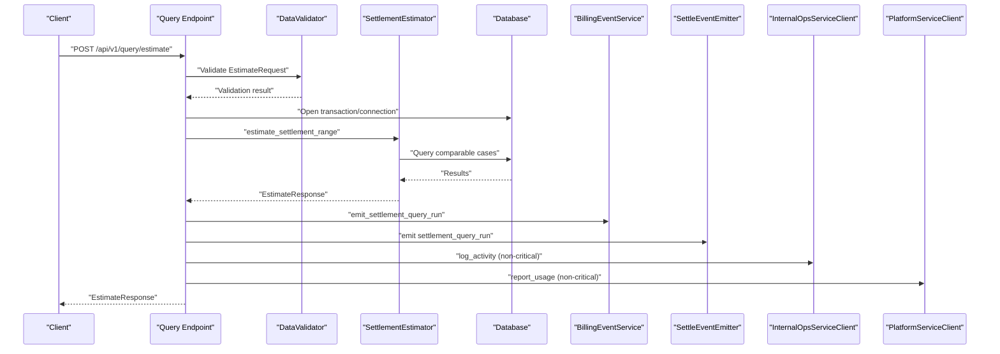
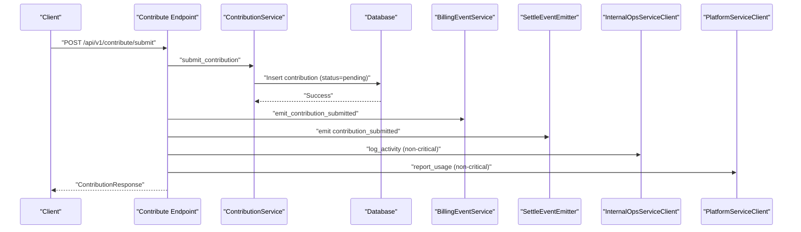
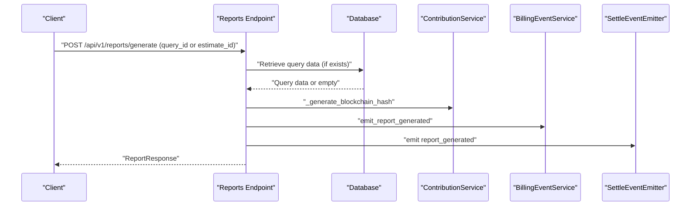
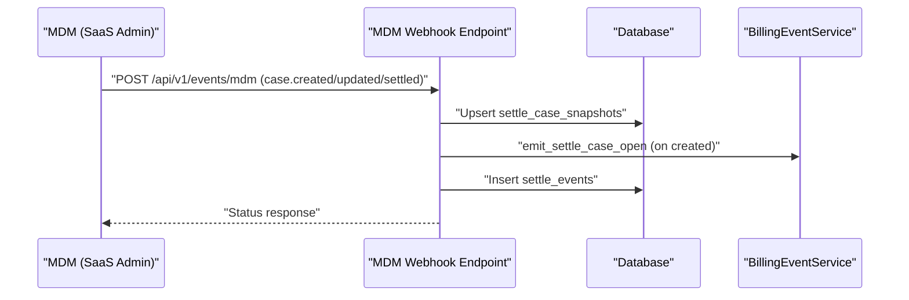
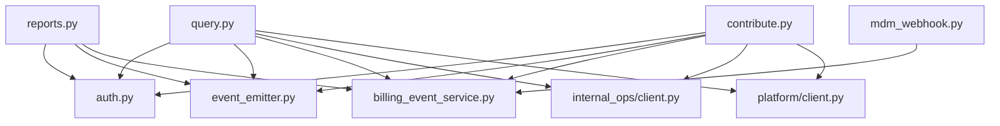

# Cross-Service Workflows

<cite>
**Referenced Files in This Document**
- [app/main.py](file://app/main.py)
- [app/core/service_registry.py](file://app/core/service_registry.py)
- [app/api/v1/router.py](file://app/api/v1/router.py)
- [app/api/v1/endpoints/query.py](file://app/api/v1/endpoints/query.py)
- [app/api/v1/endpoints/contribute.py](file://app/api/v1/endpoints/contribute.py)
- [app/api/v1/endpoints/reports.py](file://app/api/v1/endpoints/reports.py)
- [app/api/v1/endpoints/mdm_webhook.py](file://app/api/v1/endpoints/mdm_webhook.py)
- [app/services/billing_event_service.py](file://app/services/billing_event_service.py)
- [app/services/integrations/internal_ops/client.py](file://app/services/integrations/internal_ops/client.py)
- [app/services/integrations/platform/client.py](file://app/services/integrations/platform/client.py)
- [app/core/event_emitter.py](file://app/core/event_emitter.py)
- [app/core/auth.py](file://app/core/auth.py)
- [app/models/case_bank.py](file://app/models/case_bank.py)
- [docs/INTEGRATION_GUIDE.md](file://docs/INTEGRATION_GUIDE.md)
- [docs/architecture/SETTLE_ADMIN_ARCHITECTURE.md](file://docs/architecture/SETTLE_ADMIN_ARCHITECTURE.md)
- [tests/integration/week_16_integration_tests.py](file://tests/integration/week_16_integration_tests.py)
</cite>

## Table of Contents
1. [Introduction](#introduction)
2. [Project Structure](#project-structure)
3. [Core Components](#core-components)
4. [Architecture Overview](#architecture-overview)
5. [Detailed Component Analysis](#detailed-component-analysis)
6. [Dependency Analysis](#dependency-analysis)
7. [Performance Considerations](#performance-considerations)
8. [Troubleshooting Guide](#troubleshooting-guide)
9. [Conclusion](#conclusion)
10. [Appendices](#appendices)

## Introduction
This document explains the end-to-end workflows spanning multiple TrueVow services and their integration patterns. It focuses on:
- Tenant onboarding workflows and service activation
- Cross-service data flows among SETTLE, Internal Ops, Platform, and SaaS Admin
- Integration contracts between SETTLE, Internal Ops, and Platform services
- Workflow diagrams showing service interactions, data transformations, and error propagation
- Coordination mechanisms, state management, and audit trail requirements
- Monitoring, debugging techniques, and failure recovery strategies for distributed operations

## Project Structure
The SETTLE service is a FastAPI application that exposes public and authenticated endpoints, integrates with Internal Ops and Platform services, and emits behavioral events to SaaS Admin. It registers itself with the Service Registry and participates in event-driven workflows.

**Diagram sources**
- [app/main.py:102-135](file://app/main.py#L102-L135)
- [app/api/v1/router.py:5-25](file://app/api/v1/router.py#L5-L25)
- [app/api/v1/endpoints/query.py:20-98](file://app/api/v1/endpoints/query.py#L20-L98)
- [app/api/v1/endpoints/contribute.py:51-125](file://app/api/v1/endpoints/contribute.py#L51-L125)
- [app/api/v1/endpoints/reports.py:23-188](file://app/api/v1/endpoints/reports.py#L23-L188)
- [app/api/v1/endpoints/mdm_webhook.py:73-114](file://app/api/v1/endpoints/mdm_webhook.py#L73-L114)
- [app/core/auth.py:34-90](file://app/core/auth.py#L34-L90)
- [app/core/event_emitter.py:56-88](file://app/core/event_emitter.py#L56-L88)
- [app/services/billing_event_service.py:72-119](file://app/services/billing_event_service.py#L72-L119)
- [app/services/integrations/internal_ops/client.py:34-84](file://app/services/integrations/internal_ops/client.py#L34-L84)
- [app/services/integrations/platform/client.py:34-84](file://app/services/integrations/platform/client.py#L34-L84)

**Section sources**
- [app/main.py:102-135](file://app/main.py#L102-L135)
- [app/api/v1/router.py:5-25](file://app/api/v1/router.py#L5-L25)

## Core Components
- Service Registry and Heartbeat: SETTLE registers with the registry, publishes modules and integrations, and maintains a heartbeat.
- Authentication: Dual-mode authentication supporting API keys and Clerk JWT, with audit logging.
- Behavioral Event Emission: Fire-and-forget emission of feature-level events to SaaS Admin.
- Billing Event Service: Tracks billable actions and persists them for downstream processing.
- Integration Clients: Internal Ops client for activity logging, tasks, notifications, and error logging; Platform client for usage reporting and API key synchronization.
- Endpoints: Query estimation, contribution submission, report generation, and MDM webhook handlers.

**Section sources**
- [app/core/service_registry.py:64-207](file://app/core/service_registry.py#L64-L207)
- [app/core/auth.py:34-90](file://app/core/auth.py#L34-L90)
- [app/core/event_emitter.py:56-88](file://app/core/event_emitter.py#L56-L88)
- [app/services/billing_event_service.py:72-119](file://app/services/billing_event_service.py#L72-L119)
- [app/services/integrations/internal_ops/client.py:34-84](file://app/services/integrations/internal_ops/client.py#L34-L84)
- [app/services/integrations/platform/client.py:34-84](file://app/services/integrations/platform/client.py#L34-L84)
- [app/api/v1/endpoints/query.py:20-98](file://app/api/v1/endpoints/query.py#L20-L98)
- [app/api/v1/endpoints/contribute.py:51-125](file://app/api/v1/endpoints/contribute.py#L51-L125)
- [app/api/v1/endpoints/reports.py:23-188](file://app/api/v1/endpoints/reports.py#L23-L188)
- [app/api/v1/endpoints/mdm_webhook.py:73-114](file://app/api/v1/endpoints/mdm_webhook.py#L73-L114)

## Architecture Overview
SETTLE operates as a shared service with centralized settlement data. It integrates with:
- Internal Ops for activity logging, task creation, notifications, and error logging
- Platform for usage reporting and API key synchronization
- SaaS Admin via behavioral events and MDM webhooks for lifecycle events

**Diagram sources**
- [app/services/integrations/internal_ops/client.py:30-32](file://app/services/integrations/internal_ops/client.py#L30-L32)
- [app/services/integrations/platform/client.py:30-32](file://app/services/integrations/platform/client.py#L30-L32)
- [app/core/event_emitter.py:50-55](file://app/core/event_emitter.py#L50-L55)
- [app/api/v1/endpoints/mdm_webhook.py:73-89](file://app/api/v1/endpoints/mdm_webhook.py#L73-L89)

## Detailed Component Analysis

### Service Registration and Heartbeat
SETTLE registers with the Service Registry during startup, publishes module capabilities, and registers integration contracts. A background heartbeat task keeps the service alive in the registry.

**Diagram sources**
- [app/main.py:60-90](file://app/main.py#L60-L90)
- [app/core/service_registry.py:64-82](file://app/core/service_registry.py#L64-L82)
- [app/core/service_registry.py:113-147](file://app/core/service_registry.py#L113-L147)
- [app/core/service_registry.py:178-207](file://app/core/service_registry.py#L178-L207)
- [app/core/service_registry.py:216-243](file://app/core/service_registry.py#L216-L243)

**Section sources**
- [app/main.py:60-90](file://app/main.py#L60-L90)
- [app/core/service_registry.py:248-333](file://app/core/service_registry.py#L248-L333)

### Authentication and Audit Trail
SETTLE supports dual authentication modes and logs all auth events to an audit table for compliance.

**Diagram sources**
- [app/core/auth.py:34-90](file://app/core/auth.py#L34-L90)
- [app/core/auth.py:392-484](file://app/core/auth.py#L392-L484)
- [app/core/auth.py:487-729](file://app/core/auth.py#L487-L729)

**Section sources**
- [app/core/auth.py:34-90](file://app/core/auth.py#L34-L90)
- [app/core/auth.py:392-484](file://app/core/auth.py#L392-L484)
- [app/core/auth.py:487-729](file://app/core/auth.py#L487-L729)

### Settlement Query Workflow
A tenant or client runs a settlement query, which triggers billing and behavioral events.

**Diagram sources**
- [app/api/v1/endpoints/query.py:20-98](file://app/api/v1/endpoints/query.py#L20-L98)
- [app/services/billing_event_service.py:271-285](file://app/services/billing_event_service.py#L271-L285)
- [app/core/event_emitter.py:56-88](file://app/core/event_emitter.py#L56-L88)
- [app/services/integrations/internal_ops/client.py:34-84](file://app/services/integrations/internal_ops/client.py#L34-L84)
- [app/services/integrations/platform/client.py:34-84](file://app/services/integrations/platform/client.py#L34-L84)

**Section sources**
- [app/api/v1/endpoints/query.py:20-98](file://app/api/v1/endpoints/query.py#L20-L98)
- [app/services/billing_event_service.py:271-285](file://app/services/billing_event_service.py#L271-L285)
- [app/core/event_emitter.py:56-88](file://app/core/event_emitter.py#L56-L88)
- [app/services/integrations/internal_ops/client.py:34-84](file://app/services/integrations/internal_ops/client.py#L34-L84)
- [app/services/integrations/platform/client.py:34-84](file://app/services/integrations/platform/client.py#L34-L84)

### Contribution Submission Workflow
Contributions are validated, anonymized, hashed, stored, and trigger behavioral and billing events. A fire-and-forget reward call may be made to another service.

**Diagram sources**
- [app/api/v1/endpoints/contribute.py:51-125](file://app/api/v1/endpoints/contribute.py#L51-L125)
- [app/services/billing_event_service.py:305-316](file://app/services/billing_event_service.py#L305-L316)
- [app/core/event_emitter.py:56-88](file://app/core/event_emitter.py#L56-L88)
- [app/services/integrations/internal_ops/client.py:34-84](file://app/services/integrations/internal_ops/client.py#L34-L84)
- [app/services/integrations/platform/client.py:34-84](file://app/services/integrations/platform/client.py#L34-L84)

**Section sources**
- [app/api/v1/endpoints/contribute.py:51-125](file://app/api/v1/endpoints/contribute.py#L51-L125)
- [app/services/billing_event_service.py:305-316](file://app/services/billing_event_service.py#L305-L316)
- [app/core/event_emitter.py:56-88](file://app/core/event_emitter.py#L56-L88)
- [app/services/integrations/internal_ops/client.py:34-84](file://app/services/integrations/internal_ops/client.py#L34-L84)
- [app/services/integrations/platform/client.py:34-84](file://app/services/integrations/platform/client.py#L34-L84)

### Report Generation Workflow
Reports require a prior query; the endpoint retrieves query data, generates a blockchain hash, and emits events.

**Diagram sources**
- [app/api/v1/endpoints/reports.py:23-188](file://app/api/v1/endpoints/reports.py#L23-L188)
- [app/services/billing_event_service.py:288-302](file://app/services/billing_event_service.py#L288-L302)
- [app/core/event_emitter.py:56-88](file://app/core/event_emitter.py#L56-L88)

**Section sources**
- [app/api/v1/endpoints/reports.py:23-188](file://app/api/v1/endpoints/reports.py#L23-L188)
- [app/services/billing_event_service.py:288-302](file://app/services/billing_event_service.py#L288-L302)
- [app/core/event_emitter.py:56-88](file://app/core/event_emitter.py#L56-L88)

### MDM Webhook Workflow
SETTLE receives lifecycle events from MDM, updates snapshots, emits billing events, and records internal events.

**Diagram sources**
- [app/api/v1/endpoints/mdm_webhook.py:73-114](file://app/api/v1/endpoints/mdm_webhook.py#L73-L114)
- [app/api/v1/endpoints/mdm_webhook.py:116-183](file://app/api/v1/endpoints/mdm_webhook.py#L116-L183)
- [app/api/v1/endpoints/mdm_webhook.py:186-249](file://app/api/v1/endpoints/mdm_webhook.py#L186-L249)
- [app/api/v1/endpoints/mdm_webhook.py:252-292](file://app/api/v1/endpoints/mdm_webhook.py#L252-L292)
- [app/services/billing_event_service.py:260-268](file://app/services/billing_event_service.py#L260-L268)

**Section sources**
- [app/api/v1/endpoints/mdm_webhook.py:73-114](file://app/api/v1/endpoints/mdm_webhook.py#L73-L114)
- [app/api/v1/endpoints/mdm_webhook.py:116-183](file://app/api/v1/endpoints/mdm_webhook.py#L116-L183)
- [app/api/v1/endpoints/mdm_webhook.py:186-249](file://app/api/v1/endpoints/mdm_webhook.py#L186-L249)
- [app/api/v1/endpoints/mdm_webhook.py:252-292](file://app/api/v1/endpoints/mdm_webhook.py#L252-L292)
- [app/services/billing_event_service.py:260-268](file://app/services/billing_event_service.py#L260-L268)

### Integration Contracts: SETTLE ↔ Internal Ops
- Purpose: Activity logging, task creation, notifications, error logging
- Non-critical failures: All calls return success/failure without raising exceptions
- Typical payloads include user_id, activity_type, task metadata, notification details, and error context

**Section sources**
- [app/services/integrations/internal_ops/client.py:34-84](file://app/services/integrations/internal_ops/client.py#L34-L84)
- [app/services/integrations/internal_ops/client.py:86-142](file://app/services/integrations/internal_ops/client.py#L86-L142)
- [app/services/integrations/internal_ops/client.py:144-198](file://app/services/integrations/internal_ops/client.py#L144-L198)
- [app/services/integrations/internal_ops/client.py:200-238](file://app/services/integrations/internal_ops/client.py#L200-L238)

### Integration Contracts: SETTLE ↔ Platform
- Purpose: Usage reporting for billing and API key status synchronization
- Non-critical failures: Usage reporting and sync return success/failure without raising exceptions

**Section sources**
- [app/services/integrations/platform/client.py:34-84](file://app/services/integrations/platform/client.py#L34-L84)
- [app/services/integrations/platform/client.py:86-122](file://app/services/integrations/platform/client.py#L86-L122)
- [app/services/integrations/platform/client.py:124-140](file://app/services/integrations/platform/client.py#L124-L140)

### Data Models and Validation
- EstimateRequest and EstimateResponse define the query interface and response structure
- ContributionRequest and ContributionResponse define contribution interface and response structure
- Validation enforces jurisdiction format, outcome ranges, and ethical compliance

**Section sources**
- [app/models/case_bank.py:69-139](file://app/models/case_bank.py#L69-L139)
- [app/models/case_bank.py:141-203](file://app/models/case_bank.py#L141-L203)

### Tenant Onboarding and Service Activation
- Founding Member creation involves approvals in SaaS Admin and API key generation in SETTLE
- API keys are stored with hashes and linked to user records
- Access levels determine permissions for contributions and administrative endpoints

**Section sources**
- [docs/architecture/SETTLE_ADMIN_ARCHITECTURE.md:430-515](file://docs/architecture/SETTLE_ADMIN_ARCHITECTURE.md#L430-L515)
- [docs/INTEGRATION_GUIDE.md:331-361](file://docs/INTEGRATION_GUIDE.md#L331-L361)

## Dependency Analysis
SETTLE depends on:
- Core modules for authentication, event emission, and service registry
- Integration clients for Internal Ops and Platform
- Billing event service for metering
- Database access for persistence
- Pydantic models for request/response validation

**Diagram sources**
- [app/api/v1/endpoints/query.py:9-14](file://app/api/v1/endpoints/query.py#L9-L14)
- [app/api/v1/endpoints/contribute.py:9-13](file://app/api/v1/endpoints/contribute.py#L9-L13)
- [app/api/v1/endpoints/reports.py:11-17](file://app/api/v1/endpoints/reports.py#L11-L17)
- [app/api/v1/endpoints/mdm_webhook.py:19-21](file://app/api/v1/endpoints/mdm_webhook.py#L19-L21)

**Section sources**
- [app/api/v1/endpoints/query.py:9-14](file://app/api/v1/endpoints/query.py#L9-L14)
- [app/api/v1/endpoints/contribute.py:9-13](file://app/api/v1/endpoints/contribute.py#L9-L13)
- [app/api/v1/endpoints/reports.py:11-17](file://app/api/v1/endpoints/reports.py#L11-L17)
- [app/api/v1/endpoints/mdm_webhook.py:19-21](file://app/api/v1/endpoints/mdm_webhook.py#L19-L21)

## Performance Considerations
- Response targets: Sub-second p95 for queries; under 2 seconds for report generation
- Asynchronous operations: Heartbeat, event emission, and integration calls are non-blocking
- Background tasks: API key last_used_at updates occur asynchronously
- Caching and indexing: Database queries leverage indexed fields for comparable cases

[No sources needed since this section provides general guidance]

## Troubleshooting Guide
- Authentication failures: Check audit logs for auth_success/auth_failure entries and verify API key/JWT validity
- Integration failures: Internal Ops and Platform calls are non-critical; inspect logs for error messages and retry policies
- Billing events: Verify pending events and status transitions; reconcile with downstream systems
- Webhook handling: Validate MDM API key, parse JSON correctly, and confirm snapshot updates and event recording
- Monitoring: Use heartbeat, request IDs, and Sentry for distributed tracing

**Section sources**
- [app/core/auth.py:34-90](file://app/core/auth.py#L34-L90)
- [app/services/integrations/internal_ops/client.py:81-84](file://app/services/integrations/internal_ops/client.py#L81-L84)
- [app/services/integrations/platform/client.py:82-84](file://app/services/integrations/platform/client.py#L82-L84)
- [app/services/billing_event_service.py:120-143](file://app/services/billing_event_service.py#L120-L143)
- [app/api/v1/endpoints/mdm_webhook.py:86-95](file://app/api/v1/endpoints/mdm_webhook.py#L86-L95)

## Conclusion
SETTLE orchestrates settlement intelligence workflows across services with robust authentication, non-critical integration calls, and comprehensive eventing. Its integration contracts with Internal Ops and Platform enable seamless operational insights and billing alignment, while MDM webhooks maintain accurate case snapshots. The documented workflows, diagrams, and troubleshooting steps provide a blueprint for reliable, observable, and recoverable distributed operations.

[No sources needed since this section summarizes without analyzing specific files]

## Appendices

### Appendix A: Behavioral Events Emitted by SETTLE
- settlement_query_run
- report_generated
- contribution_submitted

**Section sources**
- [app/core/event_emitter.py:36-41](file://app/core/event_emitter.py#L36-L41)

### Appendix B: Billable Actions and Billing Events
- settle_case_open
- settlement_query_run
- report_generated
- contribution_submitted

**Section sources**
- [app/services/billing_event_service.py:31-36](file://app/services/billing_event_service.py#L31-L36)

### Appendix C: Integration Tests Coverage
- Service-to-service communication checks
- Settlement query workflow validation
- Contribution workflow validation
- Report generation workflow validation

**Section sources**
- [tests/integration/week_16_integration_tests.py:713-749](file://tests/integration/week_16_integration_tests.py#L713-L749)
- [tests/integration/week_16_integration_tests.py:246-280](file://tests/integration/week_16_integration_tests.py#L246-L280)