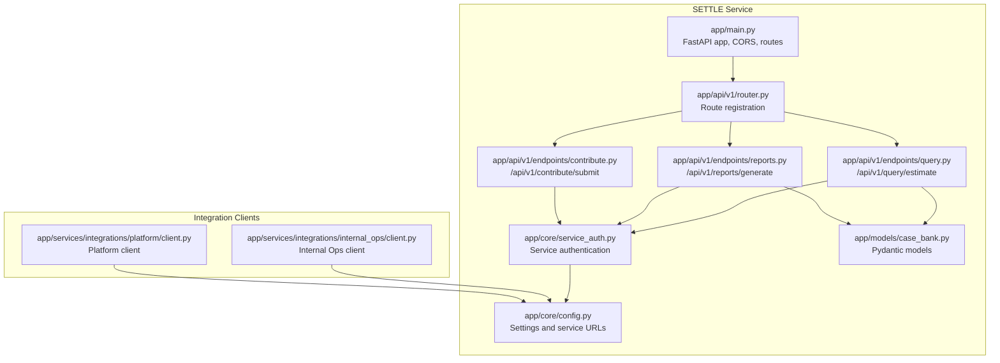
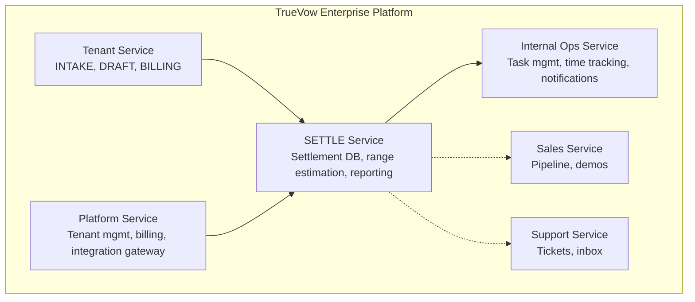
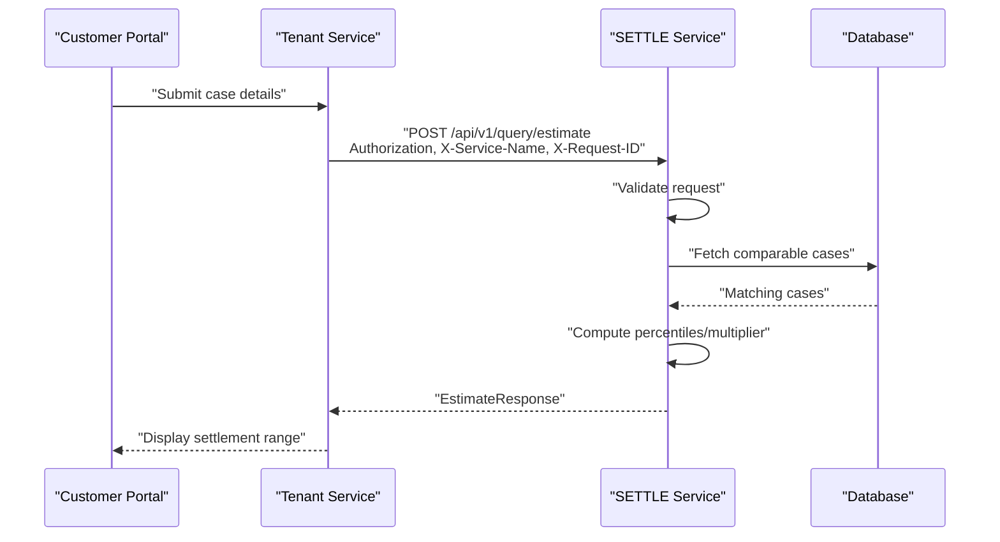
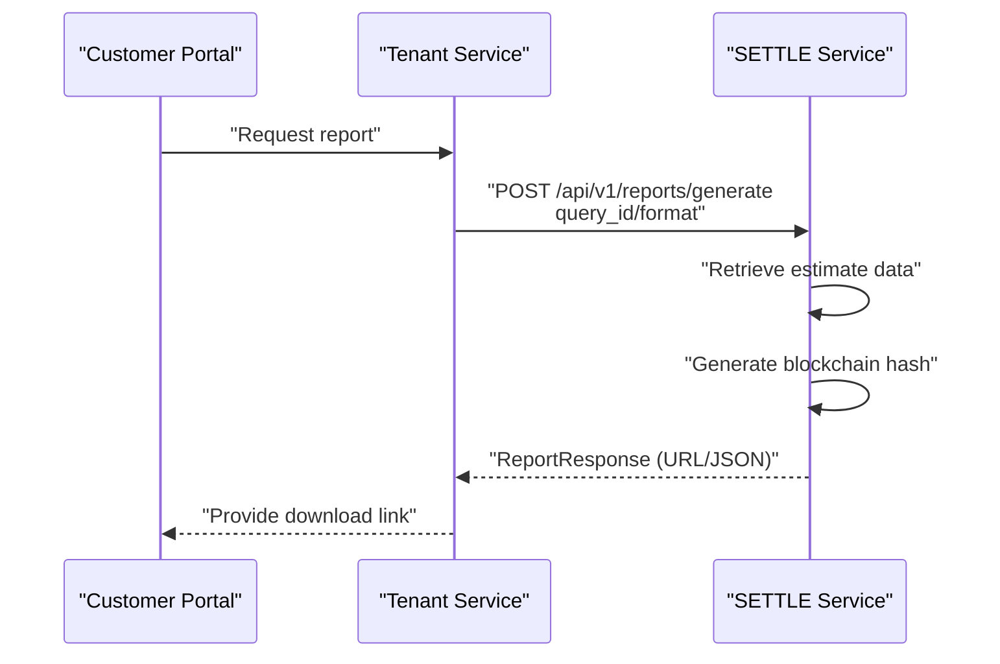
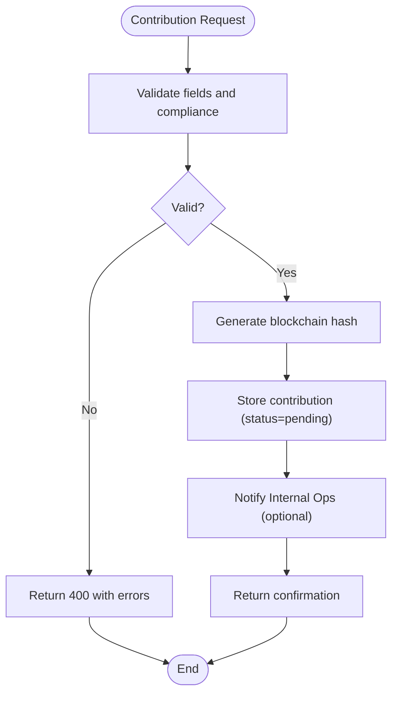
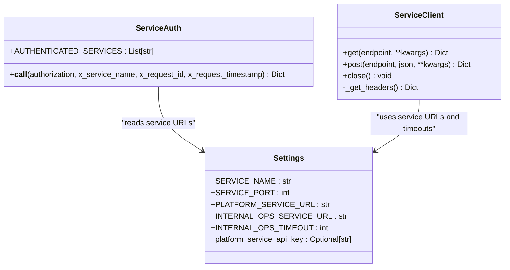
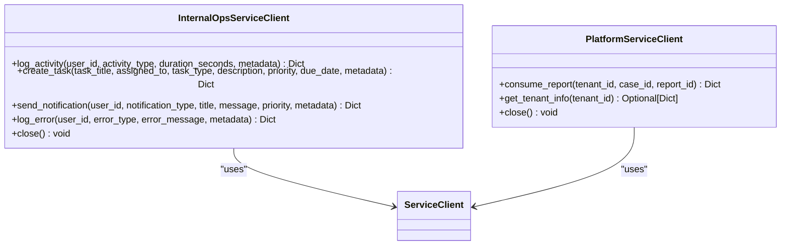
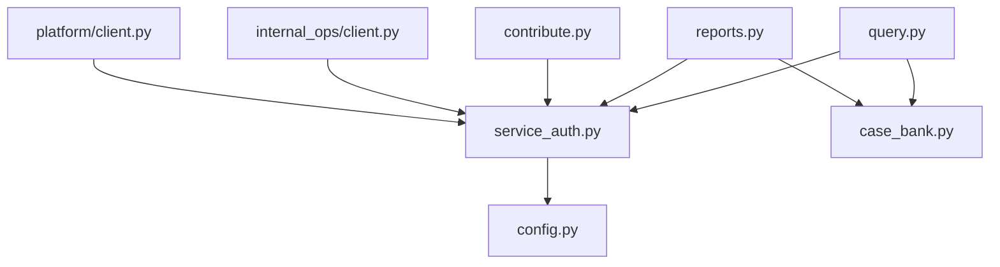

# Customer Portal Integration Bridge

<cite>
**Referenced Files in This Document**
- [README.md](file://README.md)
- [app/main.py](file://app/main.py)
- [app/api/v1/router.py](file://app/api/v1/router.py)
- [app/api/v1/endpoints/query.py](file://app/api/v1/endpoints/query.py)
- [app/api/v1/endpoints/reports.py](file://app/api/v1/endpoints/reports.py)
- [app/api/v1/endpoints/contribute.py](file://app/api/v1/endpoints/contribute.py)
- [app/core/config.py](file://app/core/config.py)
- [app/core/service_auth.py](file://app/core/service_auth.py)
- [app/services/integrations/internal_ops/client.py](file://app/services/integrations/internal_ops/client.py)
- [app/services/integrations/platform/client.py](file://app/services/integrations/platform/client.py)
- [app/models/case_bank.py](file://app/models/case_bank.py)
- [docs/INTEGRATION_GUIDE.md](file://docs/INTEGRATION_GUIDE.md)
- [docs/API_DOCUMENTATION.md](file://docs/API_DOCUMENTATION.md)
</cite>

## Table of Contents
1. [Introduction](#introduction)
2. [Project Structure](#project-structure)
3. [Core Components](#core-components)
4. [Architecture Overview](#architecture-overview)
5. [Detailed Component Analysis](#detailed-component-analysis)
6. [Dependency Analysis](#dependency-analysis)
7. [Performance Considerations](#performance-considerations)
8. [Troubleshooting Guide](#troubleshooting-guide)
9. [Conclusion](#conclusion)

## Introduction
This document describes the Customer Portal Integration Bridge for the TrueVow SETTLE Service, focusing on how external customer portals and tenant applications integrate with the centralized settlement intelligence service. The bridge enables secure, authenticated access to settlement range estimation, contribution submission, and report generation while maintaining strict compliance with ethical and privacy standards.

The SETTLE Service operates as a shared, centralized service (not tenant-specific) and exposes both public endpoints (e.g., waitlist and stats) and authenticated endpoints for query, contribution, and reporting. Integration with other TrueVow services follows a standardized service-to-service authentication pattern using API keys and mandatory request headers.

## Project Structure
The integration bridge spans several key areas:
- Application entry point and routing
- API endpoints for query, contribution, and reports
- Service configuration and authentication
- Integration clients for Internal Ops and Platform services
- Data models for request/response validation

**Diagram sources**
- [app/main.py:1-87](file://app/main.py#L1-L87)
- [app/api/v1/router.py:1-22](file://app/api/v1/router.py#L1-L22)
- [app/api/v1/endpoints/query.py:1-153](file://app/api/v1/endpoints/query.py#L1-L153)
- [app/api/v1/endpoints/reports.py:1-248](file://app/api/v1/endpoints/reports.py#L1-L248)
- [app/api/v1/endpoints/contribute.py:1-112](file://app/api/v1/endpoints/contribute.py#L1-L112)
- [app/core/config.py:1-363](file://app/core/config.py#L1-L363)
- [app/core/service_auth.py:1-376](file://app/core/service_auth.py#L1-L376)
- [app/models/case_bank.py:1-347](file://app/models/case_bank.py#L1-L347)
- [app/services/integrations/internal_ops/client.py:1-244](file://app/services/integrations/internal_ops/client.py#L1-L244)
- [app/services/integrations/platform/client.py:1-145](file://app/services/integrations/platform/client.py#L1-L145)

**Section sources**
- [README.md:1-297](file://README.md#L1-L297)
- [app/main.py:1-87](file://app/main.py#L1-L87)
- [app/api/v1/router.py:1-22](file://app/api/v1/router.py#L1-L22)

## Core Components
- FastAPI Application: Initializes logging, Sentry monitoring (conditional), CORS, and registers API routers.
- API Router: Organizes public, authenticated, and admin endpoints under /api/v1.
- Endpoints:
  - Query: Settlement range estimation with validation and pilot-mode user handling.
  - Reports: Report generation with blockchain hashing and optional JSON summary.
  - Contribute: Contribution submission with compliance validation and future database integration.
- Authentication: Service-to-service authentication enforcing API keys, service names, and request IDs.
- Integration Clients:
  - Internal Ops Client: Logs activity, creates tasks, sends notifications, and logs errors.
  - Platform Client: Consumes reports for billing and retrieves tenant information.

**Section sources**
- [app/main.py:1-87](file://app/main.py#L1-L87)
- [app/api/v1/router.py:1-22](file://app/api/v1/router.py#L1-L22)
- [app/api/v1/endpoints/query.py:1-153](file://app/api/v1/endpoints/query.py#L1-L153)
- [app/api/v1/endpoints/reports.py:1-248](file://app/api/v1/endpoints/reports.py#L1-L248)
- [app/api/v1/endpoints/contribute.py:1-112](file://app/api/v1/endpoints/contribute.py#L1-L112)
- [app/core/service_auth.py:1-376](file://app/core/service_auth.py#L1-L376)
- [app/services/integrations/internal_ops/client.py:1-244](file://app/services/integrations/internal_ops/client.py#L1-L244)
- [app/services/integrations/platform/client.py:1-145](file://app/services/integrations/platform/client.py#L1-L145)

## Architecture Overview
The Customer Portal Integration Bridge leverages a five-service enterprise architecture. The SETTLE Service acts as a centralized shared service, accessible to both TrueVow customers and non-customers via API keys. It communicates with other services using standardized headers and API keys.

**Diagram sources**
- [README.md:26-92](file://README.md#L26-L92)
- [docs/INTEGRATION_GUIDE.md:47-93](file://docs/INTEGRATION_GUIDE.md#L47-L93)

## Detailed Component Analysis

### Query Estimation Workflow
The query endpoint estimates settlement ranges using comparable cases, with validation, pilot-mode user handling, and optional forwarding of end-user identity via a special header when using API key authentication.

**Diagram sources**
- [app/api/v1/endpoints/query.py:20-132](file://app/api/v1/endpoints/query.py#L20-L132)
- [docs/INTEGRATION_GUIDE.md:154-214](file://docs/INTEGRATION_GUIDE.md#L154-L214)

**Section sources**
- [app/api/v1/endpoints/query.py:1-153](file://app/api/v1/endpoints/query.py#L1-L153)
- [docs/INTEGRATION_GUIDE.md:154-214](file://docs/INTEGRATION_GUIDE.md#L154-L214)

### Report Generation Workflow
The reports endpoint generates a 4-page professional report, optionally returning a JSON summary. It retrieves prior query data and constructs a blockchain hash for verification.

**Diagram sources**
- [app/api/v1/endpoints/reports.py:22-177](file://app/api/v1/endpoints/reports.py#L22-L177)
- [docs/INTEGRATION_GUIDE.md:272-314](file://docs/INTEGRATION_GUIDE.md#L272-L314)

**Section sources**
- [app/api/v1/endpoints/reports.py:1-248](file://app/api/v1/endpoints/reports.py#L1-L248)
- [docs/INTEGRATION_GUIDE.md:272-314](file://docs/INTEGRATION_GUIDE.md#L272-L314)

### Contribution Submission Workflow
The contribution endpoint validates submissions against strict ethical guidelines and prepares blockchain receipts for auditability.

**Diagram sources**
- [app/api/v1/endpoints/contribute.py:16-82](file://app/api/v1/endpoints/contribute.py#L16-L82)
- [docs/INTEGRATION_GUIDE.md:217-268](file://docs/INTEGRATION_GUIDE.md#L217-L268)

**Section sources**
- [app/api/v1/endpoints/contribute.py:1-112](file://app/api/v1/endpoints/contribute.py#L1-L112)
- [docs/INTEGRATION_GUIDE.md:217-268](file://docs/INTEGRATION_GUIDE.md#L217-L268)

### Service Authentication and Integration
Service-to-service authentication requires standardized headers and API keys. The configuration module centralizes service URLs and timeouts, enabling consistent client initialization.

**Diagram sources**
- [app/core/service_auth.py:20-180](file://app/core/service_auth.py#L20-L180)
- [app/core/service_auth.py:183-321](file://app/core/service_auth.py#L183-L321)
- [app/core/config.py:266-331](file://app/core/config.py#L266-L331)

**Section sources**
- [app/core/service_auth.py:1-376](file://app/core/service_auth.py#L1-L376)
- [app/core/config.py:1-363](file://app/core/config.py#L1-L363)

### Integration Clients
- Internal Ops Client: Provides methods to log activity, create tasks, send notifications, and log errors. Non-critical failures are handled gracefully.
- Platform Client: Integrates with the Platform Service for billing consumption and tenant information retrieval.

**Diagram sources**
- [app/services/integrations/internal_ops/client.py:19-244](file://app/services/integrations/internal_ops/client.py#L19-L244)
- [app/services/integrations/platform/client.py:39-145](file://app/services/integrations/platform/client.py#L39-L145)
- [app/core/service_auth.py:327-375](file://app/core/service_auth.py#L327-L375)

**Section sources**
- [app/services/integrations/internal_ops/client.py:1-244](file://app/services/integrations/internal_ops/client.py#L1-L244)
- [app/services/integrations/platform/client.py:1-145](file://app/services/integrations/platform/client.py#L1-L145)
- [app/core/service_auth.py:327-375](file://app/core/service_auth.py#L327-L375)

## Dependency Analysis
The integration bridge depends on:
- FastAPI for routing and request handling
- Pydantic models for request/response validation
- Service authentication for secure inter-service communication
- Configuration module for service URLs and timeouts
- Integration clients for downstream services

**Diagram sources**
- [app/api/v1/endpoints/query.py:1-153](file://app/api/v1/endpoints/query.py#L1-L153)
- [app/api/v1/endpoints/reports.py:1-248](file://app/api/v1/endpoints/reports.py#L1-L248)
- [app/api/v1/endpoints/contribute.py:1-112](file://app/api/v1/endpoints/contribute.py#L1-L112)
- [app/core/service_auth.py:1-376](file://app/core/service_auth.py#L1-L376)
- [app/core/config.py:1-363](file://app/core/config.py#L1-L363)
- [app/models/case_bank.py:1-347](file://app/models/case_bank.py#L1-L347)
- [app/services/integrations/internal_ops/client.py:1-244](file://app/services/integrations/internal_ops/client.py#L1-L244)
- [app/services/integrations/platform/client.py:1-145](file://app/services/integrations/platform/client.py#L1-L145)

**Section sources**
- [app/api/v1/endpoints/query.py:1-153](file://app/api/v1/endpoints/query.py#L1-L153)
- [app/api/v1/endpoints/reports.py:1-248](file://app/api/v1/endpoints/reports.py#L1-L248)
- [app/api/v1/endpoints/contribute.py:1-112](file://app/api/v1/endpoints/contribute.py#L1-L112)
- [app/core/service_auth.py:1-376](file://app/core/service_auth.py#L1-L376)
- [app/core/config.py:1-363](file://app/core/config.py#L1-L363)
- [app/models/case_bank.py:1-347](file://app/models/case_bank.py#L1-L347)
- [app/services/integrations/internal_ops/client.py:1-244](file://app/services/integrations/internal_ops/client.py#L1-L244)
- [app/services/integrations/platform/client.py:1-145](file://app/services/integrations/platform/client.py#L1-L145)

## Performance Considerations
- Response time targets: Query endpoint aims for sub-second response times; reports generation targets under two seconds.
- Rate limiting: Configurable per access level (founding members, standard, premium).
- Caching: Redis configuration supports caching for improved performance.
- Timeouts: Service clients enforce timeouts for downstream calls.

[No sources needed since this section provides general guidance]

## Troubleshooting Guide
Common integration issues and resolutions:
- Authentication failures: Ensure Authorization header contains a valid API key, and X-Service-Name and X-Request-ID are present.
- Rate limit exceeded: Monitor access levels and reduce request frequency accordingly.
- Service timeouts: Increase timeouts or retry with exponential backoff.
- Validation errors: Review request payloads against documented schemas and validation rules.

**Section sources**
- [docs/INTEGRATION_GUIDE.md:738-800](file://docs/INTEGRATION_GUIDE.md#L738-L800)
- [docs/API_DOCUMENTATION.md:47-71](file://docs/API_DOCUMENTATION.md#L47-L71)

## Conclusion
The Customer Portal Integration Bridge provides a robust, secure pathway for customer portals and tenant applications to leverage the SETTLE Service’s settlement intelligence capabilities. By adhering to standardized authentication, request/response formats, and integration patterns, systems can reliably estimate settlement ranges, submit contributions, and generate verifiable reports while maintaining compliance and performance standards.