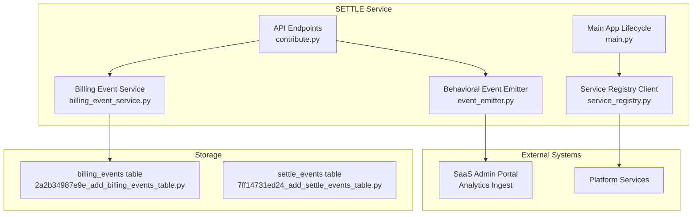
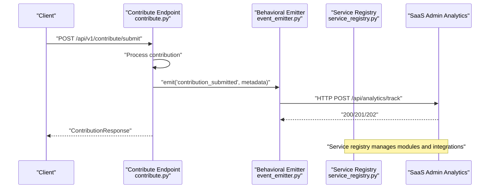
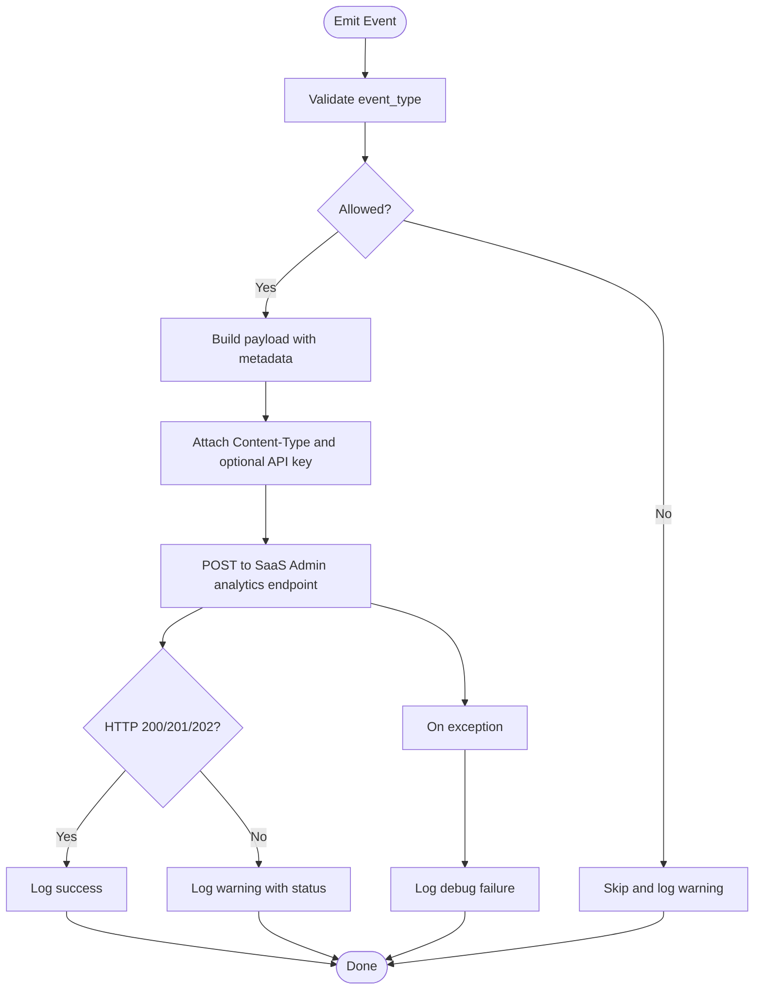
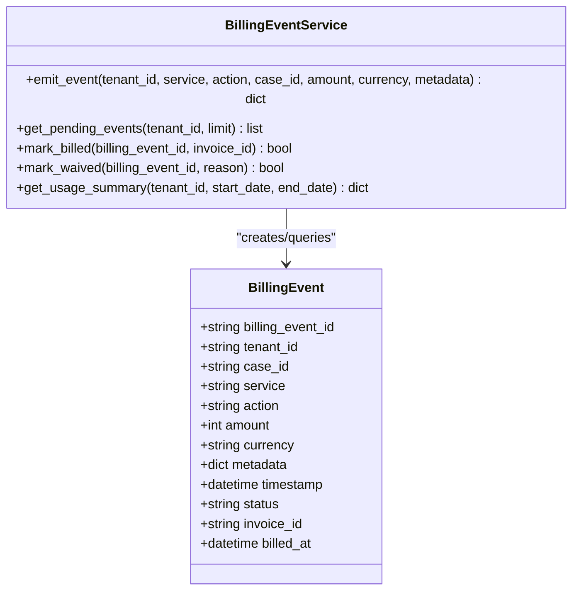
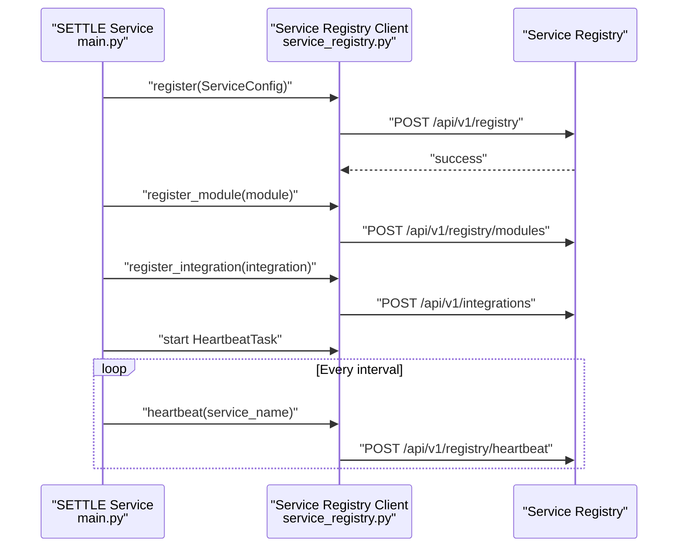
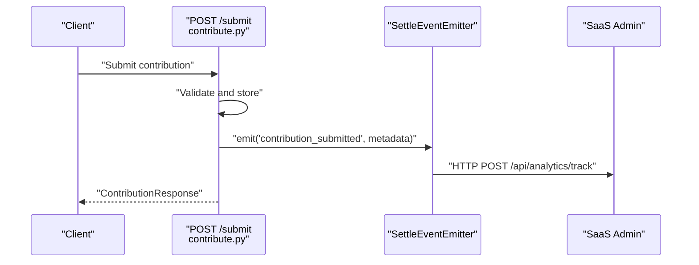
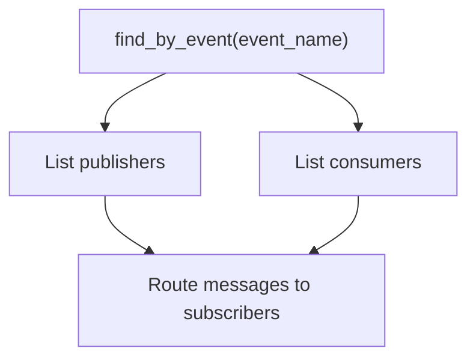
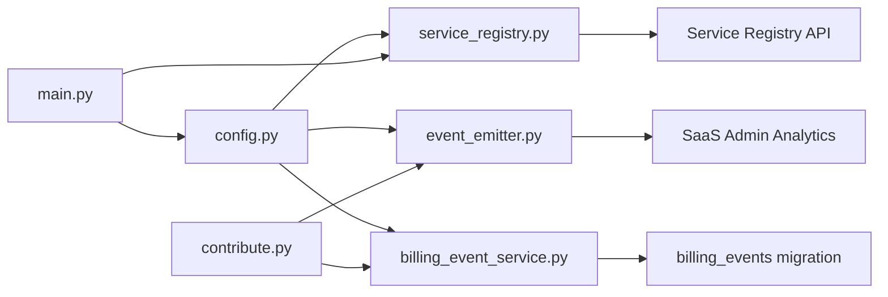

# Event Emitter & Communication

<cite>
**Referenced Files in This Document**
- [event_emitter.py](file://app/core/event_emitter.py)
- [service_registry.py](file://app/core/service_registry.py)
- [billing_event_service.py](file://app/services/billing_event_service.py)
- [contribute.py](file://app/api/v1/endpoints/contribute.py)
- [config.py](file://app/core/config.py)
- [main.py](file://app/main.py)
- [2a2b34987e9e_add_billing_events_table.py](file://alembic/versions/2a2b34987e9e_add_billing_events_table.py)
- [7ff14731ed24_add_settle_events_table.py](file://alembic/versions/7ff14731ed24_add_settle_events_table.py)
- [ffd820027e8c_add_contribution_type_to_settlement_.py](file://alembic/versions/ffd820027e8c_add_contribution_type_to_settlement_.py)
- [add_contribution_event.py](file://scripts/add_contribution_event.py)
- [mdm_webhook.py](file://app/api/v1/endpoints/mdm_webhook.py)
</cite>

## Table of Contents
1. [Introduction](#introduction)
2. [Project Structure](#project-structure)
3. [Core Components](#core-components)
4. [Architecture Overview](#architecture-overview)
5. [Detailed Component Analysis](#detailed-component-analysis)
6. [Dependency Analysis](#dependency-analysis)
7. [Performance Considerations](#performance-considerations)
8. [Troubleshooting Guide](#troubleshooting-guide)
9. [Conclusion](#conclusion)
10. [Appendices](#appendices)

## Introduction
This document describes the event-driven communication system within the SETTLE service integration. It explains how services publish and consume events, the event emission patterns, event types, inter-service messaging protocols, filtering mechanisms, and asynchronous communication patterns. It also specifies event schemas, payload formats, delivery guarantees, and the relationship between service registry events and custom business events. Finally, it covers event routing, subscription management, and error handling in event-driven scenarios, with practical examples and integration workflows.

## Project Structure
The event-driven system spans several modules:
- Behavioral event emission to SaaS Admin via a fire-and-forget HTTP emitter
- Billing event tracking persisted in the database for metering and invoicing
- Service registry integration for service discovery, module registration, and heartbeat maintenance
- API endpoints that trigger behavioral events upon successful operations
- Database migrations defining event storage schemas

**Diagram sources**
- [event_emitter.py:1-88](file://app/core/event_emitter.py#L1-L88)
- [billing_event_service.py:1-317](file://app/services/billing_event_service.py#L1-L317)
- [service_registry.py:1-355](file://app/core/service_registry.py#L1-L355)
- [contribute.py:1-164](file://app/api/v1/endpoints/contribute.py#L1-L164)
- [main.py:1-157](file://app/main.py#L1-L157)
- [2a2b34987e9e_add_billing_events_table.py:1-44](file://alembic/versions/2a2b34987e9e_add_billing_events_table.py#L1-L44)
- [7ff14731ed24_add_settle_events_table.py:1-40](file://alembic/versions/7ff14731ed24_add_settle_events_table.py#L1-L40)

**Section sources**
- [main.py:52-100](file://app/main.py#L52-L100)
- [service_registry.py:64-214](file://app/core/service_registry.py#L64-L214)

## Core Components
- Behavioral Event Emitter: A fire-and-forget HTTP client that emits feature-level behavioral events to SaaS Admin’s analytics ingestion endpoint. It validates event types, constructs payloads, and logs outcomes without raising exceptions.
- Billing Event Service: Persists billable actions locally with statuses and provides convenience functions to emit billing events for metering/invoicing.
- Service Registry Client: Registers the service, publishes modules with their events, maintains heartbeats, and supports discovery by event name.
- API Endpoints: Trigger behavioral events after successful operations, ensuring non-blocking emissions via fire-and-forget tasks.

**Section sources**
- [event_emitter.py:44-88](file://app/core/event_emitter.py#L44-L88)
- [billing_event_service.py:62-317](file://app/services/billing_event_service.py#L62-L317)
- [service_registry.py:47-214](file://app/core/service_registry.py#L47-L214)
- [contribute.py:111-125](file://app/api/v1/endpoints/contribute.py#L111-L125)

## Architecture Overview
The system separates concerns:
- Behavioral events: Lightweight, fire-and-forget telemetry sent to SaaS Admin for product analytics.
- Billing events: Persistent records for metering/invoicing, stored in the database with lifecycle states.
- Service registry: Centralized discovery and orchestration for modules and integrations.

**Diagram sources**
- [contribute.py:51-125](file://app/api/v1/endpoints/contribute.py#L51-L125)
- [event_emitter.py:56-88](file://app/core/event_emitter.py#L56-L88)
- [service_registry.py:64-214](file://app/core/service_registry.py#L64-L214)

## Detailed Component Analysis

### Behavioral Event Emission
Behavioral events are emitted after successful feature operations. The emitter:
- Validates event types against a predefined set
- Builds a structured payload with contextual metadata
- Sends an HTTP POST to SaaS Admin’s analytics endpoint
- Operates fire-and-forget with no exception propagation

**Diagram sources**
- [event_emitter.py:56-88](file://app/core/event_emitter.py#L56-L88)

**Section sources**
- [event_emitter.py:36-41](file://app/core/event_emitter.py#L36-L41)
- [event_emitter.py:56-88](file://app/core/event_emitter.py#L56-L88)

### Billing Event Tracking
Billing events capture billable actions for metering and invoicing:
- Emits events with service/action semantics and optional metadata
- Stores events in the billing_events table with status lifecycle
- Provides queries for pending events and usage summaries
- Offers convenience functions for common actions

**Diagram sources**
- [billing_event_service.py:45-119](file://app/services/billing_event_service.py#L45-L119)
- [billing_event_service.py:62-317](file://app/services/billing_event_service.py#L62-L317)

**Section sources**
- [billing_event_service.py:62-119](file://app/services/billing_event_service.py#L62-L119)
- [2a2b34987e9e_add_billing_events_table.py:21-39](file://alembic/versions/2a2b34987e9e_add_billing_events_table.py#L21-L39)

### Service Registry and Discovery
The service registers itself and its modules, publishes events, and maintains heartbeats:
- Registration includes service metadata, endpoints, and capabilities
- Modules declare published and consumed events
- Integrations define cross-service contracts
- Heartbeat task keeps the registry informed of liveness

**Diagram sources**
- [main.py:60-87](file://app/main.py#L60-L87)
- [service_registry.py:64-214](file://app/core/service_registry.py#L64-L214)

**Section sources**
- [main.py:60-87](file://app/main.py#L60-L87)
- [service_registry.py:64-214](file://app/core/service_registry.py#L64-L214)

### API Endpoint Integration
The contribution endpoint emits a behavioral event after successful submission:
- Extracts tenant/user context from auth
- Submits contribution and stores it
- Fire-and-forget emission of “contribution_submitted”

**Diagram sources**
- [contribute.py:51-125](file://app/api/v1/endpoints/contribute.py#L51-L125)
- [event_emitter.py:56-88](file://app/core/event_emitter.py#L56-L88)

**Section sources**
- [contribute.py:111-125](file://app/api/v1/endpoints/contribute.py#L111-L125)

### Event Filtering and Subscription Management
- Service Registry supports discovery by event name, enabling publishers and consumers to locate each other.
- Integrations define contracts and event triggers for cross-service subscriptions.
- The behavioral emitter validates event types against a controlled set to prevent unauthorized telemetry.

**Diagram sources**
- [service_registry.py:160-167](file://app/core/service_registry.py#L160-L167)

**Section sources**
- [service_registry.py:160-167](file://app/core/service_registry.py#L160-L167)
- [event_emitter.py:58-60](file://app/core/event_emitter.py#L58-L60)

### Asynchronous Communication Patterns
- Behavioral emissions are fire-and-forget with timeouts and non-propagating exceptions.
- Heartbeat tasks run in the background to maintain liveness.
- API handlers schedule emissions asynchronously to avoid blocking request processing.

**Section sources**
- [event_emitter.py:79-87](file://app/core/event_emitter.py#L79-L87)
- [service_registry.py:226-243](file://app/core/service_registry.py#L226-L243)
- [contribute.py:117-123](file://app/api/v1/endpoints/contribute.py#L117-L123)

### Delivery Guarantees
- Behavioral events: Best-effort delivery with no retries or acknowledgments. Failures are logged but do not interrupt the main operation.
- Billing events: Stored persistently in the database with status transitions for processing and invoicing.
- Registry operations: Idempotent registration and heartbeat updates; errors are logged and retried externally.

**Section sources**
- [event_emitter.py:79-87](file://app/core/event_emitter.py#L79-L87)
- [billing_event_service.py:87-118](file://app/services/billing_event_service.py#L87-L118)
- [service_registry.py:79-98](file://app/core/service_registry.py#L79-L98)

### Relationship Between Service Registry Events and Business Events
- Service Registry events: Module registration, heartbeat, and integration contracts.
- Business events: Feature-level telemetry (behavioral) and billable actions (billing).
- The registry enables discovery and subscription; business events are emitted independently but can be correlated via tenant/user context.

**Section sources**
- [service_registry.py:269-333](file://app/core/service_registry.py#L269-L333)
- [event_emitter.py:36-41](file://app/core/event_emitter.py#L36-L41)
- [billing_event_service.py:31-42](file://app/services/billing_event_service.py#L31-L42)

### Event Routing and Subscription Management
- Publishers declare events in module definitions; consumers discover publishers via event name.
- Integrations define cross-service triggers and routing intentions.
- For behavioral events, routing is handled by SaaS Admin’s ingestion endpoint.

**Section sources**
- [service_registry.py:269-333](file://app/core/service_registry.py#L269-L333)
- [service_registry.py:160-167](file://app/core/service_registry.py#L160-L167)
- [event_emitter.py:56-88](file://app/core/event_emitter.py#L56-L88)

### Error Handling in Event-Driven Scenarios
- Behavioral emitter: Exceptions caught and logged; HTTP failures logged with status codes.
- Registry client: Exceptions logged; heartbeats continue on loop.
- Billing service: Errors captured and returned; status remains pending for retry processing.

**Section sources**
- [event_emitter.py:86-87](file://app/core/event_emitter.py#L86-L87)
- [service_registry.py:96-98](file://app/core/service_registry.py#L96-L98)
- [billing_event_service.py:116-118](file://app/services/billing_event_service.py#L116-L118)

## Dependency Analysis
The following diagram shows key dependencies among event-related components:

**Diagram sources**
- [config.py:273-276](file://app/core/config.py#L273-L276)
- [event_emitter.py:50-55](file://app/core/event_emitter.py#L50-L55)
- [service_registry.py:50-54](file://app/core/service_registry.py#L50-L54)
- [billing_event_service.py:87-102](file://app/services/billing_event_service.py#L87-L102)
- [main.py:60-87](file://app/main.py#L60-L87)
- [contribute.py:111-125](file://app/api/v1/endpoints/contribute.py#L111-L125)
- [2a2b34987e9e_add_billing_events_table.py:21-39](file://alembic/versions/2a2b34987e9e_add_billing_events_table.py#L21-L39)

**Section sources**
- [config.py:273-276](file://app/core/config.py#L273-L276)
- [main.py:60-87](file://app/main.py#L60-L87)

## Performance Considerations
- Behavioral emissions use short timeouts and fire-and-forget to avoid impacting request latency.
- Registry heartbeats run on intervals to minimize overhead.
- Billing event persistence relies on indexed columns for efficient querying and aggregation.
- Consider batching or queuing for high-volume scenarios if telemetry volume increases.

## Troubleshooting Guide
- Behavioral events not appearing in SaaS Admin:
  - Verify SaaS Admin service URL and API key in configuration.
  - Check emitter logs for HTTP status warnings or exceptions.
  - Confirm event type is in the allowed set.
- Billing events stuck in pending:
  - Query pending events and inspect statuses.
  - Mark events billed or waived as appropriate.
  - Review usage summaries for trends.
- Service registry issues:
  - Confirm registration and heartbeat tasks are running.
  - Check discovery endpoints for event publishers/consumers.
- Contribution submissions failing:
  - Validate request payload and jurisdiction format.
  - Inspect emitted behavioral event for correlation.

**Section sources**
- [event_emitter.py:79-87](file://app/core/event_emitter.py#L79-L87)
- [billing_event_service.py:120-143](file://app/services/billing_event_service.py#L120-L143)
- [service_registry.py:226-243](file://app/core/service_registry.py#L226-L243)
- [contribute.py:129-134](file://app/api/v1/endpoints/contribute.py#L129-L134)

## Conclusion
The SETTLE service integrates two complementary event streams:
- Behavioral telemetry to SaaS Admin for product insights
- Billing events for metering and invoicing

Service registry enables discovery and subscription, while API endpoints ensure non-blocking, fire-and-forget emissions. The system emphasizes resilience, observability, and separation of concerns between product analytics and operational billing.

## Appendices

### Event Types and Payload Specifications
- Behavioral events (SaaS Admin):
  - Event types: settlement_query_run, report_generated, report_exported, contribution_submitted
  - Payload fields: event_type, event_category, tenant_id, user_id, source, metadata, client_ts
  - Delivery: HTTP POST to analytics endpoint; best-effort, no acknowledgments
- Billing events (database):
  - Fields: billing_event_id, tenant_id, case_id, service, action, amount, currency, metadata, timestamp, status, invoice_id, billed_at
  - Status lifecycle: pending → billed/waived/failed
- SETTLE events (database):
  - Fields: event_id, case_id, tenant_id, event_type, event_source, payload, occurred_at, recorded_at
  - Indexes optimized for tenant/type/time queries

**Section sources**
- [event_emitter.py:36-41](file://app/core/event_emitter.py#L36-L41)
- [event_emitter.py:61-75](file://app/core/event_emitter.py#L61-L75)
- [billing_event_service.py:45-60](file://app/services/billing_event_service.py#L45-L60)
- [2a2b34987e9e_add_billing_events_table.py:21-39](file://alembic/versions/2a2b34987e9e_add_billing_events_table.py#L21-L39)
- [7ff14731ed24_add_settle_events_table.py:22-35](file://alembic/versions/7ff14731ed24_add_settle_events_table.py#L22-L35)

### Integration Workflows
- Contribution submission:
  - Submit contribution → store → emit behavioral event → return response
- Settlement estimation:
  - Emit billing event for settlement_query_run with metadata
- Report generation:
  - Emit billing event for report_generated with metadata
- Contribution approval:
  - Emit billing event for contribution_submitted with metadata

**Section sources**
- [contribute.py:111-125](file://app/api/v1/endpoints/contribute.py#L111-L125)
- [billing_event_service.py:271-302](file://app/services/billing_event_service.py#L271-L302)
- [add_contribution_event.py:8-24](file://scripts/add_contribution_event.py#L8-L24)

### Additional Schema Notes
- Contribution type column added to settlement records for filtering and reporting
- Indexes on contribution_type improve query performance for analytics

**Section sources**
- [ffd820027e8c_add_contribution_type_to_settlement_.py:21-31](file://alembic/versions/ffd820027e8c_add_contribution_type_to_settlement_.py#L21-L31)