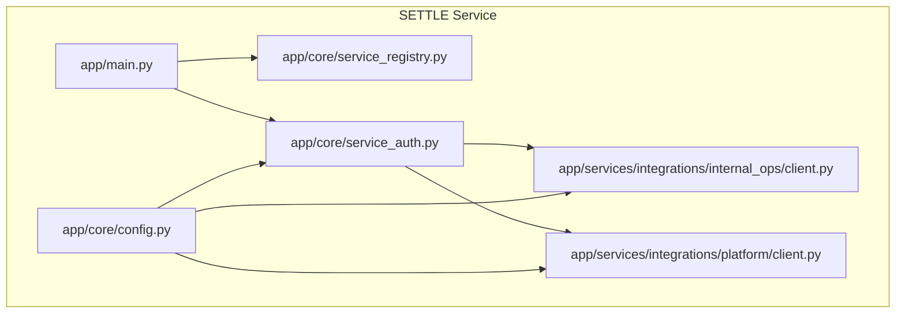
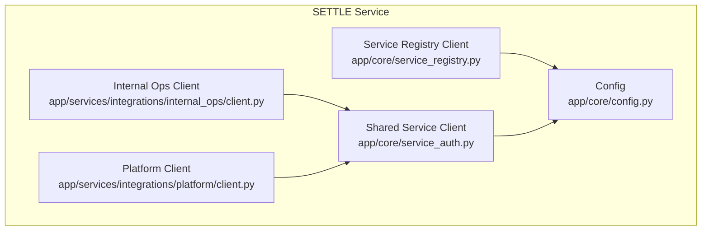
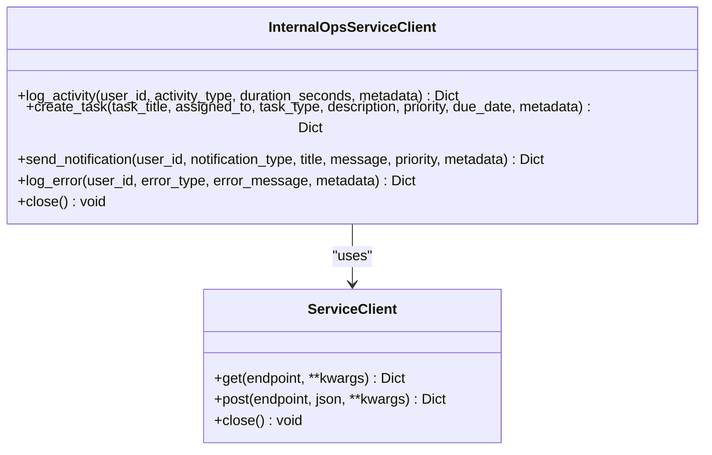
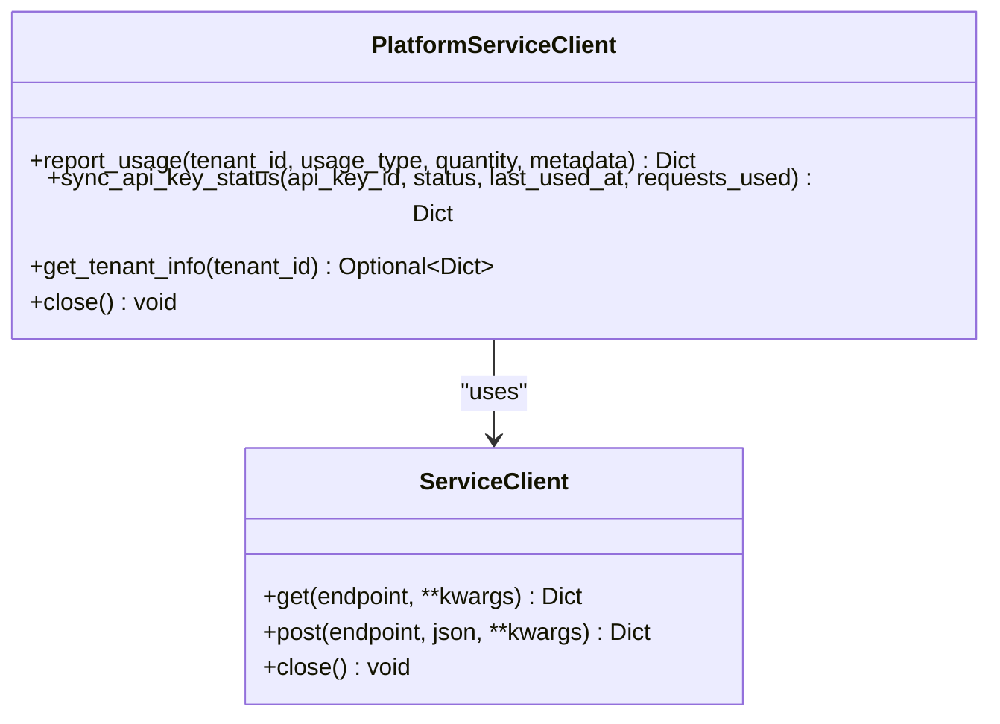
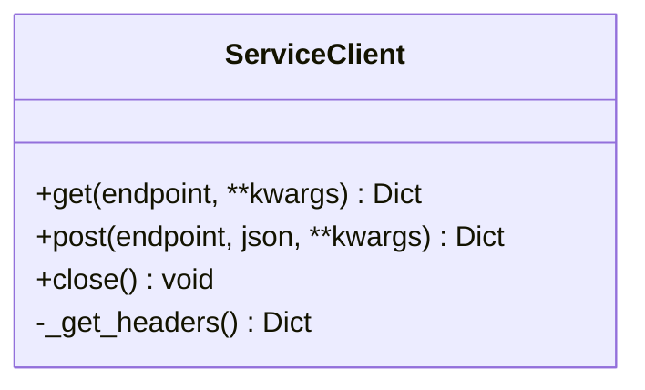
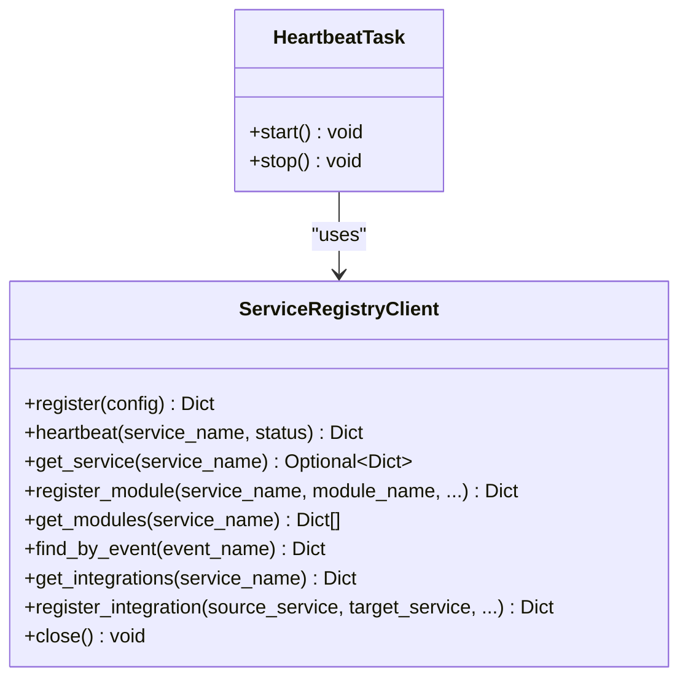
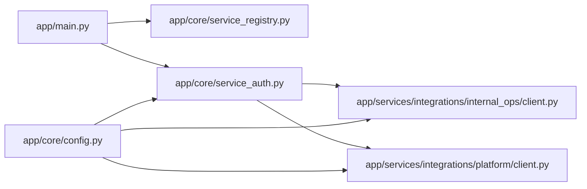

# Integration Clients

<cite>
**Referenced Files in This Document**
- [client.py](file://app/services/integrations/internal_ops/client.py)
- [client.py](file://app/services/integrations/platform/client.py)
- [service_auth.py](file://app/core/service_auth.py)
- [service_registry.py](file://app/core/service_registry.py)
- [config.py](file://app/core/config.py)
- [main.py](file://app/main.py)
- [SAAS_ADMIN_API_CONTRACT.md](file://docs/integration/SAAS_ADMIN_API_CONTRACT.md)
- [env.template](file://env.template)
- [requirements.txt](file://requirements.txt)
</cite>

## Table of Contents
1. [Introduction](#introduction)
2. [Project Structure](#project-structure)
3. [Core Components](#core-components)
4. [Architecture Overview](#architecture-overview)
5. [Detailed Component Analysis](#detailed-component-analysis)
6. [Dependency Analysis](#dependency-analysis)
7. [Performance Considerations](#performance-considerations)
8. [Troubleshooting Guide](#troubleshooting-guide)
9. [Conclusion](#conclusion)
10. [Appendices](#appendices)

## Introduction
This document explains the integration clients used by the SETTLE service to communicate with external TrueVow services. It focuses on:
- Internal Ops client for service registry operations and internal operational tasks
- Platform client for tenant management and billing integration

It covers client initialization, authentication mechanisms, API endpoint specifications, usage patterns, error handling, retry strategies, integration contracts, data exchange formats, and lifecycle management. Guidance on connection pooling, performance optimization, and service-specific configurations is also included.

## Project Structure
The integration clients are implemented as thin wrappers around a shared service client that encapsulates authentication headers and HTTP transport. They are located under the integrations package and rely on centralized configuration and authentication utilities.

**Diagram sources**
- [main.py:16-22](file://app/main.py#L16-L22)
- [service_auth.py:327-344](file://app/core/service_auth.py#L327-L344)
- [service_registry.py:50-60](file://app/core/service_registry.py#L50-L60)
- [client.py:30-32](file://app/services/integrations/internal_ops/client.py#L30-L32)
- [client.py:30-32](file://app/services/integrations/platform/client.py#L30-L32)

**Section sources**
- [main.py:16-22](file://app/main.py#L16-L22)
- [service_auth.py:327-344](file://app/core/service_auth.py#L327-L344)
- [service_registry.py:50-60](file://app/core/service_registry.py#L50-L60)
- [client.py:30-32](file://app/services/integrations/internal_ops/client.py#L30-L32)
- [client.py:30-32](file://app/services/integrations/platform/client.py#L30-L32)

## Core Components
- Internal Ops client: Provides methods to log activity, create tasks, send notifications, and log errors to the Internal Ops service.
- Platform client: Provides methods to report usage events, synchronize API key status, and fetch tenant information from the Platform service.
- Shared service client: Encapsulates HTTP transport, authentication headers, timeouts, and error handling for outbound service calls.
- Service registry client: Manages service registration, heartbeat, and discovery for the SETTLE service.

Key responsibilities:
- Initialization: Clients are initialized with service URLs and API keys from configuration.
- Authentication: Requests include standardized headers and optional bearer tokens.
- Error handling: Non-fatal failures return structured error responses; fatal errors raise exceptions.
- Lifecycle: Clients expose a close method to release resources.

**Section sources**
- [client.py:19-244](file://app/services/integrations/internal_ops/client.py#L19-L244)
- [client.py:19-146](file://app/services/integrations/platform/client.py#L19-L146)
- [service_auth.py:183-321](file://app/core/service_auth.py#L183-L321)
- [service_registry.py:47-214](file://app/core/service_registry.py#L47-L214)

## Architecture Overview
The SETTLE service integrates with two TrueVow services via dedicated clients. Both clients use a shared service client that injects standardized headers and applies timeouts. Configuration is centralized in settings, and the service registers itself with the Service Registry.

**Diagram sources**
- [client.py:30-32](file://app/services/integrations/internal_ops/client.py#L30-L32)
- [client.py:30-32](file://app/services/integrations/platform/client.py#L30-L32)
- [service_auth.py:327-344](file://app/core/service_auth.py#L327-L344)
- [service_registry.py:50-60](file://app/core/service_registry.py#L50-L60)
- [config.py:258-314](file://app/core/config.py#L258-L314)

## Detailed Component Analysis

### Internal Ops Client
Purpose:
- Log activity for time tracking
- Create tasks
- Send notifications
- Log errors

Initialization:
- Instantiates a shared service client using Internal Ops service URL and API key from configuration.

Endpoints and payloads:
- Activity logging: POST /api/v1/time/activity with user_id, activity_type, duration_seconds, service, metadata, timestamp.
- Task creation: POST /api/v1/tasks with task_title, assigned_to, task_type, description, priority, due_date, service, metadata.
- Notification sending: POST /api/v1/notifications with user_id, notification_type, title, message, priority, service, metadata, timestamp.
- Error logging: POST /api/v1/errors/log with user_id, error_type, error_message, service, metadata, timestamp.

Error handling:
- Attempts are wrapped in try/catch blocks.
- On failure, logs an error and returns a structured dictionary with success and error fields; exceptions are not raised for non-critical operations.

Usage pattern:
- Instantiate the client and call the desired method with required parameters.
- Close the client when done to release underlying HTTP resources.

**Diagram sources**
- [client.py:19-244](file://app/services/integrations/internal_ops/client.py#L19-L244)
- [service_auth.py:183-321](file://app/core/service_auth.py#L183-L321)

**Section sources**
- [client.py:34-244](file://app/services/integrations/internal_ops/client.py#L34-L244)
- [service_auth.py:337-344](file://app/core/service_auth.py#L337-L344)

### Platform Client
Purpose:
- Report usage events for billing
- Synchronize API key status
- Retrieve tenant information

Initialization:
- Instantiates a shared service client using Platform service URL and API key from configuration.

Endpoints and payloads:
- Usage reporting: POST /api/v1/usage/report with tenant_id, service, usage_type, quantity, metadata, timestamp.
- API key synchronization: POST /api/v1/api-keys/{api_key_id}/sync with status, last_used_at, requests_used, service.
- Tenant info retrieval: GET /api/v1/tenants/{tenant_id}.

Error handling:
- Attempts are wrapped in try/catch blocks.
- On failure, logs an error and returns a structured dictionary with success and error fields; exceptions are not raised for non-critical operations.

Usage pattern:
- Instantiate the client and call the desired method with required parameters.
- Close the client when done to release underlying HTTP resources.

**Diagram sources**
- [client.py:19-146](file://app/services/integrations/platform/client.py#L19-L146)
- [service_auth.py:183-321](file://app/core/service_auth.py#L183-L321)

**Section sources**
- [client.py:34-146](file://app/services/integrations/platform/client.py#L34-L146)
- [service_auth.py:327-344](file://app/core/service_auth.py#L327-L344)

### Shared Service Client
Responsibilities:
- Construct standardized headers: Content-Type, X-Service-Name, X-Request-ID, X-Request-Timestamp.
- Optionally attach Authorization header with a bearer token.
- Perform GET and POST requests with timeouts and robust error handling.
- Raise HTTPException with appropriate status codes for upstream failures.

Timeouts and headers:
- Timeout configurable per client instantiation.
- Headers include service identity and request correlation.

Error handling:
- HTTP status errors mapped to HTTPException with upstream details.
- Timeouts mapped to gateway timeout.
- Other exceptions mapped to bad gateway.

Lifecycle:
- Exposes close to release underlying HTTP client.

**Diagram sources**
- [service_auth.py:183-321](file://app/core/service_auth.py#L183-L321)

**Section sources**
- [service_auth.py:183-321](file://app/core/service_auth.py#L183-L321)

### Service Registry Client
Purpose:
- Register the SETTLE service and its modules
- Send periodic heartbeats
- Discover services and integrations
- Manage integration contracts

Initialization:
- Reads registry URL and API key from environment variables.
- Lazily initializes an AsyncClient with a short default timeout.

Operations:
- Service registration and heartbeat
- Module registration
- Discovery: get_service, get_modules, find_by_event, get_integrations
- Integration registration

Heartbeat task:
- Background task that periodically sends heartbeat signals.

Configuration:
- Centralized service configuration and module/event definitions for the SETTLE service.

**Diagram sources**
- [service_registry.py:47-214](file://app/core/service_registry.py#L47-L214)
- [service_registry.py:216-244](file://app/core/service_registry.py#L216-L244)

**Section sources**
- [service_registry.py:47-214](file://app/core/service_registry.py#L47-L214)
- [service_registry.py:216-244](file://app/core/service_registry.py#L216-L244)

## Dependency Analysis
- Internal Ops client depends on the shared service client and Internal Ops service configuration.
- Platform client depends on the shared service client and Platform service configuration.
- Both clients depend on configuration for base URLs and API keys.
- The main application initializes the Service Registry client during startup and starts a heartbeat task.

**Diagram sources**
- [main.py:60-86](file://app/main.py#L60-L86)
- [service_registry.py:50-60](file://app/core/service_registry.py#L50-L60)
- [service_auth.py:327-344](file://app/core/service_auth.py#L327-L344)
- [client.py:30-32](file://app/services/integrations/internal_ops/client.py#L30-L32)
- [client.py:30-32](file://app/services/integrations/platform/client.py#L30-L32)
- [config.py:258-314](file://app/core/config.py#L258-L314)

**Section sources**
- [main.py:60-86](file://app/main.py#L60-L86)
- [service_registry.py:50-60](file://app/core/service_registry.py#L50-L60)
- [service_auth.py:327-344](file://app/core/service_auth.py#L327-L344)
- [client.py:30-32](file://app/services/integrations/internal_ops/client.py#L30-L32)
- [client.py:30-32](file://app/services/integrations/platform/client.py#L30-L32)
- [config.py:258-314](file://app/core/config.py#L258-L314)

## Performance Considerations
- Connection pooling: The shared service client uses an httpx.AsyncClient per client instance. For high-throughput scenarios, consider reusing a single client instance across the application to benefit from connection reuse.
- Timeouts: Default timeouts are set per client. Tune PLATFORM_SERVICE_TIMEOUT and INTERNAL_OPS_SERVICE_TIMEOUT according to network conditions and downstream service performance.
- Retry strategy: Built-in retries are not implemented in the shared client. For idempotent operations, implement exponential backoff with jitter at the caller level.
- Logging overhead: Logging is performed on every operation. In hot paths, consider sampling or adjusting log levels.
- Heartbeat cadence: Heartbeat interval is configurable and defaults to five minutes. Keep this aligned with monitoring expectations.

[No sources needed since this section provides general guidance]

## Troubleshooting Guide
Common issues and resolutions:
- Missing or invalid headers: Ensure X-Service-Name, X-Request-ID, and X-Request-Timestamp are present. Authorization header must include a proper bearer token when required.
- Unauthorized service: Verify the calling service is in the authorized list and API key format is correct.
- Timeouts: Increase timeout values in configuration for slow downstream services.
- Non-critical failures: Internal Ops and Platform clients return structured error dictionaries; inspect the error field for details.
- Service registry registration: Confirm SERVICE_REGISTRY_URL and API key are set. Check heartbeat logs for connectivity issues.

Operational checks:
- Validate environment variables for service URLs and API keys.
- Confirm service registration and heartbeat status.
- Review client-side logs for request IDs to trace failures.

**Section sources**
- [service_auth.py:53-180](file://app/core/service_auth.py#L53-L180)
- [service_registry.py:83-98](file://app/core/service_registry.py#L83-L98)
- [env.template:58-82](file://env.template#L58-L82)

## Conclusion
The SETTLE service integrates with Internal Ops and Platform services through lightweight, consistent clients built on a shared service client. Authentication is standardized, error handling is explicit, and lifecycle management is straightforward. For production deployments, ensure proper configuration, implement retry policies where appropriate, and monitor service registry health and client-side logs.

[No sources needed since this section summarizes without analyzing specific files]

## Appendices

### Authentication Mechanisms
- Headers: Content-Type, X-Service-Name, X-Request-ID, X-Request-Timestamp.
- Authorization: Bearer token with API key format validation.
- Service name validation against an authorized list.
- Development bypass: When SKIP_AUTH or ENABLE_SERVICE_AUTH is disabled, requests are allowed with a warning.

**Section sources**
- [service_auth.py:53-180](file://app/core/service_auth.py#L53-L180)

### API Endpoint Specifications
- Internal Ops:
  - POST /api/v1/time/activity
  - POST /api/v1/tasks
  - POST /api/v1/notifications
  - POST /api/v1/errors/log
- Platform:
  - POST /api/v1/usage/report
  - POST /api/v1/api-keys/{api_key_id}/sync
  - GET /api/v1/tenants/{tenant_id}

**Section sources**
- [client.py:62-230](file://app/services/integrations/internal_ops/client.py#L62-L230)
- [client.py:62-136](file://app/services/integrations/platform/client.py#L62-L136)

### Integration Contracts and Data Exchange Formats
- Internal Ops:
  - Activity logging payload includes user_id, activity_type, duration_seconds, service, metadata, timestamp.
  - Task creation payload includes task_title, assigned_to, task_type, description, priority, due_date, service, metadata.
  - Notification payload includes user_id, notification_type, title, message, priority, service, metadata, timestamp.
  - Error logging payload includes user_id, error_type, error_message, service, metadata, timestamp.
- Platform:
  - Usage reporting payload includes tenant_id, service, usage_type, quantity, metadata, timestamp.
  - API key sync payload includes status, last_used_at, requests_used, service.
  - Tenant info retrieval returns tenant details.

**Section sources**
- [client.py:62-230](file://app/services/integrations/internal_ops/client.py#L62-L230)
- [client.py:62-136](file://app/services/integrations/platform/client.py#L62-L136)

### Client Initialization and Lifecycle Management
- Initialization: Clients are initialized with service URLs and API keys from configuration.
- Lifecycle: Call close() to release underlying HTTP resources.
- Registration and heartbeat: The main application registers the service and starts a heartbeat task during startup.

**Section sources**
- [client.py:30-32](file://app/services/integrations/internal_ops/client.py#L30-L32)
- [client.py:30-32](file://app/services/integrations/platform/client.py#L30-L32)
- [service_auth.py:327-344](file://app/core/service_auth.py#L327-L344)
- [main.py:60-90](file://app/main.py#L60-L90)

### Service-Specific Configurations
- Service registry: SERVICE_REGISTRY_URL, SERVICE_REGISTRY_API_KEY, heartbeat interval.
- Platform service: PLATFORM_SERVICE_URL, PLATFORM_SERVICE_API_KEY, PLATFORM_SERVICE_TIMEOUT.
- Internal Ops service: INTERNAL_OPS_SERVICE_URL, INTERNAL_OPS_SERVICE_API_KEY, INTERNAL_OPS_TIMEOUT.
- General service settings: SERVICE_NAME, SERVICE_PORT, SERVICE_VERSION.

**Section sources**
- [config.py:51-54](file://app/core/config.py#L51-L54)
- [config.py:258-314](file://app/core/config.py#L258-L314)
- [env.template:58-82](file://env.template#L58-L82)

### External References
- SaaS Admin API contract for administrative endpoints within SETTLE.

**Section sources**
- [SAAS_ADMIN_API_CONTRACT.md:1-297](file://docs/integration/SAAS_ADMIN_API_CONTRACT.md#L1-L297)