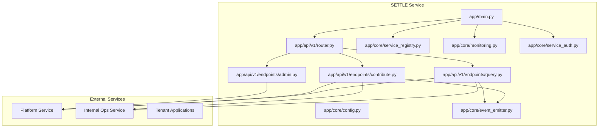
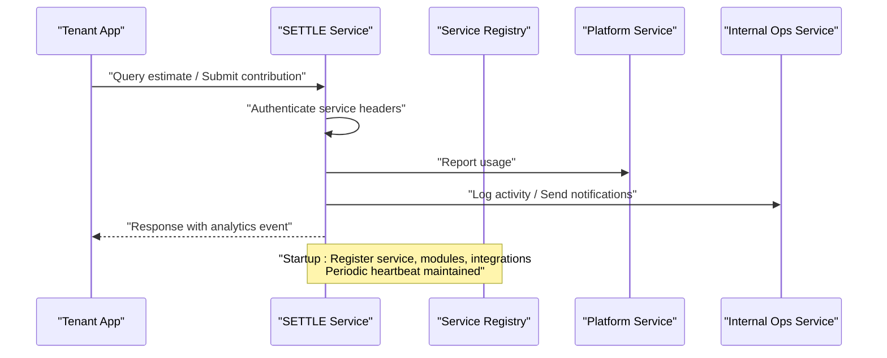
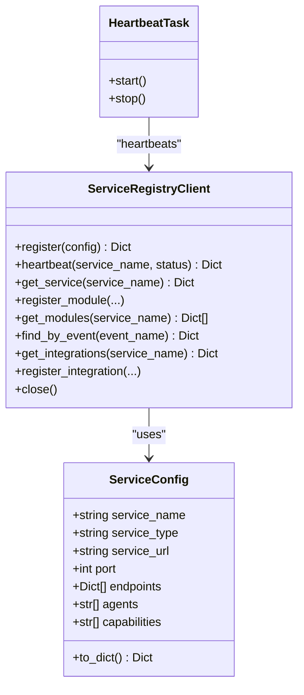
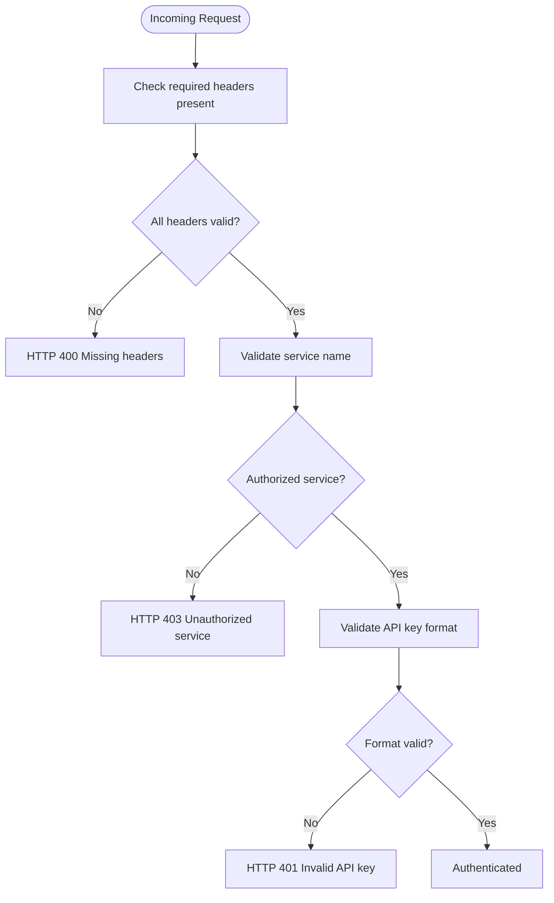
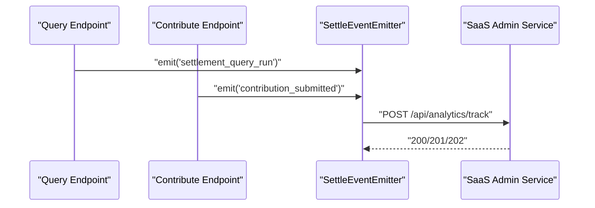
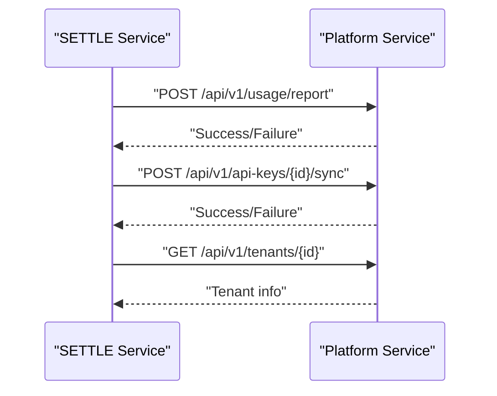
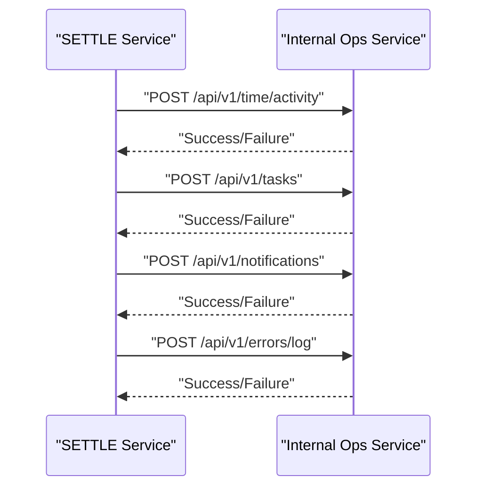
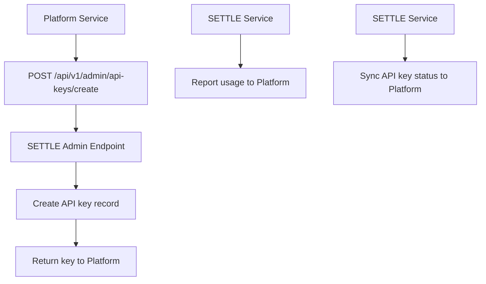
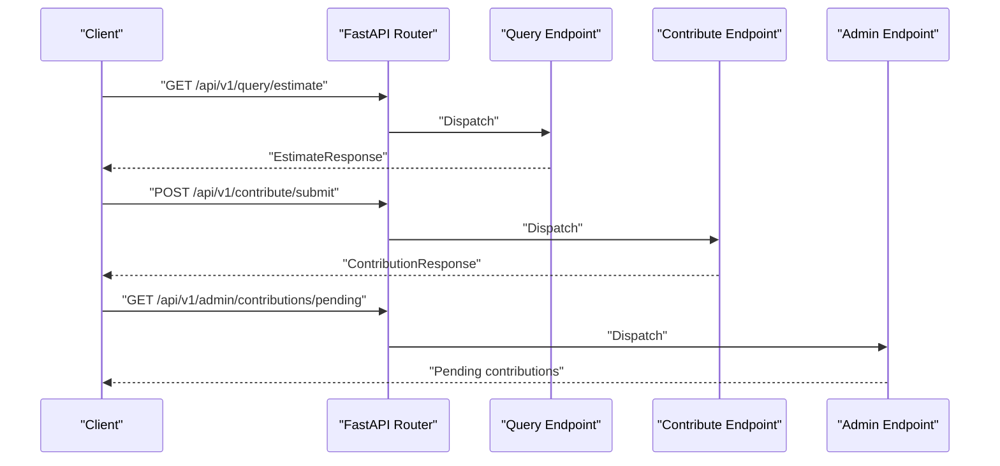
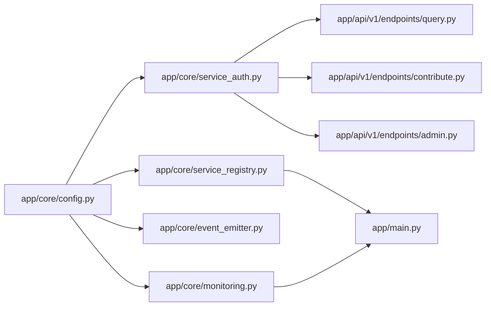

# Service Integration

<cite>
**Referenced Files in This Document**
- [app/main.py](file://app/main.py)
- [app/core/service_registry.py](file://app/core/service_registry.py)
- [app/core/event_emitter.py](file://app/core/event_emitter.py)
- [app/core/config.py](file://app/core/config.py)
- [app/core/monitoring.py](file://app/core/monitoring.py)
- [app/core/service_auth.py](file://app/core/service_auth.py)
- [app/models/api_keys.py](file://app/models/api_keys.py)
- [app/api/v1/router.py](file://app/api/v1/router.py)
- [app/api/v1/endpoints/admin.py](file://app/api/v1/endpoints/admin.py)
- [app/api/v1/endpoints/contribute.py](file://app/api/v1/endpoints/contribute.py)
- [app/api/v1/endpoints/query.py](file://app/api/v1/endpoints/query.py)
- [app/models/case_bank.py](file://app/models/case_bank.py)
- [app/services/integrations/platform/client.py](file://app/services/integrations/platform/client.py)
- [app/services/integrations/internal_ops/client.py](file://app/services/integrations/internal_ops/client.py)
- [docs/INTEGRATION_GUIDE.md](file://docs/INTEGRATION_GUIDE.md)
</cite>

## Table of Contents
1. [Introduction](#introduction)
2. [Project Structure](#project-structure)
3. [Core Components](#core-components)
4. [Architecture Overview](#architecture-overview)
5. [Detailed Component Analysis](#detailed-component-analysis)
6. [Dependency Analysis](#dependency-analysis)
7. [Performance Considerations](#performance-considerations)
8. [Troubleshooting Guide](#troubleshooting-guide)
9. [Conclusion](#conclusion)
10. [Appendices](#appendices)

## Introduction
This document describes the SETTLE Service integration patterns with TrueVow’s broader 5-service architecture. It covers the service registry architecture, event-driven communication, cross-service collaboration, and integration contracts with Platform Service, Internal Ops Service, and Tenant applications. It also specifies API key provisioning, usage tracking, and service health monitoring, along with event emission patterns, notification systems, inter-service messaging protocols, integration testing strategies, error handling, and service discovery mechanisms.

## Project Structure
The SETTLE Service is a FastAPI application that exposes public and authenticated endpoints, integrates with internal services for operational tasks, and participates in the TrueVow service mesh via a central Service Registry and standardized service-to-service authentication.

**Diagram sources**
- [app/main.py:102-157](file://app/main.py#L102-L157)
- [app/api/v1/router.py:1-26](file://app/api/v1/router.py#L1-L26)
- [app/api/v1/endpoints/query.py:1-119](file://app/api/v1/endpoints/query.py#L1-L119)
- [app/api/v1/endpoints/contribute.py:1-164](file://app/api/v1/endpoints/contribute.py#L1-L164)
- [app/api/v1/endpoints/admin.py:1-756](file://app/api/v1/endpoints/admin.py#L1-L756)
- [app/core/service_registry.py:47-355](file://app/core/service_registry.py#L47-L355)
- [app/core/event_emitter.py:44-88](file://app/core/event_emitter.py#L44-L88)
- [app/core/monitoring.py:14-306](file://app/core/monitoring.py#L14-L306)
- [app/core/service_auth.py:20-376](file://app/core/service_auth.py#L20-L376)

**Section sources**
- [app/main.py:102-157](file://app/main.py#L102-L157)
- [app/api/v1/router.py:1-26](file://app/api/v1/router.py#L1-L26)

## Core Components
- Service Registry Client and Heartbeat: Registers the service, modules, and integrations; maintains liveness via periodic heartbeats.
- Service Authentication: Enforces service-to-service authentication with required headers and API key validation.
- Configuration: Centralized settings for service URLs, timeouts, API keys, and feature flags.
- Event Emitter: Fire-and-forget behavioral event emission to SaaS Admin for analytics.
- Monitoring: Sentry integration for error tracking, performance monitoring, and compliance-aware filtering.
- Platform Service Client: Reports usage, synchronizes API key status, and fetches tenant info.
- Internal Ops Service Client: Logs activity, creates tasks, sends notifications, and records errors.

**Section sources**
- [app/core/service_registry.py:47-355](file://app/core/service_registry.py#L47-L355)
- [app/core/service_auth.py:20-376](file://app/core/service_auth.py#L20-L376)
- [app/core/config.py:23-351](file://app/core/config.py#L23-L351)
- [app/core/event_emitter.py:44-88](file://app/core/event_emitter.py#L44-L88)
- [app/core/monitoring.py:14-306](file://app/core/monitoring.py#L14-L306)
- [app/services/integrations/platform/client.py:19-146](file://app/services/integrations/platform/client.py#L19-L146)
- [app/services/integrations/internal_ops/client.py:19-244](file://app/services/integrations/internal_ops/client.py#L19-L244)

## Architecture Overview
SETTLE participates in the TrueVow 5-service architecture. It registers itself with the Service Registry, authenticates service-to-service calls, emits behavioral events, and collaborates with Platform and Internal Ops for operational workflows.

**Diagram sources**
- [app/main.py:52-100](file://app/main.py#L52-L100)
- [app/core/service_registry.py:64-214](file://app/core/service_registry.py#L64-L214)
- [app/services/integrations/platform/client.py:34-84](file://app/services/integrations/platform/client.py#L34-L84)
- [app/services/integrations/internal_ops/client.py:34-84](file://app/services/integrations/internal_ops/client.py#L34-L84)

## Detailed Component Analysis

### Service Registry and Discovery
- Registration: On startup, the service registers itself, its modules, and integration contracts with the Service Registry.
- Heartbeat: A background task periodically sends heartbeat signals to maintain liveness.
- Discovery: Provides convenience functions to resolve service URLs and find services by event.

**Diagram sources**
- [app/core/service_registry.py:24-264](file://app/core/service_registry.py#L24-L264)
- [app/core/service_registry.py:47-244](file://app/core/service_registry.py#L47-L244)

**Section sources**
- [app/main.py:60-90](file://app/main.py#L60-L90)
- [app/core/service_registry.py:64-214](file://app/core/service_registry.py#L64-L214)

### Service-to-Service Authentication
- Required headers: X-Service-Name, X-Request-ID, X-Request-Timestamp, Authorization (Bearer <service-api-key>).
- Authorized services: Platform, Internal Ops, Sales, Support, Tenant services.
- API key format: Must start with a service-specific prefix; in development, mock acceptance is supported.

**Diagram sources**
- [app/core/service_auth.py:53-180](file://app/core/service_auth.py#L53-L180)

**Section sources**
- [app/core/service_auth.py:20-180](file://app/core/service_auth.py#L20-L180)

### Event Emission and Analytics
- Behavioral events are emitted fire-and-forget to SaaS Admin for analytics.
- Supported event types include settlement query runs, report generation/export, and contribution submissions.
- Emission is non-blocking and logs warnings on failures.

**Diagram sources**
- [app/api/v1/endpoints/query.py:84-98](file://app/api/v1/endpoints/query.py#L84-L98)
- [app/api/v1/endpoints/contribute.py:111-124](file://app/api/v1/endpoints/contribute.py#L111-L124)
- [app/core/event_emitter.py:56-88](file://app/core/event_emitter.py#L56-L88)

**Section sources**
- [app/core/event_emitter.py:44-88](file://app/core/event_emitter.py#L44-L88)
- [app/api/v1/endpoints/query.py:84-98](file://app/api/v1/endpoints/query.py#L84-L98)
- [app/api/v1/endpoints/contribute.py:111-124](file://app/api/v1/endpoints/contribute.py#L111-L124)

### Platform Service Integration
- Usage reporting: Reports usage events for billing and analytics.
- API key synchronization: Syncs status, last-used timestamps, and request counts.
- Tenant info retrieval: Fetches tenant details for provisioning callbacks.

**Diagram sources**
- [app/services/integrations/platform/client.py:34-140](file://app/services/integrations/platform/client.py#L34-L140)

**Section sources**
- [app/services/integrations/platform/client.py:19-146](file://app/services/integrations/platform/client.py#L19-L146)

### Internal Ops Service Integration
- Activity logging: Records time spent on SETTLE tasks for billing and analytics.
- Task creation: Creates internal tasks for contribution reviews and support.
- Notifications: Sends alerts to users for pending actions.
- Error logging: Captures errors for tracking and alerting.

**Diagram sources**
- [app/services/integrations/internal_ops/client.py:34-238](file://app/services/integrations/internal_ops/client.py#L34-L238)

**Section sources**
- [app/services/integrations/internal_ops/client.py:19-244](file://app/services/integrations/internal_ops/client.py#L19-L244)

### API Key Provisioning and Usage Tracking
- Provisioning: Platform Service calls SETTLE Admin API to create tenant API keys with access levels and limits.
- Usage tracking: SETTLE reports usage to Platform for billing and analytics.
- Status sync: SETTLE syncs API key status changes to Platform.
- Data models: API key and founding member models define structure and validation.

**Diagram sources**
- [app/api/v1/endpoints/admin.py:425-463](file://app/api/v1/endpoints/admin.py#L425-L463)
- [app/services/integrations/platform/client.py:34-122](file://app/services/integrations/platform/client.py#L34-L122)
- [app/models/api_keys.py:11-147](file://app/models/api_keys.py#L11-L147)

**Section sources**
- [app/api/v1/endpoints/admin.py:425-550](file://app/api/v1/endpoints/admin.py#L425-L550)
- [app/services/integrations/platform/client.py:34-122](file://app/services/integrations/platform/client.py#L34-L122)
- [app/models/api_keys.py:11-147](file://app/models/api_keys.py#L11-L147)

### Endpoints and Contracts
- Query endpoint: Settlement range estimation with validation and event emission.
- Contribution endpoint: Submission of anonymized case data with compliance checks and event emission.
- Admin endpoints: Pending contributions, approvals, rejections, and analytics dashboards.
- Router: Aggregates public, authenticated, admin, and webhook endpoints.

**Diagram sources**
- [app/api/v1/router.py:5-25](file://app/api/v1/router.py#L5-L25)
- [app/api/v1/endpoints/query.py:20-98](file://app/api/v1/endpoints/query.py#L20-L98)
- [app/api/v1/endpoints/contribute.py:51-125](file://app/api/v1/endpoints/contribute.py#L51-L125)
- [app/api/v1/endpoints/admin.py:31-89](file://app/api/v1/endpoints/admin.py#L31-L89)

**Section sources**
- [app/api/v1/router.py:1-26](file://app/api/v1/router.py#L1-L26)
- [app/api/v1/endpoints/query.py:1-119](file://app/api/v1/endpoints/query.py#L1-L119)
- [app/api/v1/endpoints/contribute.py:1-164](file://app/api/v1/endpoints/contribute.py#L1-L164)
- [app/api/v1/endpoints/admin.py:1-756](file://app/api/v1/endpoints/admin.py#L1-L756)

### Data Models and Validation
- Case bank models define request/response shapes for queries and contributions, including jurisdiction formatting, outcome ranges, and validation constants.
- Pydantic models enforce data integrity and provide structured responses.

**Section sources**
- [app/models/case_bank.py:69-269](file://app/models/case_bank.py#L69-L269)

## Dependency Analysis
- Configuration drives service URLs, timeouts, API keys, and feature flags for all integrations.
- Monitoring integrates Sentry for error tracking and performance profiling with compliance-aware filtering.
- Authentication enforces strict service-to-service contracts across the ecosystem.

**Diagram sources**
- [app/core/config.py:23-351](file://app/core/config.py#L23-L351)
- [app/core/service_auth.py:20-376](file://app/core/service_auth.py#L20-L376)
- [app/core/service_registry.py:47-355](file://app/core/service_registry.py#L47-L355)
- [app/core/event_emitter.py:44-88](file://app/core/event_emitter.py#L44-L88)
- [app/core/monitoring.py:14-306](file://app/core/monitoring.py#L14-L306)
- [app/api/v1/endpoints/query.py:1-119](file://app/api/v1/endpoints/query.py#L1-L119)
- [app/api/v1/endpoints/contribute.py:1-164](file://app/api/v1/endpoints/contribute.py#L1-L164)
- [app/api/v1/endpoints/admin.py:1-756](file://app/api/v1/endpoints/admin.py#L1-L756)
- [app/main.py:102-157](file://app/main.py#L102-L157)

**Section sources**
- [app/core/config.py:23-351](file://app/core/config.py#L23-L351)
- [app/core/monitoring.py:14-306](file://app/core/monitoring.py#L14-L306)

## Performance Considerations
- Response time targets are defined in configuration for query and report generation.
- Rate limiting is configurable per access level.
- Asynchronous clients and fire-and-forget emissions minimize latency impact.
- Caching and connection pooling are configured via database and Redis settings.

[No sources needed since this section provides general guidance]

## Troubleshooting Guide
- Authentication failures: Missing or invalid headers, unauthorized service, or malformed API key.
- Service timeouts: Increase timeouts or retry with backoff; verify upstream service availability.
- Sentry integration: Ensure DSN is configured; verify before-send hooks for compliance.
- Health endpoints: Use service-specific health checks to validate operational status.

**Section sources**
- [app/core/service_auth.py:53-180](file://app/core/service_auth.py#L53-L180)
- [app/core/monitoring.py:14-306](file://app/core/monitoring.py#L14-L306)
- [app/api/v1/endpoints/query.py:110-118](file://app/api/v1/endpoints/query.py#L110-L118)
- [app/api/v1/endpoints/contribute.py:155-163](file://app/api/v1/endpoints/contribute.py#L155-L163)
- [app/api/v1/endpoints/admin.py:738-755](file://app/api/v1/endpoints/admin.py#L738-L755)

## Conclusion
SETTLE integrates tightly with TrueVow’s 5-service architecture through a robust service registry, standardized authentication, and event-driven collaboration. Its integration contracts with Platform and Internal Ops enable secure, auditable, and observable operations, while its Admin APIs support tenant onboarding and analytics. The documented patterns and configurations provide a reliable foundation for multi-service collaboration and scalable operations.

[No sources needed since this section summarizes without analyzing specific files]

## Appendices

### Integration Testing Strategies
- Unit tests for validators, estimators, and services.
- Integration tests validating service-to-service flows with mocked clients.
- End-to-end scenarios covering query, contribution, and admin workflows.
- Load and chaos testing to validate resilience and performance targets.

**Section sources**
- [docs/INTEGRATION_GUIDE.md:1-800](file://docs/INTEGRATION_GUIDE.md#L1-L800)

### Service Discovery and Contracts
- Service Registry provides discovery and event-based routing.
- Contracts specify required headers, endpoints, and capabilities for each module and integration.

**Section sources**
- [app/core/service_registry.py:149-208](file://app/core/service_registry.py#L149-L208)
- [app/core/service_registry.py:267-334](file://app/core/service_registry.py#L267-L334)