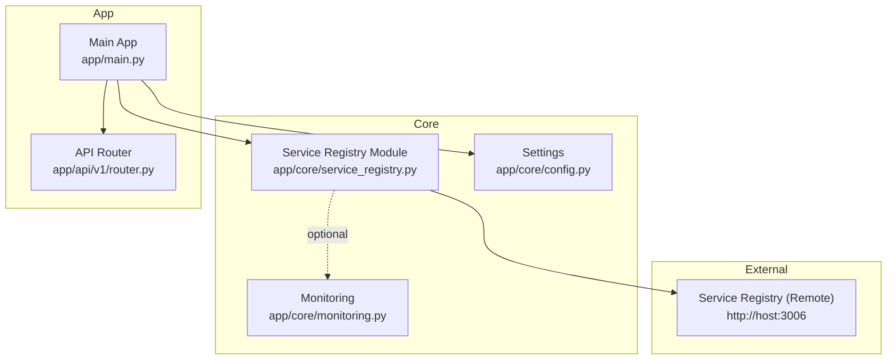
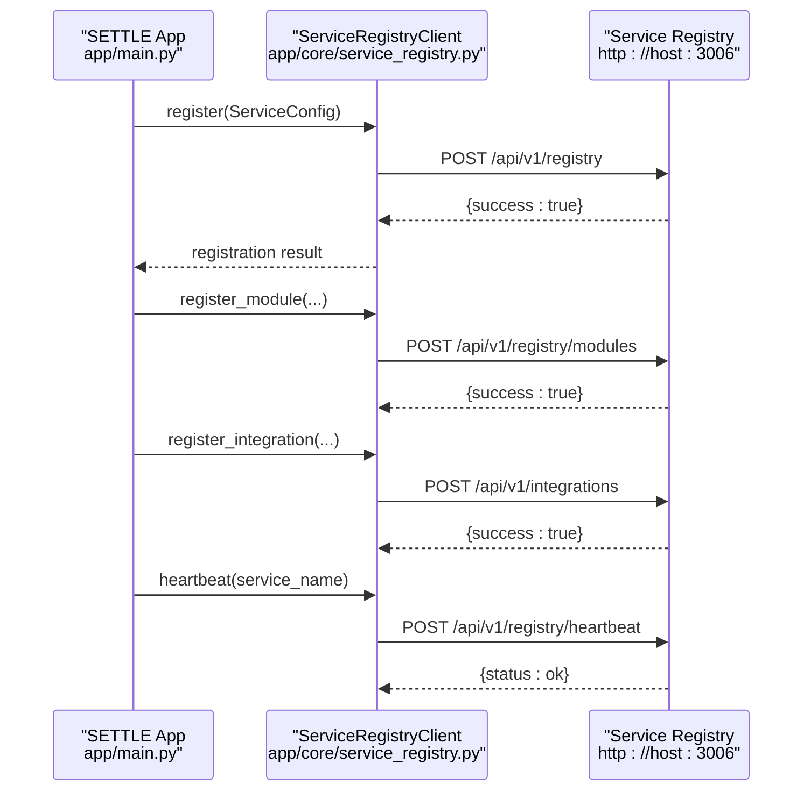
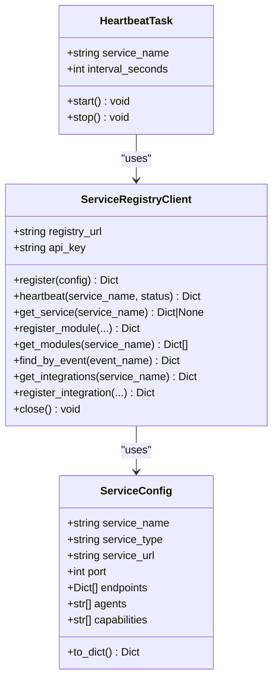
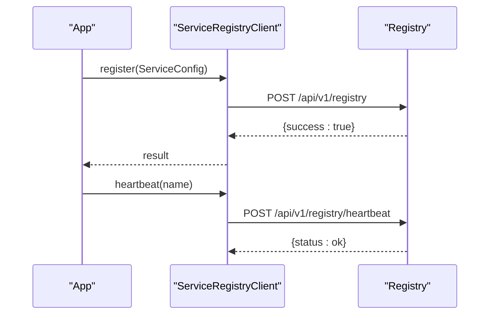
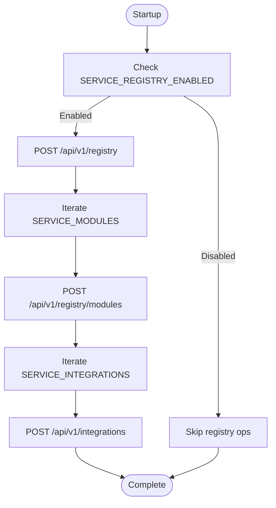
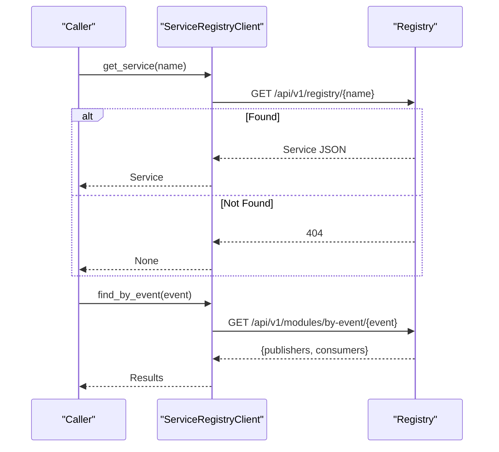
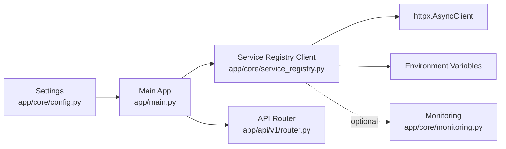

# Service Registry

<cite>
**Referenced Files in This Document**
- [service_registry.py](file://app/core/service_registry.py)
- [main.py](file://app/main.py)
- [config.py](file://app/core/config.py)
- [env.template](file://env.template)
- [router.py](file://app/api/v1/router.py)
- [test_registry.py](file://test_registry.py)
- [test_registry2.py](file://test_registry2.py)
- [fix_registry.py](file://fix_registry.py)
- [monitoring.py](file://app/core/monitoring.py)
- [event_emitter.py](file://app/core/event_emitter.py)
</cite>

## Table of Contents
1. [Introduction](#introduction)
2. [Project Structure](#project-structure)
3. [Core Components](#core-components)
4. [Architecture Overview](#architecture-overview)
5. [Detailed Component Analysis](#detailed-component-analysis)
6. [Dependency Analysis](#dependency-analysis)
7. [Performance Considerations](#performance-considerations)
8. [Troubleshooting Guide](#troubleshooting-guide)
9. [Conclusion](#conclusion)
10. [Appendices](#appendices)

## Introduction
This document explains the Service Registry integration pattern used by the SETTLE service. It covers the ServiceRegistryClient architecture, service registration and heartbeat mechanisms, service discovery capabilities, the ServiceConfig data structure, module registration system, and integration contract management. It also documents the service configuration system, environment variable requirements, fail-safe mechanisms, availability checks, error handling strategies, and integration testing approaches.

## Project Structure
The Service Registry integration is centered around a dedicated core module that encapsulates HTTP client behavior, configuration, and lifecycle tasks. The main application wires the registry client into its startup/shutdown lifecycle.

**Diagram sources**
- [service_registry.py](file://app/core/service_registry.py)
- [main.py](file://app/main.py)
- [config.py](file://app/core/config.py)
- [router.py](file://app/api/v1/router.py)

**Section sources**
- [service_registry.py](file://app/core/service_registry.py)
- [main.py](file://app/main.py)
- [config.py](file://app/core/config.py)
- [router.py](file://app/api/v1/router.py)

## Core Components
- ServiceRegistryClient: Async HTTP client that registers services, publishes heartbeats, discovers services and modules, and manages integration contracts.
- ServiceConfig: Data structure representing a service’s identity, network location, and capabilities.
- HeartbeatTask: Background task that periodically pings the registry to maintain liveness.
- Global configuration and convenience helpers: Settings-driven defaults, module definitions, integration definitions, and a fail-fast service lookup helper.

Key responsibilities:
- Registration: POST /api/v1/registry with ServiceConfig payload.
- Heartbeat: POST /api/v1/registry/heartbeat with service name and status.
- Discovery: GET /api/v1/registry/{service_name}, GET /api/v1/registry/{service_name}/modules, GET /api/v1/modules/by-event/{event_name}.
- Modules: POST /api/v1/registry/modules with module metadata and event contracts.
- Integrations: POST /api/v1/integrations with integration contract metadata.

**Section sources**
- [service_registry.py](file://app/core/service_registry.py)
- [config.py](file://app/core/config.py)

## Architecture Overview
The SETTLE service registers itself with the central Service Registry during startup, then maintains liveness via periodic heartbeats. It also registers feature modules and integration contracts. Discovery APIs enable other services to locate SETTLE and its capabilities.

**Diagram sources**
- [main.py](file://app/main.py)
- [service_registry.py](file://app/core/service_registry.py)

## Detailed Component Analysis

### ServiceRegistryClient
Responsibilities:
- Build and reuse an async HTTP client with a base URL and short timeout.
- Register the service with the registry using ServiceConfig.
- Send periodic heartbeats.
- Discover services, modules, and integration partners.
- Manage integration contracts between services.

API surface:
- register(config): POST /api/v1/registry
- heartbeat(service_name, status): POST /api/v1/registry/heartbeat
- get_service(service_name): GET /api/v1/registry/{service_name}
- register_module(...): POST /api/v1/registry/modules
- get_modules(service_name): GET /api/v1/registry/{service_name}/modules
- find_by_event(event_name): GET /api/v1/modules/by-event/{event_name}
- get_integrations(service_name): GET /api/v1/integrations/{service_name}
- register_integration(...): POST /api/v1/integrations
- close(): close underlying HTTP client

Error handling:
- Exceptions are caught and logged; failures return structured error payloads to avoid crashing the app.

Security:
- Optional API key header X-Registry-API-Key is attached when configured.

**Section sources**
- [service_registry.py](file://app/core/service_registry.py)

### ServiceConfig Data Structure
Fields:
- service_name: Unique logical name.
- service_type: Type/category of the service.
- service_url: Fully qualified base URL.
- port: Port number.
- endpoints: List of endpoint descriptors (path, method, description).
- agents: Optional agent identifiers.
- capabilities: Optional capability tags.

Serialization:
- to_dict() produces a JSON-serializable representation suitable for registration.

**Section sources**
- [service_registry.py](file://app/core/service_registry.py)

### HeartbeatTask
Behavior:
- Runs a background task that periodically calls heartbeat at a configurable interval.
- Starts/stops the task and ensures resources are closed on shutdown.

Defaults:
- Interval is controlled by settings.SERVICE_HEARTBEAT_INTERVAL_S (default 300 seconds).

**Section sources**
- [service_registry.py](file://app/core/service_registry.py)
- [config.py](file://app/core/config.py)

### Module Registration System
SETTLE predefines module configurations that are registered at startup. Each module includes:
- service_name: Target service.
- module_name: Logical module identifier.
- module_version: Semver string.
- description: Human-readable description.
- endpoints: API endpoints exposed by the module.
- events_published: Events emitted by the module.
- events_consumed: Events subscribed to by the module.

Registration flow:
- Iterates over SERVICE_MODULES and calls register_module for each.

**Section sources**
- [service_registry.py](file://app/core/service_registry.py)

### Integration Contract Management
SETTLE defines integration contracts that describe relationships with other services. Contracts include:
- source_service: Originating service.
- target_service: Partner service.
- integration_type: Contract type (e.g., service_registry, event_subscription).
- purpose: Human-readable intent.
- event_triggers: Trigger events for event_subscription.

Registration flow:
- Iterates over SERVICE_INTEGRATIONS and calls register_integration for each.

Discovery:
- get_integrations(service_name) returns integration partners.
- find_by_event(event_name) returns publishers and consumers for an event.

**Section sources**
- [service_registry.py](file://app/core/service_registry.py)

### Service Availability Checks and Fail-Fast Lookup
Convenience function:
- require_service(service_name) performs a discovery lookup and raises if the service is missing or inactive.

Usage pattern:
- Use during startup or critical flows where a dependency must be present.

**Section sources**
- [service_registry.py](file://app/core/service_registry.py)

### API Specifications

- Service Registration
  - Method: POST
  - Path: /api/v1/registry
  - Headers: Content-Type: application/json; optional X-Registry-API-Key
  - Body: ServiceConfig serialized to JSON
  - Response: JSON object indicating success or error

- Heartbeat
  - Method: POST
  - Path: /api/v1/registry/heartbeat
  - Headers: Content-Type: application/json; optional X-Registry-API-Key
  - Body: { service_name, status }
  - Response: JSON object with status

- Service Lookup
  - Method: GET
  - Path: /api/v1/registry/{service_name}
  - Response: JSON object for the service or null/None if not found

- Module Registration
  - Method: POST
  - Path: /api/v1/registry/modules
  - Headers: Content-Type: application/json; optional X-Registry-API-Key
  - Body: { service_name, module_name, module_version, description, endpoints, events_published, events_consumed }
  - Response: JSON object indicating success or error

- Module Discovery
  - Method: GET
  - Path: /api/v1/registry/{service_name}/modules
  - Response: JSON array of modules

- Event-Based Discovery
  - Method: GET
  - Path: /api/v1/modules/by-event/{event_name}
  - Response: { publishers: [...], consumers: [...] }

- Integration Registration
  - Method: POST
  - Path: /api/v1/integrations
  - Headers: Content-Type: application/json; optional X-Registry-API-Key
  - Body: { source_service, target_service, integration_type, purpose, event_triggers }
  - Response: JSON object indicating success or error

- Integration Discovery
  - Method: GET
  - Path: /api/v1/integrations/{service_name}
  - Response: { receives_from: [...], sends_to: [...] }

Heartbeat interval:
- Default: 300 seconds (5 minutes), configurable via settings.SERVICE_HEARTBEAT_INTERVAL_S.

**Section sources**
- [service_registry.py](file://app/core/service_registry.py)
- [config.py](file://app/core/config.py)

### Service Configuration System and Environment Variables
Core settings:
- SERVICE_REGISTRY_ENABLED: Enable/disable registry integration.
- SERVICE_REGISTRY_URL: Base URL of the registry.
- SERVICE_HEARTBEAT_INTERVAL_S: Heartbeat interval in seconds.

Service identity and endpoints:
- SERVICE_NAME, SERVICE_PORT, SERVICE_HOST determine the service identity and URL.
- Endpoints are defined in the module-level SETTLE_SERVICE_CONFIG.

Environment template:
- The repository provides a comprehensive environment template covering service configuration, database, Redis, security, and integration settings.

**Section sources**
- [config.py](file://app/core/config.py)
- [service_registry.py](file://app/core/service_registry.py)
- [env.template](file://env.template)

### Integration with Main Application Lifecycle
- Startup: If registry is enabled, the app registers the service, starts the heartbeat task, registers modules, and registers integrations.
- Shutdown: Stops the heartbeat task and closes the HTTP client.

**Section sources**
- [main.py](file://app/main.py)
- [service_registry.py](file://app/core/service_registry.py)

### API Router Context
- The API router mounts all service endpoints. While not directly part of registry logic, it provides the context for module endpoint definitions in the registry.

**Section sources**
- [router.py](file://app/api/v1/router.py)

## Architecture Overview

**Diagram sources**
- [service_registry.py](file://app/core/service_registry.py)

## Detailed Component Analysis

### Registration and Heartbeat Flow

**Diagram sources**
- [main.py](file://app/main.py)
- [service_registry.py](file://app/core/service_registry.py)

### Module and Integration Registration Flow

**Diagram sources**
- [main.py](file://app/main.py)
- [service_registry.py](file://app/core/service_registry.py)

### Service Discovery Flow

**Diagram sources**
- [service_registry.py](file://app/core/service_registry.py)

## Dependency Analysis
- ServiceRegistryClient depends on:
  - httpx.AsyncClient for HTTP operations.
  - Environment variables for registry URL and API key.
- Main application depends on:
  - Settings for enabling/disabling registry and configuring heartbeat interval.
  - ServiceRegistryClient for lifecycle operations.
- Monitoring integration is independent but complementary to registry logging.

**Diagram sources**
- [config.py](file://app/core/config.py)
- [main.py](file://app/main.py)
- [service_registry.py](file://app/core/service_registry.py)
- [router.py](file://app/api/v1/router.py)
- [monitoring.py](file://app/core/monitoring.py)

**Section sources**
- [config.py](file://app/core/config.py)
- [main.py](file://app/main.py)
- [service_registry.py](file://app/core/service_registry.py)
- [router.py](file://app/api/v1/router.py)
- [monitoring.py](file://app/core/monitoring.py)

## Performance Considerations
- Heartbeat interval: Default 300 seconds balances liveness detection with minimal overhead.
- HTTP client reuse: The client is lazily created and reused to avoid connection overhead.
- Timeout: Short client timeout prevents blocking operations.
- Discovery caching: Consider caching discovery results at the application layer if frequent lookups occur.

## Troubleshooting Guide
Common issues and remedies:
- Registry connectivity failures:
  - Verify SERVICE_REGISTRY_URL and network reachability.
  - Confirm SERVICE_REGISTRY_ENABLED setting.
- API key mismatches:
  - Ensure SERVICE_REGISTRY_API_KEY or SETTLE_SERVICE_API_KEY is set consistently across services.
  - Use the provided fix script to align accepted API keys on the registry side.
- Heartbeat failures:
  - Check heartbeat interval and network stability.
  - Review logs for warnings and errors.
- Service discovery returns None:
  - Confirm the service is registered and active.
  - Validate service_name spelling and casing.
- Integration registration failures:
  - Validate integration contract fields and event names.
- Testing registry connectivity:
  - Use provided test scripts to probe health endpoints and registry listings.

Operational checks:
- Use test_registry.py or test_registry2.py to validate connectivity to the registry and target services.
- Monitor logs for registration and heartbeat outcomes.

**Section sources**
- [test_registry.py](file://test_registry.py)
- [test_registry2.py](file://test_registry2.py)
- [fix_registry.py](file://fix_registry.py)
- [service_registry.py](file://app/core/service_registry.py)

## Conclusion
The SETTLE service integrates with the Service Registry through a clean, asynchronous client that handles registration, heartbeats, discovery, module registration, and integration contracts. The design emphasizes resilience via fail-safe patterns, structured error handling, and environment-driven configuration. The provided tests and scripts facilitate reliable integration testing and operational validation.

## Appendices

### Environment Variables Reference
- SERVICE_REGISTRY_ENABLED: Enable/disable registry integration.
- SERVICE_REGISTRY_URL: Base URL of the registry.
- SERVICE_REGISTRY_API_KEY or SETTLE_SERVICE_API_KEY: API key for registry requests.
- SERVICE_HEARTBEAT_INTERVAL_S: Heartbeat interval in seconds.
- SERVICE_NAME, SERVICE_PORT, SERVICE_HOST: Service identity and address.
- Additional settings for database, Redis, security, and cross-service integration are defined in the environment template.

**Section sources**
- [config.py](file://app/core/config.py)
- [service_registry.py](file://app/core/service_registry.py)
- [env.template](file://env.template)