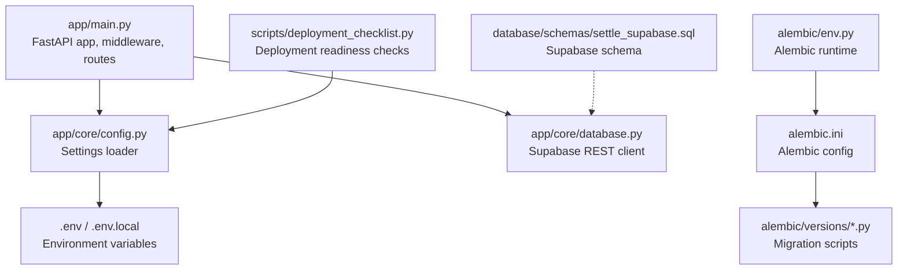
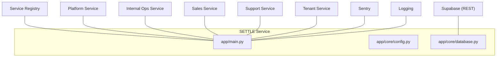
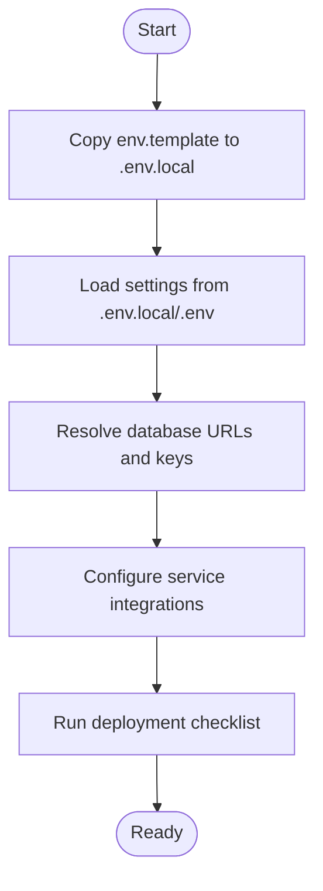
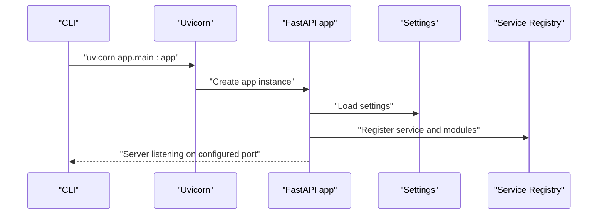
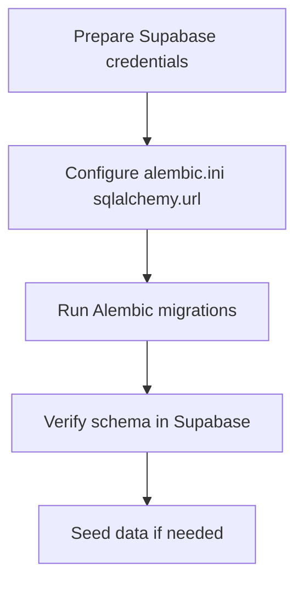
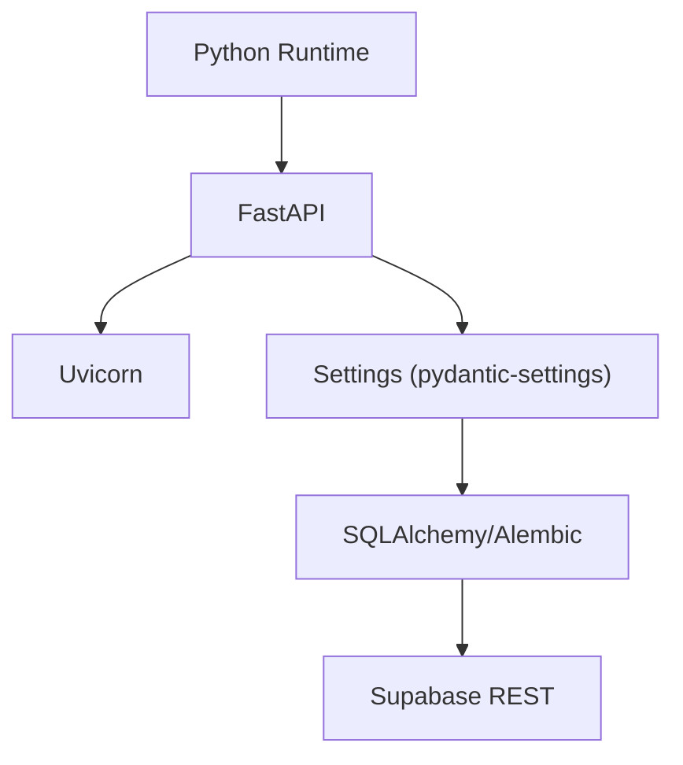

# Deployment Procedures

<cite>
**Referenced Files in This Document**
- [env.template](file://env.template)
- [requirements.txt](file://requirements.txt)
- [alembic.ini](file://alembic.ini)
- [app/main.py](file://app/main.py)
- [app/core/config.py](file://app/core/config.py)
- [app/core/database.py](file://app/core/database.py)
- [alembic/env.py](file://alembic/env.py)
- [database/schemas/settle_supabase.sql](file://database/schemas/settle_supabase.sql)
- [database/FIXES_APPLIED.md](file://database/FIXES_APPLIED.md)
- [scripts/deployment_checklist.py](file://scripts/deployment_checklist.py)
</cite>

## Table of Contents
1. [Introduction](#introduction)
2. [Project Structure](#project-structure)
3. [Core Components](#core-components)
4. [Architecture Overview](#architecture-overview)
5. [Detailed Component Analysis](#detailed-component-analysis)
6. [Dependency Analysis](#dependency-analysis)
7. [Performance Considerations](#performance-considerations)
8. [Troubleshooting Guide](#troubleshooting-guide)
9. [Conclusion](#conclusion)
10. [Appendices](#appendices)

## Introduction
This document provides end-to-end deployment procedures for the SETTLE Service. It covers environment preparation, dependency installation, service startup, multi-service environment setup, configuration management, database migration and schema initialization, data seeding, containerization considerations, orchestration setup, deployment checklists, pre-deployment validation, post-deployment verification, rollback strategies, blue-green deployment, zero-downtime techniques, environment-specific configurations, secrets management, and infrastructure provisioning.

## Project Structure
The repository follows a modular FastAPI application structure with configuration-driven settings, database abstraction, and migration tooling. Key areas relevant to deployment include:
- Application entrypoint and lifecycle management
- Configuration loading and environment variable precedence
- Database abstraction layer supporting Supabase REST API
- Alembic-based migrations
- Supabase schema definition
- Deployment validation checklist

**Diagram sources**
- [app/main.py:102-157](file://app/main.py#L102-L157)
- [app/core/config.py:23-351](file://app/core/config.py#L23-L351)
- [app/core/database.py:220-549](file://app/core/database.py#L220-L549)
- [alembic/env.py:1-79](file://alembic/env.py#L1-L79)
- [alembic.ini:1-117](file://alembic.ini#L1-L117)
- [database/schemas/settle_supabase.sql:1-505](file://database/schemas/settle_supabase.sql#L1-L505)
- [scripts/deployment_checklist.py:181-200](file://scripts/deployment_checklist.py#L181-L200)

**Section sources**
- [app/main.py:102-157](file://app/main.py#L102-L157)
- [app/core/config.py:23-351](file://app/core/config.py#L23-L351)
- [app/core/database.py:220-549](file://app/core/database.py#L220-L549)
- [alembic/env.py:1-79](file://alembic/env.py#L1-L79)
- [alembic.ini:1-117](file://alembic.ini#L1-L117)
- [database/schemas/settle_supabase.sql:1-505](file://database/schemas/settle_supabase.sql#L1-L505)
- [scripts/deployment_checklist.py:181-200](file://scripts/deployment_checklist.py#L181-L200)

## Core Components
- Application entrypoint initializes FastAPI, middleware, CORS, request ID tracing, and registers with the service registry.
- Configuration loads environment variables from .env.local or .env with flexible naming conventions and provider-agnostic database settings.
- Database layer abstracts Supabase REST API usage and includes retry logic and health checks.
- Alembic manages schema migrations with offline/online modes.
- Supabase schema defines production-ready tables, views, policies, and indexes.
- Deployment checklist validates environment variables, documentation presence, core files, and test availability.

**Section sources**
- [app/main.py:102-157](file://app/main.py#L102-L157)
- [app/core/config.py:23-351](file://app/core/config.py#L23-L351)
- [app/core/database.py:412-549](file://app/core/database.py#L412-L549)
- [alembic/env.py:29-79](file://alembic/env.py#L29-L79)
- [database/schemas/settle_supabase.sql:1-505](file://database/schemas/settle_supabase.sql#L1-L505)
- [scripts/deployment_checklist.py:21-194](file://scripts/deployment_checklist.py#L21-L194)

## Architecture Overview
The deployment architecture integrates the SETTLE Service with external systems and infrastructure:
- Service Registry for discovery and heartbeats
- Supabase for data persistence
- Optional integrations with Platform, Internal Ops, Sales, Support, and Tenant services
- Monitoring via Sentry and logging configuration
- Health endpoints and graceful shutdown handling

**Diagram sources**
- [app/main.py:16-100](file://app/main.py#L16-L100)
- [app/core/config.py:254-318](file://app/core/config.py#L254-L318)
- [app/core/database.py:412-463](file://app/core/database.py#L412-L463)

**Section sources**
- [app/main.py:16-100](file://app/main.py#L16-L100)
- [app/core/config.py:254-318](file://app/core/config.py#L254-L318)
- [app/core/database.py:412-463](file://app/core/database.py#L412-L463)

## Detailed Component Analysis

### Environment Preparation and Configuration Management
- Copy the environment template to .env or .env.local and set environment-specific values.
- The configuration supports both SETTLE_ prefixed and unprefixed variables for backward compatibility and provider-agnostic naming.
- Database configuration accepts multiple naming conventions and resolves provider-specific keys.
- Service-to-service integration variables enable optional integrations with Platform, Internal Ops, Sales, Support, and Tenant services.
- Secrets such as JWT, API keys, and provider credentials are managed via environment variables.

**Diagram sources**
- [env.template:1-201](file://env.template#L1-L201)
- [app/core/config.py:23-351](file://app/core/config.py#L23-L351)
- [scripts/deployment_checklist.py:21-78](file://scripts/deployment_checklist.py#L21-L78)

**Section sources**
- [env.template:1-201](file://env.template#L1-L201)
- [app/core/config.py:23-351](file://app/core/config.py#L23-L351)
- [scripts/deployment_checklist.py:21-78](file://scripts/deployment_checklist.py#L21-L78)

### Dependency Installation
- Install Python dependencies using the provided requirements file.
- Ensure Python virtual environment is activated before installation.
- Confirm dependency versions align with FastAPI, SQLAlchemy, Alembic, and optional integrations.

**Section sources**
- [requirements.txt:1-53](file://requirements.txt#L1-L53)

### Service Startup
- Start the service using Uvicorn with the application factory pattern.
- The application exposes health and documentation endpoints.
- CORS and request ID middleware are registered at startup.
- Service Registry registration and heartbeat tasks are managed during lifespan.

**Diagram sources**
- [app/main.py:102-157](file://app/main.py#L102-L157)
- [app/core/config.py:348-351](file://app/core/config.py#L348-L351)

**Section sources**
- [app/main.py:102-157](file://app/main.py#L102-L157)

### Multi-Service Environment Setup
- Configure service-to-service integration endpoints and API keys for Platform, Internal Ops, Sales, Support, and Tenant services.
- Enable or disable integrations based on environment.
- Use environment variables to control timeouts and feature flags.

**Section sources**
- [env.template:55-82](file://env.template#L55-L82)
- [app/core/config.py:254-318](file://app/core/config.py#L254-L318)

### Database Migration Procedures and Schema Initialization
- Alembic configuration defines migration script location and logging.
- Use Alembic offline/online modes to run migrations against the configured database URL.
- Supabase schema includes production-ready tables, indexes, views, policies, and constraints.

**Diagram sources**
- [alembic.ini:63-63](file://alembic.ini#L63-L63)
- [alembic/env.py:29-79](file://alembic/env.py#L29-L79)
- [database/schemas/settle_supabase.sql:1-505](file://database/schemas/settle_supabase.sql#L1-L505)

**Section sources**
- [alembic.ini:1-117](file://alembic.ini#L1-L117)
- [alembic/env.py:29-79](file://alembic/env.py#L29-L79)
- [database/schemas/settle_supabase.sql:1-505](file://database/schemas/settle_supabase.sql#L1-L505)

### Data Seeding Processes
- The Supabase schema includes sample data insertion for testing.
- Use the provided test script to verify Supabase connectivity and table existence.
- Apply fixes documented in the fixes applied guide for migration from legacy schemas.

**Section sources**
- [database/schemas/settle_supabase.sql:452-505](file://database/schemas/settle_supabase.sql#L452-L505)
- [database/FIXES_APPLIED.md:165-207](file://database/FIXES_APPLIED.md#L165-L207)

### Containerization Requirements and Orchestration Setup
- The environment template includes Docker image and registry configuration placeholders.
- Define container ports, health checks, and graceful shutdown timeouts.
- Use environment variables for configuration inside containers.
- Orchestration platforms can leverage health endpoints and environment-driven configuration.

**Section sources**
- [env.template:184-196](file://env.template#L184-L196)
- [app/main.py:148-157](file://app/main.py#L148-L157)

### Deployment Checklists and Validation
- The deployment checklist script validates environment variables, documentation, core files, and test availability.
- Use the checklist to ensure readiness before running tests and deploying to environments.

**Section sources**
- [scripts/deployment_checklist.py:21-194](file://scripts/deployment_checklist.py#L21-L194)

### Pre-Deployment Validation Steps
- Verify environment variables for service name, version, environment, and database credentials.
- Confirm optional integration variables are set appropriately.
- Ensure all documentation and core files exist.
- Run the deployment checklist and address failures.

**Section sources**
- [scripts/deployment_checklist.py:21-78](file://scripts/deployment_checklist.py#L21-L78)

### Post-Deployment Verification Procedures
- Call the health endpoint to confirm service status.
- Validate database connectivity and basic query execution.
- Confirm Service Registry registration and heartbeat activity.
- Monitor logs and Sentry for errors.

**Section sources**
- [app/main.py:148-157](file://app/main.py#L148-L157)
- [app/core/database.py:509-549](file://app/core/database.py#L509-L549)

### Rollback Procedures
- Revert to the previous container image tag or Git commit.
- Downgrade database schema using Alembic to the prior revision.
- Restore environment variables and secrets to previous values.
- Validate rollback using health checks and minimal functional tests.

**Section sources**
- [alembic/env.py:29-79](file://alembic/env.py#L29-L79)

### Blue-Green Deployment Strategies
- Maintain two identical environments (green and blue).
- Route traffic to the green environment.
- Deploy updates to the blue environment and run validation.
- Switch traffic to the blue environment upon success; retain green for quick rollback.

[No sources needed since this section provides general guidance]

### Zero-Downtime Deployment Techniques
- Use rolling restarts with readiness probes.
- Leverage health checks and graceful shutdown timeouts.
- Employ read replicas or read-only fallbacks during maintenance windows.
- Use feature flags to disable risky features during deployment.

**Section sources**
- [env.template:190-196](file://env.template#L190-L196)
- [app/main.py:93-100](file://app/main.py#L93-L100)

### Environment-Specific Configurations
- Use .env.local for multi-service setups and override values.
- Set environment to development, staging, or production to control behavior.
- Adjust logging, monitoring, and rate limiting per environment.

**Section sources**
- [app/core/config.py:340-345](file://app/core/config.py#L340-L345)

### Secrets Management
- Store secrets in environment variables.
- Avoid committing secrets to version control.
- Use CI/CD secret managers for automation.
- Rotate secrets regularly and update environment variables accordingly.

[No sources needed since this section provides general guidance]

### Infrastructure Provisioning
- Provision Supabase project and configure database credentials.
- Create service account keys and configure RLS policies.
- Set up monitoring and alerting (Sentry, Slack).
- Configure DNS, SSL/TLS, and load balancers as needed.

**Section sources**
- [database/schemas/settle_supabase.sql:402-435](file://database/schemas/settle_supabase.sql#L402-L435)
- [env.template:154-161](file://env.template#L154-L161)

## Dependency Analysis
The deployment relies on:
- FastAPI and Uvicorn for the web server
- SQLAlchemy and Alembic for ORM and migrations
- Supabase REST client abstraction for database operations
- Pydantic settings for configuration management
- Optional integrations for platform services

**Diagram sources**
- [requirements.txt:2-11](file://requirements.txt#L2-L11)
- [app/core/config.py:9-31](file://app/core/config.py#L9-L31)
- [app/core/database.py:15-17](file://app/core/database.py#L15-L17)

**Section sources**
- [requirements.txt:1-53](file://requirements.txt#L1-L53)
- [app/core/config.py:9-31](file://app/core/config.py#L9-L31)
- [app/core/database.py:15-17](file://app/core/database.py#L15-L17)

## Performance Considerations
- Tune database pool size and overflow based on workload.
- Enable query caching and adjust TTL for optimal performance.
- Monitor query timeouts and optimize slow queries.
- Use indexes defined in the Supabase schema for common query patterns.

[No sources needed since this section provides general guidance]

## Troubleshooting Guide
- Use the deployment checklist to identify missing environment variables or files.
- Validate Supabase connectivity with the provided test script.
- Inspect logs and Sentry for runtime errors.
- Confirm CORS settings and request ID tracing for debugging.

**Section sources**
- [scripts/deployment_checklist.py:21-194](file://scripts/deployment_checklist.py#L21-L194)
- [database/FIXES_APPLIED.md:165-207](file://database/FIXES_APPLIED.md#L165-L207)

## Conclusion
This document outlines a comprehensive deployment strategy for the SETTLE Service, covering environment preparation, configuration management, dependency installation, service startup, database migrations, schema initialization, data seeding, containerization, orchestration, validation, rollback, blue-green deployments, zero-downtime techniques, and infrastructure provisioning. Adhering to these procedures ensures reliable and repeatable deployments across environments.

## Appendices
- Environment template reference for all supported variables
- Supabase schema reference for production tables and policies
- Alembic configuration reference for migration execution

**Section sources**
- [env.template:1-201](file://env.template#L1-L201)
- [database/schemas/settle_supabase.sql:1-505](file://database/schemas/settle_supabase.sql#L1-L505)
- [alembic.ini:1-117](file://alembic.ini#L1-L117)