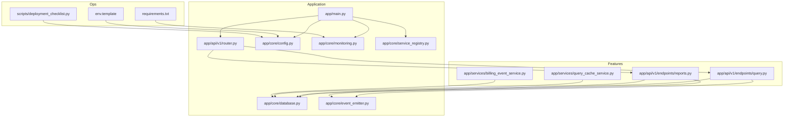
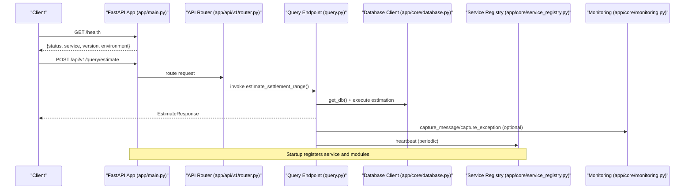
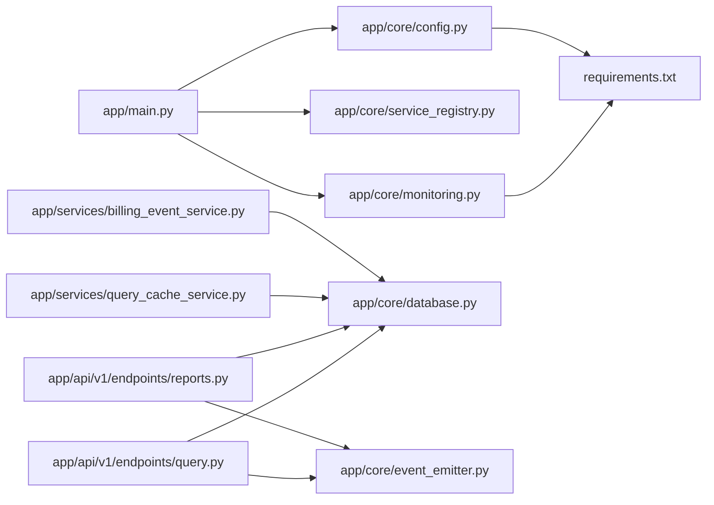

# Operations & Monitoring

<cite>
**Referenced Files in This Document**
- [app/main.py](file://app/main.py)
- [app/core/monitoring.py](file://app/core/monitoring.py)
- [app/core/config.py](file://app/core/config.py)
- [app/core/database.py](file://app/core/database.py)
- [app/core/service_registry.py](file://app/core/service_registry.py)
- [app/core/event_emitter.py](file://app/core/event_emitter.py)
- [app/api/v1/router.py](file://app/api/v1/router.py)
- [app/api/v1/endpoints/query.py](file://app/api/v1/endpoints/query.py)
- [app/api/v1/endpoints/reports.py](file://app/api/v1/endpoints/reports.py)
- [app/services/query_cache_service.py](file://app/services/query_cache_service.py)
- [app/services/billing_event_service.py](file://app/services/billing_event_service.py)
- [scripts/deployment_checklist.py](file://scripts/deployment_checklist.py)
- [env.template](file://env.template)
- [requirements.txt](file://requirements.txt)
- [docs/API_DOCUMENTATION.md](file://docs/API_DOCUMENTATION.md)
</cite>

## Table of Contents
1. [Introduction](#introduction)
2. [Project Structure](#project-structure)
3. [Core Components](#core-components)
4. [Architecture Overview](#architecture-overview)
5. [Detailed Component Analysis](#detailed-component-analysis)
6. [Dependency Analysis](#dependency-analysis)
7. [Performance Considerations](#performance-considerations)
8. [Troubleshooting Guide](#troubleshooting-guide)
9. [Conclusion](#conclusion)
10. [Appendices](#appendices)

## Introduction
This document provides comprehensive operations and monitoring guidance for the SETTLE Service. It covers system health monitoring, performance metrics collection, alerting mechanisms, log management, error tracking with Sentry, distributed tracing, database monitoring, service registry health checks, external service connectivity verification, maintenance procedures, incident response workflows, capacity planning, scaling strategies, and backup/disaster recovery measures.

## Project Structure
The SETTLE Service is a FastAPI application with modular components for configuration, monitoring, database access, service registry, and feature endpoints. Operational concerns are integrated at startup, runtime, and endpoint layers.

**Diagram sources**
- [app/main.py:1-157](file://app/main.py#L1-L157)
- [app/api/v1/router.py:1-26](file://app/api/v1/router.py#L1-L26)
- [app/core/config.py:1-351](file://app/core/config.py#L1-L351)
- [app/core/monitoring.py:1-306](file://app/core/monitoring.py#L1-L306)
- [app/core/database.py:1-549](file://app/core/database.py#L1-L549)
- [app/core/service_registry.py:1-355](file://app/core/service_registry.py#L1-L355)
- [app/core/event_emitter.py:1-88](file://app/core/event_emitter.py#L1-L88)
- [app/api/v1/endpoints/query.py:1-119](file://app/api/v1/endpoints/query.py#L1-L119)
- [app/api/v1/endpoints/reports.py:1-259](file://app/api/v1/endpoints/reports.py#L1-L259)
- [app/services/query_cache_service.py:1-238](file://app/services/query_cache_service.py#L1-L238)
- [app/services/billing_event_service.py:1-317](file://app/services/billing_event_service.py#L1-L317)
- [env.template:1-201](file://env.template#L1-L201)
- [requirements.txt:1-53](file://requirements.txt#L1-L53)
- [scripts/deployment_checklist.py:1-200](file://scripts/deployment_checklist.py#L1-L200)

**Section sources**
- [app/main.py:1-157](file://app/main.py#L1-L157)
- [app/api/v1/router.py:1-26](file://app/api/v1/router.py#L1-L26)
- [app/core/config.py:1-351](file://app/core/config.py#L1-L351)
- [env.template:1-201](file://env.template#L1-L201)

## Core Components
- Configuration and environment variables: centralizes application settings, service-to-service integration endpoints, rate limiting, logging, and monitoring configuration.
- Monitoring and error tracking: Sentry initialization, filtering, breadcrumbs, and automatic logging integration.
- Database access: REST client abstraction over Supabase, retry logic, health checks, and mock mode support.
- Service registry: registration, heartbeat, module and integration registration, and discovery.
- Event emission: fire-and-forget behavioral analytics to SaaS Admin.
- Query cache: in-database caching for settlement estimates with TTL and cleanup.
- Billing event tracking: emits billable actions for metering/invoicing.
- API endpoints: public, authenticated, and admin endpoints with health checks.

**Section sources**
- [app/core/config.py:23-351](file://app/core/config.py#L23-L351)
- [app/core/monitoring.py:14-306](file://app/core/monitoring.py#L14-L306)
- [app/core/database.py:412-549](file://app/core/database.py#L412-L549)
- [app/core/service_registry.py:47-355](file://app/core/service_registry.py#L47-L355)
- [app/core/event_emitter.py:44-88](file://app/core/event_emitter.py#L44-L88)
- [app/services/query_cache_service.py:35-238](file://app/services/query_cache_service.py#L35-L238)
- [app/services/billing_event_service.py:62-317](file://app/services/billing_event_service.py#L62-L317)
- [app/api/v1/router.py:5-26](file://app/api/v1/router.py#L5-L26)

## Architecture Overview
The SETTLE Service integrates monitoring, registry orchestration, and operational endpoints. Startup initializes Sentry, registers with the service registry, and exposes health endpoints. Feature endpoints emit behavioral events and track billing events. Database operations use a REST client with retry logic and health checks.

**Diagram sources**
- [app/main.py:138-157](file://app/main.py#L138-L157)
- [app/api/v1/router.py:10-26](file://app/api/v1/router.py#L10-L26)
- [app/api/v1/endpoints/query.py:20-108](file://app/api/v1/endpoints/query.py#L20-L108)
- [app/core/database.py:412-549](file://app/core/database.py#L412-L549)
- [app/core/service_registry.py:64-98](file://app/core/service_registry.py#L64-L98)
- [app/core/monitoring.py:135-204](file://app/core/monitoring.py#L135-L204)

## Detailed Component Analysis

### Monitoring and Error Tracking (Sentry)
- Initialization: conditionally enabled in staging/production with environment-aware sampling rates and release tracking.
- Filtering: sensitive data removal from requests, user context, and extra context prior to sending to Sentry.
- Logging integration: custom handler forwards logs at error level to Sentry.
- Stats: monitoring status exposed via environment variables.

Operational guidance:
- Ensure SETTLE_SENTRY_DSN is present in production environments.
- Adjust traces_sample_rate and profiles_sample_rate per environment.
- Use capture_exception and capture_message for structured error reporting.
- Use add_breadcrumb for contextual debugging.

**Section sources**
- [app/core/monitoring.py:14-306](file://app/core/monitoring.py#L14-L306)
- [app/main.py:31-41](file://app/main.py#L31-L41)
- [app/core/config.py:240-243](file://app/core/config.py#L240-L243)

### Distributed Tracing and Request ID
- Request ID middleware attaches X-Request-ID to each request for cross-service correlation.
- Service registry heartbeats maintain liveness signals for orchestration.

Operational guidance:
- Propagate X-Request-ID across service boundaries for end-to-end tracing.
- Monitor registry heartbeats to detect outages.

**Section sources**
- [app/main.py:121-132](file://app/main.py#L121-L132)
- [app/core/service_registry.py:216-244](file://app/core/service_registry.py#L216-L244)

### Database Monitoring and Health Checks
- REST client abstraction for Supabase avoids client dependency issues.
- Retry decorator and explicit retry helper for transient failures.
- Health check endpoint validates connectivity and table accessibility.
- Mock mode support for development/testing.

Operational guidance:
- Use health_check() to verify database availability.
- Monitor retry counts and latency; adjust pool sizes and timeouts accordingly.
- Validate credentials and URL extraction logic during startup.

**Section sources**
- [app/core/database.py:374-410](file://app/core/database.py#L374-L410)
- [app/core/database.py:465-489](file://app/core/database.py#L465-L489)
- [app/core/database.py:509-539](file://app/core/database.py#L509-L539)
- [app/core/database.py:412-463](file://app/core/database.py#L412-L463)

### Service Registry Health Checks and Discovery
- Registration of service, modules, and integrations.
- Periodic heartbeat task with configurable interval.
- Lookup and discovery helpers for modules and integrations.

Operational guidance:
- Confirm registration success and module coverage.
- Monitor heartbeat intervals and failures.
- Use discovery APIs to validate integration contracts.

**Section sources**
- [app/core/service_registry.py:64-208](file://app/core/service_registry.py#L64-L208)
- [app/core/service_registry.py:216-244](file://app/core/service_registry.py#L216-L244)
- [app/main.py:60-90](file://app/main.py#L60-L90)

### Behavioral Analytics and Billing Events
- Fire-and-forget event emitter to SaaS Admin for feature usage.
- Billing event service for tracking billable actions with statuses and summaries.

Operational guidance:
- Verify event emissions for key actions (query run, report generated, contribution submitted).
- Monitor billing event queues and statuses for timely processing.

**Section sources**
- [app/core/event_emitter.py:44-88](file://app/core/event_emitter.py#L44-L88)
- [app/services/billing_event_service.py:62-317](file://app/services/billing_event_service.py#L62-L317)

### Query Cache Service
- Caches settlement estimates with 24-hour TTL.
- Provides invalidation, cleanup, and statistics retrieval.

Operational guidance:
- Monitor cache stats to assess hit ratio and expiry.
- Trigger cleanup periodically to manage table growth.

**Section sources**
- [app/services/query_cache_service.py:35-238](file://app/services/query_cache_service.py#L35-L238)

### API Endpoints and Health Monitoring
- Root and health endpoints expose operational status.
- Feature endpoints include dedicated health endpoints.

Operational guidance:
- Integrate root and health endpoints into monitoring tooling.
- Use feature-specific health endpoints for targeted checks.

**Section sources**
- [app/main.py:138-157](file://app/main.py#L138-L157)
- [app/api/v1/endpoints/query.py:110-118](file://app/api/v1/endpoints/query.py#L110-L118)
- [app/api/v1/endpoints/reports.py:250-258](file://app/api/v1/endpoints/reports.py#L250-L258)

### Configuration and Environment Management
- Settings class supports both SETTLE_ and unprefixed variables, with precedence rules.
- Environment variables include logging, monitoring, rate limiting, and service integration endpoints.

Operational guidance:
- Use env.template as the authoritative source for environment variables.
- Validate configuration during deployment using deployment checklist.

**Section sources**
- [app/core/config.py:23-351](file://app/core/config.py#L23-L351)
- [env.template:1-201](file://env.template#L1-L201)
- [scripts/deployment_checklist.py:21-78](file://scripts/deployment_checklist.py#L21-L78)

## Dependency Analysis
The application depends on Sentry SDK for monitoring, httpx for HTTP operations, and Pydantic settings for configuration. Database operations rely on a REST client abstraction.

**Diagram sources**
- [app/main.py:1-157](file://app/main.py#L1-L157)
- [app/core/monitoring.py:1-306](file://app/core/monitoring.py#L1-L306)
- [app/core/service_registry.py:1-355](file://app/core/service_registry.py#L1-L355)
- [app/core/config.py:1-351](file://app/core/config.py#L1-L351)
- [app/api/v1/endpoints/query.py:1-119](file://app/api/v1/endpoints/query.py#L1-L119)
- [app/api/v1/endpoints/reports.py:1-259](file://app/api/v1/endpoints/reports.py#L1-L259)
- [app/core/database.py:1-549](file://app/core/database.py#L1-L549)
- [app/core/event_emitter.py:1-88](file://app/core/event_emitter.py#L1-L88)
- [app/services/query_cache_service.py:1-238](file://app/services/query_cache_service.py#L1-L238)
- [app/services/billing_event_service.py:1-317](file://app/services/billing_event_service.py#L1-L317)
- [requirements.txt:1-53](file://requirements.txt#L1-L53)

**Section sources**
- [requirements.txt:1-53](file://requirements.txt#L1-L53)
- [app/core/monitoring.py:37-82](file://app/core/monitoring.py#L37-L82)

## Performance Considerations
- Response time targets: settlement estimation under 1 second (p95); report generation under 2 seconds (p95).
- Query cache TTL: 24 hours for cached estimates.
- Database pool sizing and overflow are configurable via settings.
- Rate limiting is configurable per access level.
- Query timeout and comparable cases limits are tunable.

Operational guidance:
- Monitor endpoint latencies and cache hit ratios.
- Tune DATABASE_POOL_SIZE and DATABASE_MAX_OVERFLOW based on observed concurrency.
- Adjust rate limits per environment and customer tier.
- Validate performance against documented targets regularly.

**Section sources**
- [docs/API_DOCUMENTATION.md:31-37](file://docs/API_DOCUMENTATION.md#L31-L37)
- [app/services/query_cache_service.py:43](file://app/services/query_cache_service.py#L43)
- [app/core/config.py:92-161](file://app/core/config.py#L92-L161)
- [app/core/config.py:196-239](file://app/core/config.py#L196-L239)

## Troubleshooting Guide
Common operational issues and resolutions:
- Sentry not initialized:
  - Cause: Missing SETTLE_SENTRY_DSN.
  - Action: Set DSN in environment; verify environment variable loading.
- Database connectivity failures:
  - Cause: Incorrect credentials or URL extraction.
  - Action: Validate Supabase URL and service key; confirm REST URL derivation; enable retries.
- Service registry registration failures:
  - Cause: Missing API key or unreachable registry.
  - Action: Set SERVICE_REGISTRY_API_KEY; verify registry URL; check network connectivity.
- Health check failures:
  - Action: Use /health and feature-specific health endpoints; inspect logs for errors.
- Billing event processing delays:
  - Action: Inspect pending events and statuses; reconcile invoices.

**Section sources**
- [app/core/monitoring.py:30-82](file://app/core/monitoring.py#L30-L82)
- [app/core/database.py:431-463](file://app/core/database.py#L431-L463)
- [app/core/service_registry.py:64-98](file://app/core/service_registry.py#L64-L98)
- [app/main.py:148-157](file://app/main.py#L148-L157)
- [app/services/billing_event_service.py:120-144](file://app/services/billing_event_service.py#L120-L144)

## Conclusion
The SETTLE Service embeds robust operational capabilities: Sentry-based error tracking, registry-driven orchestration, database health monitoring, behavioral analytics, and billing event tracking. By leveraging the provided components and following the operational procedures outlined here, teams can maintain reliable, observable, and scalable deployments aligned with the documented performance and compliance goals.

## Appendices

### Operational Procedures

- Database monitoring:
  - Use health_check() to validate connectivity.
  - Monitor retry behavior and adjust pool sizes as needed.
  - Validate URL extraction for REST client.

- Service registry health checks:
  - Confirm registration success and module coverage.
  - Monitor heartbeat intervals and failures.
  - Use discovery APIs to validate integration contracts.

- External service connectivity:
  - Verify platform, internal ops, sales, support, and tenant service URLs and API keys.
  - Use require_service() for fail-fast service resolution.

- Maintenance procedures:
  - Query cache cleanup: run cleanup_expired() periodically.
  - Billing event reconciliation: mark billed/waived as appropriate.
  - Deployment readiness: run deployment_checklist.py to validate environment and files.

- Incident response:
  - Use Sentry event IDs to correlate logs and breadcrumbs.
  - Leverage request IDs for cross-service tracing.
  - Monitor health endpoints and registry heartbeats for early detection.

- Capacity planning and scaling:
  - Observe endpoint latencies and cache hit ratios.
  - Scale horizontally and tune database pools based on observed concurrency.
  - Apply rate limiting per access tier.

- Backup and disaster recovery:
  - Ensure database backups are managed by the underlying provider.
  - Maintain environment templates and deployment artifacts for reproducible restores.
  - Validate restore procedures periodically.

**Section sources**
- [app/core/database.py:509-539](file://app/core/database.py#L509-L539)
- [app/core/service_registry.py:339-354](file://app/core/service_registry.py#L339-L354)
- [app/services/query_cache_service.py:179-201](file://app/services/query_cache_service.py#L179-L201)
- [app/services/billing_event_service.py:145-193](file://app/services/billing_event_service.py#L145-L193)
- [scripts/deployment_checklist.py:181-199](file://scripts/deployment_checklist.py#L181-L199)
- [app/main.py:121-132](file://app/main.py#L121-L132)
- [app/core/config.py:196-239](file://app/core/config.py#L196-L239)