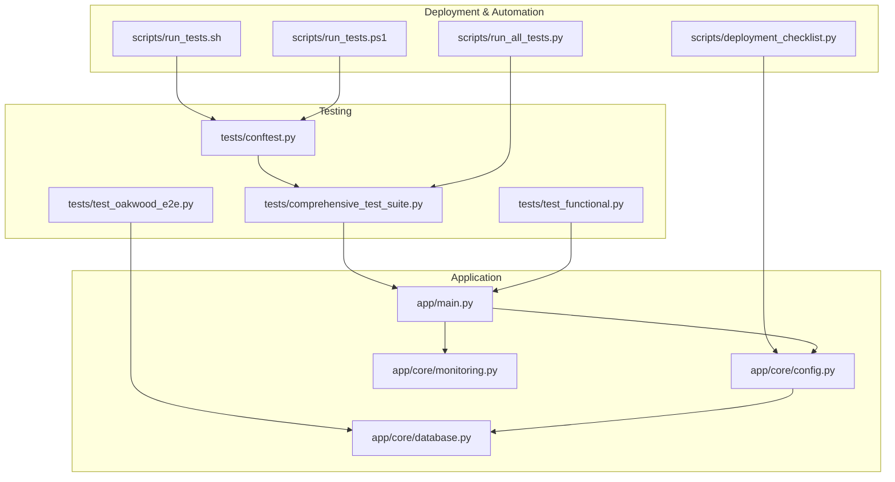
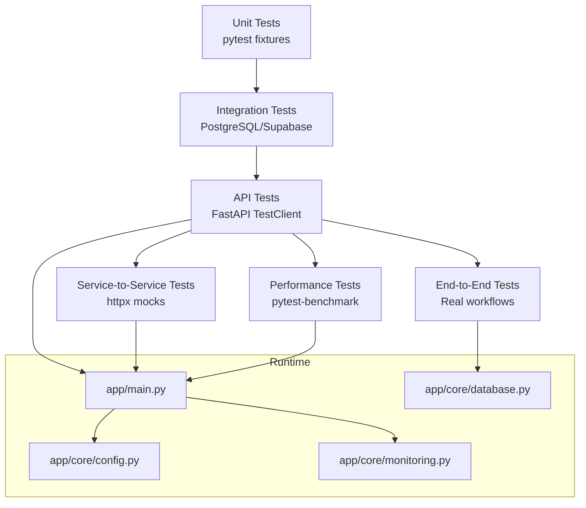
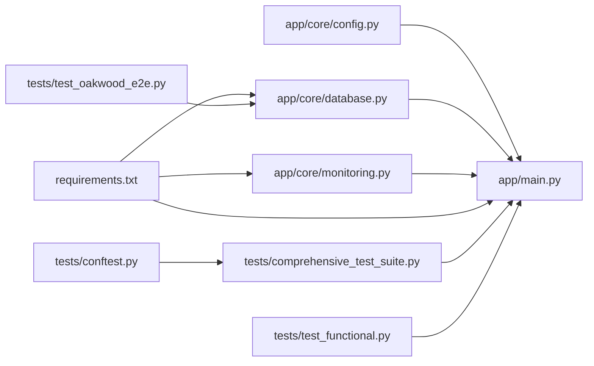

# Testing & Deployment

<cite>
**Referenced Files in This Document**
- [docs/TESTING_GUIDE.md](file://docs/TESTING_GUIDE.md)
- [scripts/run_tests.sh](file://scripts/run_tests.sh)
- [scripts/run_tests.ps1](file://scripts/run_tests.ps1)
- [scripts/run_all_tests.py](file://scripts/run_all_tests.py)
- [scripts/deployment_checklist.py](file://scripts/deployment_checklist.py)
- [requirements.txt](file://requirements.txt)
- [tests/conftest.py](file://tests/conftest.py)
- [tests/comprehensive_test_suite.py](file://tests/comprehensive_test_suite.py)
- [tests/test_functional.py](file://tests/test_functional.py)
- [tests/test_oakwood_e2e.py](file://tests/test_oakwood_e2e.py)
- [app/main.py](file://app/main.py)
- [app/core/config.py](file://app/core/config.py)
- [app/core/database.py](file://app/core/database.py)
- [app/core/monitoring.py](file://app/core/monitoring.py)
</cite>

## Table of Contents
1. [Introduction](#introduction)
2. [Project Structure](#project-structure)
3. [Core Components](#core-components)
4. [Architecture Overview](#architecture-overview)
5. [Detailed Component Analysis](#detailed-component-analysis)
6. [Dependency Analysis](#dependency-analysis)
7. [Performance Considerations](#performance-considerations)
8. [Troubleshooting Guide](#troubleshooting-guide)
9. [Conclusion](#conclusion)
10. [Appendices](#appendices)

## Introduction
This document defines comprehensive testing strategies and deployment procedures for the SETTLE Service. It covers unit testing, integration testing, API and service-to-service tests, performance and load testing, and end-to-end workflows. It also documents deployment pipelines, environment configuration, monitoring and alerting, rollback strategies, and troubleshooting procedures.

## Project Structure
The repository organizes testing and deployment assets under dedicated folders and scripts:
- tests/: pytest-based suites for unit, integration, functional, and end-to-end tests
- scripts/: automation for running tests and validating deployment readiness
- app/: FastAPI application, configuration, database abstraction, and monitoring
- docs/: official testing and integration documentation
- requirements.txt: runtime and test dependencies

**Diagram sources**
- [tests/conftest.py:1-44](file://tests/conftest.py#L1-L44)
- [tests/comprehensive_test_suite.py:1-200](file://tests/comprehensive_test_suite.py#L1-L200)
- [tests/test_functional.py:1-200](file://tests/test_functional.py#L1-L200)
- [tests/test_oakwood_e2e.py:1-200](file://tests/test_oakwood_e2e.py#L1-L200)
- [scripts/run_tests.sh:1-36](file://scripts/run_tests.sh#L1-L36)
- [scripts/run_tests.ps1:1-34](file://scripts/run_tests.ps1#L1-L34)
- [scripts/run_all_tests.py:1-200](file://scripts/run_all_tests.py#L1-L200)
- [scripts/deployment_checklist.py:1-200](file://scripts/deployment_checklist.py#L1-L200)
- [app/main.py:1-157](file://app/main.py#L1-L157)
- [app/core/config.py:1-351](file://app/core/config.py#L1-L351)
- [app/core/database.py:1-549](file://app/core/database.py#L1-L549)
- [app/core/monitoring.py:1-306](file://app/core/monitoring.py#L1-L306)

**Section sources**
- [docs/TESTING_GUIDE.md:1-845](file://docs/TESTING_GUIDE.md#L1-L845)
- [scripts/run_tests.sh:1-36](file://scripts/run_tests.sh#L1-L36)
- [scripts/run_tests.ps1:1-34](file://scripts/run_tests.ps1#L1-L34)
- [scripts/run_all_tests.py:1-200](file://scripts/run_all_tests.py#L1-L200)
- [scripts/deployment_checklist.py:1-200](file://scripts/deployment_checklist.py#L1-L200)
- [requirements.txt:1-53](file://requirements.txt#L1-L53)

## Core Components
- Test framework and markers: pytest with fixtures and markers for integration and benchmark tests
- Test categories: unit, integration, API, service-to-service, performance, and end-to-end
- Test coverage targets and reporting
- Test environment setup with mock mode and environment variables
- CI/CD integration via GitHub Actions workflow (defined in documentation)

Key capabilities:
- Configuration-driven test environment via environment variables and settings
- Mock mode for database-independent testing
- Real HTTP client testing against the FastAPI app
- Comprehensive end-to-end scenarios simulating tenant and admin workflows

**Section sources**
- [docs/TESTING_GUIDE.md:42-130](file://docs/TESTING_GUIDE.md#L42-L130)
- [tests/conftest.py:9-44](file://tests/conftest.py#L9-L44)
- [tests/comprehensive_test_suite.py:44-200](file://tests/comprehensive_test_suite.py#L44-L200)
- [tests/test_functional.py:1-200](file://tests/test_functional.py#L1-L200)
- [tests/test_oakwood_e2e.py:1-200](file://tests/test_oakwood_e2e.py#L1-L200)

## Architecture Overview
The testing architecture follows a layered pyramid:
- Unit tests focus on pure functions and small units
- Integration tests validate database and external service interactions
- API tests exercise endpoints with TestClient
- Service-to-service tests validate inter-service communication via mocks
- Performance tests enforce latency targets
- End-to-end tests simulate realistic user journeys

**Diagram sources**
- [docs/TESTING_GUIDE.md:42-130](file://docs/TESTING_GUIDE.md#L42-L130)
- [app/main.py:1-157](file://app/main.py#L1-L157)
- [app/core/config.py:1-351](file://app/core/config.py#L1-L351)
- [app/core/database.py:1-549](file://app/core/database.py#L1-L549)
- [app/core/monitoring.py:1-306](file://app/core/monitoring.py#L1-L306)

## Detailed Component Analysis

### Unit Testing
- Focus: isolated functions and classes (e.g., estimators, validators, anonymizers)
- Approach: fixtures, parameterized tests, and deterministic mocking
- Coverage: targeted at core logic with high fidelity to business rules

Guidelines:
- Prefer deterministic inputs and controlled mocks
- Validate edge cases and boundary conditions
- Keep tests fast and independent

**Section sources**
- [docs/TESTING_GUIDE.md:133-298](file://docs/TESTING_GUIDE.md#L133-L298)
- [tests/comprehensive_test_suite.py:44-200](file://tests/comprehensive_test_suite.py#L44-L200)

### Integration Testing
- Focus: database operations and Supabase REST interactions
- Approach: real database connectivity with retry logic and cleanup
- Coverage: CRUD operations, query filtering, and transaction semantics

Guidelines:
- Use test fixtures to seed and clean test data
- Enforce timeouts and retry policies
- Validate response shapes and constraints

**Section sources**
- [docs/TESTING_GUIDE.md:301-380](file://docs/TESTING_GUIDE.md#L301-L380)
- [app/core/database.py:412-549](file://app/core/database.py#L412-L549)

### API Testing
- Focus: endpoint correctness, authentication, validation, and error handling
- Approach: TestClient against the FastAPI app with structured assertions
- Coverage: public endpoints, authenticated endpoints, admin endpoints, and error paths

Guidelines:
- Test success paths, validation failures, and unauthorized access
- Verify response schemas and performance SLAs
- Use consistent auth headers and request payloads

**Section sources**
- [docs/TESTING_GUIDE.md:383-512](file://docs/TESTING_GUIDE.md#L383-L512)
- [tests/test_functional.py:1-200](file://tests/test_functional.py#L1-L200)
- [tests/comprehensive_test_suite.py:102-200](file://tests/comprehensive_test_suite.py#L102-L200)

### Service-to-Service Testing
- Focus: inter-service communication via HTTP clients with mocked responses
- Approach: patch httpx.AsyncClient to simulate platform and internal ops services
- Coverage: usage reporting, activity logging, and authentication headers

Guidelines:
- Validate request shape and response handling
- Ensure proper error propagation and logging
- Test both success and failure scenarios

**Section sources**
- [docs/TESTING_GUIDE.md:515-573](file://docs/TESTING_GUIDE.md#L515-L573)
- [tests/comprehensive_test_suite.py:1-200](file://tests/comprehensive_test_suite.py#L1-L200)

### Performance and Load Testing
- Focus: response times, throughput, and resource utilization
- Approach: pytest-benchmark markers and concurrent request patterns
- Coverage: query latency, contribution submission, report generation, and concurrency

Guidelines:
- Enforce strict latency targets (e.g., <1 second for queries)
- Measure p95/p99 latencies under load
- Monitor memory and CPU during heavy loads

**Section sources**
- [docs/TESTING_GUIDE.md:576-606](file://docs/TESTING_GUIDE.md#L576-L606)
- [tests/comprehensive_test_suite.py:1-200](file://tests/comprehensive_test_suite.py#L1-L200)

### End-to-End Testing
- Focus: realistic user journeys (tenant and admin)
- Approach: orchestrated sequences simulating real-world workflows
- Coverage: case snapshots, contribution submissions, and report generation

Guidelines:
- Use deterministic identifiers and cleanup between runs
- Validate state transitions and persisted outcomes
- Track warnings and failures for remediation

**Section sources**
- [docs/TESTING_GUIDE.md:610-700](file://docs/TESTING_GUIDE.md#L610-L700)
- [tests/test_oakwood_e2e.py:1-200](file://tests/test_oakwood_e2e.py#L1-L200)

### Test Execution and Reporting
- Scripts:
  - Bash and PowerShell wrappers to run unit, functional, and coverage tests
  - A comprehensive orchestrator that runs categorized test suites and aggregates results
- Conftest:
  - Session-scoped environment setup and auth header fixtures
- Coverage:
  - HTML and terminal reports generated via pytest

**Section sources**
- [scripts/run_tests.sh:1-36](file://scripts/run_tests.sh#L1-L36)
- [scripts/run_tests.ps1:1-34](file://scripts/run_tests.ps1#L1-L34)
- [scripts/run_all_tests.py:1-200](file://scripts/run_all_tests.py#L1-L200)
- [tests/conftest.py:1-44](file://tests/conftest.py#L1-L44)

### Deployment Procedures
- Pre-deploy checklist:
  - Validates environment variables, documentation presence, core files, and test files
  - Ensures production-readiness before promotion
- Environment configuration:
  - Centralized settings with provider-agnostic and provider-specific overrides
  - Support for mock mode and service registry integration
- Monitoring and observability:
  - Sentry initialization for error tracking and performance monitoring
  - Bar compliance safeguards to avoid PII exposure

**Section sources**
- [scripts/deployment_checklist.py:1-200](file://scripts/deployment_checklist.py#L1-L200)
- [app/core/config.py:1-351](file://app/core/config.py#L1-L351)
- [app/core/monitoring.py:1-306](file://app/core/monitoring.py#L1-L306)

### Monitoring, Alerting, and Maintenance
- Monitoring:
  - Sentry SDK integration with sampling rates and before-send hooks
  - Automatic log forwarding for error-level events
- Alerting:
  - Slack webhook configuration available in settings
  - Error tracking and breadcrumbs for debugging
- Maintenance:
  - Health checks for database connectivity
  - Graceful startup/shutdown with heartbeat tasks

**Section sources**
- [app/core/monitoring.py:1-306](file://app/core/monitoring.py#L1-L306)
- [app/main.py:1-157](file://app/main.py#L1-L157)
- [app/core/database.py:509-549](file://app/core/database.py#L509-L549)

### Rollback Strategies
- Database:
  - Alembic migrations support versioned schema changes; maintain migration history for rollbacks
- Application:
  - Versioned releases and environment-based toggles (e.g., AUTH_MODE guard)
  - Canary deployments with health checks and heartbeat monitoring

Note: Specific rollback commands are not included here; refer to migration and deployment tooling for exact procedures.

**Section sources**
- [app/main.py:42-49](file://app/main.py#L42-L49)
- [app/core/config.py:46-50](file://app/core/config.py#L46-L50)

### CI/CD Integration
- GitHub Actions workflow:
  - Runs tests with Postgres and Redis services
  - Installs dependencies and executes pytest suites
  - Provides health-checked service containers for integration tests

**Section sources**
- [docs/TESTING_GUIDE.md:755-845](file://docs/TESTING_GUIDE.md#L755-L845)

## Dependency Analysis
Testing and deployment depend on:
- FastAPI application entrypoint and routing
- Configuration settings for environment, services, and feature flags
- Database abstraction layer for REST-based operations
- Monitoring integration for error tracking and performance metrics

**Diagram sources**
- [app/core/config.py:1-351](file://app/core/config.py#L1-L351)
- [app/main.py:1-157](file://app/main.py#L1-L157)
- [app/core/database.py:1-549](file://app/core/database.py#L1-L549)
- [app/core/monitoring.py:1-306](file://app/core/monitoring.py#L1-L306)
- [requirements.txt:1-53](file://requirements.txt#L1-L53)
- [tests/conftest.py:1-44](file://tests/conftest.py#L1-L44)
- [tests/comprehensive_test_suite.py:1-200](file://tests/comprehensive_test_suite.py#L1-L200)
- [tests/test_functional.py:1-200](file://tests/test_functional.py#L1-L200)
- [tests/test_oakwood_e2e.py:1-200](file://tests/test_oakwood_e2e.py#L1-L200)

**Section sources**
- [requirements.txt:1-53](file://requirements.txt#L1-L53)
- [app/core/config.py:1-351](file://app/core/config.py#L1-L351)
- [app/core/database.py:1-549](file://app/core/database.py#L1-L549)
- [app/core/monitoring.py:1-306](file://app/core/monitoring.py#L1-L306)
- [tests/conftest.py:1-44](file://tests/conftest.py#L1-L44)
- [tests/comprehensive_test_suite.py:1-200](file://tests/comprehensive_test_suite.py#L1-L200)
- [tests/test_functional.py:1-200](file://tests/test_functional.py#L1-L200)
- [tests/test_oakwood_e2e.py:1-200](file://tests/test_oakwood_e2e.py#L1-L200)

## Performance Considerations
- Enforce strict latency targets for queries and report generation
- Use pytest-benchmark to measure and track regressions
- Apply retry logic for transient database failures
- Monitor database health and connection pooling

[No sources needed since this section provides general guidance]

## Troubleshooting Guide
Common issues and resolutions:
- Missing environment variables:
  - Use the deployment checklist to validate required and optional variables
- Database connectivity:
  - Verify Supabase URL and service key; confirm REST URL extraction logic
  - Use health checks to detect degraded or unhealthy states
- Authentication failures:
  - Confirm API keys and service auth headers; ensure mock mode alignment
- Sentry initialization:
  - Ensure DSN is present; verify before-send hooks for compliance
- Test failures:
  - Run targeted suites via scripts; inspect coverage reports and logs

**Section sources**
- [scripts/deployment_checklist.py:21-78](file://scripts/deployment_checklist.py#L21-L78)
- [app/core/database.py:509-549](file://app/core/database.py#L509-L549)
- [app/core/monitoring.py:14-83](file://app/core/monitoring.py#L14-L83)
- [tests/conftest.py:25-44](file://tests/conftest.py#L25-L44)

## Conclusion
The SETTLE Service employs a robust, layered testing strategy with strong emphasis on API correctness, service integration, performance, and end-to-end workflows. The deployment pipeline leverages environment-driven configuration, comprehensive checklists, and monitoring to ensure reliability and compliance. Adopting the outlined procedures will maintain high-quality standards and operational excellence.

[No sources needed since this section summarizes without analyzing specific files]

## Appendices

### Test Coverage Requirements
- Target: 80%+ overall coverage
- Reporting: HTML and terminal reports via pytest
- Tools: pytest, pytest-asyncio, pytest-cov, pytest-benchmark

**Section sources**
- [docs/TESTING_GUIDE.md:38-100](file://docs/TESTING_GUIDE.md#L38-L100)
- [scripts/run_all_tests.py:144-155](file://scripts/run_all_tests.py#L144-L155)

### Quality Assurance Processes
- Configuration validation and environment checks
- Health checks and database connectivity tests
- Security and compliance safeguards (PHI/PII detection, CORS, rate limiting)
- Monitoring and error tracking integration

**Section sources**
- [scripts/deployment_checklist.py:81-148](file://scripts/deployment_checklist.py#L81-L148)
- [app/core/monitoring.py:85-133](file://app/core/monitoring.py#L85-L133)
- [tests/comprehensive_test_suite.py:167-200](file://tests/comprehensive_test_suite.py#L167-L200)