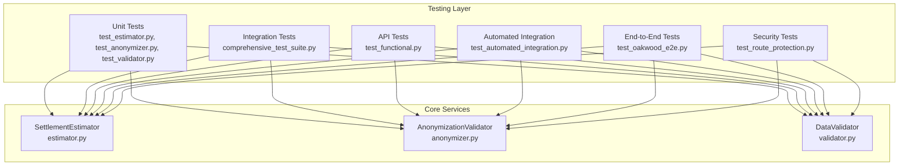
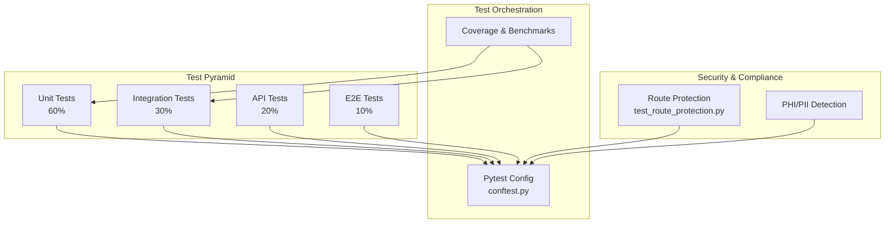
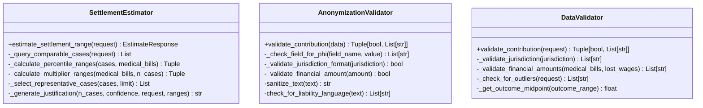
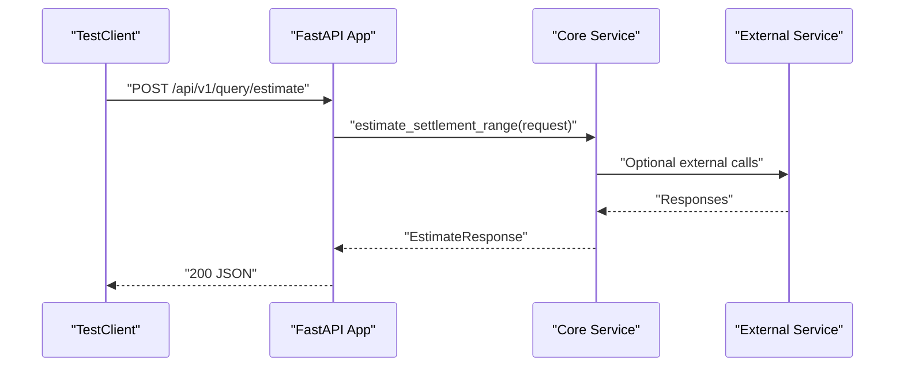
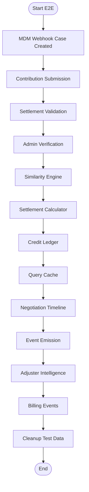
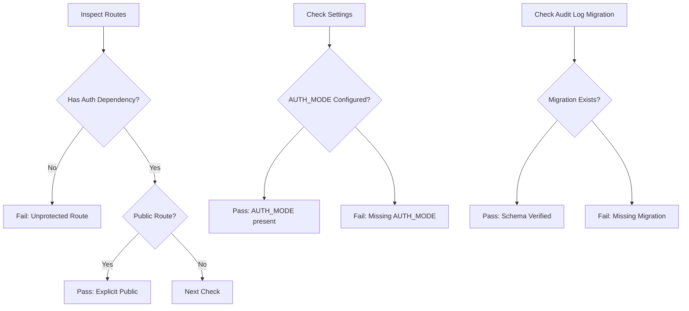
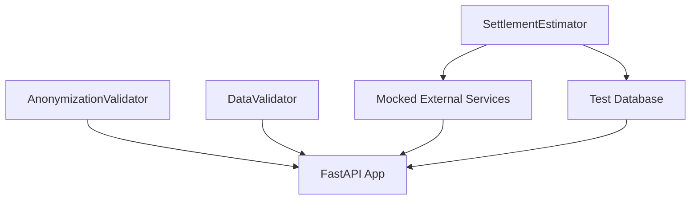

# Testing Strategy

<cite>
**Referenced Files in This Document**
- [conftest.py](file://tests/conftest.py)
- [comprehensive_test_suite.py](file://tests/comprehensive_test_suite.py)
- [test_estimator.py](file://tests/test_estimator.py)
- [test_anonymizer.py](file://tests/test_anonymizer.py)
- [test_validator.py](file://tests/test_validator.py)
- [test_functional.py](file://tests/test_functional.py)
- [test_automated_integration.py](file://tests/test_automated_integration.py)
- [test_oakwood_e2e.py](file://tests/test_oakwood_e2e.py)
- [test_route_protection.py](file://tests/security/test_route_protection.py)
- [TESTING_GUIDE.md](file://docs/TESTING_GUIDE.md)
- [anonymizer.py](file://app/services/anonymizer.py)
- [estimator.py](file://app/services/estimator.py)
- [validator.py](file://app/services/validator.py)
</cite>

## Table of Contents
1. [Introduction](#introduction)
2. [Project Structure](#project-structure)
3. [Core Components](#core-components)
4. [Architecture Overview](#architecture-overview)
5. [Detailed Component Analysis](#detailed-component-analysis)
6. [Dependency Analysis](#dependency-analysis)
7. [Performance Considerations](#performance-considerations)
8. [Troubleshooting Guide](#troubleshooting-guide)
9. [Conclusion](#conclusion)
10. [Appendices](#appendices)

## Introduction
This document defines a comprehensive testing strategy for the SETTLE Service, covering unit, integration, API, and end-to-end testing. It focuses on core services—estimator, anonymizer, and validator—while detailing patterns for API endpoints, database operations, and external service integrations. It also outlines performance, load, and security testing requirements, along with automation, continuous integration, and quality gates.

## Project Structure
The testing infrastructure is organized around pytest fixtures, focused unit tests, functional API tests, automated integration tests, and end-to-end scenarios. The repository includes:
- Unit tests for core services (estimator, anonymizer, validator)
- Functional tests validating real HTTP requests and responses
- Automated integration tests simulating customer scenarios
- End-to-end tests for complete user workflows
- Security tests ensuring route protection and compliance
- A comprehensive testing guide with environment setup and best practices

**Diagram sources**
- [test_estimator.py:1-103](file://tests/test_estimator.py#L1-L103)
- [test_anonymizer.py:1-201](file://tests/test_anonymizer.py#L1-L201)
- [test_validator.py:1-141](file://tests/test_validator.py#L1-L141)
- [comprehensive_test_suite.py:1-731](file://tests/comprehensive_test_suite.py#L1-L731)
- [test_functional.py:1-286](file://tests/test_functional.py#L1-L286)
- [test_automated_integration.py:1-454](file://tests/test_automated_integration.py#L1-L454)
- [test_oakwood_e2e.py:1-711](file://tests/test_oakwood_e2e.py#L1-L711)
- [test_route_protection.py:1-188](file://tests/security/test_route_protection.py#L1-L188)
- [estimator.py:1-443](file://app/services/estimator.py#L1-L443)
- [anonymizer.py:1-340](file://app/services/anonymizer.py#L1-L340)
- [validator.py:1-327](file://app/services/validator.py#L1-L327)

**Section sources**
- [TESTING_GUIDE.md:1-800](file://docs/TESTING_GUIDE.md#L1-L800)

## Core Components
This section documents the three core services under test and their roles in the settlement intelligence pipeline.

- SettlementEstimator: Computes settlement ranges via percentile-based calculation or multiplier fallback, with confidence thresholds and representative case sampling.
- AnonymizationValidator: Enforces strict PHI/PII compliance and legal constraints for contributions.
- DataValidator: Validates data formats, ranges, and business logic for contributions and queries.

Key responsibilities:
- Estimator: Query comparable cases, calculate percentiles, apply multipliers, select representative cases, and generate justification text.
- Anonymizer: Detect PHI/PII patterns, enforce drop-down constraints, validate jurisdiction format, and sanitize legacy text.
- Validator: Validate jurisdictions, financial amounts, outcome ranges, and detect outliers.

**Section sources**
- [estimator.py:25-443](file://app/services/estimator.py#L25-L443)
- [anonymizer.py:17-340](file://app/services/anonymizer.py#L17-L340)
- [validator.py:25-327](file://app/services/validator.py#L25-L327)

## Architecture Overview
The testing architecture aligns with a layered pyramid emphasizing unit tests, integration tests, API tests, and end-to-end tests. Security and performance tests complement the suite.

**Diagram sources**
- [conftest.py:1-44](file://tests/conftest.py#L1-L44)
- [test_route_protection.py:13-188](file://tests/security/test_route_protection.py#L13-L188)
- [TESTING_GUIDE.md:42-70](file://docs/TESTING_GUIDE.md#L42-L70)

**Section sources**
- [TESTING_GUIDE.md:42-70](file://docs/TESTING_GUIDE.md#L42-L70)

## Detailed Component Analysis

### Unit Testing Strategy for Core Services
- SettlementEstimator
  - Test percentile-based calculation with sufficient comparable cases.
  - Test multiplier fallback with insufficient comparable cases.
  - Validate confidence thresholds and response time constraints.
  - Verify representative case selection and justification generation.
- AnonymizationValidator
  - Validate PHI/PII detection for SSN, phone, email, names, and specific business identifiers.
  - Test jurisdiction format validation and drop-down value constraints.
  - Verify liability language detection and legacy text sanitization.
- DataValidator
  - Validate jurisdiction format and state codes.
  - Validate financial amounts and policy limits.
  - Detect outliers and enforce consent requirements.

**Diagram sources**
- [estimator.py:25-443](file://app/services/estimator.py#L25-L443)
- [anonymizer.py:17-340](file://app/services/anonymizer.py#L17-L340)
- [validator.py:25-327](file://app/services/validator.py#L25-L327)

**Section sources**
- [test_estimator.py:13-103](file://tests/test_estimator.py#L13-L103)
- [test_anonymizer.py:10-201](file://tests/test_anonymizer.py#L10-L201)
- [test_validator.py:11-141](file://tests/test_validator.py#L11-L141)

### Integration Testing Patterns
- API Endpoints
  - Validate health checks, authentication, and error handling.
  - Test public endpoints (e.g., waitlist join) and authenticated endpoints (e.g., query estimate, contribution submission).
- Database Operations
  - Use TestClient for real HTTP requests against the app.
  - Validate response structures, status codes, and data integrity.
- External Service Integrations
  - Mock service clients (Platform, Internal Ops) to verify headers, request shapes, and error handling.
  - Confirm service-to-service authentication headers and response parsing.

**Diagram sources**
- [test_functional.py:24-54](file://tests/test_functional.py#L24-L54)
- [comprehensive_test_suite.py:264-334](file://tests/comprehensive_test_suite.py#L264-L334)

**Section sources**
- [test_functional.py:16-286](file://tests/test_functional.py#L16-L286)
- [comprehensive_test_suite.py:409-556](file://tests/comprehensive_test_suite.py#L409-L556)

### End-to-End Testing Methodologies
- Automated Integration Tests
  - Simulate customer journeys with realistic payloads and validate success/failure paths.
  - Include PHI detection, invalid API key rejection, and report generation.
- Oakwood Law Firm E2E
  - Comprehensive scenario covering MDM webhook, contribution submission, validation, verification, similarity scoring, calculator confidence weights, credit ledger, query cache, negotiation timeline, event emission, adjuster intelligence, and billing events.
  - Includes cleanup routines to maintain test isolation.

**Diagram sources**
- [test_oakwood_e2e.py:72-706](file://tests/test_oakwood_e2e.py#L72-L706)

**Section sources**
- [test_automated_integration.py:327-454](file://tests/test_automated_integration.py#L327-L454)
- [test_oakwood_e2e.py:675-711](file://tests/test_oakwood_e2e.py#L675-L711)

### Security Testing Requirements
- Route Protection
  - Ensure all non-public routes have authentication dependencies and public routes explicitly override defaults.
  - Verify AUTH_MODE and PERMISSION_FAIL_OPEN configurations per security contract.
- Audit Logging
  - Validate presence and schema of auth audit log migration.
- PHI/PII Compliance
  - Enforce anonymization rules and reject submissions containing PHI/PII.

**Diagram sources**
- [test_route_protection.py:22-111](file://tests/security/test_route_protection.py#L22-L111)
- [test_route_protection.py:116-188](file://tests/security/test_route_protection.py#L116-L188)

**Section sources**
- [test_route_protection.py:13-188](file://tests/security/test_route_protection.py#L13-L188)

## Dependency Analysis
Testing dependencies emphasize loose coupling between services and robust mocking for external integrations. Unit tests isolate core logic, while integration tests validate HTTP flows and database interactions.

**Diagram sources**
- [estimator.py:51-147](file://app/services/estimator.py#L51-L147)
- [anonymizer.py:92-181](file://app/services/anonymizer.py#L92-L181)
- [validator.py:52-138](file://app/services/validator.py#L52-L138)
- [comprehensive_test_suite.py:492-556](file://tests/comprehensive_test_suite.py#L492-L556)

**Section sources**
- [comprehensive_test_suite.py:492-556](file://tests/comprehensive_test_suite.py#L492-L556)

## Performance Considerations
- Response Time Targets
  - Health checks: <100 ms
  - Stats endpoints: <500 ms
  - Estimator queries: <1 second (p95)
- Concurrency
  - Validate concurrent request handling and thread safety.
- Benchmarking
  - Use pytest-benchmark markers to establish baselines and regressions.

**Section sources**
- [comprehensive_test_suite.py:683-707](file://tests/comprehensive_test_suite.py#L683-L707)
- [TESTING_GUIDE.md:576-606](file://docs/TESTING_GUIDE.md#L576-L606)

## Troubleshooting Guide
Common issues and resolutions:
- Authentication Failures
  - Verify API keys and service authentication headers.
  - Confirm environment variable USE_MOCK_DATA for test mode.
- PHI/PII Rejections
  - Review anonymization violations and update submissions to use allowed drop-down values and generic descriptions.
- Database Connectivity
  - Ensure test database is initialized and migrations applied before running integration tests.
- External Service Errors
  - Confirm mocked clients return expected responses and handle timeouts gracefully.

**Section sources**
- [conftest.py:9-23](file://tests/conftest.py#L9-L23)
- [test_functional.py:127-147](file://tests/test_functional.py#L127-L147)
- [TESTING_GUIDE.md:102-130](file://docs/TESTING_GUIDE.md#L102-L130)

## Conclusion
The SETTLE Service employs a robust, layered testing strategy that validates core logic, API behavior, integrations, and end-to-end workflows. Security and compliance are enforced rigorously, with performance targets and comprehensive test coverage. The documented patterns enable consistent automation, continuous integration, and quality gates.

## Appendices

### Test Coverage Requirements
- Target: 80%+ overall coverage
- Focus: Core services (estimator, anonymizer, validator) and critical API endpoints
- Tools: pytest, pytest-asyncio, pytest-cov, pytest-benchmark

**Section sources**
- [TESTING_GUIDE.md:38-70](file://docs/TESTING_GUIDE.md#L38-L70)

### Mocking Strategies
- Use unittest.mock.patch and AsyncMock for external service clients.
- Mock database queries in unit tests to isolate logic.
- Utilize TestClient for realistic HTTP request/response cycles.

**Section sources**
- [comprehensive_test_suite.py:492-556](file://tests/comprehensive_test_suite.py#L492-L556)
- [test_automated_integration.py:17-50](file://tests/test_automated_integration.py#L17-L50)

### Test Data Management
- Use fixtures and factories to generate deterministic test data.
- Clean up test data after E2E runs to prevent cross-test contamination.
- Leverage UUIDs for unique identifiers and seeded datasets for integration tests.

**Section sources**
- [test_oakwood_e2e.py:651-673](file://tests/test_oakwood_e2e.py#L651-L673)
- [TESTING_GUIDE.md:102-130](file://docs/TESTING_GUIDE.md#L102-L130)

### Testing Best Practices
- Settlement Intelligence Calculations
  - Validate percentile vs. multiplier fallback logic and confidence thresholds.
  - Ensure representative case selection and justification generation.
- Data Anonymization Compliance
  - Enforce drop-down constraints and jurisdiction format validation.
  - Detect and reject PHI/PII and liability language.
- Blockchain Verification Processes
  - Validate hash generation and format for reports and contributions.

**Section sources**
- [estimator.py:148-388](file://app/services/estimator.py#L148-L388)
- [anonymizer.py:92-338](file://app/services/anonymizer.py#L92-L338)
- [validator.py:140-262](file://app/services/validator.py#L140-L262)

### Security Testing Requirements
- Route Protection
  - All non-public routes must have explicit auth dependencies.
  - Public routes must override defaults with dependencies=[].
- Configuration Checks
  - AUTH_MODE and PERMISSION_FAIL_OPEN must be present and correctly configured.
- Audit Logging
  - Auth audit log migration must exist and include required fields.

**Section sources**
- [test_route_protection.py:22-111](file://tests/security/test_route_protection.py#L22-L111)
- [test_route_protection.py:116-188](file://tests/security/test_route_protection.py#L116-L188)

### Performance Testing, Load Testing, and Security Testing
- Performance
  - Establish baselines with pytest-benchmark and enforce response time targets.
- Load Testing
  - Validate concurrent request handling and thread safety.
- Security Testing
  - Validate route protection, API key validation, CORS policies, and PHI detection accuracy.

**Section sources**
- [comprehensive_test_suite.py:683-707](file://tests/comprehensive_test_suite.py#L683-L707)
- [test_functional.py:622-635](file://tests/test_functional.py#L622-L635)
- [test_route_protection.py:22-111](file://tests/security/test_route_protection.py#L22-L111)

### Test Automation and Continuous Integration
- CI/CD Integration
  - Use GitHub Actions to run tests with PostgreSQL and Redis services.
  - Configure environment variables and test database setup.
- Quality Gates
  - Enforce minimum coverage thresholds and block PRs on failing tests.

**Section sources**
- [TESTING_GUIDE.md:755-800](file://docs/TESTING_GUIDE.md#L755-L800)