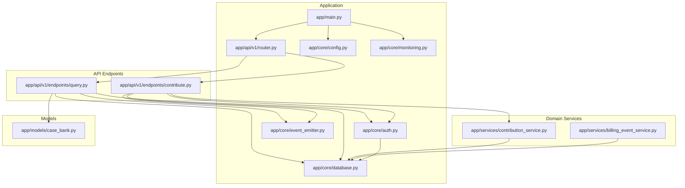
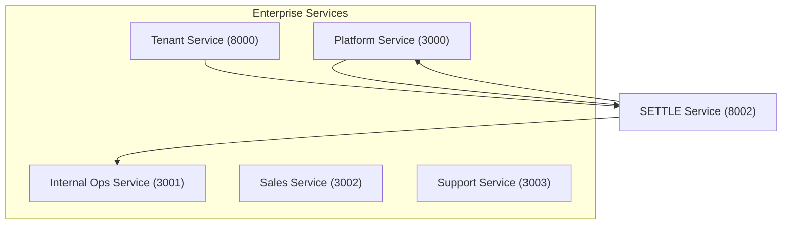
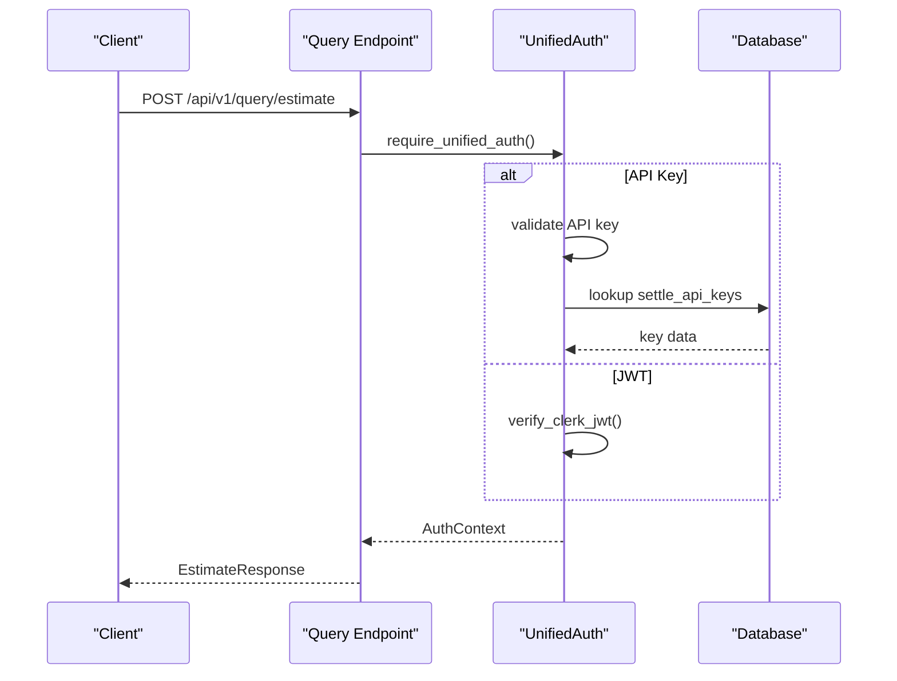
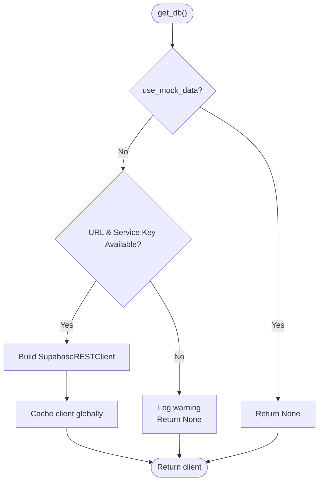
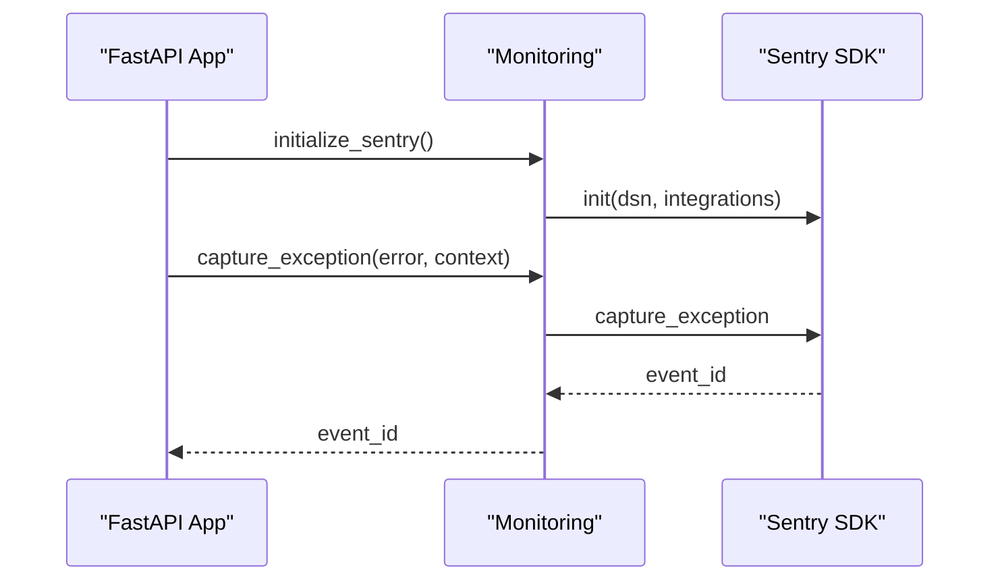
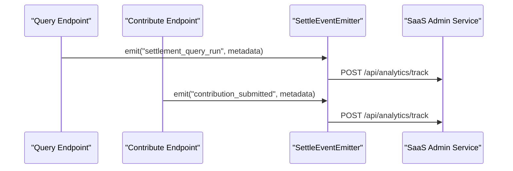
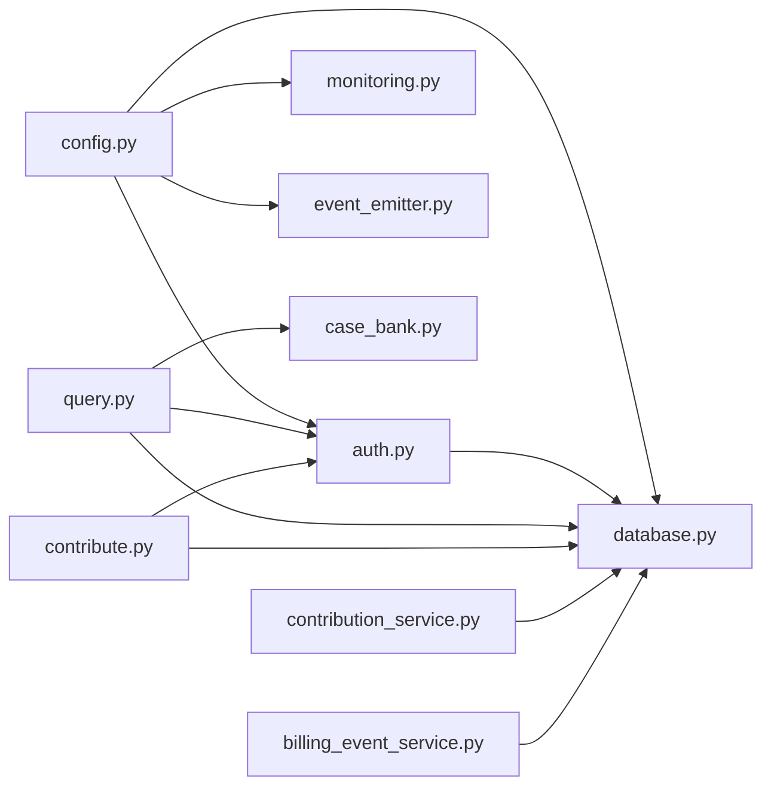

# Troubleshooting & FAQ

<cite>
**Referenced Files in This Document**
- [README.md](file://README.md)
- [app/main.py](file://app/main.py)
- [app/core/config.py](file://app/core/config.py)
- [app/core/database.py](file://app/core/database.py)
- [app/core/auth.py](file://app/core/auth.py)
- [app/core/monitoring.py](file://app/core/monitoring.py)
- [app/core/event_emitter.py](file://app/core/event_emitter.py)
- [app/api/v1/router.py](file://app/api/v1/router.py)
- [app/api/v1/endpoints/query.py](file://app/api/v1/endpoints/query.py)
- [app/api/v1/endpoints/contribute.py](file://app/api/v1/endpoints/contribute.py)
- [app/models/case_bank.py](file://app/models/case_bank.py)
- [app/services/billing_event_service.py](file://app/services/billing_event_service.py)
- [app/services/contribution_service.py](file://app/services/contribution_service.py)
- [docs/API_DOCUMENTATION.md](file://docs/API_DOCUMENTATION.md)
- [docs/TESTING_GUIDE.md](file://docs/TESTING_GUIDE.md)
- [scripts/deployment_checklist.py](file://scripts/deployment_checklist.py)
- [tests/comprehensive_test_suite.py](file://tests/comprehensive_test_suite.py)
</cite>

## Table of Contents
1. [Introduction](#introduction)
2. [Project Structure](#project-structure)
3. [Core Components](#core-components)
4. [Architecture Overview](#architecture-overview)
5. [Detailed Component Analysis](#detailed-component-analysis)
6. [Dependency Analysis](#dependency-analysis)
7. [Performance Considerations](#performance-considerations)
8. [Troubleshooting Guide](#troubleshooting-guide)
9. [Conclusion](#conclusion)
10. [Appendices](#appendices)

## Introduction
This document provides comprehensive troubleshooting guidance and Frequently Asked Questions for the SETTLE Service. It covers diagnostics and resolutions for development, testing, and production environments, including API integration issues, database connectivity, service communication failures, authentication problems, performance bottlenecks, and deployment challenges. It also documents monitoring and logging strategies, error analysis procedures, escalation processes, and answers to common architecture and integration questions.

## Project Structure
The SETTLE Service is a FastAPI application organized around modular components:
- Application entrypoint initializes middleware, routing, and monitoring.
- Core modules handle configuration, database abstraction, authentication, monitoring, and event emission.
- API v1 endpoints expose public, authenticated, and admin capabilities.
- Services encapsulate domain logic such as billing events, contribution handling, and estimators.
- Documentation and tests validate behavior and performance.

**Diagram sources**
- [app/main.py:1-157](file://app/main.py#L1-L157)
- [app/api/v1/router.py:1-26](file://app/api/v1/router.py#L1-L26)
- [app/api/v1/endpoints/query.py:1-119](file://app/api/v1/endpoints/query.py#L1-L119)
- [app/api/v1/endpoints/contribute.py:1-164](file://app/api/v1/endpoints/contribute.py#L1-L164)
- [app/core/database.py:1-549](file://app/core/database.py#L1-L549)
- [app/core/auth.py:1-867](file://app/core/auth.py#L1-L867)
- [app/core/monitoring.py:1-306](file://app/core/monitoring.py#L1-L306)
- [app/core/event_emitter.py:1-88](file://app/core/event_emitter.py#L1-L88)
- [app/services/billing_event_service.py:1-317](file://app/services/billing_event_service.py#L1-L317)
- [app/services/contribution_service.py:1-388](file://app/services/contribution_service.py#L1-L388)
- [app/models/case_bank.py:1-269](file://app/models/case_bank.py#L1-L269)

**Section sources**
- [README.md:1-297](file://README.md#L1-L297)
- [app/main.py:1-157](file://app/main.py#L1-L157)
- [app/api/v1/router.py:1-26](file://app/api/v1/router.py#L1-L26)

## Core Components
- Configuration and environment management: centralizes settings, database keys, service URLs, rate limits, and monitoring.
- Database abstraction: REST client wrapper for Supabase to avoid client dependency issues, with retry and health checks.
- Authentication: dual-mode support (API keys and Clerk JWT) with audit logging and scope validation.
- Monitoring: Sentry integration for error tracking, performance monitoring, and compliance-aware filtering.
- Event emission: fire-and-forget behavioral events to SaaS Admin.
- API endpoints: query estimation, contribution submission, reports, and admin management.
- Domain services: billing event tracking and contribution processing with duplicate detection and outlier checks.

**Section sources**
- [app/core/config.py:1-351](file://app/core/config.py#L1-L351)
- [app/core/database.py:1-549](file://app/core/database.py#L1-L549)
- [app/core/auth.py:1-867](file://app/core/auth.py#L1-L867)
- [app/core/monitoring.py:1-306](file://app/core/monitoring.py#L1-L306)
- [app/core/event_emitter.py:1-88](file://app/core/event_emitter.py#L1-L88)
- [app/api/v1/endpoints/query.py:1-119](file://app/api/v1/endpoints/query.py#L1-L119)
- [app/api/v1/endpoints/contribute.py:1-164](file://app/api/v1/endpoints/contribute.py#L1-L164)
- [app/services/billing_event_service.py:1-317](file://app/services/billing_event_service.py#L1-L317)
- [app/services/contribution_service.py:1-388](file://app/services/contribution_service.py#L1-L388)

## Architecture Overview
SETTLE is part of a 5-service enterprise architecture and exposes a centralized, shared service accessible to both TrueVow customers and external users via API keys. It integrates with Platform, Internal Ops, Sales, Support, and Tenant services using authenticated requests and emits behavioral events.

**Diagram sources**
- [README.md:26-73](file://README.md#L26-L73)
- [README.md:184-252](file://README.md#L184-L252)

**Section sources**
- [README.md:26-73](file://README.md#L26-L73)
- [README.md:184-252](file://README.md#L184-L252)

## Detailed Component Analysis

### Authentication and Authorization
- Dual authentication supports API keys (legacy) and Clerk JWT (new).
- Audit logging records all auth events for compliance.
- Scope and role validation enforced per endpoint requirements.
- Development vs production auth mode enforced.

**Diagram sources**
- [app/api/v1/endpoints/query.py:20-98](file://app/api/v1/endpoints/query.py#L20-L98)
- [app/core/auth.py:340-485](file://app/core/auth.py#L340-L485)
- [app/core/auth.py:487-795](file://app/core/auth.py#L487-L795)

**Section sources**
- [app/core/auth.py:340-485](file://app/core/auth.py#L340-L485)
- [app/core/auth.py:487-795](file://app/core/auth.py#L487-L795)
- [app/api/v1/endpoints/query.py:20-98](file://app/api/v1/endpoints/query.py#L20-L98)

### Database Connectivity and Retry Logic
- REST-based client for Supabase avoids client dependency issues.
- Retry decorator and explicit retry helpers for transient failures.
- Health check validates connectivity and table accessibility.
- Mock mode bypasses database for local development.

**Diagram sources**
- [app/core/database.py:412-463](file://app/core/database.py#L412-L463)
- [app/core/database.py:374-409](file://app/core/database.py#L374-L409)
- [app/core/database.py:509-539](file://app/core/database.py#L509-L539)

**Section sources**
- [app/core/database.py:412-463](file://app/core/database.py#L412-L463)
- [app/core/database.py:374-409](file://app/core/database.py#L374-L409)
- [app/core/database.py:509-539](file://app/core/database.py#L509-L539)

### Monitoring and Error Tracking
- Sentry initialization with environment-specific sampling rates.
- Automatic logging integration and compliance-aware redaction.
- Breadcrumbs and user context for enhanced observability.

**Diagram sources**
- [app/core/monitoring.py:14-83](file://app/core/monitoring.py#L14-L83)
- [app/core/monitoring.py:135-169](file://app/core/monitoring.py#L135-L169)

**Section sources**
- [app/core/monitoring.py:14-83](file://app/core/monitoring.py#L14-L83)
- [app/core/monitoring.py:135-169](file://app/core/monitoring.py#L135-L169)

### Behavioral Events and Admin Integration
- Fire-and-forget event emitter to SaaS Admin for analytics.
- Billing event service tracks usage and emits metering events.

**Diagram sources**
- [app/api/v1/endpoints/query.py:84-98](file://app/api/v1/endpoints/query.py#L84-L98)
- [app/api/v1/endpoints/contribute.py:111-124](file://app/api/v1/endpoints/contribute.py#L111-L124)
- [app/core/event_emitter.py:56-88](file://app/core/event_emitter.py#L56-L88)
- [app/services/billing_event_service.py:72-119](file://app/services/billing_event_service.py#L72-L119)

**Section sources**
- [app/core/event_emitter.py:56-88](file://app/core/event_emitter.py#L56-L88)
- [app/services/billing_event_service.py:72-119](file://app/services/billing_event_service.py#L72-L119)

## Dependency Analysis
- Configuration drives database, service URLs, and monitoring.
- Authentication depends on database for API key validation and audit logging.
- Endpoints depend on services and models for request/response handling.
- Event emission and billing services depend on database for persistence.

**Diagram sources**
- [app/core/config.py:1-351](file://app/core/config.py#L1-L351)
- [app/core/database.py:1-549](file://app/core/database.py#L1-L549)
- [app/core/auth.py:1-867](file://app/core/auth.py#L1-L867)
- [app/core/monitoring.py:1-306](file://app/core/monitoring.py#L1-L306)
- [app/core/event_emitter.py:1-88](file://app/core/event_emitter.py#L1-L88)
- [app/api/v1/endpoints/query.py:1-119](file://app/api/v1/endpoints/query.py#L1-L119)
- [app/api/v1/endpoints/contribute.py:1-164](file://app/api/v1/endpoints/contribute.py#L1-L164)
- [app/models/case_bank.py:1-269](file://app/models/case_bank.py#L1-L269)
- [app/services/contribution_service.py:1-388](file://app/services/contribution_service.py#L1-L388)
- [app/services/billing_event_service.py:1-317](file://app/services/billing_event_service.py#L1-L317)

**Section sources**
- [app/core/config.py:1-351](file://app/core/config.py#L1-L351)
- [app/core/database.py:1-549](file://app/core/database.py#L1-L549)
- [app/core/auth.py:1-867](file://app/core/auth.py#L1-L867)
- [app/core/monitoring.py:1-306](file://app/core/monitoring.py#L1-L306)
- [app/core/event_emitter.py:1-88](file://app/core/event_emitter.py#L1-L88)
- [app/api/v1/endpoints/query.py:1-119](file://app/api/v1/endpoints/query.py#L1-L119)
- [app/api/v1/endpoints/contribute.py:1-164](file://app/api/v1/endpoints/contribute.py#L1-L164)
- [app/models/case_bank.py:1-269](file://app/models/case_bank.py#L1-L269)
- [app/services/contribution_service.py:1-388](file://app/services/contribution_service.py#L1-L388)
- [app/services/billing_event_service.py:1-317](file://app/services/billing_event_service.py#L1-L317)

## Performance Considerations
- Response time targets: <1 second for queries, <500ms for contributions, <2 seconds for reports.
- Concurrency: tested with concurrent requests achieving 100% success.
- Database retries and timeouts prevent transient failures from impacting latency.
- Monitoring captures performance traces and profiles for production environments.

[No sources needed since this section provides general guidance]

## Troubleshooting Guide

### Common Issues and Resolutions

- Symptoms: 401 Unauthorized on authenticated endpoints
  - Causes: Missing or invalid API key, missing JWT, incorrect headers
  - Resolution: Verify Authorization header format, ensure API key validity, confirm JWT scope/roles
  - References: [app/core/auth.py:340-485](file://app/core/auth.py#L340-L485), [docs/API_DOCUMENTATION.md:45-72](file://docs/API_DOCUMENTATION.md#L45-L72)

- Symptoms: Database connection failures or degraded health
  - Causes: Missing Supabase URL/service key, network issues, invalid URL format
  - Resolution: Confirm environment variables, use REST URL extraction logic, enable retries, run health check
  - References: [app/core/database.py:412-463](file://app/core/database.py#L412-L463), [app/core/database.py:509-539](file://app/core/database.py#L509-L539)

- Symptoms: Contribution rejected due to PHI/PII
  - Causes: Presence of protected health information or narrative text
  - Resolution: Remove PHI, use drop-down values only, confirm consent
  - References: [app/api/v1/endpoints/contribute.py:56-104](file://app/api/v1/endpoints/contribute.py#L56-L104), [docs/API_DOCUMENTATION.md:276-282](file://docs/API_DOCUMENTATION.md#L276-L282)

- Symptoms: Slow response times under load
  - Causes: Insufficient database connections, missing rate limiting, blocking operations
  - Resolution: Tune pool sizes, enforce rate limits, leverage fire-and-forget events, monitor traces
  - References: [app/core/config.py:92-96](file://app/core/config.py#L92-L96), [app/core/monitoring.py:14-83](file://app/core/monitoring.py#L14-L83)

- Symptoms: Service-to-service communication failures
  - Causes: Missing required headers, unauthorized service, misconfigured URLs
  - Resolution: Add X-Service-Name and X-Request-ID, verify API keys, check service URLs
  - References: [app/core/auth.py:340-485](file://app/core/auth.py#L340-L485), [app/core/config.py:257-317](file://app/core/config.py#L257-L317)

- Symptoms: Sentry not capturing errors
  - Causes: Missing DSN, import errors, disabled in development
  - Resolution: Set SETTLE_SENTRY_DSN, verify installation, confirm environment
  - References: [app/core/monitoring.py:14-83](file://app/core/monitoring.py#L14-L83)

- Symptoms: Billing events not recorded
  - Causes: Database not available, insert failures
  - Resolution: Check database connectivity, inspect billing_events table
  - References: [app/services/billing_event_service.py:72-119](file://app/services/billing_event_service.py#L72-L119)

- Symptoms: Duplicate contribution rejected
  - Causes: Identical fingerprint hash detected
  - Resolution: Modify input to change fingerprint, ensure uniqueness
  - References: [app/services/contribution_service.py:212-222](file://app/services/contribution_service.py#L212-L222)

- Symptoms: Deployment readiness warnings
  - Causes: Missing environment variables, missing documentation files
  - Resolution: Run deployment checklist, populate .env/.env.local, ensure required files
  - References: [scripts/deployment_checklist.py:21-78](file://scripts/deployment_checklist.py#L21-L78)

**Section sources**
- [app/core/auth.py:340-485](file://app/core/auth.py#L340-L485)
- [app/core/database.py:412-463](file://app/core/database.py#L412-L463)
- [app/core/database.py:509-539](file://app/core/database.py#L509-L539)
- [app/api/v1/endpoints/contribute.py:56-104](file://app/api/v1/endpoints/contribute.py#L56-L104)
- [docs/API_DOCUMENTATION.md:276-282](file://docs/API_DOCUMENTATION.md#L276-L282)
- [app/core/config.py:92-96](file://app/core/config.py#L92-L96)
- [app/core/monitoring.py:14-83](file://app/core/monitoring.py#L14-L83)
- [app/services/billing_event_service.py:72-119](file://app/services/billing_event_service.py#L72-L119)
- [app/services/contribution_service.py:212-222](file://app/services/contribution_service.py#L212-L222)
- [scripts/deployment_checklist.py:21-78](file://scripts/deployment_checklist.py#L21-L78)

### Debugging Techniques

- Enable development logging and request tracing:
  - Verify logging configuration and request ID middleware
  - References: [app/main.py:24-29](file://app/main.py#L24-L29), [app/main.py:121-132](file://app/main.py#L121-L132)

- Validate API requests:
  - Use Postman/curl to test endpoints with proper headers and payloads
  - References: [docs/API_DOCUMENTATION.md:74-90](file://docs/API_DOCUMENTATION.md#L74-L90)

- Inspect authentication flow:
  - Trace auth events and audit logs
  - References: [app/core/auth.py:34-90](file://app/core/auth.py#L34-L90)

- Monitor database health:
  - Run health check and inspect counts
  - References: [app/core/database.py:509-539](file://app/core/database.py#L509-L539)

- Verify event emission:
  - Check SaaS Admin endpoint responses and logs
  - References: [app/core/event_emitter.py:56-88](file://app/core/event_emitter.py#L56-L88)

- Validate billing events:
  - Query billing_events table and status transitions
  - References: [app/services/billing_event_service.py:120-169](file://app/services/billing_event_service.py#L120-L169)

**Section sources**
- [app/main.py:24-29](file://app/main.py#L24-L29)
- [app/main.py:121-132](file://app/main.py#L121-L132)
- [docs/API_DOCUMENTATION.md:74-90](file://docs/API_DOCUMENTATION.md#L74-L90)
- [app/core/auth.py:34-90](file://app/core/auth.py#L34-L90)
- [app/core/database.py:509-539](file://app/core/database.py#L509-L539)
- [app/core/event_emitter.py:56-88](file://app/core/event_emitter.py#L56-L88)
- [app/services/billing_event_service.py:120-169](file://app/services/billing_event_service.py#L120-L169)

### Error Analysis Procedures
- Use Sentry event IDs to correlate logs and breadcrumbs.
- Redact sensitive data before sending to Sentry.
- Add breadcrumbs around critical operations for context.
- References: [app/core/monitoring.py:85-132](file://app/core/monitoring.py#L85-L132), [app/core/monitoring.py:231-258](file://app/core/monitoring.py#L231-L258)

**Section sources**
- [app/core/monitoring.py:85-132](file://app/core/monitoring.py#L85-L132)
- [app/core/monitoring.py:231-258](file://app/core/monitoring.py#L231-L258)

### Escalation Processes
- Development: Local logs, Sentry, and unit/integration tests.
- Staging: Full environment parity with production-like data.
- Production: Enable Sentry, monitor health endpoints, coordinate with Platform/Internal Ops for cross-service issues.
- References: [app/main.py:32-41](file://app/main.py#L32-L41), [README.md:26-73](file://README.md#L26-L73)

**Section sources**
- [app/main.py:32-41](file://app/main.py#L32-L41)
- [README.md:26-73](file://README.md#L26-L73)

### Frequently Asked Questions

- Q: How do I authenticate with the SETTLE API?
  - A: Use either API key (Bearer settle_xxx) or Clerk JWT (Bearer eyJ...). Some endpoints require additional headers for service-to-service calls.
  - References: [docs/API_DOCUMENTATION.md:45-72](file://docs/API_DOCUMENTATION.md#L45-L72), [app/core/auth.py:340-485](file://app/core/auth.py#L340-L485)

- Q: Why am I getting a 400 error for contribution submission?
  - A: Likely due to PHI/PII detection, missing required fields, or invalid outcome range. Review the request payload and compliance rules.
  - References: [docs/API_DOCUMENTATION.md:276-282](file://docs/API_DOCUMENTATION.md#L276-L282), [app/api/v1/endpoints/contribute.py:99-104](file://app/api/v1/endpoints/contribute.py#L99-L104)

- Q: How does SETTLE handle database connectivity issues?
  - A: Uses REST client with retry logic and health checks; can operate in mock mode for development.
  - References: [app/core/database.py:374-409](file://app/core/database.py#L374-L409), [app/core/database.py:509-539](file://app/core/database.py#L509-L539)

- Q: What monitoring and observability features are available?
  - A: Sentry integration, request tracing, breadcrumbs, and compliance-aware redaction.
  - References: [app/core/monitoring.py:14-83](file://app/core/monitoring.py#L14-L83), [app/core/monitoring.py:231-258](file://app/core/monitoring.py#L231-L258)

- Q: How are billing events tracked?
  - A: Events are persisted to billing_events table and can be queried for usage summaries.
  - References: [app/services/billing_event_service.py:120-169](file://app/services/billing_event_service.py#L120-L169), [app/services/billing_event_service.py:194-253](file://app/services/billing_event_service.py#L194-L253)

- Q: How do I deploy SETTLE safely?
  - A: Run the deployment checklist, verify environment variables, and execute comprehensive tests.
  - References: [scripts/deployment_checklist.py:21-78](file://scripts/deployment_checklist.py#L21-L78), [docs/TESTING_GUIDE.md:702-727](file://docs/TESTING_GUIDE.md#L702-L727)

**Section sources**
- [docs/API_DOCUMENTATION.md:45-72](file://docs/API_DOCUMENTATION.md#L45-L72)
- [app/core/auth.py:340-485](file://app/core/auth.py#L340-L485)
- [docs/API_DOCUMENTATION.md:276-282](file://docs/API_DOCUMENTATION.md#L276-L282)
- [app/api/v1/endpoints/contribute.py:99-104](file://app/api/v1/endpoints/contribute.py#L99-L104)
- [app/core/database.py:374-409](file://app/core/database.py#L374-L409)
- [app/core/database.py:509-539](file://app/core/database.py#L509-L539)
- [app/core/monitoring.py:14-83](file://app/core/monitoring.py#L14-L83)
- [app/core/monitoring.py:231-258](file://app/core/monitoring.py#L231-L258)
- [app/services/billing_event_service.py:120-169](file://app/services/billing_event_service.py#L120-L169)
- [app/services/billing_event_service.py:194-253](file://app/services/billing_event_service.py#L194-L253)
- [scripts/deployment_checklist.py:21-78](file://scripts/deployment_checklist.py#L21-L78)
- [docs/TESTING_GUIDE.md:702-727](file://docs/TESTING_GUIDE.md#L702-L727)

## Conclusion
This troubleshooting guide consolidates actionable diagnostics, resolutions, and best practices for SETTLE Service across development, testing, and production. By leveraging built-in monitoring, robust authentication, resilient database connectivity, and comprehensive testing, teams can maintain reliability and performance while ensuring compliance and observability.

[No sources needed since this section summarizes without analyzing specific files]

## Appendices

### Appendix A: Environment Variables Checklist
- Required: SERVICE_NAME, SERVICE_VERSION, ENVIRONMENT
- Database: SUPABASE_URL, SUPABASE_SERVICE_KEY (production mode)
- Optional integrations: PLATFORM_SERVICE_URL, INTERNAL_OPS_SERVICE_URL, TENANT_SERVICE_URL
- References: [scripts/deployment_checklist.py:21-78](file://scripts/deployment_checklist.py#L21-L78)

**Section sources**
- [scripts/deployment_checklist.py:21-78](file://scripts/deployment_checklist.py#L21-L78)

### Appendix B: Test Execution Commands
- Run all tests: pytest
- Run with coverage: pytest --cov=app --cov-report=html
- Run specific suites: pytest tests/unit/, pytest tests/integration/
- References: [docs/TESTING_GUIDE.md:702-727](file://docs/TESTING_GUIDE.md#L702-L727), [tests/comprehensive_test_suite.py:713-730](file://tests/comprehensive_test_suite.py#L713-L730)

**Section sources**
- [docs/TESTING_GUIDE.md:702-727](file://docs/TESTING_GUIDE.md#L702-L727)
- [tests/comprehensive_test_suite.py:713-730](file://tests/comprehensive_test_suite.py#L713-L730)